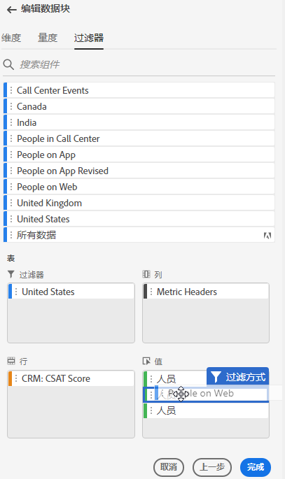
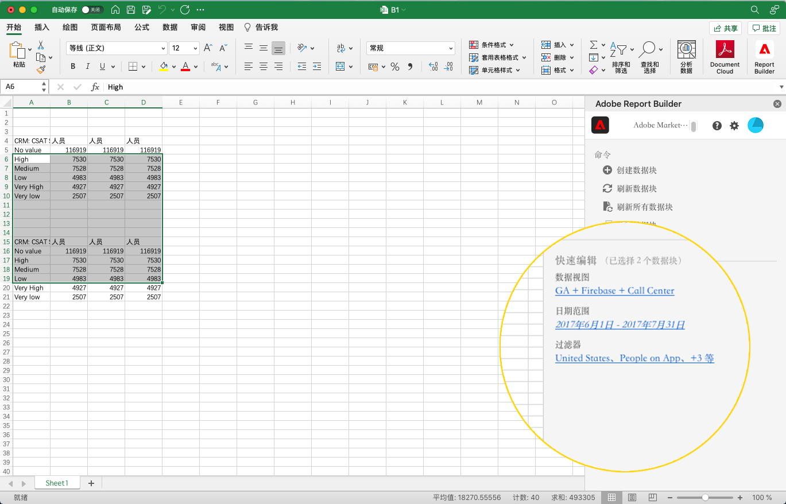
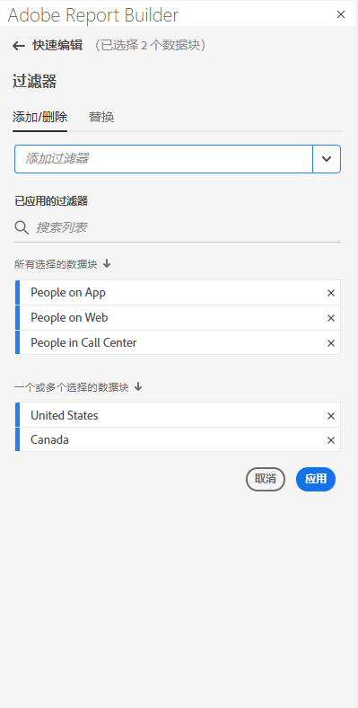
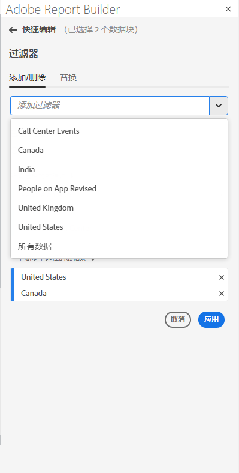
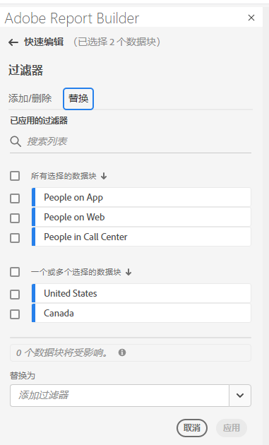
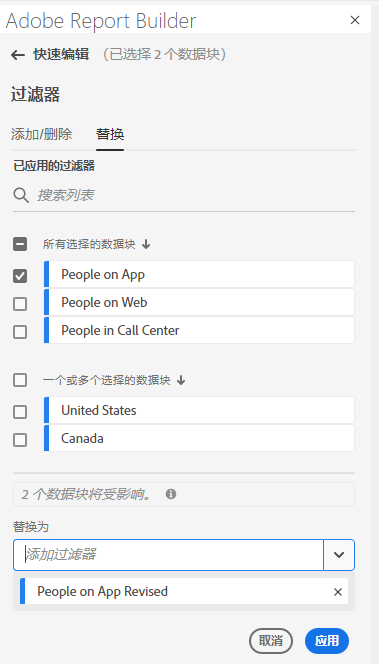

# 在 Report Builder 中使用筛选器

您可以在创建新数据块或者从“命令”面板中选择&#x200B;**编辑数据块**&#x200B;选项时应用筛选器。

## 将筛选器应用到数据块

要将筛选器应用到整个数据块，请双击筛选器或者将筛选器从组件列表拖放到表的“筛选器”部分。

## 将筛选器应用到单独的量度

要将筛选器应用于单独的量度，请将筛选器拖放到表中的某个量度上。您还可以在“表”窗格中，单击量度右侧的 **...** 图标，然后选择&#x200B;**筛选量度**。要查看应用的筛选器，请将光标悬停在上方或者在“表”窗格中选择量度。已应用筛选器的量度会显示一个筛选器图标。

<!--  -->

## 快速编辑筛选器

您可以使用“快速编辑”面板为现有数据块添加、删除或更换筛选器。

在电子表格中选择单元格范围时，“快速编辑”面板中的&#x200B;**筛选器**&#x200B;链接会显示该选区中数据块使用的筛选器的概要列表。

使用“快速编辑”面板编辑筛选器

1. 从一个或多个数据块选择单元格范围。

   

1. 单击“筛选器”链接以启动“快速编辑 - 筛选器”面板。

   

### 添加或删除筛选器

您可以使用“添加/删除”选项添加或删除筛选器。

1. 在“快速编辑 - 筛选器”面板中选择&#x200B;**添加/删除**&#x200B;选项卡。

   应用到所选数据块的所有筛选器将在“快速编辑 - 筛选器”面板中列出。应用到选区中所有数据块的筛选器在&#x200B;**应用到所有选定数据块**&#x200B;标题下列出。应用到选区中部分而非所有数据块的筛选器在&#x200B;**应用到 1 个或多个选定数据块**&#x200B;标题下列出。

   所选数据块中有多个筛选器时，您可以使用&#x200B;**添加筛选器**&#x200B;搜索字段搜索特定筛选器。

   

1. 通过从&#x200B;**添加筛选器**&#x200B;下拉菜单中选择筛选器来添加筛选器。

   可搜索筛选器列表中包含可供数据视图访问的所有筛选器，这些筛选器包括位于一个或多个选定的数据块中的筛选器以及在组织中全局可用的所有筛选器。

   添加筛选器会将该筛选器应用到选区中的所有数据块。

1. 要删除筛选器，请单击&#x200B;**已应用筛选器**&#x200B;列表中筛选器右侧的删除图标 **x**。

1. 单击&#x200B;**应用**&#x200B;以保存更改并返回到中心面板。

   Report Builder 显示消息以确认应用了筛选器更改。

### 替换筛选器

您可以使用其他筛选器替换现有筛选器以更改筛选数据的方式。

1. 在“快速编辑 - 筛选器”面板中选择&#x200B;**替换**&#x200B;选项卡。

   

1. 使用&#x200B;**搜索列表**&#x200B;搜索字段来查找特定筛选器。

1. 选择您要替换的一个或多个筛选器。

1. 在“替换为”字段中搜索一个或多个筛选器。

   选择某个筛选器以将其添加到&#x200B;**替换为...** 列表中。

   

1. 单击&#x200B;**应用**。

   Report Builder 将更新筛选器列表以反映替换情况。
