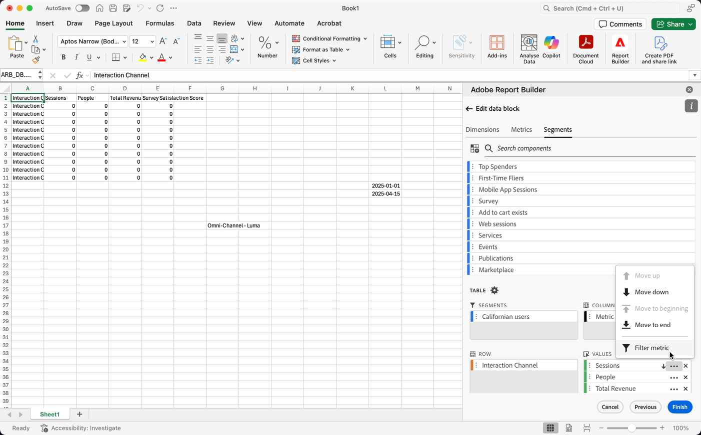
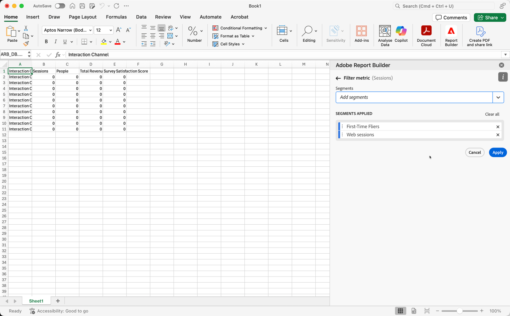
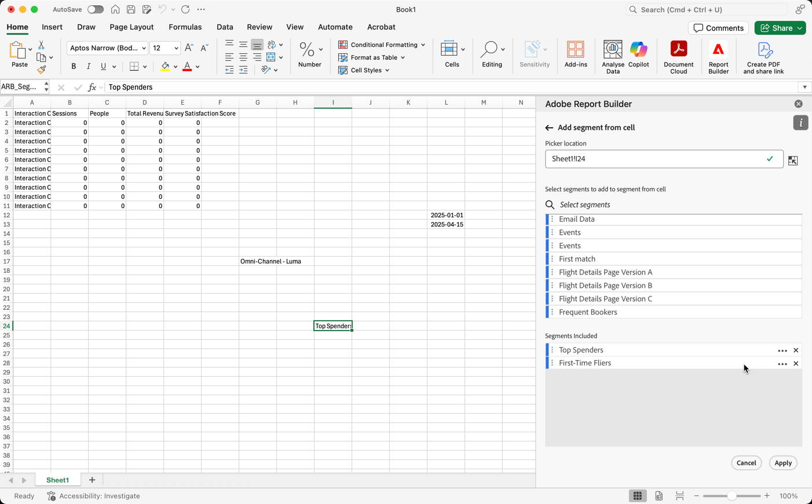
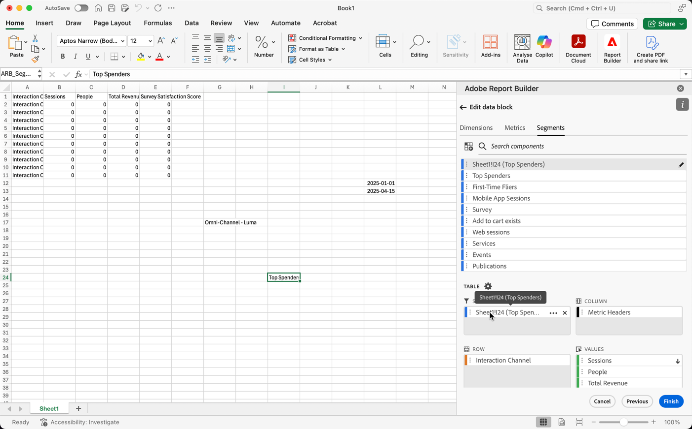
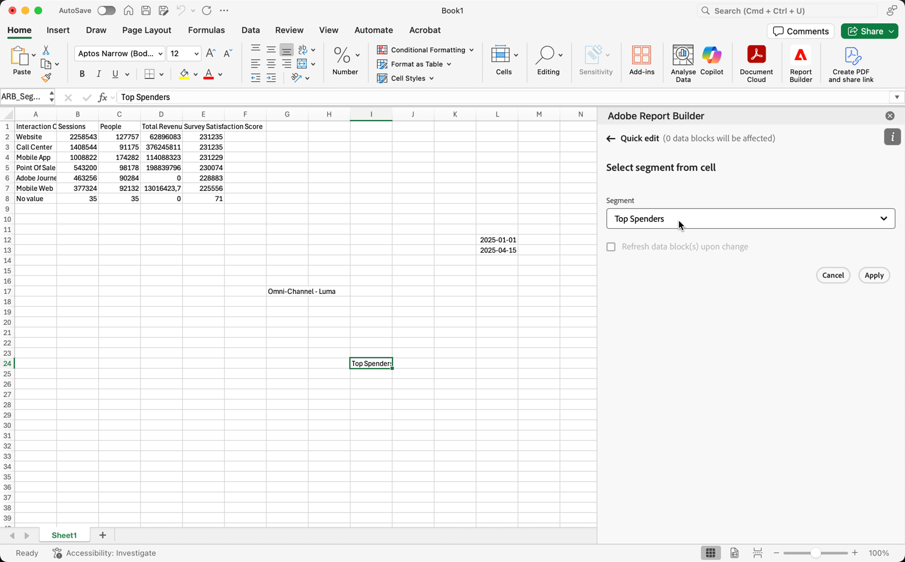

# 使用区段工作

您可以在创建新数据块或从&#x200B;**[!UICONTROL 命令]**&#x200B;面板中选择&#x200B;**[!UICONTROL 编辑数据块]**&#x200B;时应用区段。

## 将区段应用到数据块

要将区段应用于整个数据块，请双击一个区段，或者将区段从组件列表拖放到表的区段部分中。

## 将筛选器应用到单独的量度

要使用区段将过滤器应用于单个量度，请执行以下操作：

* 将&#x200B;**[!UICONTROL 区段]**&#x200B;中的一个或多个区段拖放到表中的某个量度上。

* 或者：

  1. 在&#x200B;**[!UICONTROL 表]**&#x200B;窗格中为特定量度选择，然后选择&#x200B;**[!UICONTROL 筛选量度]**。

     {zoomable="yes"}

  1. 从&#x200B;**[!UICONTROL 段]**&#x200B;下拉菜单中选择一个或多个段。 区段已添加到&#x200B;**[!UICONTROL 应用的区段]**&#x200B;列表。

     已应用
  1. 选择以从&#x200B;**[!UICONTROL 应用的区段]**&#x200B;列表中删除区段。 或者选择&#x200B;**[!UICONTROL 全部清除]**&#x200B;以从&#x200B;**[!UICONTROL 应用的区段]**&#x200B;列表中删除所有区段。
  1. 选择&#x200B;**[!UICONTROL 应用]**。

要查看应用的筛选器，请将光标悬停在量度上，或者在“表”窗格中选择量度。 已应用区段的量度会显示区段图标。

## 快速编辑区段

您可以使用&#x200B;**[!UICONTROL 快速编辑]**&#x200B;面板为现有数据块添加、删除或替换区段。

在电子表格中选择单元格范围时，**[!UICONTROL 快速编辑]**&#x200B;面板中的&#x200B;**[!UICONTROL 区段]**&#x200B;链接会显示该选区中数据块使用的区段的摘要列表。

要使用&#x200B;**[!UICONTROL 快速编辑]**&#x200B;面板编辑区段，请执行以下操作：

1. 从一个或多个数据块选择单元格范围。

1. 选择&#x200B;**[!UICONTROL 区段]**&#x200B;链接以启动&#x200B;**[!UICONTROL 快速编辑]**&#x200B;**[!UICONTROL 区段]**&#x200B;面板。

### 添加或删除区段

您可以使用“添加/删除”选项添加或删除区段。

1. 在&#x200B;**[!UICONTROL 快速编辑]**&#x200B;**[!UICONTROL 区段]**&#x200B;面板中选择&#x200B;**[!UICONTROL 添加/删除]**&#x200B;选项卡。

   1. 从&#x200B;**[!UICONTROL 段]**&#x200B;下拉菜单中选择一个或多个段。 区段已添加到&#x200B;**[!UICONTROL 应用的区段]**&#x200B;列表。
   1. 选择以从&#x200B;**[!UICONTROL 应用的区段]**&#x200B;列表中删除区段。
   1. 选择&#x200B;**[!UICONTROL 应用]**。

Report Builder显示消息以确认应用的区段更改。

### 替换区段

您可以使用另一个区段替换现有区段，以更改数据的分段方式。

1. 在&#x200B;**[!UICONTROL 快速编辑]**&#x200B;**[!UICONTROL 区段]**&#x200B;面板中选择&#x200B;**[!UICONTROL 替换]**&#x200B;选项卡。

1. 使用&#x200B;**搜索列表**&#x200B;搜索字段来查找特定区段。

1. 选择要替换的一个或多个区段。

1. 从“替换为”下拉菜单中搜索一个或多个区段，以将区段添加到&#x200B;**[!UICONTROL 替换为]**&#x200B;列表。

1. 选择&#x200B;**[!UICONTROL 应用]**。

Report Builder会更新区段列表以反映替换情况。

## 从单元格定义数据块区段

数据块可以从单元格引用区段。 多个数据块可以引用区段的同一单元格，从而允许您一次为多个数据块轻松切换区段。

要从单元格应用区段，请执行以下操作：

1. [创建新数据块](create-a-data-block.md#create-a-data-block)或编辑现有数据块。
1. 选择&#x200B;**[!UICONTROL 区段]**&#x200B;选项卡以定义区段。
1. 选择。

   {zoomable="yes"}

1. 选择要数据块从中引用区段的单元格。

1. 双击以向单元格添加区段。 或者，将一个或多个区段拖放到&#x200B;**[!UICONTROL 包括的区段]**&#x200B;部分中。

1. 选择&#x200B;**[!UICONTROL 应用]**&#x200B;以创建引用单元格。

1. 从&#x200B;**区段**&#x200B;选项卡，将新创建的引用单元格区段添加到数据块。

   显示Sheet1！J1(All Data)区段的{zoomable="yes"}

1. 选择&#x200B;**[!UICONTROL 完成]**。

要将引用单元格作为区段应用于其他数据块，请在&#x200B;**[!UICONTROL 表]**&#x200B;选项卡的&#x200B;**[!UICONTROL 区段]**&#x200B;列表中将该单元格引用用作区段之一。

### 使用引用单元格更改数据块区段

1. 选择电子表格中的引用单元格。

1. 在&#x200B;**[!UICONTROL 快速编辑]**&#x200B;菜单的&#x200B;**[!UICONTROL 单元格]**&#x200B;的区段下选择链接。

   单元格链接中的{zoomable="yes"}

1. 从下拉菜单中选择您的区段。

1. 选择&#x200B;**[!UICONTROL 应用]**。
