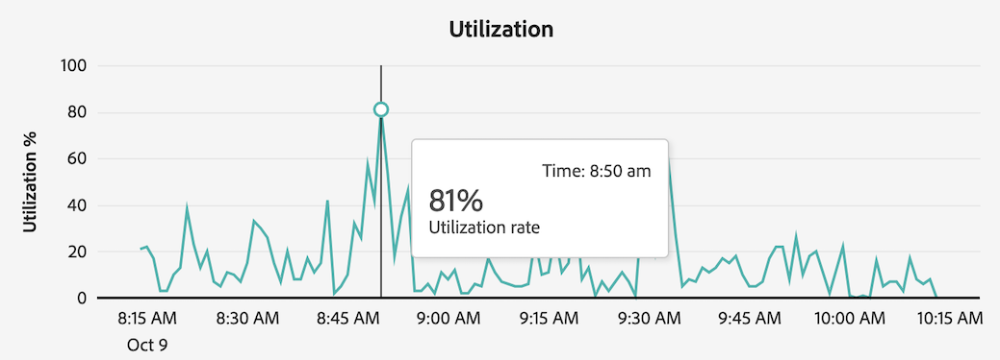
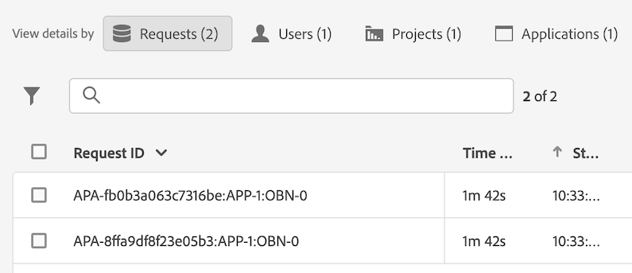

# 查看报告活动 {#view-reporting-activity}

[!UICONTROL 报告活动管理器]使管理员能够快速诊断和修复在报告高峰期出现的容量问题。

有关报告活动管理器的更多信息，包括主要优点和权限要求，请参阅[报告活动管理器概述](/help/reporting-activity-manager/reporting-activity-overview.md)。

## 对于所有连接 {#view-all-report-suites}

<!-- markdownlint-disable MD034 -->

>[!CONTEXTUALHELP]
>id="cja_tools_reportingactivitymanager_connections"
>title="连接"
>abstract="此表显示您有权管理报告活动的连接。表格的每一列都提供了有关每个连接的信息。"

<!-- markdownlint-enable MD034 -->

<!-- markdownlint-disable MD034 -->

>[!CONTEXTUALHELP]
>id="tools_reportingactivitymanager_connections"
>title="连接"
>abstract="此表显示您有权管理报告活动的连接。表格的每一列都提供了有关每个连接的信息。"

<!-- markdownlint-enable MD034 -->

1. 在 Customer Journey Analytics 中，转到&#x200B;**[!UICONTROL 工具]** > **[!UICONTROL 报告活动管理器]**。

   已启用的基础连接的列表会显示。

   

1. 要查看组织中所有连接的报告请求总数，请展开&#x200B;[!UICONTROL **显示更多**]&#x200B;以查看&#x200B;[!UICONTROL **每月报告请求数**]&#x200B;图表。

   您可以查看您所在组织内当月和上月报告请求的数量。

   

1. （可选）您可以搜索或筛选连接列表：

   * 使用搜索字段可搜索特定连接。开始键入连接名称或 ID，连接列表会随着您的键入而更新。

   * 选择以展开区段选项列表。 您可以按&#x200B;[!UICONTROL **收藏夹**]&#x200B;或&#x200B;[!UICONTROL **状态**]&#x200B;进行筛选。

     要将某个连接标记为收藏，请点击连接名称左侧的星形图标。

     <!-- (does this option still exist?) 1. (Optional) Select **[!UICONTROL Refresh]** at the top-right to refresh the data. -->

1. 查看每个连接的利用率信息。表中显示的数据代表页面上次加载时该连接的报告活动。

   以下列可供使用：

   | UI 元素 | 描述 |
   | --- | --- |
   | **[!UICONTROL 连接]** | 您正在监控其报告活动的连接。 |
   | **[!UICONTROL 数据视图]** | 显示使用该连接的所有数据视图。数据视图配置可能会增加报告请求的复杂性。 |
   | **[!UICONTROL 产能利用率]** | 连接报告容量的实时使用率百分比。 
**注释**&#x200B;使用容量达到 100%，并不一定意味着您应该立即开始取消报告请求。如果平均等待时间合理，100％的使用容量也是健康的。另一方面，如果已排队的请求数量也在增加，则 100% 的使用容量可能表明存在问题。
 |
   | **[!UICONTROL 已排队的请求]** | 等待处理的请求数。<!-- ??? --> |
   | **[!UICONTROL 队列等待时间]** | 请求开始处理之前的平均等待时间。<!-- ???? --> |
   | **[!UICONTROL 状态]** | 可能的状态是： <ul><li>[!UICONTROL **活动**]（蓝色）：过去 2 小时内已在该连接上运行的报告。表中显示的数据代表页面上次加载时该连接的报告容量。</li><li>[!UICONTROL **不活跃**]（灰色）：过去 2 个小时内未针对该连接运行过任何报告，因此未显示该连接的任何数据。</li></ul> |

   {style="table-layout:auto"}

## 对于单个连接

1. 在 Customer Journey Analytics 中，选择&#x200B;[!UICONTROL **工具**] > [!UICONTROL **报告活动管理器**]。

1. 选择要查看其详细信息的连接的链接标题。

   您所选择的连接的报告活动数据会显示。

1. （可选）在报告活动管理器中首次加载连接时，显示的数据代表当前的利用率量度。要在初始加载后查看更新的量度，请选择&#x200B;[!UICONTROL **刷新**]&#x200B;按钮手动刷新页面。

   <!-- Need to update this screenshot:  -->

1. 使用可用的图表和表格来了解连接中的报告活动。

   * [查看图表](#view-graphs)

   * [查看表格](#view-table)

### 查看图表

以下图表可帮助您更好地了解连接中发生的活动。

如果看不到图表，请选择&#x200B;[!UICONTROL **显示图表**]&#x200B;按钮。

#### 利用率图表 {#utilization}

“利用率”图表显示选定的连接在过去 2 小时内的报告利用率。

将光标悬停在图表上，可以查看该分钟使用容量百分比最高的时间点。

* **X 轴**：报告过去 2 小时内的使用容量。
* **Y 轴**：报告使用容量百分比（按分钟计）。

  

#### 不同用户图表

“不同用户”图表显示选定的连接在过去 2 小时内的报告活动。

将光标悬停在图表上，可以查看该分钟最大用户数最高的时间点。

* **X 轴**：过去 2 小时时间范围内的报告活动。
* **Y 轴**：发出报告请求的用户数量（按分钟计）。

  

#### 请求图表

“请求”图表显示过去 2 小时内选定连接已处理和已排队的请求数。

将光标悬停在图表上，可以查看该分钟最大请求数量最高的时间点。

* **X 轴**：过去 2 小时时间范围内已处理和已排队的请求数。
* **Y 轴**：已处理的请求数（绿色）和已排队的请求数（紫色）（按分钟计）。

  

#### 正在排队图表

“正在排队”图表显示过去 2 小时内选定连接的报告请求的平均队列等待时间（以秒为单位）。

将光标悬停在图表上，可以查看该分钟最大平均等待时间最高的时间点。

* **X 轴**：过去 2 小时时间范围内报告请求的平均队列等待时间。
* **Y 轴**：平均等待时间（以秒为单位）。

  

### 查看表格 {#view-table}

查看表格时，请考虑以下事项：

* 您可以通过选择数据表顶部的以下任一选项卡来查看数据：[!UICONTROL **请求**]、[!UICONTROL **用户**]、[!UICONTROL **项目**]&#x200B;或&#x200B;[!UICONTROL **应用程序**]。

* 您可以搜索或筛选连接列表：

   * 使用搜索字段可搜索特定连接。开始键入连接名称或 ID，连接列表会随着您的键入而更新。

   * 选择&#x200B;[!UICONTROL **过滤器**]&#x200B;图标以展开过滤器选项列表。您可以按&#x200B;[!UICONTROL **状态**]、[!UICONTROL **复杂性**]、[!UICONTROL **应用程序**]、[!UICONTROL **用户**]&#x200B;或&#x200B;[!UICONTROL **项目**]&#x200B;进行筛选。

   * 您可以选择&#x200B;[!UICONTROL **隐藏图表**]&#x200B;以仅显示表格。

#### 通过请求查看数据

当您选择&#x200B;[!UICONTROL **请求**]&#x200B;选项卡时，表中将显示以下列：

| 列 | 描述 |
| --- | --- |
| [!UICONTROL **请求 ID**] | 可以用于故障排除目的的唯一 ID。要复制 ID，请选择请求，然后选择选项，[!UICONTROL **复制请求 ID**]。 |
| [!UICONTROL **已用时间**] | 请求运行了多长时间。 |
| [!UICONTROL **开始时间**] | 请求开始处理的时间（基于管理员的本地时间）。 |
| [!UICONTROL **等待时间**] | 请求在处理之前等待了多长时间。当有足够的容量时，该值通常为“0”。 |
| [!UICONTROL **应用程序**] | [!UICONTROL 报告活动管理器]支持的应用程序包括： <ul><li>Analysis Workspace UI</li><li>Workspace 计划项目</li><li>Report Builder</li><li>生成器 UI：区段、计算量度、注释、受众等。</li><li>来自 2.0 API 的 API 调用</li><li>警报<li>整个表导出</li><li>与任何人共享链接</li><li>引导式分析</li><li>查询 Analytics 报告引擎的任何其他应用程序</li></li></ul>
**注释：**&#x200B;如果此列的值为&#x200B;[!UICONTROL **未知**]，则表示该请求元数据不适用于该用户。
 |
| [!UICONTROL **用户**] | 发起请求的用户。 
**注释：**&#x200B;如果此列的值为&#x200B;[!UICONTROL **未知**]，则表示该请求元数据不适用于该用户。
 |
| [!UICONTROL **项目**] | 已保存的工作区项目名称、API 报告 ID 等。（元数据可能因各种应用程序而异。）
**注释：**&#x200B;如果此列的值为&#x200B;[!UICONTROL **未知**]，则表示该项目尚未保存，或请求元数据不适用于该用户。
 |
| [!UICONTROL **状态**] | 状态指示器： <ul><li>**运行中**：请求当前正在处理中。</li><li>**等待中**：请求正在等待处理。</li></ul> |
| [!UICONTROL **复杂性**] | 并非所有请求都需要相同的处理时间。请求复杂性可以帮助我们大致了解处理请求所需的时间。 
可能的值包括：
 <ul><li>[!UICONTROL **低**]</li><li>[!UICONTROL **中**]</li><li>[!UICONTROL **高**]</li></ul>该值受以下列值的影响：<ul><li>[!UICONTROL **月份边界**]</li><li>[!UICONTROL **列**]</li><li>[!UICONTROL **区段**]</li></ul> |
| [!UICONTROL **月份边界**] | 请求中包含的月份数。更多月份边界增加了请求的复杂性。 |
| [!UICONTROL **列**] | 请求中的量度和细分数量。更多列增加了请求的复杂性。 |
| [!UICONTROL **区段**] | 应用于请求的区段数。更多区段增加了请求的复杂性。 |

{style="table-layout:auto"}

#### 按用户查看数据

当您选择&#x200B;[!UICONTROL **用户**]&#x200B;选项卡时，表中将显示以下列：

| 列 | 描述 |
| --- | --- |
| [!UICONTROL **用户**] | 发起请求的用户。如果此列的值为&#x200B;[!UICONTROL **无法识别**]，则表示用户处于您没有管理权限的登录公司。 |
| [!UICONTROL **请求数**] | 用户发起的请求数。 |
| [!UICONTROL **项目数量**] | 与用户关联的项目数量。<!-- ??? --> |
| [!UICONTROL **应用程序**] | [!UICONTROL 报告活动管理器]支持的应用程序包括： <ul><li>Analysis Workspace UI</li><li>Workspace 计划项目</li><li>Report Builder</li><li>生成器 UI：区段、计算量度、注释、受众等。</li><li>来自 2.0 API 的 API 调用</li><li>警报<li>整个表导出</li><li>与任何人共享链接</li><li>引导式分析</li><li>查询 Analytics 报告引擎的任何其他应用程序</li></li></ul> |
| [!UICONTROL **平均复杂度**] | 用户发起请求的平均复杂性。 
并非所有请求都需要相同的处理时间。请求复杂性可以帮助我们大致了解处理请求所需的时间。

此列中的值是根据以下各列中的值确定的分数得出：
<ul><li>[!UICONTROL **平均月份边界**]</li><li>[!UICONTROL **平均列数**]</li><li>[!UICONTROL **平均区段数**]</li></ul> |
| [!UICONTROL **平均月份边界**] | 请求中包含的平均月份数。更多月份边界增加了请求的复杂性。 |
| [!UICONTROL **平均列数**] | 所包含请求中量度和细分的平均数量。更多列增加了请求的复杂性。 |
| [!UICONTROL **平均区段数**] | 应用于所包含请求的平均区段数。更多区段增加了请求的复杂性。 |

{style="table-layout:auto"}

#### 按项目查看数据

当您选择&#x200B;[!UICONTROL **项目**]&#x200B;选项卡时，表中将显示以下列：

| 列 | 描述 |
| --- | --- |
| [!UICONTROL **项目**] | 发起请求的项目。 |
| [!UICONTROL **请求数量**] | 与项目相关的请求数量。 |
| [!UICONTROL **用户数量**] | 与项目相关的用户数量。<!-- ??? --> |
| [!UICONTROL **应用程序**] | [!UICONTROL 报告活动管理器]支持的应用程序包括： <ul><li>Analysis Workspace UI</li><li>Workspace 计划项目</li><li>Report Builder</li><li>生成器 UI：区段、计算量度、注释、受众等。</li><li>来自 2.0 API 的 API 调用</li><li>警报<li>整个表导出</li><li>与任何人共享链接</li><li>引导式分析</li><li>查询 Analytics 报告引擎的任何其他应用程序</li></li></ul> |
| [!UICONTROL **平均复杂度**] | 项目中包含请求的平均复杂性。 
并非所有请求都需要相同的处理时间。请求复杂性可以帮助我们大致了解处理请求所需的时间。

此列中的值是根据以下各列中的值确定的分数得出：
<ul><li>[!UICONTROL **平均月份边界**]</li><li>[!UICONTROL **平均列数**]</li><li>[!UICONTROL **平均区段数**]</li></ul> |
| [!UICONTROL **平均月份边界**] | 请求中包含的平均月份数。更多月份边界增加了请求的复杂性。 |
| [!UICONTROL **平均列数**] | 所包含请求中量度和细分的平均数量。更多列增加了请求的复杂性。 |
| [!UICONTROL **平均区段数**] | 应用于所包含请求的平均区段数。更多区段增加了请求的复杂性。 |

{style="table-layout:auto"}

#### 按应用程序查看数据

当您选择&#x200B;[!UICONTROL **应用程序**]&#x200B;选项卡时，表中将显示以下列：

| 列 | 描述 |
| --- | --- |
| [!UICONTROL **应用程序**] | 发起请求的应用程序。 |
| [!UICONTROL **请求数量**] | 与应用程序相关的请求数量。 |
| [!UICONTROL **用户数量**] | 与应用程序相关的用户数量。<!--???--> |
| [!UICONTROL **项目数量**] | 与应用程序相关的项目数量。<!--???--> |
| [!UICONTROL **平均复杂度**] | 与应用程序相关请求的平均复杂性。 
并非所有请求都需要相同的处理时间。请求复杂性可以帮助我们大致了解处理请求所需的时间。

此列中的值是根据以下各列中的值确定的分数得出：
此列中的值是根据以下各列中的值确定的分数得出：<ul><li>[!UICONTROL **平均月份边界**]</li><li>[!UICONTROL **平均列数**]</li><li>[!UICONTROL **平均区段数**]</li></ul> |
| [!UICONTROL **平均月份边界**] | 请求中包含的平均月份数。更多月份边界增加了请求的复杂性。 |
| [!UICONTROL **平均列数**] | 所包含请求中量度和细分的平均数量。更多列增加了请求的复杂性。 |
| [!UICONTROL **平均区段数**] | 应用于所包含请求的平均区段数。更多区段增加了请求的复杂性。 |

{style="table-layout:auto"}

<!-- 

## Frequently asked questions {#faq}

| Question | Answer |
| --- | --- |
| | |

{style="table-layout:auto"}

-->
