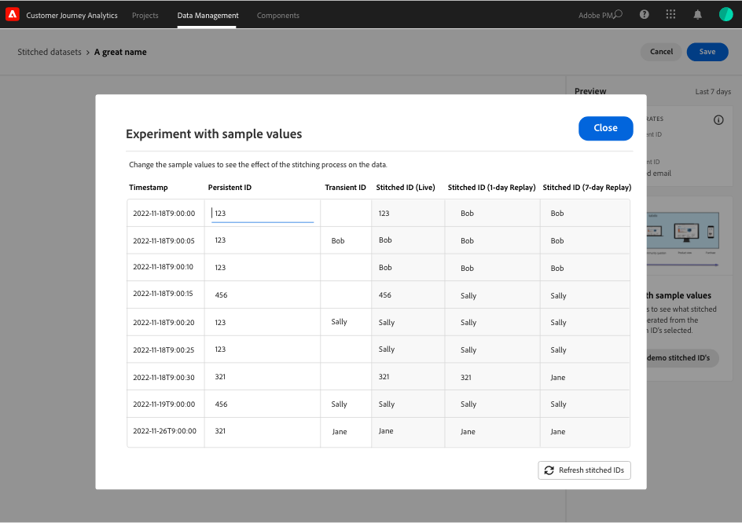

# 创建和管理拼合的数据集

拼接允许管理员在Customer Journey Analytics中可用的数据集上拼接身份。 拼合数据集可提高用户档案表示的准确性，从而最终实现更好的分析和报告。

拼接过程允许您定义现有的 **永久ID** 在数据集中。 然后，将指定重放窗口（每天、每周）的永久标识符与最精确的标识符拼合 **临时ID** （人员或经过身份验证的标识符）可供该数据集使用。 临时标识符的示例包括电子邮件、电话号码、CRM ID或存储在图表中的其他标识。 参见 [概述](overview.md) 以了解有关拼接的更多信息。

## 创建

要启动拼合，您需要创建一个或多个拼合的数据集。 要创建拼合的数据集，请执行以下操作：

1. 选择 **[!UICONTROL **&#x200B;拼接&#x200B;**]** 起始日期 **[!UICONTROL **&#x200B;数据管理&#x200B;**]** 在顶部栏中。

2. 在 [!UICONTROL 拼合的数据集] 屏幕，选择 **[!UICONTROL **&#x200B;创建拼合的数据集&#x200B;**]**.

   系统将提示您说明自己的责任。

3. 选择 **[!UICONTROL **&#x200B;继续&#x200B;**]** 如果你接受这些责任。

   >[!NOTE]
   >
   >    如果您选择 **[!UICONTROL **&#x200B;取消&#x200B;**]**，您将无法创建拼合的数据集。

4. 在 [!UICONTROL 拼接的数据集>无标题拼接的数据集] 屏幕：

   1. 定义 **[!UICONTROL **&#x200B;数据集名称&#x200B;**]** 和（可选） **[!UICONTROL **&#x200B;描述&#x200B;**]**，

   2. 从中选择沙盒 **[!UICONTROL **&#x200B;沙盒&#x200B;**]** 列出存储事件数据集的位置。

      

   3. 选择 **[!UICONTROL **&#x200B;选择源数据集&#x200B;**]** 按钮。

      在 [!UICONTROL 选择一个要拼合的数据集] 弹出窗口：

      

      - 选择一个数据集并选择 **[!UICONTROL **&#x200B;选择&#x200B;**]** 以继续。

   4. 从中选择一个永久标识符 **[!UICONTROL **&#x200B;永久ID **]** 列表。

   5. 从中选择临时标识符 **[!UICONTROL **&#x200B;临时ID **]** 列表。

      您会注意到，预览面板似乎在计算过去七天的饱和率（在事件数内每个指定标识符都有一个值的次数）。 完成计算后，面板会用颜色显示是否满足拼接的最小条件（绿色）或不满足（红色）。

      

      最低条件为：

      - 持续性标识符饱和度：比率>= 95%

      - 瞬时标识符饱和度：速率>= 5%

        如果满足最小条件，则可以试验样本值。

      - 选择 **[!UICONTROL **&#x200B;创建演示拼接ID **]**.

        在 [!UICONTROL 试验样本值] 对话框中，将显示一个表，其中包含示例值 [!UICONTROL 时间戳]， [!UICONTROL 永久ID]， [!UICONTROL 临时ID]， [!UICONTROL 拼合ID（正式启用）]， [!UICONTROL 拼合ID（1天重播）]、和 [!UICONTROL 拼合ID（7天重播）].

            
            
            1.  输入**的值[!UICONTROL **永久ID**]**。
            
            2.  选择**[!UICONTROL **刷新拼接ID**]**查看拼合过程对数据集中的数据的影响。
            
            3.  选择**[!UICONTROL **关闭**]**当您完成样本值的试验时。
        

        返回 [!UICONTROL 拼合的数据集> _数据集名称_] 屏幕：

   6. 从中选择重述历史数据的频率和时段的选项 **[!UICONTROL **“重播”窗口&#x200B;**]** 列表。

      您可以在默认值之间选择 **[!UICONTROL **&#x200B;前一天，每天&#x200B;**]** 或 **[!UICONTROL **&#x200B;前7天，每周&#x200B;**]**.

   7. 从中选择值 **[!UICONTROL **&#x200B;平均每日事件数&#x200B;**]** 列表。

   8. 输入一个值(介于 `0` 和 `12`)，位于 **[!UICONTROL **&#x200B;要回填的月数&#x200B;**]**.

   9. 选择 **[!UICONTROL **&#x200B;保存&#x200B;**]** 以保存拼合的数据集并启动拼合。

## 查看状态

您可以在以下位置查看拼合的状态 [!UICONTROL 拼合的数据集] 列表。

- 选择 **[!UICONTROL **&#x200B;拼接&#x200B;**]** 起始日期 **[!UICONTROL **&#x200B;数据管理&#x200B;**]** 在顶部栏中。

  您将看到一个拼合数据集列表，每个数据集都使用 [!UICONTROL 沙盒]， [!UICONTROL 源数据集]， [!UICONTROL 状态]， [!UICONTROL 回填状态]， [!UICONTROL 所有者]、和 [!UICONTROL 创建日期].

  

  的可能值 [!UICONTROL 状态] 为：

  | 值 | 说明 |
  |-----|-----|
  | **[!UICONTROL **&#x200B;已排队&#x200B;**]** | 将很快收到并处理请求。 |
  | **[!UICONTROL **&#x200B;正在进行创建&#x200B;**]** | 正在创建资源和新拼合的数据集。 |
  | **[!UICONTROL **&#x200B;正在进行拼接&#x200B;**]** | 资源和拼合的数据集已存在，并且正在进行拼合 |
  | **[!UICONTROL **&#x200B;错误&#x200B;**]** | 拼合时出现问题。 架构在源数据集与拼合数据集之间发生了更改，日流量过大，或者…… (_**此处需要更多信息……**_) |

  >[!INFO]
  >
  >    每当状态发生变化时，都会发送消息通知 **[!UICONTROL **&#x200B;拼接的数据集 _数据集名称_ 已更改为状态 _状态名称&#x200B;_**]**.

  此 [!UICONTROL 回填状态] 可以具有以下值：0%、25%、50%、75%或100%。

  您可以选择信息图标以显示一个弹出窗口，其中包含有关所选拼接数据集的更多详细信息。

## 删除

>[!NOTE]
>
>您只能删除具有状态的数据集 [!UICONTROL 正在进行拼合]， [!UICONTROL 错误]，或 [!UICONTROL 已排队].

要删除单个拼接的数据集，请执行以下操作：

- 选择 **[!UICONTROL **...**]** 对于拼接的数据集，然后选择 **[!UICONTROL **&#x200B;删除&#x200B;**]** 从菜单中。

  

要删除多个拼接数据，请执行以下操作：

- 使用每个列出数据集开头的复选框选择多个拼合的数据集。

- 选择 **[!UICONTROL **...**]** 从其中一个选定的拼接数据集中选择 **[!UICONTROL **&#x200B;删除&#x200B;**]** 从菜单中。
