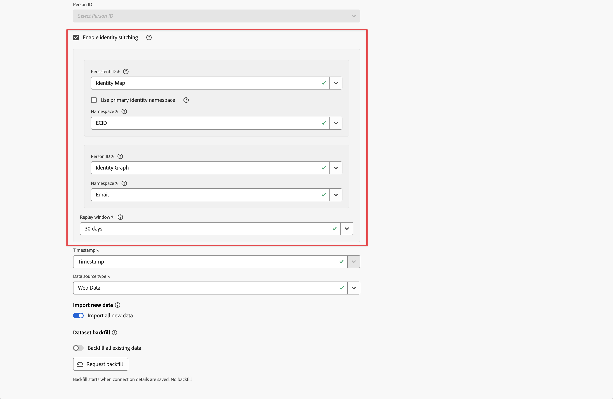

# 启用拼接

您可以对作为连接的一部分配置的一个或多个事件数据集启用拼合。 您许可的Customer Journey Analytics包将决定您能够为拼合启用的事件数据集数量。

当您[创建连接](/help/connections/create-connection.md)或[编辑连接](/help/connections/manage-connections.md#edit-a-connection)时，您可以将拼合作为事件数据集的[数据集设置](/help/connections/create-connection.md#dataset-settings)的一部分来启用。

## 先决条件

您需要检查并满足您指定的拼接方法的先决条件：[基于字段的拼接](fbs.md#prerequisites)或[基于图形的拼接](gbs.md#prerequisites)。

## 印前检查检查

如果您满足前提条件，请在启用身份拼接之前对事件数据集中的数据执行一些预检检查：

* 如果您使用永久ID或人员ID的[体验数据模型(XDM)架构](https://experienceleague.adobe.com/zh-hans/docs/experience-platform/xdm/home)字段，请确保在事件数据集的架构中正确标记身份。 [请参阅身份命名空间概述](https://experienceleague.adobe.com/zh-hans/docs/experience-platform/identity/features/namespaces)。
* 验证持久ID和人员ID的标识覆盖范围：

  * **[!UICONTROL 永久ID]**

    查询7天的数据，其中您的永久ID字段不为null，并除以针对数据集中所有事件的7天数据查询。 该百分比应高于95%。

    用于验证的查询示例：

    ```sql
    SELECT
      COUNT(*) AS total_events,
      COUNT({PERSISTENT_ID_FIELD}) AS events_with_persistentid,
      ROUND(COUNT({PERSISTENT_ID_FIELD}) / COUNT(*), 2) AS percent_with_persistentid_not_null
    FROM 
      {DATASET_TABLE_NAME}
    WHERE
      TO_TIMESTAMP(timestamp, '{FORMAT_STRING}') >= TIMESTAMP '{START_DATE}'
      AND TO_TIMESTAMP(timestamp, '{FORMAT_STRING}') < TIMESTAMP '{END_DATE}';
    ```

    其中：

    * `{PERSISTENT_ID_FIELD}`是永久ID的字段。 例如：`identityMap.ecid[0]`。
    * `{DATASET_TABLE_NAME}`是事件数据集的表名称。
    * `{FORMAT_STRING}`是时间戳字段的格式字符串。 例如：`MM/DD/YY HH12:MI AM`。
    * `{START_DATE}`是开始日期。 例如：`2024-01-01 00:00:00`。
    * `{END_DATE}`是标准格式的结束日期。 例如：`2024-01-08 00:00:00`。


  * **[!UICONTROL 人员 ID]**
    * 对于基于图形的拼接，请确保身份图形包含一些片段，这些片段关联来自您选择的永久ID命名空间和人员ID命名空间的ID值。 转到[Experience Platform身份图形查看器](https://experienceleague.adobe.com/zh-hans/docs/experience-platform/identity/features/identity-graph-viewer){target="_blank"}，并通过一些示例永久ID值查询该图形。 要验证，请检查这些持久ID值是否与图表中的人员ID值相关联。
    * 对于基于字段的拼合，请查询7天的数据，其中人员ID字段不为null，然后除以针对数据集中所有事件的7天数据查询。 理想情况下，该百分比应高于5%。

      用于验证的查询示例：

      ```sql
      SELECT
        COUNT(*) AS total_events,
        COUNT({PERSON_ID_FIELD}) AS events_with_personid,
        ROUND(COUNT({PERSON_ID_FIELD}) / COUNT(*), 2) AS percent_with_personid_not_null
      FROM 
        {DATASET_TABLE_NAME}
      WHERE
        TO_TIMESTAMP(timestamp, '{FORMAT_STRING}') >= TIMESTAMP '{START_DATE}'
        AND TO_TIMESTAMP(timestamp, '{FORMAT_STRING}') < TIMESTAMP '{END_DATE}';
      ```

      其中：

      * `{PERSON_ID_FIELD}`是人员ID的字段。 例如：`identityMap.crmId[0]`。
      * `{DATASET_TABLE_NAME}`是事件数据集的表名称。
      * `{FORMAT_STRING}`是时间戳字段的格式字符串。 例如：`MM/DD/YY HH12:MI AM`。
      * `{START_DATE}`是开始日期。 例如：`2024-01-01 00:00:00`。
      * `{END_DATE}`是标准格式的结束日期。 例如：`2024-01-08 00:00:00`。


## 启用身份标识拼接 {#enable-identity-stitching}

当您[添加](/help/connections/create-connection.md#add-datasets)或[编辑](/help/connections/create-connection.md#edit-a-dataset)基于人员的连接中的事件数据集时，可以启用身份拼接。 身份拼接不适用于基于帐户的连接。

>[!CONTEXTUALHELP]
>id="connection_changeto_identitygraph"
>title="身份标识图的更改"
>abstract="在使用身份标识图进行拼接前，请先确保您已完成身份标识图的设置。"
>additional-url="https://experienceleague.adobe.com/zh-hans/docs/analytics-platform/using/stitching/gbs" text="基于图形的拼接"

>[!CONTEXTUALHELP]
>id="connection_stitching_personid"
>title="人员 ID"
>abstract="从可用身份标识中选择一个人员 ID（个人的唯一标识符）。 如果您的许可证包含基于图形的拼接功能且需使用该拼接方式，请选择&#x200B;**[!UICONTROL 身份标识图]**。"

>[!CONTEXTUALHELP]
>id="connection_stitchingmetrics"
>title="拼接量度"
>abstract="拼接量度使用过去 7 天事件时间戳的样本数据集进行计算。<br>此样本数据集通常与&#x200B;**[!UICONTROL 预览]**&#x200B;表中使用的样本数据不同。"

>[!CONTEXTUALHELP]
>id="connection_stitchingmetrics_gbs_personidcoverage"
>title="人员 ID 覆盖率"
>abstract="在拼接过程中（实时和重放）用于识别的所选人员 ID 的覆盖率。<br/>为了获得最佳拼接效果，身份标识图中应为每个永久 ID 建立（永久 ID，人员 ID）关系。"

>[!CONTEXTUALHELP]
>id="connection_stitchingmetrics_fbs_personidcoverage"
>title="人员 ID 覆盖率"
>abstract="在拼接过程中（实时和重放）用于识别的所选人员 ID 的覆盖率。<br/>为了获得最佳拼接效果，应在每个永久 ID（设备信息）至少对应的一个事件中发送人员 ID（用户信息）。"

>[!CONTEXTUALHELP]
>id="connection_stitchingmetrics_persistentidcoverage"
>title="永久 ID 覆盖率"
>abstract="当无法检测到人员 ID 值时，该值会在拼接过程中（实时和重放）用于识别。 <br/>不包含永久 ID 和人员 ID 的事件将从数据中丢弃。 为了获得最佳拼接效果，所有事件都应包含永久 ID。"


>[!CONTEXTUALHELP]
>id="connection_stitchingmetrics_badids"
>title="无效 ID"
>abstract="无效 ID 是指会严重影响报告数据的 ID 值。"
>additional-url="https://experienceleague.adobe.com/zh-hans/docs/analytics-platform/using/technotes/badids" text="无效 ID"


### 数据集设置

若要启用拼接，请使用&#x200B;**[!UICONTROL 添加数据集]**&#x200B;或&#x200B;**[!UICONTROL 编辑数据集]**&#x200B;对话框的事件数据集&#x200B;**[!UICONTROL 数据集设置]**&#x200B;部分。

启用该功能时

1. 选择&#x200B;**[!UICONTROL 启用身份拼接]**。

   如果启用或禁用拼合连接中已保存的事件数据集，**[!UICONTROL 更改人员ID]**&#x200B;对话框将显示人员ID更改的影响。 选择&#x200B;**[!UICONTROL 继续]**&#x200B;以继续。

   **[!UICONTROL 启用身份拼接]**&#x200B;对话框汇总了拼接身份的结果。 选择&#x200B;**[!UICONTROL 继续]**&#x200B;以继续。

1. 从&#x200B;**[!UICONTROL 永久ID]**&#x200B;下拉菜单中选择一个永久ID。

   如果为永久ID选择&#x200B;**[!UICONTROL 标识映射]**，请选择命名空间。 您有两个选项：

   * 选择&#x200B;**[!UICONTROL 使用主身份命名空间]**&#x200B;以使用主身份命名空间。
   * 从&#x200B;**[!UICONTROL 命名空间]**&#x200B;下拉菜单中选择一个命名空间。

1. 从&#x200B;**[!UICONTROL 人员ID]**&#x200B;下拉菜单中选择人员ID。

   如果您为人员ID选择&#x200B;**[!UICONTROL 身份映射]**，请选择命名空间。 您有两个选项：

   * 选择&#x200B;**[!UICONTROL 使用主身份命名空间]**&#x200B;以使用主身份命名空间。
   * 从&#x200B;**[!UICONTROL 命名空间]**&#x200B;下拉菜单中选择一个命名空间。

   如果您为人员ID选择&#x200B;**[!UICONTROL 身份图形]**（要使用[基于图形的拼接](/help/stitching/gbs.md)），则必须选择命名空间。

   >[!NOTE]
   >
   >确保您有权使用身份图。
   >

   在此之前，将显示&#x200B;**[!UICONTROL 更改为身份图]**&#x200B;对话框，以确保您已经为数据集完成身份图的设置。 此安装程序是[基于图表的先决条件](/help/stitching/gbs.md#prerequisites)的一部分，之后才能使用标识图进行拼合。 选择&#x200B;**[!UICONTROL 继续]**&#x200B;以继续。

   * 从&#x200B;**[!UICONTROL 命名空间]**&#x200B;下拉菜单中选择一个命名空间。

1. 从&#x200B;**[!UICONTROL 重播窗口]**&#x200B;下拉菜单中选择一个重播窗口。 可用选项取决于您有权访问的Customer Journey Analytics包。

1. 选择&#x200B;**[!UICONTROL 下一步]**&#x200B;查看要拼合的事件数据集预览。


### 数据集预览

在标准&#x200B;**[!UICONTROL 数据集预览]**&#x200B;界面之上，当[添加](/help/connections/create-connection.md#add-datasets)或[编辑](/help/connections/create-connection.md#edit-a-dataset)数据集到基于人员的连接中时，可以使用两个其他的信息面板。

启用该功能时

#### 拼接量度

>[!AVAILABILITY]
>
>无法对基于图形的拼接使用拼接量度。
>

**[!UICONTROL 拼接量度]**&#x200B;是使用最近7天带有事件时间戳的数据示例集计算的。 此样本数据集通常不同于&#x200B;**[!UICONTROL 预览]**&#x200B;表中使用的样本数据。 拼接量度提供以下内容的详细信息：

* **[!UICONTROL 人员ID覆盖率]**：拼接过程中用于标识的选定人员ID覆盖率（实时和重播）。
  * 为了获得基于字段的最佳拼接结果，应在每个永久ID（设备信息）的至少一个事件中发送个人ID（用户信息）。
  * 为了获得最佳的基于图形的拼接结果，每个永久ID的身份图中应存在一个（永久ID、人员ID）关系。

  人员ID覆盖范围显示为百分比，并与在稳定开发或生产设置中推荐的内容进行比较。 此覆盖值越高，使用选定的人员ID获得的拼接结果就越好。

* **[!UICONTROL 持久ID覆盖率]**：此值用于在拼接过程（实时和重放）中标识，以防检测到人员ID值。 不包含永久 ID 和人员 ID 的事件将从数据中丢弃。 为了获得最佳拼接效果，所有事件都应包含永久 ID。

  持久ID覆盖范围以百分比显示，并与稳定开发或生产设置的最低建议数量进行比较。

#### 无效 ID

>[!AVAILABILITY]
>
>错误ID不适用于基于图形的拼合。
>

>[!INFO]
>
>在Customer Journey Analytics界面中，错误ID也称为BAVID。
> 

在Customer Journey Analytics中，错误ID是一个标识符：

* 具有特定ID值，该值来自启用拼接的数据集中的永久ID或人员ID字段，**和**
* 每月出现在连接数据中的一百多万(1,000,000)个事件中。

当某个ID值被标记为错误ID时，任何包含该ID值的未来事件都将从连接数据中舍弃，并且不会在报表中显示。

错误ID用例示例：

* 人员ID字段中有自定义值或占位符值（例如，`undefined`）。 此类值还会影响[拼接和报告数据质量](/help/stitching/faq.md#undefined-person-id-values)。
* 在基于字段的拼合配置中，如果多人共享一台设备，则用户之间的转换总数超过50,000。 在这种情况下，拼接过程将停止使用该设备的人员ID信息，而仅使用永久性ID信息。 因此，来自该设备的所有数据集事件都将发送到具有永久ID身份的连接数据中，这可能会导致出现“ID错误”情况。


>[!NOTE]
>**[!UICONTROL 拼合量度]**（包括&#x200B;**[!UICONTROL 错误的ID]**）是根据有限的数据集计算的。 要识别计划用于拼接的数据集存在错误ID，请参阅[错误ID技术说明](/help/technotes/badids.md)。
>


### 保存

保存连接后，将触发对配置的数据集启用拼合的过程。 设置拼合服务后，该服务会处理实时流式传输的数据以及来自Experience Platform中的事件数据集的任何请求的回填。 随后，数据被摄取到Customer Journey Analytics连接中。

流程的每个部分都会增加一定的延迟。 以下处理时间是护栏，而不是合同服务级别协议(SLA)。

对于已保存并包含已启用拼合的数据集的有效初始连接设置：

* 经过若干小时（不到17小时）后，实时数据最初会显示在Customer Journey Analytics中。 实时数据从事件时间戳值开始，这些值与拼合启用完成时的实际时间相匹配。

  要确保实时数据开始流入，请为数据集启用&#x200B;**[!UICONTROL 导入所有新数据]**&#x200B;选项。

  摄取到Experience Platform源事件数据集的新数据将在四个小时内显示在Customer Journey Analytics中。

* 回填数据（如果最初请求）与实时数据大约在同一时间出现在Customer Journey Analytics中，但可能需要几天才能完全处理，具体取决于所涉及的卷。 回填数据从最早的事件时间戳值开始。

  >[!CAUTION]
  >
  >对于在“连接”界面中启用拼合的数据集，由于已知限制，当前无法报告回填状态。
  >

  使用替代方法验证是否回填了来自拼接数据集的数据。 例如，使用[Experience Platform查询服务UI](https://experienceleague.adobe.com/en/docs/experience-platform/query/ui/overview)从数据集中提取相关时段的事件计数。 比较同一时间范围内在[Customer Journey Analytics报表](/help/analysis-workspace/home.md)中的事件数量度。 如果这些数字匹配，则回填已完成。

## 限制

除了[基于字段的拼接限制](/help/stitching/fbs.md#limitations)和[基于图形的拼接限制](/help/stitching/gbs.md#limitations)之外，在Connections界面中启用拼接时，还将应用以下限制：

* 作为单个连接的一部分，您只能拼合一次事件数据集。 您不能多次定义同一事件数据集，也不能对每个实例使用单独的拼接配置。 如果要对同一数据集应用不同的拼接配置，请为每个配置使用单独的连接。


## 迁移

在Connections界面中启用的拼合可以共存，而不会出现基于请求的拼合问题。

例如，由于较早或当前的拼接请求，您在数据湖中有基于Web的拼接数据集。 您可以使用Connections界面从呼叫中心数据集添加拼合数据，以将该数据与基于Web的数据相结合。

最终，Adobe会将您的基于请求的拼接数据集迁移到连接中的新拼接体验。

