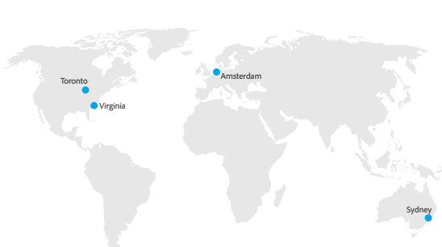

# Customer Journey Analytics托管位置

Adobe Customer Journey Analytics在北美洲（加拿大安大略弗吉尼亚）、欧洲（荷兰）和亚太地区（澳大利亚）的公共云服务提供商的企业级数据中心内托管。

在配置时，客户指定其Adobe Experience Platform数据将驻留的地区。 从Experience Platform数据湖摄取到CJA的数据将存储在同一区域。

