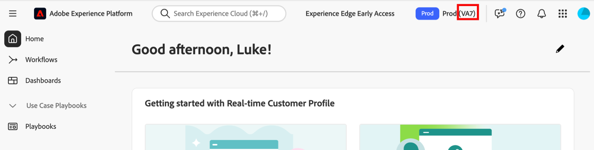

# Customer Journey Analytics托管位置

Adobe Customer Journey Analytics在北美洲、欧洲和APAC的公共云服务提供商的企业级数据中心内托管。

在配置时，客户指定其Adobe Experience Platform数据将驻留的地区。 从Adobe Experience Platform数据湖摄取到Customer Journey Analytics的数据将存储在同一区域。

有关详细信息，请参阅Adobe Experience Cloud文档中的[区域数据收集](https://experienceleague.adobe.com/en/docs/core-services/interface/data-collection/rdc)。

## 查看存储数据的数据中心

>[!NOTE]
>
>无法将数据从一个数据中心移动到另一个数据中心。

要查看您的数据存储到哪个数据中心：

1. 登录到 [Adobe Experience Cloud](https://experience.adobe.com)。

1. 从界面右上角的应用程序切换器中选择&#x200B;**[!UICONTROL Experience Platform]**。

1. 您分配的数据中心的区域代码显示在Experience Platform的右上角部分。

   

1. 请使用下表了解您的区域代码与哪个地理区域相关联：

   | Adobe区域代码 | 云提供商 | 地理区域 |
   |-------------------|-------|-------------------------------------------|
   | VA7 | Azure | 美国（默认） |
   | VA6 | AWS | 美国（按要求） |
   | NLD2 | Azure | 荷兰，阿姆斯特丹 |
   | CAN2 | Azure | 加拿大中部，多伦多 |
   | AUS5 | Azure | 澳大利亚、悉尼 |
   | GBR9 | Azure | 英国，伦敦 |
   | IND2 | Azure | 印度 |
   | CHE2 | Azure | 瑞士 |

