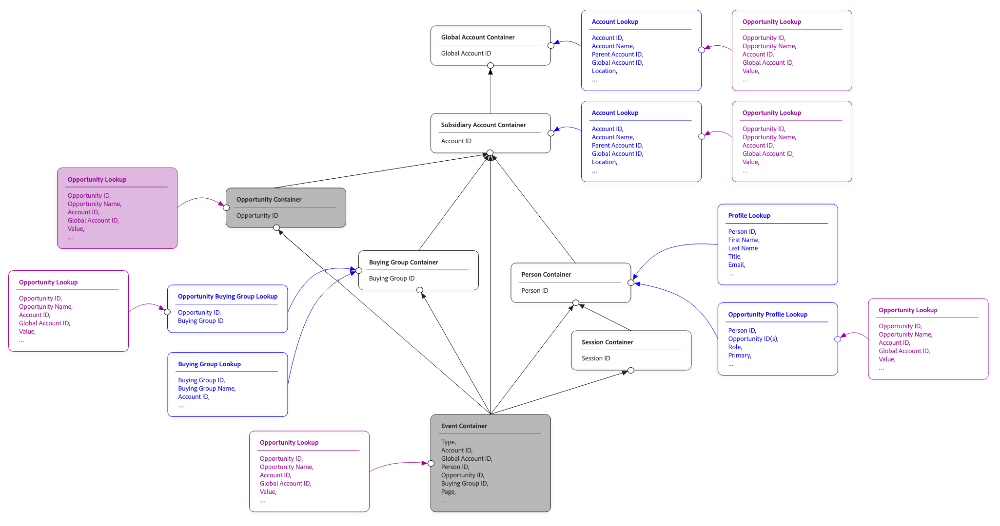
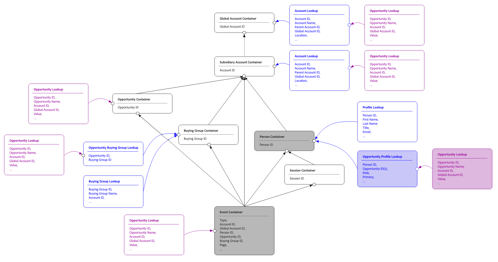
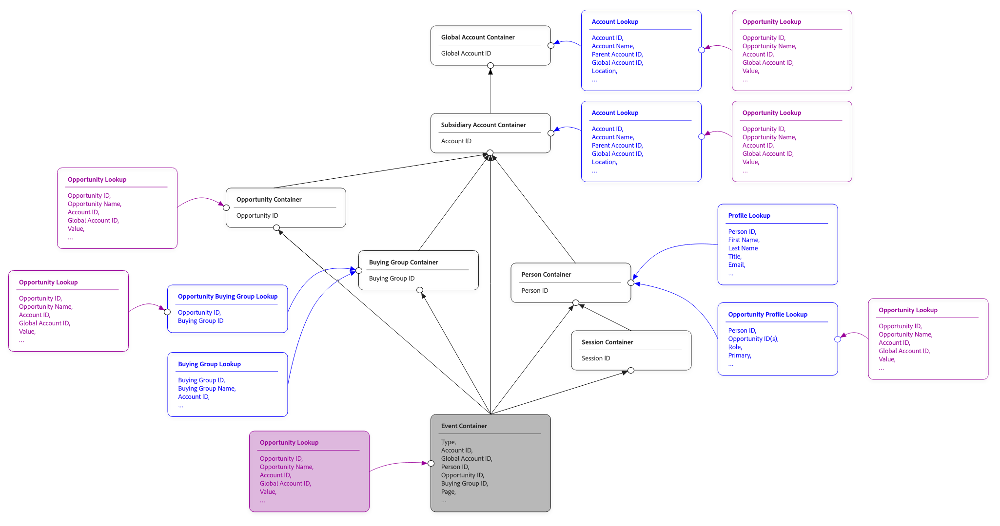

# 共享查找

在Customer Journey Analytics中，查找数据集通过额外的上下文丰富了您的事件数据。 例如，将产品名称、类别和价格添加到购买事件的产品目录数据集。 或者向营销事件添加营销活动详细信息的营销活动元数据数据集。

通过查找，您可以使用未存储在事件本身中的属性来报告事件数据。
传统上，查找数据集通过单个固定路径与事件相连。事件数据集中的一个键字段与查找数据集中的一个键字段匹配。当只有一种方法可将两个数据集关联时，此查找可正常工作，但在常见的现实场景中，此简单链接会损坏：

* 与产品SKU或产品ID上的事件联接的产品目录，具体取决于事件源。
* 根据渠道（Web事件的电子邮件、店内事件的忠诚度ID），用户将与不同身份命名空间上的事件关联的查找归为用户属性。
* 直接（按人员）和间接（按帐户，用于B2B报告目的）连接到事件的用户档案数据集

共享查找通过允许您在查找数据集和查找数据丰富事件之间定义多个联接路径来解决有限的固定路径联接。 每个路径描述了一种将查找行与事件行匹配的方法。 基于查找构建的维度或量度可以选择要使用的路径。 现在，同一查找数据集可以从单个配置支持多个报表场景。

共享查找也是[总人口报告](./tpr.md)的基础，该报告使用共享查找将配置文件数据集连接到事件。

## 概念

以下各节介绍了主要的共享查找概念。

### 连接路径

联接路径是用于匹配查找数据集与事件之间的行的单一路径。 每个连接路径都具有：

* **路径名**。 您选择的易于用户识别的标签，用于在构建维度和量度时标识UI中的路径。
* 事件端的&#x200B;**键字段**。 此字段用于将事件与查找数据进行匹配。
* 查找端有&#x200B;**匹配键字段**。  此字段是键值匹配的目标字段。
* 可选的&#x200B;**命名空间**。 当键字段为身份映射时，需要命名空间。

单个查找数据集可以具有一个或多个连接路径。 在该查找中基于字段构建的维度和量度可以指定要使用的路径。 如果未指定路径，则使用数据集的默认路径。

### 按容器匹配

对于配置文件数据集（与总人口报表一起使用），共享查找支持“按容器匹配”设置，该设置可根据容器类型自动配置连接：

* **按人员容器匹配**。 使用事件数据集的身份映射作为键，通过人员身份将查找联接到事件。
* **按帐户容器匹配** [!BADGE B2B edition]{type=Informative url="https://experienceleague.adobe.com/zh-hans/docs/analytics-platform/using/cja-overview/cja-b2b/cja-b2b-edition" newtab=true tooltip="Customer Journey Analytics B2B Edition"}。 通过帐户标识连接查找。
* **按全局帐户容器匹配**（[!BADGE B2B edition]{type=Informative url="https://experienceleague.adobe.com/zh-hans/docs/analytics-platform/using/cja-overview/cja-b2b/cja-b2b-edition" newtab=true tooltip="Customer Journey Analytics B2B Edition"}启用了全局帐户）。 查找通过全局帐户标识联接。

按容器匹配可处理常见案例，无需手动配置关键字段。 按容器匹配的主要优点是可自动处理重复数据删除。 容器存储唯一身份（针对人员、帐户或全局帐户）。

除了总人口报表之外，您还可以使用“按容器匹配”来定义到其他查找数据集的连接路径。

### 按字段匹配

或者，您可以按字段匹配用户档案数据集。 该匹配可导致根据特定标识直接查找事件数据中的每个事件。 如果使用按字段匹配，则结果可能包含重复的数据，这可能会导致结果混乱，尤其是与量度一起使用时。 有关更详细的解释，请参阅[示例](#example)。

### 标识映射为关键字段

如果连接两侧的键字段是标识映射（包含多个命名空间标识的字段），则需要额外的配置：

* **主键**&#x200B;或&#x200B;**命名空间**。 您可以使用身份映射的主键进行匹配，也可以通过选择特定的命名空间进行匹配。 选择命名空间是更常见的选择；主键未填充到所有配置文件数据源中。
* **辅助命名空间**。 对于未在给定行上填充主命名空间的情况（这与拼接数据集通用），您可以指定回退命名空间。 在填充连接时，该连接使用主命名空间，否则将回退到辅助命名空间。
* **路径间的一致性**。 当在连接上的多个共享查找中使用相同的标识映射作为键字段时，这些查找中的命名空间选择必须一致。

### 在查找路径上查找

查找数据集可以本身连接到另一个查找数据集。 这种查找会创建一个两级查找链：事件→查找A→查找B。

查询链的每个级别都可以有自己的连接路径。 在第二级查找中基于字段构建的维度或量度使用在每次步骤中配置的路径遍历链。 不支持比两个级别更深的查找链。

## 使用时间

当满足以下任一条件时，使用共享查找：

* 您需要以多种方式将相同的查找数据集连接到事件。
* 您可以处理不同事件使用不同标识命名空间的B2C（企业对消费者）标识数据。
* 您可以配置一个B2B（企业对企业）连接，该连接需要将事件与人员和帐户相关联。
* 可将用户档案数据集添加到连接以进行总人口报告。

如果您的查找数据集具有单个明显的连接键，并且您只需要一种将查找数据集中的数据与事件关联的方法，则可以配置单个路径。 共享查找也支持这种简单的情况。

## 示例

下面的全面示例介绍了共享查找的一般情况。

假设您在Customer Journey Analytics连接中设置了一个事件数据集，旁边列出了以下配置文件、机会配置文件、帐户和机会查找数据集。

每个数据集的示例数据：

>[!BEGINTABS]

>[!TAB 事件]

| 时间戳 | 人员 ID | 帐户 ID | 全球帐户 ID | 机会 ID | 页面 |
|---|---|---|---|---|---|
| 2025-01-29 07:01:57 | P-ABC | A-123 | A-123 | O-432 | 主页 |
| 2025-02-28 05:32:13 | P-ABC | A-123 | A-123 | O-432 | 小组件 |
| 2025-03-13 08:21:47 | P-ABC | A-123 | A-123 | O-432 | Doohickey |
| 2025-03-17 17:21:45 | P-EFG | A-123 | A-123 | O-543 | 小工具 |
| 2025-04-01 05:32:13 | P-LMN | A-456 | A-789 | O-876 | 主页 |
| 2025-04-01 05:32:13 | P-LMN | A-456 | A-789 | O-876 | 小工具 |

>[!TAB 轮廓]

| 人员 ID | 名称 | 帐户 ID | 全球帐户 ID |
|---|---|---|---|
| P-ABC | John | A-123 | A-123 |
| P-EFG | Kate | A-123 | A-123 |
| P-HIJ | Dave | A-789 | A-789 |
| P-LMN | 维杰 | A-456 | A-789 |

>[!TAB 帐户]

| 帐户 ID | 名称 | 全球帐户 ID | 国家/地区 | 生命周期值 |
|---|---|---|---|---:|
| A-123 | Acme | A-123 | 美国 | 1.22亿美元 |
| A-456 | 大公司 | A-789 | JP | 2300万美元 |
| A-789 | 巨型 | A-789 | UK | 4800万美元 |

>[!TAB 机会配置文件]

| 人员 ID | 机会 ID | 全球帐户 ID |
|---|---|---|
| P-ABC | O-432 | A-123 |
| P-ABC | O-543 | A-123 |
| P-EFG | O-543 | A-123 |
| P-LMN | O-876 | A-789 |

>[!TAB 机会]

| 机会 ID | 名称 | 帐户 ID | 全球帐户 ID | 状态 | 值 |
|---|---|---|---|---|---:|
| O-432 | Acme Express | A-123 | A-123 | 打开 | 200万美元 |
| O-543 | Acme CC | A-123 | A-123 | 已关闭 | 100万美元 |
| O-765 | Acme DX | A-123 | A-123 | 打开 | 800万美元 |
| O-876 | BigCo CC | A-456 | A-789 | 打开 | 700万美元 |
| O-987 | BigCo DX | A-456 | A-789 | 打开 | 1600万美元 |
| O-888 | 巨型DX | A-789 | A-789 | 打开 | 1300万美元 |

>[!ENDTABS]

创建此连接后，会自动创建[容器](/help/getting-started/cja-b2b-concepts-features.md#containers)，作为Customer Journey Analytics核心功能的一部分。

下图显示此连接的实体关系。

{zoomable="yes"}

您可以将这些容器用作路径分析的一部分，以报告每个帐户的opportunity值。 根据所选容器，可以有不同的结果。

| 帐户名称 | 机会值 （机会容器） | 机会值 （子目录帐户容器） | 机会值 （人员容器） |
|---|---:|---:|---:|
| Acme | 300万美元 | 1100万美元 | 400万美元 |
| 大公司 | 700万美元 | 2300万美元 | 700万美元 |

### 按机会容器匹配

为了与客户匹配机会，使用机会容器作为从事件到机会查找数据的路径，这为Acme带来300万美元，为BigCo带来700万美元。

{zoomable="yes"}

>[!BEGINTABS]

>[!TAB 事件数据]

| 时间戳 | 人员 ID | 帐户 ID | 全球帐户 ID | 机会ID  | 页面 |
|---|---|---|---|---|---|
| 2025-01-29 07:01:57 | P-ABC | A-123 | A-123 | **O-432** | 主页 |
| 2025-02-28 05:32:13 | P-ABC | A-123 | A-123 | **O-432** | 小组件 |
| 2025-03-13 08:21:47 | P-ABC | A-123 | A-123 | **O-432** | Doohickey |
| 2025-03-17 17:21:45 | P-EFG | A-123 | A-123 | **O-543** | 小工具 |
| 2025-04-01 05:32:13 | P-LMN | A-456 | A-789 | **O-876** | 主页 |
| 2025-04-01 05:32:13 | P-LMN | A-456 | A-789 | **O-876** | 小工具 |

>[!TAB 机会]

| 机会ID  | 名称 | 帐户 ID | 全球帐户 ID | 状态 | 值 |
|---|---|---|---|---|---:|
| **O-432** | Acme Express | A-123 | A-123 | 打开 | **$2M** |
| **O-543** | Acme CC | A-123 | A-123 | 已关闭 | **$1M** |
| O-765 | Acme DX | A-123 | A-123 | 打开 | 800万美元 |
| **O-876** | BigCo CC | A-456 | A-789 | 打开 | **$7M** |
| O-987 | BigCo DX | A-456 | A-789 | 打开 | 1600万美元 |
| O-888 | 巨型DX | A-789 | A-789 | 打开 | 1300万美元 |

>[!ENDTABS]

### 按子公司帐户容器匹配

为了将商机与客户相匹配，使用子公司客户容器作为从事件到商机查找数据的路径，这为Acme带来1100万美元，为BigCo带来2300万美元。

{zoomable="yes"}

>[!BEGINTABS]

>[!TAB 事件]

| 时间戳 | 人员 ID | 帐户ID  | 全球帐户 ID | 机会 ID | 页面 |
|---|---|---|---|---|---|
| 2025-01-29 07:01:57 | P-ABC | **A-123** | A-123 | O-432 | 主页 |
| 2025-02-28 05:32:13 | P-ABC | **A-123** | A-123 | O-432 | 小组件 |
| 2025-03-13 08:21:47 | P-ABC | **A-123** | A-123 | O-432 | Doohickey |
| 2025-03-17 17:21:45 | P-EFG | **A-123** | A-123 | O-543 | 小工具 |
| 2025-04-01 05:32:13 | P-LMN | **A-456** | A-789 | O-876 | 主页 |
| 2025-04-01 05:32:13 | P-LMN | **A-456** | A-789 | O-876 | 小工具 |

>[!TAB 机会]

| 机会 ID | 名称 | 帐户ID  | 全球帐户 ID | 状态 | 值 |
|---|---|---|---|---|---:|
| O-432 | Acme Express | **A-123** | A-123 | 打开 | **$2M** |
| O-543 | Acme CC | **A-123** | A-123 | 已关闭 | **$1M** |
| O-765 | Acme DX | **A-123** | A-123 | 打开 | **$8M** |
| O-876 | BigCo CC | **A-456** | A-789 | 打开 | **$7M** |
| O-987 | BigCo DX | **A-456** | A-789 | 打开 | **$16M** |
| O-888 | 巨型DX | A-789 | A-789 | 打开 | 1300万美元 |

>[!ENDTABS]

### 按人员容器匹配

{zoomable="yes"}

为了将机会与客户相匹配，请使用人员容器作为机会配置文件和查找数据的路径，结果为Acme带来400万美元，BigCo获得700万美元。

>[!BEGINTABS]

>[!TAB 事件]

| 时间戳 | 人员ID  | 帐户 ID | 全球帐户 ID | 机会 ID | 页面 |
|---|---|---|---|---|---|
| 2025-01-29 07:01:57 | **P-ABC** | A-123 | A-123 | O-432 | 主页 |
| 2025-02-28 05:32:13 | **P-ABC** | A-123 | A-123 | O-432 | 小组件 |
| 2025-03-13 08:21:47 | **P-ABC** | A-123 | A-123 | O-432 | Doohickey |
| 2025-03-17 17:21:45 | **P-EFG** | A-123 | A-123 | O-543 | 小工具 |
| 2025-04-01 05:32:13 | **P-LMN** | A-456 | A-789 | O-876 | 主页 |
| 2025-04-01 05:32:13 | **P-LMN** | A-456 | A-789 | O-876 | 小工具 |

>[!TAB 人员/机会]

| 人员ID  | 机会ID  | 全球帐户 ID |
|---|---|---|
| **P-ABC** | **O-432** | A-123 |
| **P-ABC** | **O-543** | A-123 |
| **P-EFG** | **O-543** | A-123 |
| **P-LMN** | **O-876** | A-789 |

>[!TAB 机会查找]

| 机会ID  | 名称 | 帐户 ID | 全球帐户 ID | 状态 | 值 |
|---|---|---|---|---|---:|
| **O-432** | Acme Express | A-123 | A-123 | 打开 | **$2M** |
| **O-543** (2x) | Acme CC | A-123 | A-123 | 已关闭 | 100万美元x 2 = **200万美元** |
| O-765 | Acme DX | A-123 | A-123 | 打开 | 800万美元 |
| **O-876** | BigCo CC | A-456 | A-789 | 打开 | **$7M** |
| O-987 | BigCo DX | A-456 | A-789 | 打开 | 1600万美元 |
| O-888 | 巨型DX | A-789 | A-789 | 打开 | 1300万美元 |

>[!ENDTABS]

### 按容器显示的其他匹配项

此示例中可能包含更多连接路径。 例如，通过全局帐户容器或购买组容器。 每个连接路径都通过容器匹配进行查找。

### 按字段匹配

您还可以选择按字段匹配，而不是按容器匹配。 然后，直接匹配机会ID。

>[!BEGINTABS]

>[!TAB 事件]

| 时间戳 | 人员 ID | 帐户 ID | 全球帐户 ID | 机会ID  | 页面 |
|---|---|---|---|---|---|
| 2025-01-29 07:01:57 | P-ABC | **A-123** | A-123 | **O-432** | 主页 |
| 2025-02-28 05:32:13 | P-ABC | **A-123** | A-123 | **O-432** | 小组件 |
| 2025-03-13 08:21:47 | P-ABC | **A-123** | A-123 | **O-432** | Doohickey |
| 2025-03-17 17:21:45 | P-EFG | **A-123** | A-123 | **O-543** | 小工具 |
| 2025-04-01 05:32:13 | P-LMN | **A-456** | A-789 | **O-876** | 主页 |
| 2025-04-01 05:32:13 | P-LMN | **A-456** | A-789 | **O-876** | 小工具 |

>[!TAB 机会]

| 机会ID  | 名称 | 帐户 ID | 全球帐户 ID | 状态 | 值 |
|---|---|---|---|---|---:|
| **O-432** (3x) | Acme Express | A-123 | A-123 | 打开 | 200万美元x 3 = **600万美元** |
| **O-543** | Acme CC | A-123 | A-123 | 已关闭 | **$1M** |
| O-765 | Acme DX | A-123 | A-123 | 打开 | 800万美元 |
| **O-876** (2x) | BigCo CC | A-456 | A-789 | 打开 | 700万美元x 2 = **1400万美元** |
| O-987 | BigCo DX | A-456 | A-789 | 打开 | 1600万美元 |
| O-888 | 巨型DX | A-789 | A-789 | 打开 | 1300万美元 |

>[!ENDTABS]

### 总人口报表

{zoomable="yes"}

[总人口报告](tpr.md)使用共享查找，但不报告事件。 在此示例中，您只能使用帐户或全局帐户容器报告帐户机会值量度，因为这些容器是唯一可能连接到机会查找数据的连接。

>[!BEGINTABS]

>[!TAB 轮廓]

| 人员 ID | 名称 | 帐户ID  | 全球帐户 ID |
|---|---|---|---|
| P-ABC | John | **A-123** | A-123 |
| P-EFG | Kate | **A-123** | A-123 |
| P-HIJ | Dave | **A-789** | A-789 |
| P-LMN | 维杰 | **A-456** | A-789 |

>[!TAB 机会]

| 机会 ID | 名称 | 帐户ID  | 全球帐户 ID | 状态 | 值 |
|---|---|---|---|---|---:|
| O-432 | Acme Express | **A-123** | A-123 | 打开 | **$2M** |
| O-543 | Acme CC | **A-123** | A-123 | 已关闭 | **$1M** |
| O-765 | Acme DX | **A-123** | A-123 | 打开 | **$8M** |
| O-876 | BigCo CC | **A-456** | A-789 | 打开 | **$7M** |
| O-987 | BigCo DX | **A-456** | A-789 | 打开 | **$16M** |
| O-888 | 巨型DX | **A-789** | A-789 | 打开 | **$13M** |

* 帐户A-123 (Acme)的3个机会，总计&#x200B;**$13M**。
* A-456 (BigCo)有2个销售机会，总金额为&#x200B;**2300万美元**。
* 帐户A-789 (Giant)的1个机会，总计&#x200B;**1300万美元**。

>[!ENDTABS]
