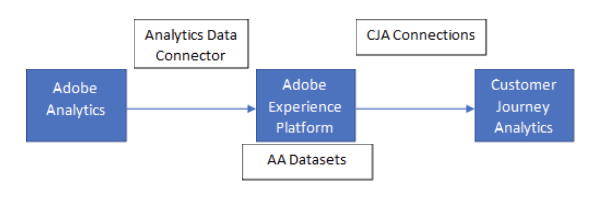

# 将 Analytics 源连接器数据与 Adobe Analytics 进行比较

当您的组织采用 Customer Journey Analytics 时，可能会发现 Adobe Analytics 和 Customer Journey Analytics 之间的数据存在一些差异。 这些差异是正常的，可能有多种原因。 Customer Journey Analytics 旨在让您改进 Adobe Analytics 中数据的某些限制。 这种灵活性可能会导致 Customer Journey Analytics 以不同的方式解读数据。 通过本文了解 Customer Journey Analytics 和 Adobe Analytics 在处理您的数据时可能存在的差异。

此页面假设您通过 [Analytics 源连接器](https://experienceleague.adobe.com/docs/experience-platform/sources/ui-tutorials/create/adobe-applications/analytics.html?lang=zh-Hans)将 Adobe Analytics 数据摄取到 Adobe Experience Platform，然后在 Customer Journey Analytics 中创建了一个[连接](/help/connections/overview.md)和[数据视图](/help/data-views/data-views.md)。

。

请注意以下原因可能会导致两个报告平台之间存在数据差异：

* **不同的数据集或报告包**：确保 Adobe Analytics 中的报告包与源连接器从其中派生数据的报告包相同。
* **日程表设置**：Adobe Analytics 中的报告包中包含的时区和其他日程表设置，您可以进行配置。 同样，Customer Journey Analytics 中的数据视图也有一个您可以控制的单独设置。 如果需要对等性，请确保这些设置在两个产品之间是匹配的。
* **其他数据集**：Customer Journey Analytics 提供在一个连接中包含多个数据集的功能。 这些差异包括其他事件数据集、轮廓数据集或查找数据集。 此功能是 Adobe Analytics 与 Customer Journey Analytics 之间的关键区别，能够洞察跨渠道数据。
* **拼接的数据集**：Adobe 提供分析两个数据集之间人员 ID 的功能，结果会生成一个包含拼接 ID 的新数据集。 这些[拼接的数据集](/help/stitching/overview.md)中包含超出 Adobe Analytics 报告包所提供范围的额外数据。
* **数据源**：Customer Journey Analytics 不包含上传到 Adobe Analytics 报告包的任何类型的[数据源](https://experienceleague.adobe.com/zh-hans/docs/analytics/import/data-sources/overview)，包括摘要数据源或交易 ID 数据源。
* **维度和量度设置**：在数据视图中，每个维度和量度都包括自己的设置，您的组织可以更改这些设置。 这些更改会在运行报告时应用，因此具有追溯力。 Adobe Analytics 中的维度和量度设置会更改数据的收集方式，因此这些更改会从该时间点起生效。 如果您更改了任一产品中的组件设置，就可能会导致报告差异。 如果关注某个特定维度，请确保 Adobe Analytics 和 Customer Journey Analytics 之间的归因和持久性设置相匹配。

  >[!TIP]
  >
  >Adobe 强烈建议 Adobe Analytics 中的维度使用“[!UICONTROL 最近（最后）]”的分配。 此分配设置可让 Customer Journey Analytics 具有更大的归因灵活性。

* **访问定义**：除了各维度和量度设置外，数据视图本身还包含可以完全改变访客数据解读方式的设置。 例如，您可以将一个区段应用到整个数据视图（类似于 Adobe Analytics 中的[虚拟报告包](https://experienceleague.adobe.com/zh-hans/docs/analytics/components/virtual-report-suites/vrs-about)）。 您还可以更改访问持续时间的定义，或在任何所需事件上自动开始新的访问。 这些设置中的任何一个都会对 Customer Journey Analytics 和 Adobe Analytics 之间的报告差异产生显著影响。

## 检查两个产品之间的记录数

如果以上所有设置看起来都相似，并且您至少想验证两个产品之间的记录数，可以使用以下步骤：

1. 在 Adobe Experience Platform [查询服务](https://experienceleague.adobe.com/zh-hans/docs/experience-platform/query/home)中运行以下“按时间戳划分的总记录数”查询：

   ```sql
   SELECT
     Substring(from_utc_timestamp(timestamp,'{timeZone}'), 1, 10) AS Day,
     Count(_id) AS Records
   FROM  {dataset}
   WHERE   timestamp >= from_utc_timestamp('{fromDate}','UTC')
     AND timestamp < from_utc_timestamp('{toDate}','UTC')
     AND timestamp IS NOT NULL
     AND enduserids._experience.aaid.id IS NOT NULL
   GROUP BY Day
   ORDER BY Day;
   ```

1. 在 Adobe Analytics [数据馈送](https://experienceleague.adobe.com/zh-hans/docs/analytics/export/analytics-data-feed/data-feed-overview)中生成所需日期范围的馈送文件。 计算每个文件中的行数，识别并排除以下几行：

   * `exclude_hit` 不是 `0`（两个产品都从 Analysis Workspace 中排除的数据）
   * `hit_source` 是 `0`、`3`、`5`、`7`、`8`、`9` 或 `10`（数据源和其他非点击数据）
   * `page_event` 是 `53` 或 `63`（流媒体保持活跃的点击数）

   符合上述任一标准的行将从 Analytics 源连接器摄取工作流中排除，因此在计算数据馈送行数时也应被排除。

1. 查询服务中的总记录数应与同一时段内数据馈送中的行数匹配。
