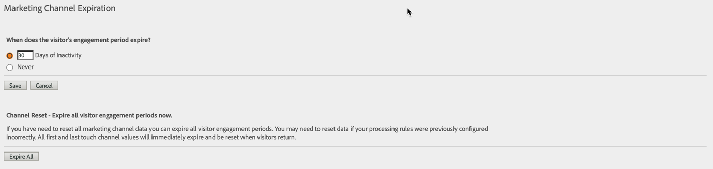

# 在 Adobe Experience Platform 中使用营销渠道维度

如果您的组织使用 [Analytics源连接器](https://experienceleague.adobe.com/docs/experience-platform/sources/connectors/adobe-applications/analytics.html?lang=zh-Hans) 要将报表包数据纳入Customer Journey Analytics，您可以在Customer Journey Analytics中配置连接以报告“营销渠道”维度。

## 前提条件

* 必须已使用 [ Analytics Source Connector ](https://experienceleague.adobe.com/docs/experience-platform/sources/connectors/adobe-applications/analytics.html?lang=zh-Hans) 将报告包数据导入 Adobe Experience Platform。不支持其他数据源，因为“营销渠道”维度依赖于 Analytics 报表包中的处理规则。
* 必须已设置“营销渠道”维度处理规则。参见 [营销渠道的处理规则](https://experienceleague.adobe.com/docs/analytics/admin/admin-tools/manage-report-suites/edit-report-suite/marketing-channels/c-rules.html?lang=zh-Hans) 《Adobe Analytics组件指南》中的。

## “营销渠道”架构元素

在所需的报告包上建立 Analytics Source Connector 后，系统会为您创建 XDM 架构。此架构包含所有 Analytics 维度和量度作为原始数据。此类原始数据中不包含归因或持久性设置。相反，每个事件都通过“营销渠道”维度处理规则运行，并记录其匹配的第一个规则。在Customer Journey Analytics中创建数据视图时，需要指定归因和持久性。

1. [创建包含基于 Analytics Source Connector 的数据集的连接](/help/connections/create-connection.md)。
2. [创建数据视图](/help/data-views/create-dataview.md)，视图中包含以下维度：
   * **`channel.typeAtSource`**：相当于[营销渠道](https://experienceleague.adobe.com/docs/analytics/components/dimensions/marketing-channel.html?lang=zh-Hans)维度。
   * **`channel._id`**：相当于[营销渠道详细信息](https://experienceleague.adobe.com/docs/analytics/components/dimensions/marketing-detail.html?lang=zh-Hans)
3. 为每个维度提供所需的归因模型和持久性。如果要同时使用“首次接触”和“最后接触”维度，请将每个“营销渠道”维度多次拖动到组件区域。为每个维度提供所需的归因模型和持久性。Adobe 还建议为每个维度提供一个显示名称，以便于在分析工作区中使用这些维度。
4. 创建数据视图。

“营销渠道”维度现在可在分析工作区中使用。

>[!NOTE]
>
> 分析源连接器要求填充 `channel.typeAtSource`（营销渠道）和 `channel._id`（市场渠道详细信息），否则两者都不会转移到 XDM ExperienceEvent。如果源报告包中的营销渠道详细信息为空白，则会导致出现空白的 `channel._id`，分析源连接器也会成为空白 `channel.typeAtSource`。这可能导致报告 Adobe Analytics 和 Customer Journey Analytics 之间存在差异。

## 处理方式和体系结构差异

>[!IMPORTANT]
>
>报表包数据与 Platform 数据之间存在一些基本数据差异。Adobe 强烈建议调整报表包中的“营销渠道”维度处理规则，以便能在 Platform 中正常收集数据。

>[!NOTE]
>
>为了最大化 Attribution IQ 和 Customer Journey Analytics 的营销渠道效率，我们发布了一些 [修订后的最佳实践](https://experienceleague.adobe.com/docs/analytics/components/marketing-channels/mchannel-best-practices.html?lang=zh-Hans)。

“营销渠道”设置在 Platform 数据和报表包数据中的运行方式有所不同。在为Customer Journey Analytics设置营销渠道时，请考虑以下差异：

* **为访问的首个页面**：此规则条件在多个默认“营销渠道”定义中是通用的。将在 Platform 中忽略包含此条件的任何处理规则（同一规则中的其他条件仍适用）。会话是在数据查询时而不是数据收集时确定的，这样可阻止 Platform 使用此特定规则条件。Adobe 建议重新评估任何包含“是访问的第一页”标准的营销渠道处理规则，选择实现目标的替代方法。

  

* **覆盖最后接触渠道**：营销渠道管理器中的这项设置通常会阻止某些渠道获取最后接触渠道点数。Platform 会忽略此设置，从而允许将诸如“直接”或“内部”之类的宽泛渠道以可能不太妥当的方式计入量度。Adobe 建议删除未选中“覆盖最后接触渠道”的渠道。
   * 您可以在营销渠道管理器中删除“直接”营销渠道，然后依赖该渠道的Customer Journey Analytics“无值”维度项目。 您还可以将此维度项重命名为“直接”，或在配置数据视图时完全排除此维度项。
   * 或者，您也可以创建营销渠道分类，对每个值进行单独分类，但要在Customer Journey Analytics中排除的渠道除外。 然后，在创建数据视图时，您可以使用此分类维度，而不是 `channel.typeAtSource`。

  

* **营销渠道到期**：此参与期设置确定用户要在保持不活动状态多长时间后才能在报表包数据中获得新的首次联系渠道。 Platform会使用自己的归因设置，因此此设置在Customer Journey Analytics中会被完全忽略。

  

## 比较Customer Journey Analytics和Adobe Analytics之间的数据

由于Adobe Experience Platform的架构与Adobe Analytics报表包不同，因此无法保证结果匹配。 但是，您可以使用以下提示来简化此比较过程：

* 确认上列体系结构差异不会影响您的比较。这包括删除不覆盖最后接触渠道的渠道，以及删除“为访问（会话）的首次点击”规则条件。
* 再次检查您的连接是否使用与Adobe Analytics相同的报表包。 如果您的Customer Journey Analytics连接包含多个报表包，并且每个报表包都有自己的“营销渠道”处理规则，则很难将其与Adobe Analytics进行比较。 您需要为每个要比较数据的报表包各创建一个连接。
* 确保比较相同日期范围的数据，并且数据视图中的时区设置与报表包的时区相同。
* 在查看报表包数据时使用自定义归因模型。例如，将[营销渠道](https://experienceleague.adobe.com/docs/analytics/components/dimensions/marketing-channel.html?lang=zh-Hans)维度与使用非默认归因模型的量度结合使用。Adobe 建议不要比较默认维度[首次接触渠道](https://experienceleague.adobe.com/docs/analytics/components/dimensions/first-touch-channel.html?lang=zh-Hans)或[最后接触渠道](https://experienceleague.adobe.com/docs/analytics/components/dimensions/last-touch-channel.html?lang=zh-Hans)，因为它们依赖于报表包中收集的归因数据。Customer Journey Analytics不依赖于报表包的归因数据，而是在运行Customer Journey Analytics报表时进行计算。
* 由于报表包数据与 Platform 数据之间存在体系结构上的差异，因此无法合理比较某些量度。例如，访问/会话、人员/人员和发生次数/事件。
