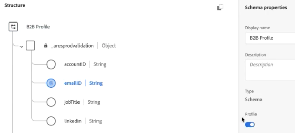

# (B2B)将帐户级别数据添加为查找数据集

此B2B用例向您展示如何在帐户级别而非人员级别指定分析。 帐户级分析可以回答诸如

* 哪个公司名与此帐户匹配？
* 有多少员工与此帐户/公司关联？
* 此帐户中包含哪些角色？
* 与其他帐户相比，此帐户在特定营销活动方面的整体表现如何？
* 某个帐户的特定角色（如IT经理）的行为是否与另一个帐户的相同角色行为是否不同？

通过将帐户级别信息作为 [查找](/help/getting-started/cja-glossary.md) 数据集(与传统Adobe Analytics的分类相似)。

首先在Adobe Experience Platform创建查找模式，然后通过引入基于。csv的帐户级别数据来创建查找表数据集。 然后，您继续创建一个连接CJA，它组合了不同的数据集，包括您创建的查找数据集。 然后，您创建一个数据视图，最终能够在Workspace中利用所有这些数据。

>[!NOTE]
>
>查找表的大小最大可以为1 GB。

## 1.创建查找模式(Experience Platform)

为 [查找](/help/getting-started/cja-glossary.md) 表确保使用的数据集在CJA中具有正确的设置（记录类型）。 最佳实践是 [创建自定义模式类](https://docs.adobe.com/content/help/en/experience-platform/xdm/tutorials/create-schema-ui.html#create-new-class) 名为“查找”（任何元素中均为空），可重新用于所有查找表。

## 2.创建查找数据集(Experience Platform)

创建模式后，您需要从该模式创建查找数据集，Experience Platform。 此查找数据集包含帐户级营销信息，如：公司名称、员工总数、域名、他们所属的行业、年收入、他们是否是Experience Platform的当前客户、他们处于哪个销售阶段、帐户内的哪个团队使用CJA等。

1. 在Adobe Experience Platform，转到 **[!UICONTROL 数据管理>数据集]**.
1. 单击 **[!UICONTROL +创建数据集]**.
1. 单击 **[!UICONTROL 从模式创建数据集]**.
1. 选择您创建的查找模式类。
1. 单击&#x200B;**[!UICONTROL 下一步]**。
1. 命名数据集（在我们的示例中，为B2B信息）并提供描述。
1. 单击&#x200B;**[!UICONTROL 完成]**。

## 3.在连接中合并数据集(Customer Journey Analytics)

在此示例中，我们将3个数据集合为一个CJA连接：

| 数据集名称 | 描述 | AEP模式类 | 数据集详细信息 |
|---|---|---|---|
| B2B印象 | 包含帐户级别的点击流事件级数据。 例如，它包含用于运行营销广告的电子邮件ID和相应的帐户ID以及营销名称。 还包括每个用户对这些广告的印象。 | 基于XDM ExperienceEvent模式类 | The `emailID` 用作主标识，并为 `Customer ID` 命名空间。 因此，它将显示为默认值 **[!UICONTROL 人员ID]** customer journey analytics。  |
| B2B用户档案 | 此用户档案数据集会告诉您有关帐户中用户的更多信息，如其职务、所属帐户、LinkedIn用户档案等。 | 基于XDM个人用户档案模式类 | 无需选择 `emailID` 作为此模式中的主ID。 确保启用 **[!UICONTROL 用户档案]**;如果不连接，CJA将无法连接 `emailID` 在B2B用户档案中 `emailID` B2B印象数据。 （此功能称为基于字段的拼接。）  |
| B2B信息 | 请参阅上面的“创建查找数据集”。 | B2BAccount(自定义查找模式类) | 关系 `accountID` B2B印象数据集是通过将B2B信息数据集与CJA中的B2B印象数据集连接而自动创建的，如以下步骤所述。  |

以下是如何组合数据集：

1. 在Customer Journey Analytics中，选择 **[!UICONTROL 连接]** 选项卡。
1. 选择要合并的数据集（在我们的示例中，以上三个数据集）。
1. （不确定这是步骤所属的位置……）对于B2B信息数据集，请选择 `accountID` 用于查找表的键。 然后选择其匹配键（对应的维）, `accountID` 事件数据集。
1. 单击&#x200B;**[!UICONTROL 下一步]**。
1. 命名并描述连接，并根据 [这些说明](/help/connections/create-connection.md).
1. 单击&#x200B;**[!UICONTROL 保存]**。

现在数据将被收录。 载入数据并建立查找大约需要2到4小时，具体取决于查找表的大小。

## 从此连接创建数据视图

按照 [创建数据视图](/help/data-views/create-dataview.md).

* 从数据集添加您需要的所有组件（维度和指标）。

## 在Workspace中分析数据

您现在可以根据所有3个数据集的数据创建Workspace项目。

例如，您可以在介绍中找到答案：

* 按accountID细分emailID，确定电子邮件ID属于哪个公司。
* 有多少员工被映射到特定帐户ID?
* 帐户ID属于哪个行业？

