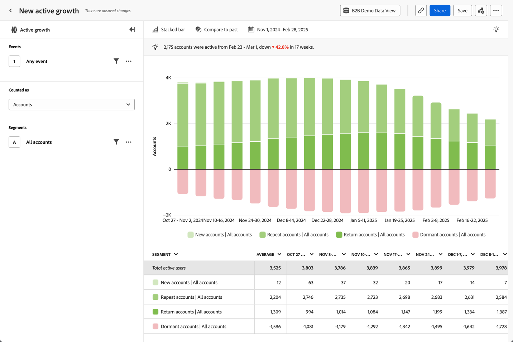

# 构建产品价值

{{draft-b2b}}

您希望向产品经理和CMO或CEO提供B2B产品价值见解。 例如，通过数据驱动的流失分析或谓词。 并使这些见解可通过移动仪表板消化。

Customer Journey Analytics B2B edition可以支持您提供产品价值分析。 有关示例，请参阅以下部分。

## 减少客户流失

您希望识别产品使用率低、品牌参与度低以及表明具有高流失潜力的其他关键因素的客户。 利用此早期识别功能，可制定帐户激活策略。

[主动增长](/help/guided-analysis/types/active-growth.md)引导式分析可以帮助您确定如何：

* 深入了解特定时期内客户、商机和用户的增长和收购。
* 发现最近没有预约的休眠帐户。 因此，您可以确定续订或追加销售策略。
* 与客户成功或销售组织合作，重新利用闲置的客户。 您可以调查低使用率，并规划产品增强功能以解决流失问题并克服采用速度缓慢或停滞不前的现象。

### 示例

您希望看到您的新客户、重复客户、回访客户和休眠客户的净活跃增长。

1. [创建并配置活动增长](/help/guided-analysis/types/active-growth.md)引导式分析。
1. 选择&#x200B;**[!UICONTROL 帐户]**&#x200B;作为&#x200B;**[!UICONTROL 计为]**。
1. 选择首选的&#x200B;**[!UICONTROL 图表设置]**。 例如：  **[!UICONTROL 栈叠条形]**。
1. 选择首选的 **[!UICONTROL 时间间隔]**&#x200B;和&#x200B;**[!UICONTROL 日期范围]**。

## 实现洞察大众化

您希望让CMO和CEO的重要见解民主化，以便他们可以从移动设备中一眼查看帐户数据和产品使用情况。

[移动记分卡](/help/mobile-app/home.md)可帮助提供这些见解。

### 示例

您要创建一个移动记分卡，该记分卡将有关客户、业务机会、已关闭的获胜和失败的业务机会以及与这些业务机会关联的收入的详细信息。

1. [创建移动记分卡](/help/mobile-app/create-scorecard.md)。
1. 定义要报告的期间。 例如&#x200B;**[!UICONTROL 2024年10月与上一时段]**。
1. 将相关量度拖放到应用程序画布上。 例如：**[!UICONTROL 全局帐户]**、**[!UICONTROL 机会]**、**[!UICONTROL 已关闭的收入]**、**[!UICONTROL 已关闭的收入]**、**[!UICONTROL 已关闭的收入]**&#x200B;和&#x200B;**[!UICONTROL 已关闭的收入]**。

   

1. 使用&#x200B;**[!UICONTROL 预览]**&#x200B;预览仪表板。 仪表板现在可从Adobe Analytics仪表板应用程序获得，可从[App Store](https://apps.apple.com/us/app/adobe-analytics-dashboards/id1509062264)或[Google Play](https://play.google.com/store/apps/details?id=com.adobe.analyticsdashboards)获得。

   
