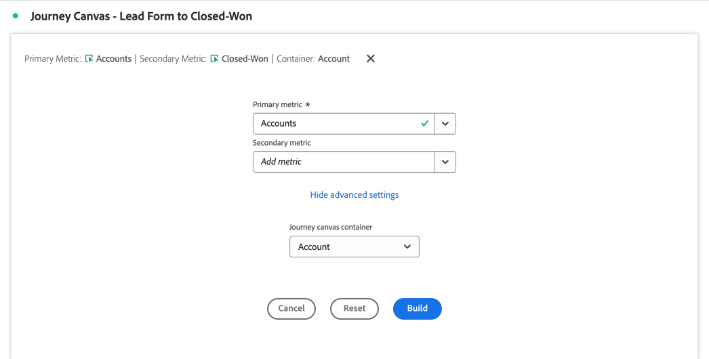
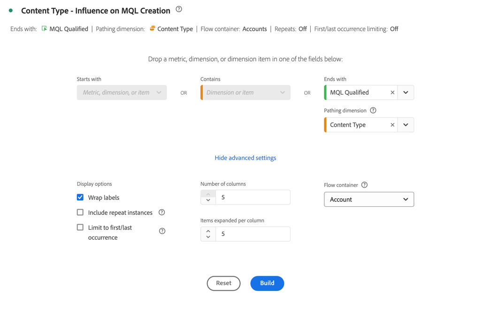

# 优化帐户营销

有效的基于帐户的营销需要帐户级别对购买历程有深入的了解。 因此，您可以确定最有效的营销活动来推动交易完成。

对于此理解，您要分析和探索：

* 营销影响：

   * 跨营销活动、渠道和内容。
   * 在帐户中购买组时，

* 销售管道进度。
* 追加销售和交叉销售机会。
* 客户帐户运行状况。

Customer Journey Analytics B2B edition可以支持您优化帐户营销。 有关示例，请参阅以下部分。

## 基于帐户的营销参与

您希望确定哪些体验（在线和离线）在创造封闭机会方面最具影响力。

使用[历程画布](/help/analysis-workspace/visualizations/journey-canvas/journey-canvas.md)可视化图表来映射帐户、商机、购买团体、促销活动和渠道之间的每次交互，以了解在您的帐户营销中正在做什么以及您可以在哪些方面改进。

历程画布可视化图表可帮助您：

* 看全文。 例如，您可以显示&#x200B;*特定*&#x200B;高价值帐户或购买群组的详细路径，其中包括所有已知的在线和离线交互。
* 对关键里程碑之前或之后的关键时刻进行上下文分析（例如：营销合格商机触发器或机会创建）。
* 通过可视化图表在特定帐户上的交互历史记录支持销售人员。 此类可视化图表支持相关的对话。

### 示例

您希望可视化从潜在客户表单到已关闭的赢家的历程。

1. [创建和配置历程画布](/help/analysis-workspace/visualizations/journey-canvas/configure-journey-canvas.md)可视化图表。
1. 将&#x200B;**[!UICONTROL 帐户]**&#x200B;配置为&#x200B;**[!UICONTROL 主要指标]**。
1. 请确保选择&#x200B;**[!UICONTROL 帐户]**&#x200B;作为&#x200B;**[!UICONTROL 历程画布容器]**。

   

1. 选择&#x200B;**[!UICONTROL 生成]**。
1. 将节点拖放到画布上并连接这些节点以说明帐户历程。 例如：从&#x200B;**[!UICONTROL 潜在客户表单：步骤1]**&#x200B;表单到&#x200B;**[!UICONTROL Opp。 已创建]**。

   

## 同类群组分段

您希望确定关键买家组，以便将这些买家组激活到其他渠道，如付费媒体、电子邮件、社交。

使用[同类群组表](/help/analysis-workspace/visualizations/cohort-table/cohort-analysis.md)可视化图表根据共享起点(如市场鉴别(MQL)商机日期)对B2B实体（帐户、商机、购买群组）进行分组。 并在后续阶段或里程碑中跟踪每个实体随时间的进度。

同类群组表可视化图表可帮助您：

* 分析客户或机会同类群组在几周或几个月内达到关键里程碑（例如：从符合营销条件的潜在客户到符合销售条件的潜在客户）的速度。
* 确定某些同类群组（按区段、促销活动来源、购买组类型）在整个销售周期中的速度是否比其他同类群组快。
* 评估战略计划（例如：营销活动）是否与后续同类群组的更短的晋升时间表相关。

### 示例

您希望每月查看已结束业务机会的同类群组。

1. [创建并配置同类群组表](/help/analysis-workspace/visualizations/cohort-table/t-cohort.md)可视化图表。
1. 使用&#x200B;**[!UICONTROL 创建的机会]**&#x200B;作为&#x200B;**[!UICONTROL 包含条件]**&#x200B;量度。 选择&#x200B;**[!UICONTROL >=]**&#x200B;作为运算符并输入值`1`。
1. 使用&#x200B;**[!UICONTROL Closed-Won]**&#x200B;作为&#x200B;**[!UICONTROL 返回标准]**&#x200B;指标。 选择&#x200B;**[!UICONTROL >=]**&#x200B;作为运算符并输入值`1`。
1. 选择&#x200B;**[!UICONTROL Opportunity]**&#x200B;作为容器。

   

1. 选择&#x200B;**[!UICONTROL 生成]**。 有关同类群组表的示例，请参阅下文。

   

## 面对面活动

您要报告参与帐户并查看多个面对面事件的活动。 因此，您可以分析和优化现场活动出席率的影响。

通过[流量](/help/analysis-workspace/visualizations/c-flow/flow.md)可视化图表，您可以可视化用户在一段时间内的交互或阶段之间的路径，现在还可以可视化帐户或购买团体之间的路径。

流量可视化图表可帮助您：

* 识别B2B实体遍历的接触点的最频繁序列（例如：从&#x200B;*网站访问*&#x200B;到&#x200B;*白皮书下载*&#x200B;到&#x200B;*演示请求*）。
* 可视化客户或购买组如何以非线性方式导航（例如：回圈、跳过阶段或采用意外的路线）。
* 关注关键交互（例如：演示请求）之前或之后的流程，以了解促成交互的因素或交互后执行的操作。

### 示例

您希望直观显示对MQL（营销合格商机）生成的影响。

1. [创建和配置流量](/help/analysis-workspace/visualizations/c-flow/create-flow.md)可视化图表。
1. 为&#x200B;**[!UICONTROL End with]**&#x200B;选择&#x200B;**[!UICONTROL MQL限定的]**。
1. 为&#x200B;**[!UICONTROL 路径维度]**&#x200B;选择&#x200B;**[!UICONTROL 内容类型]**。
1. 选择&#x200B;**[!UICONTROL 显示高级设置]**。
1. 输入`5`作为&#x200B;**[!UICONTROL 列数]**。
1. 为&#x200B;**[!UICONTROL 流容器]**&#x200B;选择&#x200B;**[!UICONTROL 帐户]**。

   

1. 选择&#x200B;**[!UICONTROL 生成]**。

   
