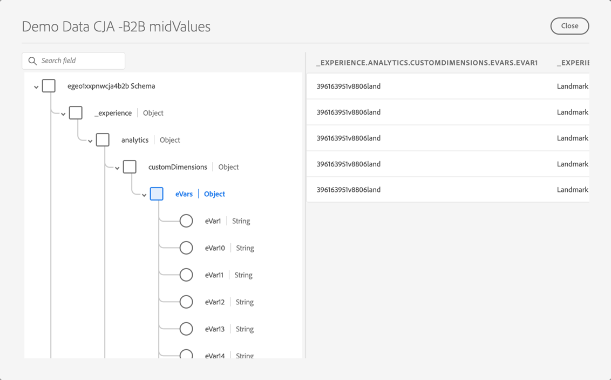
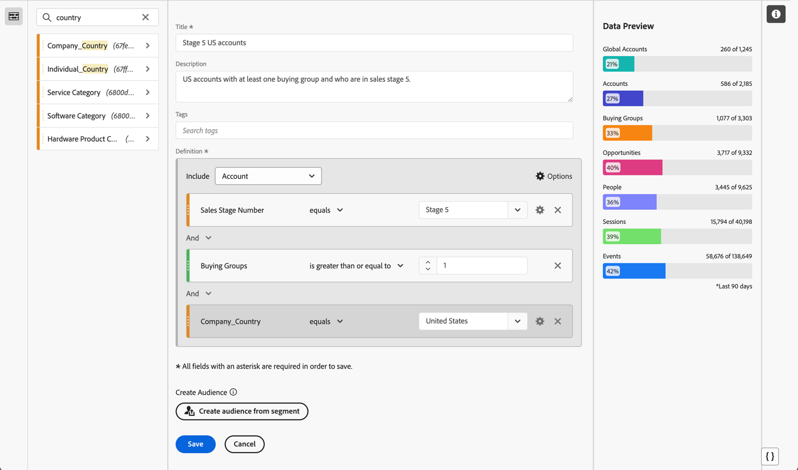

# B2B edition用例的设置

本文介绍Customer Journey Analytics B2B edition的典型设置，以支持以下用例：

* [优化帐户营销](optimize-account-marketing.md)
* [增长关键客户](grow-key-accounts.md)
* [构建产品价值](build-product-value.md)

>[!NOTE]
>
>在这些用例中使用的演示数据和屏幕截图仅用于说明目的，并不反映真实世界数据。

## 解决方案设计参考

在设置Customer Journey Analytics B2B edition之前，请确保您拥有适当的解决方案设计参考，该参考记录了您收集的每个字段。

解决方案设计参考的示例可能如下所示：

+++ 事件维度

| Dimension名称 |
|---|
| 帐户 ID |
| 帐户名称 |
| 购买群组 ID |
| 呼叫中心 |
| 呼叫中心代表Id |
| 呼叫ID |
| 营销活动跟踪代码 |
| 内容 ID |
| 内容类型 |
| 数据源 |
| 设备类型 |
| 事件详细信息 |
| 活动名称 |
| 漏斗 |
| 互动渠道 |
| 商机ID |
| 营销渠道 |
| 营销事件ID |
| 营销事件类型 |
| 机会 ID |
| 页面 |
| 详细信息页面 |
| 反向链接域 |
| 销售代表ID |
| 销售阶段名称 |
| 销售阶段编号 |
| 网站区域 |
| SKU |
| 子公司帐户 ID |
| 调查Id |
| 调查满意度分数 |
| 调查类型 |
| 用户 ID |

+++

+++ 事件量度

| 量度名称 | 事件类型 |
|---|---|
| 帐户创建：完成 | 计数器 |
| 帐户创建：开始 | 计数器 |
| 呼叫成本 | 货币 |
| 通话时长 | 计数器 |
| 呼叫满意度分数 | 数值 |
| 通话调查已完成 | 计数器 |
| 呼叫 | 计数器 |
| Closed-Lost | 计数器 |
| 非公开赢利 | 计数器 |
| 内容查看 | 计数器 |
| 交易规模货币显示点进次数 | 计数器 |
| 显示展示 | 计数器 |
| 电子邮件已退回 | 计数器 |
| 电子邮件已点击 | 计数器 |
| 电子邮件已送达 | 计数器 |
| 电子邮件已打开 | 计数器 |
| 已发送电子邮件 | 计数器 |
| 出席活动 | 计数器 |
| 事件注册：完成 | 计数器 |
| 事件注册：步骤1 | 计数器 |
| 事件注册：步骤2 | 计数器 |
| 事件注册：步骤3 | 计数器 |
| 全球满意度得分数字入站呼叫 | 计数器 |
| 潜在客户表单：完成 | 计数器 |
| 潜在客户表单：步骤1 | 计数器 |
| 潜在客户表单：步骤2 | 计数器 |
| 商机已生成 | 计数器 |
| 商机资格 | 计数器 |
| 会议 | 计数器 |
| MQL被取消资格 | 计数器 |
| MQL限定 | 计数器 |
| 需求评估 | 计数器 |
| 协商 | 计数器 |
| 异议处理 | 计数器 |
| 机会 | 计数器 |
| 机会创建 | 计数器 |
| 订购 | 计数器 |
| 出站呼叫 | 计数器 |
| 售后跟踪 | 计数器 |
| 提案提交 | 计数器 |
| 关闭的收入 — 损失的收入 | 货币 |
| 收入收盘 — 赢 | 货币 |
| 销售联系人呼叫 | 计数器 |
| 销售阶段已开始 | 计数器 |
| 短信点进次数 | 计数器 |
| 短信已发送 | 计数器 |
| 社交点进次数 | 计数器 |
| 社交展示 | 计数器 |
| 解决方案演示 | 计数器 |
| SQL不合格 | 计数器 |
| SQL限定 | 计数器 |
| 单位（不公开） | 计数器 |
| VoC调查满意度分数 | 数值 |
| VoC调查已完成 | 计数器 |

+++

+++ 人员记录

| 数据视图字段名称 | 字段类型 |
|---|---|
| 年龄 | 量度 |
| 年龄组 | 维度 |
| 类别1亲和力级别 | 维度 |
| 类别1亲和度分数 | 量度 |
| 类别2亲和力级别 | 维度 |
| 类别2亲和度分数 | 量度 |
| 类别3亲和力级别 | 维度 |
| 类别3亲和度分数 | 量度 |
| 类别4亲和力级别 | 维度 |
| 类别4亲和度分数 | 量度 |
| 类别5亲和力级别 | 维度 |
| 类别5亲和度分数 | 量度 |
| 同意Advertising | 维度 |
| 同意所有通信 | 维度 |
| 同意直邮 | 维度 |
| 同意电子邮件 | 维度 |
| 同意移动电话 | 维度 |
| 同意Personalization | 维度 |
| 同意共享数据 | 维度 |
| 同意短信 | 维度 |
| 电子邮件 | 维度 |
| 名字 | 维度 |
| 性别 | 维度 |
| 单个城市 | 维度 |
| 单个CLTV级别 | 维度 |
| 单个CLTV得分 | 量度 |
| 单个国家/地区 | 维度 |
| 个人电话 | 维度 |
| 个人邮政编码 | 维度 |
| 个人购买倾向级别 | 维度 |
| 个人购买倾向分数 | 量度 |
| 个人流失级别的倾向 | 维度 |
| 个人流失分数倾向 | 量度 |
| 个人升级级别的倾向 | 维度 |
| 个人升级得分的倾向 | 量度 |
| 单个状态 | 维度 |
| 个人街道地址 | 维度 |
| 职务 | 维度 |
| 姓氏 | 维度 |
| 网络推广者得分 | 量度 |
| 网络发起人状态 | 维度 |
| 角色类型 | 维度 |

+++

+++ 帐户记录

| 数据视图字段名称 | 字段类型 |
|---|---|
| 年收入 | 量度 |
| 公司所在城市 | 维度 |
| 公司CLTV级别 | 维度 |
| 公司CLTV得分 | 量度 |
| 公司所在国家 | 维度 |
| 公司名称 | 维度 |
| 公司电话 | 维度 |
| 公司邮政编码 | 维度 |
| 公司购买倾向级别 | 维度 |
| 公司购买倾向分数 | 量度 |
| 公司流失级别的倾向 | 维度 |
| 公司流失率倾向 | 量度 |
| 公司升级级别的倾向 | 维度 |
| 公司升级得分的倾向 | 量度 |
| 公司规模 | 维度 |
| 公司状态 | 维度 |
| 公司街道地址 | 维度 |
| 行业 | 维度 |
| 员工数 | 量度 |
| 合作伙伴受众 — 硬件购买者 | 维度 |
| 合作伙伴受众 — 快速增长 | 维度 |
| 合作伙伴受众 — 所需服务 | 维度 |
| 合作伙伴受众 — 软件购买者 | 维度 |
| 收入范围 | 维度 |
| 网站 | 维度 |

+++

+++ SKU记录

| 数据视图字段名称 | 字段类型 |
|---|---|
| 硬件产品类别 | 维度 |
| 硬件产品名称 | 维度 |
| 服务类别 | 维度 |
| 服务名称 | 维度 |
| 软件产品类别 | 维度 |
| 软件产品名称 | 维度 |

+++

## 架构和数据集

支持解决方案设计参考的数据使用以下架构和数据集进行结构化。

### 事件数据

事件维度和量度通过基于时间序列（事件）的架构以及一个或多个包含事件数据的数据集提供支持。

<!--For example: the Account ID field is mapped to **[!UICONTROL Account ID]**. See below for a preview of the data typically available in such a dataset.

-->

### 人员数据

通过基于记录（用户档案）的架构和一个或多个包含人员数据的数据集支持人员记录。 请参阅下文，以了解此类数据集中通常可用的人员数据示例（基于示例解决方案设计参考）。

### 帐户数据

通过基于记录（查找）记录的架构和一个或多个包含帐户数据的数据集支持帐户记录。 有关此类数据集中通常可用的帐户数据示例（基于示例解决方案设计参考），请参见下文。

### SKU数据

通过基于记录（查找）的架构和一个或多个包含SKU数据的数据集支持SKU记录。 请参阅下文，以了解此类数据集中通常可用的SKU数据示例（基于示例解决方案设计参考）。

## 连接

在Customer Journey Analytics中定义基于帐户的连接，以从事件、帐户、人员和SKU数据集中摄取并连接记录。

1. [在Customer Journey Analytics中创建新连接](/help/connections/create-connection.md)。
1. 输入连接的描述性名称和说明。
1. 选择 **[!UICONTROL 帐户]**&#x200B;作为&#x200B;**[!UICONTROL 主ID]**。
1. 选择所有&#x200B;**[!UICONTROL 可选容器]**。
1. 选择您的首选沙盒并估计平均每日事件数。

   基于

1. 选择&#x200B;**[!UICONTROL 添加数据集]**&#x200B;并添加包含事件、帐户、人员和SKU数据的B2B数据集。

   

1. 选择&#x200B;**[!UICONTROL 下一步]**&#x200B;为每个选定的数据集配置设置。
1. 对于事件数据集，请确保选择与&#x200B;**[!UICONTROL 帐户ID]**、**[!UICONTROL 全局帐户ID]**、**[!UICONTROL 机会ID]**、**[!UICONTROL 购买组ID]**&#x200B;和&#x200B;**[!UICONTROL 人员ID]**&#x200B;的标识对应的适当eVar。

   。

1. 向下滚动以配置帐户记录数据集。 请确保选择正确的标识符(**[!UICONTROL Account_ID]**)以与&#x200B;**[!UICONTROL 全局帐户]**&#x200B;容器的帐户匹配。 选择正确的标识符(**[!UICONTROL Account_ID]**)作为&#x200B;**[!UICONTROL 全局帐户字段]**。

   

1. 向下滚动以配置人员记录数据集。 请确保选择正确的密钥(**[!UICONTROL Person_ID]**)以按&#x200B;**[!UICONTROL Person]**&#x200B;容器匹配人员。 选择适当的标识(**[!UICONTROL Profile_Account_ID_Individual]**)以匹配&#x200B;**[!UICONTROL 全局帐户]**&#x200B;字段。

   

1. 向下滚动以配置SKU记录数据集。 请确保选择正确的密钥(**[!UICONTROL Sku]**)。 选择&#x200B;**[!UICONTROL 按字段]**&#x200B;匹配，因为没有为此数据配置或提供容器。 选择事件数据集(**[!UICONTROL SKU （事件数据集）]**)中的SKU字段作为匹配键。

   

1. 选择&#x200B;**[!UICONTROL 添加数据集]**&#x200B;以保存数据集及其配置的设置。

1. 选择&#x200B;**[!UICONTROL 保存]**&#x200B;以保存连接。

## 数据视图

在Customer Journey Analytics中摄取数据后，您需要创建一个数据视图，其中包含您在解决方案设计参考中定义的所有组件。

### 配置

1. [在Customer Journey Analytics中创建新数据视图](/help/data-views/data-views.md)。
1. 选择您之前创建的连接(例如： **[!UICONTROL B2B演示连接(ExL)]**)。
1. 提供数据视图的名称。 例如： `B2B Demo Data view (ExL)`和描述（可选）。
1. （可选）重命名容器。 或者使用默认容器名称。

   
1. 选择&#x200B;**[!UICONTROL 保存并继续]**。

### 组件

默认情况下，所有[标准组件](/help/data-views/component-reference.md)都已包含在您的数据视图中。 这些标准组件包括“客户”、“购买组”、“全球客户”和“商机”的B2B特定指标。

1. 将您在[解决方案设计参考](#solution-design-reference)中定义的所有事件维度添加到数据视图中的维度组件。 例如，字段&#x200B;**[!UICONTROL Event Name]**&#x200B;表示&#x200B;**[!UICONTROL Event Name]**&#x200B;维度。 确保通过可用的[组件设置](/help/data-views/component-settings/overview.md)配置维度组件。

   

1. 将您在[解决方案设计引用](#solution-design-reference)中定义的所有事件量度添加到数据视图中的量度组件。 例如，字段&#x200B;**[!UICONTROL SQL Qualified]**，表示&#x200B;**[!UICONTROL SQL Qualified]**&#x200B;度量。 确保通过可用的[组件设置](/help/data-views/component-settings/overview.md)配置维度组件。

   

1. 将您在[解决方案设计引用](#solution-design-reference)中定义的所有帐户维度添加到数据视图中的维度组件。 例如，字段&#x200B;**[!UICONTROL Industry]**，表示&#x200B;**[!UICONTROL Industry]**&#x200B;维度。 确保通过可用的[组件设置](/help/data-views/component-settings/overview.md)配置维度组件。

   

1. 将您在[解决方案设计引用](#solution-design-reference)中定义的所有帐户量度添加到数据视图中的量度组件。 例如，字段&#x200B;**[!UICONTROL Number_of_Employees]**，表示&#x200B;**[!UICONTROL Number_of_Employees]**&#x200B;量度。 确保通过可用的[组件设置](/help/data-views/component-settings/overview.md)配置维度组件。

   

1. 将您在[解决方案设计引用](#solution-design-reference)中定义的所有人员维度添加到数据视图中的维度组件。 例如，字段&#x200B;**[!UICONTROL Category_1_Affinity_Level]**，表示&#x200B;**[!UICONTROL Category_1_Affinity_Level]**&#x200B;维度。 确保通过可用的[组件设置](/help/data-views/component-settings/overview.md)配置维度组件。

   

1. 将您在[解决方案设计引用](#solution-design-reference)中定义的所有人员量度添加到数据视图中的量度组件。 例如，字段&#x200B;**[!UICONTROL Category_1_Affinity_Score]**，表示&#x200B;**[!UICONTROL Category_1_Affinity_Score]**&#x200B;量度。 确保通过可用的[组件设置](/help/data-views/component-settings/overview.md)配置维度组件。

   

1. 将您在[解决方案设计参考](#solution-design-reference)中定义的所有SKU维度添加到数据视图中的维度组件。 例如，字段&#x200B;**[!UICONTROL 服务类别]**，表示&#x200B;**[!UICONTROL 服务类别]**&#x200B;维度。 确保通过可用的[组件设置](/help/data-views/component-settings/overview.md)配置维度组件。

   

1. 选择&#x200B;**[!UICONTROL 保存并继续]**。

### 设置

1. 您可以选择为数据视图定义特定的[设置](/help/data-views/create-dataview.md#settings-1)：

   * 向数据视图添加区段。
   * 使用（计算）量度定义会话设置。

1. 选择&#x200B;**[!UICONTROL 保存并继续]**。

## 区段

您可以准备一个或多个基于B2B特定容器的区段，以便在Workspace项目中使用这些区段。

例如：

* 具有事件登记段的帐户。

  

* 美国客户，拥有购买组和第5阶段机会细分市场。

  

## 其他

您可以选择为用例定义其他组件，如[计算量度](/help/components/calc-metrics/calc-metr-overview.md)、[日期范围](/help/components/date-ranges/overview.md)或[警报](/help/components/c-intelligent-alerts/intelligent-alerts.md)。
