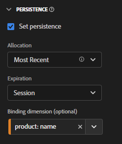

# 在CJA中使用绑定维度和量度

Customer Journey Analytics 提供了几种方法，使维度值在所设置的点击之后持续存在。Adobe 提供的一种持久性方法称为“绑定”。在早期版本的 Adobe Analytics 中，这个概念被称为促销。

虽然可以对顶级事件数据使用绑定维度，但最好在处理[对象阵列](object-arrays.md)时使用这个概念。您可以将维度归因于对象阵列的一部分，而无需将其应用于给定事件中的所有属性。例如，您可以将一个搜索词归因于购物车对象阵列中的一款产品，而无需将该搜索词绑定到整个事件。

## 示例 1：使用绑定维度将其他产品属性归因于购买

您可以将对象阵列中的维度项绑定到另一个维度。当绑定维度项出现时，CJA 将为您调用绑定维度并将其包含在事件中。考虑以下客户历程：

1. 一位访客查看了关于洗衣机的产品页面。

   ```json
   {
       "PersonID": "1",
       "product": [
           {
               "name": "Washing Machine 2000",
               "color": "white",
               "type": "front loader",
           },
       ],
       "timestamp": 1534219229
   }
   ```

1. 该访客随后又查看了关于烘干机的产品页面。

   ```json
   {
       "PersonID": "1",
       "product": [
           {
               "name": "Dryer 2000",
               "color": "neon orange",
           },
       ],
       "timestamp": 1534219502
   }
   ```

1. 最终，该访客完成了购买。每款产品的颜色不包括在购买事件中。

   ```json
   {
       "PersonID": "1",
       "orders": 1,
       "product": [
           {
               "name": "Washing Machine 2000",
               "price": 1600,
           },
           {
               "name": "Dryer 2000",
               "price": 499
           }
       ],
       "timestamp": 1534219768
   }
   ```

如果您想在没有绑定维度的情况下按颜色查看收入，则维度 `product.color` 仍然存在并错误地将点数归因于烘干机的颜色：

| product.color | 收入 |
| --- | --- |
| 霓虹橙 | 2099 |

您可以进入数据视图管理器，将产品颜色绑定到产品名称：



设置此持久性模型时，每当设置产品颜色时，CJA都会注意产品名称。 当它在后续事件中为该访客识别出相同的产品名称时，产品颜色也会随之改变。当您将产品颜色绑定到产品名称时，相同的数据看起来类似如下：

| product.color | 收入 |
| --- | --- |
| 白色 | 1600 |
| 霓虹橙 | 499 |

## 示例 2：使用绑定量度将搜索词绑定到产品购买

Adobe Analytics 中最常见的促销方法之一是将搜索词绑定到产品，这样每个搜索词就可以获得相应产品的点数。考虑以下客户历程：

1. 一位访客来到您的网站并搜索“拳击手套”。搜索量度将递增1，并显示前三个搜索结果。

   ```json
   {
       "PersonID": "1",
       "page_name": "Search results",
       "search": "1",
       "search_term": "boxing gloves",
       "product": [
           {
               "name": "Beginner gloves",
           },
           {
               "name": "Tier 3 gloves",
           },
           {
               "name": "Professional gloves",
           }
       ]
   }
   ```

2. 该访客找到一副自己喜欢的手套，然后将其添加到购物车。

   ```json
   {
       "PersonID": "1",
       "page_name": "Shopping cart",
       "cart_add": "1",
       "product": [
           {
               "name": "Tier 3 gloves",
           }
       ]
   }
   ```

3. 随后又搜索“网球拍”。搜索量度将递增1，并显示前三个搜索结果。

   ```json
   {
       "PersonID": "1",
       "page_name": "Search results",
       "search": "1",
       "search_term": "tennis racket",
       "product": [
           {
               "name": "Shock absorb racket",
           },
           {
               "name": "Women's open racket",
           },
           {
               "name": "Extreme racket",
           }
       ]
   }
   ```

4. 找到自己喜欢的球拍，然后将其添加到购物车。

   ```json
   {
       "PersonID": "1",
       "page_name": "Shopping cart",
       "cart_add": "1",
       "product": [
           {
               "name": "Tier 3 gloves",
           },
           {
               "name": "Shock absorb racket",
           }
       ]
   }
   ```

5. 第三次搜索“鞋子”。搜索量度将递增1，并显示前三个搜索结果。

   ```json
   {
       "PersonID": "1",
       "page_name": "Search results",
       "search": "1",
       "search_term": "shoes",
       "product": [
           {
               "name": "Men's walking shoes",
           },
           {
               "name": "Tennis shoes",
           },
           {
               "name": "Skate shoes",
           }
       ]
   }
   ```

6. 找到一双自己喜欢的鞋子，然后将其添加到购物车。

   ```json
   {
       "PersonID": "1",
       "page_name": "Shopping cart",
       "cart_add": "1",
       "product": [
           {
               "name": "Tier 3 gloves",
           },
           {
               "name": "Shock absorb racket",
           },
           {
               "name": "Skate shoes",
           }
       ]
   }
   ```

7. 该访客完成结账过程，购买了这三件商品。

   ```json
   {
       "PersonID": "1",
       "page_name": "Thank you for your purchase",
       "purchase": "1",
       "product": [
           {
               "name": "Tier 3 gloves",
               "price": "89.99"
           },
           {
               "name": "Shock absorb racket",
               "price": "34.99"
           },
           {
               "name": "Skate shoes",
               "price": "79.99"
           }
       ]
   }
   ```

如果您使用的分配模型不包含包含搜索词的绑定维度，则所有三个产品都仅将收入归因于单个搜索词。 例如，如果将“原始”分配与搜索词维度一起使用：

| search_term | 收入 |
| --- | --- |
| 拳击手套 | $204.97 |

如果您在搜索词维度中使用了最近分配，则所有三个产品仍会将收入归因于单个搜索词：

| search_term | 收入 |
| --- | --- |
| 鞋子 | US$204.97 |

本例仅包括一位访客，而许多搜索不同东西的访客可能会将搜索词错误地归因于不同的产品，使得确定最佳搜索结果变得困难。

当存在搜索量度时，您可以将搜索词与产品名称绑定，以便将搜索词正确归因于收入。


在 Analysis Workspace 中，生成的报表将类似如下：

| search_term | 收入 |
| --- | --- |
| 拳击手套 | $89.99 |
| 网球拍 | $34.99 |
| 鞋子 | $79.99 |

CJA会自动检测所选维度与绑定维度之间的关系。 如果绑定维度位于对象数组中，而所选维度位于更高级别，则需要绑定量度。 绑定量度充当绑定维度的触发器，因此它仅在存在绑定量度的事件上绑定自身。在上述示例中，搜索结果页面始终包含搜索词维度和搜索量度。

将搜索词维度设置为此持久性模型将会执行以下逻辑：

* 设置搜索词维度后，检查是否存在产品名称。
* 如果不存在产品名称，则什么也不做。
* 如果存在产品名称，则检查是否存在搜索量度。
* 如果不存在搜索量度，则什么也不做。
* 如果存在“搜索”量度，则将搜索词绑定到该事件中的所有产品名称。 它会将其复制到与该事件的产品名称相同的级别。 在本例中，它被视为 product.search_term。
* 如果在后续事件中看到相同的产品名称，则绑定的搜索词也会转发到该事件。

## 示例3:将视频搜索词与用户配置文件绑定

您可以将搜索词绑定到用户配置文件，以便配置文件之间的持久性保持完全分隔。 例如，您的组织运行流服务，其中一个总帐户可以具有多个用户档案。 访客具有子用户档案和成人用户档案。

1. 该帐户在子用户档案下登录，并搜索儿童的电视节目。 请注意， `"ProfileID"` is `2` 表示子用户档案。

   ```json
   {
       "PersonID": "7078",
       "ProfileID": "2",
       "Searches": "1",
       "search_term": "kids show"
   }
   ```

1. 他们找到《奥兰吉》，然后播放它，这样他们的孩子就能观看。

   ```json
   {
       "PersonID": "7078",
       "ProfileID": "2",
       "ShowName": "Orangey",
       "VideoStarts": "1"
   }
   ```

1. 当晚晚些时候，家长会切换到自己的个人资料，并搜索成人内容以观看。 请注意， `"ProfileID"` is `1` 来表示成人用户档案。 两个用户档案属于同一帐户，由相同的 `"PersonID"`.

   ```json
   {
       "PersonID": "7078",
       "ProfileID": "1",
       "Searches": "1",
       "search_term": "grownup movie"
   }
   ```

1. 找到节目“Analytics After Hours”，并享受晚上的观看体验。

   ```json
   {
       "PersonID": "7078",
       "ProfileID": "1",
       "ShowName": "Analytics After Hours",
       "VideoStarts": "1"
   }
   ```

1. 第二天，他们继续为孩子演出“奥兰吉”。 由于他们现在已经知道该节目，因此无需进行搜索。

   ```json
   {
       "PersonID": "7078",
       "ProfileID": "2",
       "ShowName": "Orangey",
       "VideoStarts": "1"
   }
   ```

如果您将“最近”分配与“人员”到期结合使用，则 `"grownup movie"` 搜索词被归因于儿童节目的最后一个视图。

| 搜索词 | 视频开始 |
| --- | --- |
| 成长电影 | 2 |
| 儿童节目 | 1 |

但是，如果您绑定 `search_term` to `ProfileID`，则每个用户档案的搜索都将与其自己的用户档案隔离，并归因于他们搜索的正确显示。


Analysis Workspace会正确地将《奥兰吉》第二集的归因于搜索词 `"kids show"` 而不考虑其他用户档案的搜索。

| 搜索词 | 视频开始 |
| --- | --- |
| 儿童节目 | 2 |
| 成长电影 | 1 |

## 示例4:评估零售设置中的浏览行为与搜索行为

您可以将值绑定到在以前的事件中设置的维度。 在设置具有绑定维度的变量时，CJA会考虑持久值。 如果此行为不需要，您可以调整绑定维度的持久性设置。 请考虑以下示例，其中 `product_finding_method` 在事件中设置，然后在以下事件中绑定到“购物车加货”量度。

1. 访客执行搜索 `"camera"`. 请注意，此页面上未设置任何产品。

   ```json
   {
       "search_term": "camera",
       "product_finding_method": "search"
   }
   ```

1. 他们单击他们喜欢的相机并将其添加到购物车。

   ```json
   {
       "Product": [
           {
               "name": "DSLR Camera"
           }
       ],
       "CartAdd": "1"
   }
   ```

1. 然后，访客浏览到男士腰带类别，而不执行搜索。 请注意，此页面上未设置任何产品。

   ```json
   {
       "category": "Men's belts",
       "product_finding_method": "browse"
   }
   ```

1. 他们点击自己喜欢的皮带，然后将其添加到购物车。

   ```json
   {
       "Product": [
           {
               "name": "Ratchet belt"
           }
       ],
       "CartAdd": "1"
   }
   ```

1. 他们完成结账流程并购买这两件物品。

   ```json
   {
       "Product": [
           {
               "name": "DSLR Camera",
               "price": "399.99"
           },
           {
               "name": "Ratchet belt",
               "price": "19.99"
           }
       ],
       "Purchase": "1"
   }
   ```

如果将持久性设置为没有绑定维度的最近分配，则所有419.98美元的收入都将归因于 `browse` 查找方法。

| 产品查找方法 | 收入 |
| --- | --- |
| 浏览 | 419.98 |

如果使用原始分配来设置持久性，而没有绑定维度，则所有419.98美元的收入将归属于 `search` 查找方法。

| 产品查找方法 | 收入 |
| --- | --- |
| 搜索 | 419.98 |

但是，如果绑定 `product_finding_method` 至“购物车加货”量度时，生成的报表会将每个产品归因到正确的查找方法。

| 产品查找方法 | 收入 |
| --- | --- |
| 搜索 | 399.99 |
| 浏览 | 19.99 |
