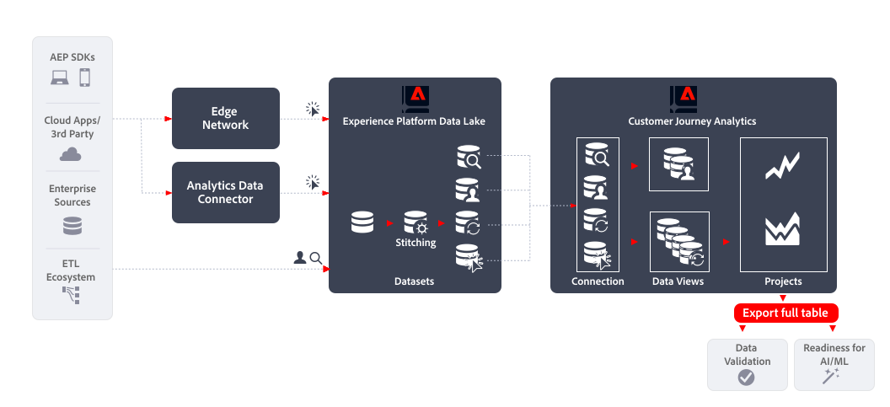

# 导出整个表

本文概述如何使用[!DNL Customer Journey Analytics BI extension]实现以下[数据导出用例](overview.md)：

- 数据验证
- 为AI/ML做好准备

## 简介

使用[!DNL Customer Journey Analytics Full Table Export]导出数据允许您从Customer Journey Analytics Analysis Workspace中的自由格式表中导出数据。

## 更多信息

您可以使用导出完整表格功能，直接将您在Analysis Workspace中创建的任何自由格式表格的完整内容导出到指定的云目标。

有关详细信息，请参阅有关[将Customer Journey Analytics报表导出到云](/help/analysis-workspace/export/export-cloud.md)的详细文档。
