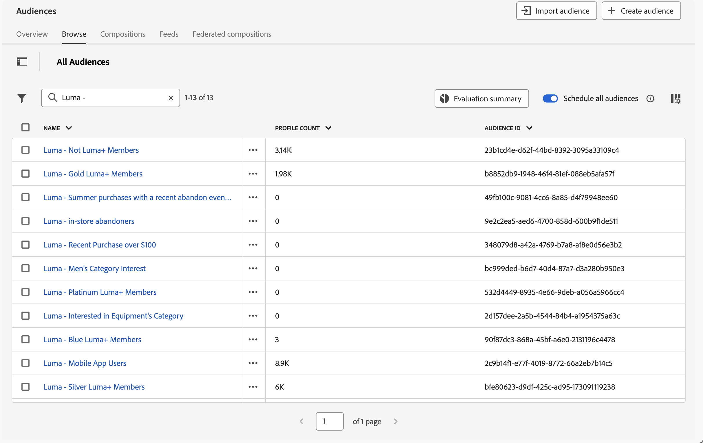
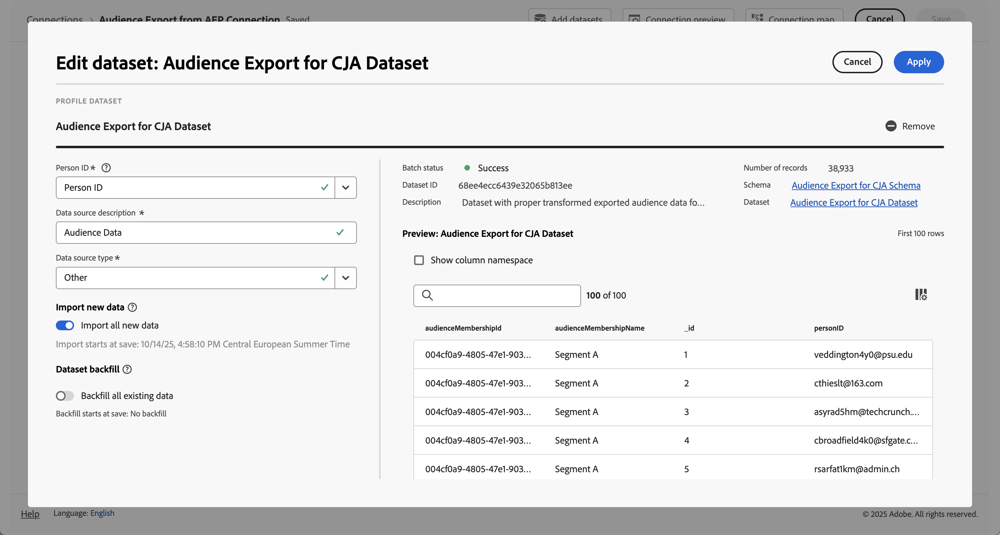
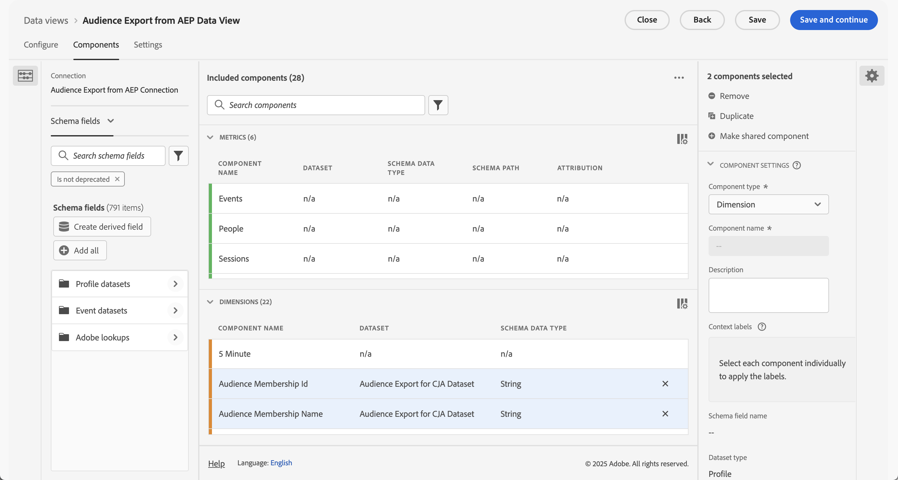

# 收錄和使用 Experience Platform 受众

本用例探索了一个将Experience Platform受众摄取到Customer Journey Analytics的临时解决方案。 这些受众可能创建于Experience Platform区段生成器、Adobe Audience Manager或其他工具中，并存储在实时客户档案中。 受众包含一组配置文件ID，以及任何适用的属性、事件等。 您希望将该受众数据纳入Customer Journey Analytics以进行进一步分析。

## 先决条件

* 访问[Experience Platform](https://experienceleague.adobe.com/zh-hans/docs/experience-platform/access-control/home)，特别是实时客户个人资料。
* 创建和管理Experience Platform [架构](https://experienceleague.adobe.com/zh-hans/docs/experience-platform/xdm/home)和[数据集](https://experienceleague.adobe.com/en/docs/experience-platform/catalog/datasets/overview)的访问权限。
* 访问[Experience Platform查询服务](https://experienceleague.adobe.com/zh-hans/docs/experience-platform/query/home) （以及编写SQL的能力）。
* 访问可执行某些数据转换的工具。
* 访问 Customer Journey Analytics. 您需要是[Customer Journey Analytics产品管理员](/help/technotes/access-control.md)才能创建和修改Customer Journey Analytics连接和数据视图。
* [验证并访问Experience Platform API（目录服务API和分段服务API）](https://experienceleague.adobe.com/zh-hans/docs/experience-platform/landing/platform-apis/api-authentication)。 您需要在组织和沙盒的“开发人员”控制台中创建项目，并确保您具有成功提交API调用所需的信息。

## 步骤

临时解决方案涉及以下步骤：

1. [选择受众(Experience Platform UI)](#select-audiences)。
1. [创建启用配置文件的数据集(Experience Platform API)](#create-a-profile-enabled-dataset)。
1. [导出受众(Experience Platform API)](#export-audiences)。
1. [转换输出(Experience Platform用户界面等)](#transform-the-output)。
1. [创建架构和数据集(Experience Platform UI)](#create-a-schema-and-dataset)。
1. [添加或编辑连接(Customer Journey Analytics UI)](#add-or-edit-a-connection)。
1. [配置数据视图(Customer Journey Analytics UI)](#configure-a-data-view)。
1. [报告和分析(Customer Journey Analytics UI)](#report-and-analyze)。


### 选择受众

解决方案首先是要标识要摄取到Customer Journey Analytics的受众。

+++ 识别受众

在 Experience Platform UI 中：

1. 选择&#x200B;**[!UICONTROL 客户]** >  **[!UICONTROL 受众]**。
1. 选择&#x200B;**[!UICONTROL 浏览]**&#x200B;并搜索要摄取和用于Customer Journey Analytics的受众。 记下每个受众的&#x200B;**[!UICONTROL 受众ID]**&#x200B;以供将来使用。

   

+++

### 创建启用配置文件的数据集

您需要基于基于核心的&#x200B;**[!UICONTROL XDM Individual Profile]**&#x200B;架构创建数据集。 在Experience Platform UI中创建数据集时，无法选择该基于核心的XDM Individual Profile作为架构。 请改用[目录服务API基于](https://experienceleague.adobe.com/en/docs/experience-platform/catalog/datasets/create#create-a-dataset)架构创建数据集`_xdm.context.profile__union`。

+++ 创建数据集请求

#### 请求

```shell
curl -X POST \
  'https://platform.adobe.io/data/foundation/catalog/dataSets?requestDataSource=true' \
  -H 'Authorization: Bearer {ACCESS_TOKEN}' \
  -H 'Content-Type: application/json' \
  -H 'x-api-key: {API_KEY}' \
  -H 'x-gw-ims-org-id: {ORG_ID}' \
  -H 'x-sandbox-name: {SANDBOX_NAME}' \
  -d '{
   "name": "{DATASET_NAME}",
   "schemaRef": {
      "id": "_xdm.context.profile__union",
      "contentType": "application/vnd.adobe.xed+json;version=1"
   },
   "fileDescription": {
      "persistet": true,
      "containerFormat": "parquet",
      "format": "parquet"
   }
}'
```

其中：

* `DATASET_NAME`是数据集的友好名称。 例如，`Segment Export Job Dataset for CJA`。

#### 响应

```json
["@/dataSets/{DATASET_ID}"]
```

其中：

* `DATASET_ID`是已创建数据集的数据集标识符。

+++

### 导出受众

将所选受众导出到刚刚创建的数据集中。 使用[分段服务API创建将受众发送到数据集的导出作业](https://experienceleague.adobe.com/en/docs/experience-platform/segmentation/api/export-jobs#create)。

+++ 导出作业请求

```shell
curl -X POST https://platform.adobe.io/data/core/ups/export/jobs \
 -H 'Authorization: Bearer {ACCESS_TOKEN}' \
 -H 'Content-Type: application/json' \
 -H 'x-gw-ims-org-id: {ORG_ID}' \
 -H 'x-api-key: {API_KEY}' \
 -H 'x-sandbox-name: {SANDBOX_NAME}' \
 -d '{
    "fields": "{COMMA_SEPARATED_LIST_OF_FULLY_QUALIFIED_FIELD_NAMES}",
    "filter": {
        "segments": [
            {
                "segmentId": "{AUDIENCE_ID_1}",
                "segmentNs": "ups",
                "status": [
                    "realized"
                ],
                "segmentId": "{AUDIENCE_ID_2}",
                "segmentNs": "ups",
                "status": [
                    "realized"
                ],
                "segmentId": "{AUDIENCE_ID_3}",
                "segmentNs": "ups",
                "status": [
                    "realized"
                ]             
             }
        ]
    },
    "destination":{
        "datasetId": "{DATASET_ID}",
        "segmentPerBatch": false
    },
    "schema":{
        "name": "_xdm.context.profile"
    }
}'
```

执行

* `COMMA_SEPARATED_LIST_OF_FULLY_QUALIFIED_FIELD_NAMES`可能类似于`_demoemea.identification.core.ecid, _demoemea.identification.core.email, _demoemea.identification.core.phoneNumber, person.gender, person.name.firstName, person.name.lastName`。 确保您至少包含要在客户历程分析中使用的相关字段(如人员ID（电子邮件）)。
* `AUDIENCE_ID_x`是要导出的受众的受众标识符。
* `DATASET_ID`是您创建的数据集。


### 响应

```json
{
  "..."
  "id": "{EXPORT_JOB_ID}",
  "..."
}
```

执行

* `EXPORT_JOB_ID`是导出作业的标识符。


+++

使用[分段服务API检查导出作业](https://experienceleague.adobe.com/en/docs/experience-platform/segmentation/api/export-jobs#get)的状态。

+++ 检索特定的导出作业请求

#### 请求

```shell
curl -X GET https://platform.adobe.io/data/core/ups/export/jobs/{EXPORT_JOB_ID} \
 -H 'Authorization: Bearer {ACCESS_TOKEN}' \
 -H 'x-gw-ims-org-id: {ORG_ID}' \
 -H 'x-api-key: {API_KEY}' \
 -H 'x-sandbox-name: {SANDBOX_NAME}'
```

#### 响应

```json
{
  "..."
  "id": "{EXPORT_JOB_ID}",
  "..."
  "status": "SUCCEEDED",
  "..."
}
```

+++

导出作业成功后，验证数据集是否包含已成功摄取的批次。

+++ 检查摄取状态

在 Experience Platform UI 中：

1. 选择&#x200B;**[!UICONTROL 数据管理]** >  **[!UICONTROL 数据集]**。
1. 选择您创建的数据集，例如：**[!UICONTROL CJA的区段导出作业数据集]**。

   

1. 验证摄取的批次。 如果数据集包含失败的批次，请使用&#x200B;**[!UICONTROL 数据管理]** >  **[!UICONTROL 监视]**&#x200B;查看原因。 例如，您使用的字段名称在架构中不存在。
1. 复制数据集的&#x200B;**[!UICONTROL 表名称]**。 例如：**[!UICONTROL segment_export_job_dataset_for_cja]**。  在下一步中使用该名称。

+++


### 转换输出

数据集中的数据格式不适用于Customer Journey Analytics。 要转换数据，请使用Experience Platform查询服务获取数据。

+++ 用于获取导出的受众数据的SQL

使用连接到Experience Platform查询服务的PSQL客户端。

在 Experience Platform UI 中：

1. 选择&#x200B;**[!UICONTROL 数据管理]** >  **[!UICONTROL 查询]**。
1. 选择 **[!UICONTROL 凭据]**。

使用凭据将PSQL客户端配置为连接到Customer Journey Analytics查询服务。

#### 查询

```sql
SELECT ROW_NUMBER() OVER (ORDER BY key)::text as _id, personID, key as audienceMembershipId
FROM (
   SELECT {IDENTITY_TO_USE_AS_PERSON_ID} AS personID, explode(segmentMembership.ups)
   FROM {DATASET_TABLE_NAME}
)
WHERE value.status = 'realized' AND (key = '{AUDIENCE_ID_1}' OR key = 'AUDIENCE_ID_2' OR key = 'AUDIENCE_ID_3')
```

其中：

* `IDENTITY_TO_USE_AS_PERSON_ID`是您定义为导出作业一部分的字段之一。 例如：`_demoemea.identification.core.email`。
* `AUDIENCE_ID_x`是您定义为导出作业一部分的受众。 您需要再次指定这些受众，因为导出作业中的规范是行级过滤器。 该行级过滤器返回指定区段的配置文件，以及每个配置文件的所有区段成员资格。


#### 结果

以JSON格式表示的查询结果应当如下所示：

```json
[
   {
      "_id": "1",
      "personID": "{PERSON_ID_x}",
      "audienceMembershipId": "{AUDIENCE_ID_x}"
   },
   {
      "_id": "2",
      "personID": "PERSON_ID_y",
      "audienceMembershipId": "{AUDIENCE_ID_x}"
   }

]
```

其中：

* `PERSON_ID_x`是要用作人员ID的标识符的标识符值。 例如，使用电子邮件时`john.doe@gmail.com`。
* `AUDIENCE_ID_x`是受众标识符。

+++

您需要转换此JSON数据以添加环境的租户名称并为受众提供更用户友好的名称。

+++ 转换JSON

最终JSON应如下所示：

```json
[
   {
      "_id": "1",
      "personID": "{PERSON_ID_x}",
      "{TENANT_NAME}": {
         "audienceMembershipId": "{AUDIENCE_ID_x}",
         "audienceMembershipName": "{AUDIENCE_FRIENDLY_NAME_x}"
      }
  },
  {
      "_id": "2",
      "personID": "{PERSON_ID_y}",
      "{TENANT_NAME}": {
         "audienceMembershipId": "{AUDIENCE_ID_y}",
         "audienceMembershipName": "{AUDIENCE_FRIENDLY_NAME_y}"
      }
    }
  }

]
```

其中：

* `TENANT_NAME`是租户的名称。 例如：`_demoemea`。
* `PERSON_ID_x`是要用作人员ID的标识符的标识符值。 例如，使用电子邮件时`john.doe@gmail.com`。
* `AUDIENCE_ID_x`是受众标识符。
* `AUDIENCE_FRIENDLY_NAME_x`是受众id的友好受众名称。 例如：`Luma - Blue+ Members`。

使用您喜爱的工具将原始JSON转换为此格式。

+++


### 创建架构和数据集

要在Customer Journey Analytics中将转换后的JSON用作导出的受众数据，您需要创建专用架构。

+++ 创建架构

要创建架构，请执行以下操作：

在 Experience Platform UI 中：

1. 选择&#x200B;**[!UICONTROL 数据管理]** >  **[!UICONTROL 架构]**。
1. 选择 **[!UICONTROL 创建架构]**。 从下拉菜单中选择&#x200B;**[!UICONTROL Standard]**。
1. 在&#x200B;**[!UICONTROL 创建架构]**&#x200B;对话框中选择&#x200B;**[!UICONTROL 手动]**&#x200B;并使用&#x200B;**[!UICONTROL 选择]**&#x200B;继续。
1. 在&#x200B;**[!UICONTROL 创建架构]**&#x200B;向导的&#x200B;**[!UICONTROL 选择类]**&#x200B;步骤中：
   1. 选择&#x200B;**[!UICONTROL 个人资料]**。
   1. 选择&#x200B;**[!UICONTROL 下一步]**。
1. 在&#x200B;**[!UICONTROL 创建架构]**&#x200B;向导的&#x200B;**[!UICONTROL 名称和审阅]**&#x200B;步骤中：
   1. 输入&#x200B;**[!UICONTROL 架构显示名称]**。 例如：`Audience Export for CJA Schema`。
   1. （可选）输入&#x200B;**[!UICONTROL 描述]**。
   1. 选择&#x200B;**[!UICONTROL 完成]**。
1. 设置架构以包含自定义字段组（例如&#x200B;**[!UICONTROL 受众成员资格]**），该自定义字段组包含名为&#x200B;**[!UICONTROL audienceMembershipId]**&#x200B;和&#x200B;**[!UICONTROL audienceMembershipName]**&#x200B;的两个字段。
1. 确保&#x200B;**[!UICONTROL personID]**&#x200B;字段是&#x200B;**[!UICONTROL 标识]**、**[!UICONTROL 主标识]**，并且具有&#x200B;**[!UICONTROL 电子邮件]**&#x200B;作为I**[!UICONTROL 标识命名空间]**。

   用于导出的

1. **[!UICONTROL 应用]**&#x200B;所有更改。 选择&#x200B;**[!UICONTROL 保存]**&#x200B;以保存架构。

+++

创建数据集并使用该数据集摄取转换后的JSON数据。

+++ 创建数据集并摄取数据

在 Experience Platform UI 中：

1. 选择&#x200B;**[!UICONTROL 数据管理]** >  **[!UICONTROL 数据集]**。
1. 选择 **[!UICONTROL 创建数据集]**。
1. 选择&#x200B;**[!UICONTROL 使用架构创建数据集]**。
1. 在&#x200B;**[!UICONTROL 从架构]**&#x200B;向导的&#x200B;**[!UICONTROL 选择架构]**&#x200B;步骤中：
   1. 选择您刚刚创建的架构。 例如：**[!UICONTROL CJA架构的受众导出]**。
   1. 选择&#x200B;**[!UICONTROL 下一步]**。
1. 在&#x200B;**[!UICONTROL 从架构创建数据集]**&#x200B;向导的&#x200B;**[!UICONTROL 配置数据集]**&#x200B;步骤中：
   1. 输入数据集的&#x200B;**[!UICONTROL 名称]**。
   1. （可选）输入数据集的&#x200B;**[!UICONTROL 描述]**。
   1. 选择&#x200B;**[!UICONTROL 完成]**。
1. 在数据集&#x200B;**[!UICONTROL 的]**&#x200B;数据集&#x200B;**[!UICONTROL _>_]**&#x200B;名称中，将转换后的JSON数据文件拖放到&#x200B;**[!UICONTROL 拖放文件]**&#x200B;上。 此操作会开始将导出的JSON数据引入数据集。
1. 验证摄取的批次。 如果数据集包含失败的批次，请使用&#x200B;**[!UICONTROL 数据管理]** >  **[!UICONTROL 监视]**&#x200B;查看原因。 例如，您在JSON中定义的字段名称在架构中不存在。


+++

### 添加或编辑连接

成功摄取包含Experience Platform中的受众数据的转换后的JSON数据后，您可以将该数据集添加到Customer Journey Analytics中的新连接或现有连接。

+++ 将数据集添加到连接

在Customer Journey Analytics UI中：

1. 选择&#x200B;**[!UICONTROL 数据管理]** > **[!UICONTROL 连接]**。
1. 创建新连接/定义&#x200B;**[!UICONTROL 连接设置]**&#x200B;和&#x200B;**[!UICONTROL 数据设置]**。 或者选择现有连接并使用 **[!UICONTROL 编辑连接]**&#x200B;编辑连接。
1. 选择 **[!UICONTROL 添加数据集]**。
1. 选择您创建并在其中摄取了转换后的JSON数据的数据集。
1. 配置数据集。 例如：

   

1. **[!UICONTROL 保存]**&#x200B;连接。

+++

### 配置数据视图

为刚刚创建或编辑的连接配置数据视图。

+++ 定义受众组件

1. 选择&#x200B;**[!UICONTROL 数据管理]** > **[!UICONTROL 数据视图]**。
1. 编辑现有数据视图或创建新数据视图。
1. 在数据视图的&#x200B;**[!UICONTROL 组件]**&#x200B;选项卡中，确保将&#x200B;**[!UICONTROL 受众成员资格ID]**&#x200B;和&#x200B;**[!UICONTROL 受众成员资格名称]**&#x200B;添加为维度组件。

   

1. 选择&#x200B;**[!UICONTROL 保存并继续]**&#x200B;以保存数据视图。

+++

### 报告和分析。

最后，使用Analysis Workspace在一个或多个使用数据视图和受众成员资格组件的面板中报告Experience Platform受众数据。


<!--

## Step 1: Select audiences in Real-time Customer Profile {#audience}

Experience Platform [Real-time Customer Profile](https://experienceleague.adobe.com/docs/experience-platform/profile/home.html) lets you see a holistic view of each individual customer by combining data from multiple channels, including online, offline, CRM, and third party. 

You likely already have audiences in RTCP that may have come from various sources. Select one or more audiences to ingest into Customer Journey Analytics. For example, WKND Fly Platinum and Gold Fly Club Members.


## Step 2: Create a Profile Union dataset for the export

In order to export the audience to a dataset that you can ingest in Customer Journey Analytics as profiles, create a dataset whose schema is a Profile [Union schema](https://experienceleague.adobe.com/docs/experience-platform/profile/union-schemas/union-schema.html#understanding-union-schemas).

Union schemas are composed of multiple schemas that share the same class and have been enabled for Profile. The union schema enables you to see an amalgamation of all of the fields contained within schemas sharing the same class. Real-time Customer Profile uses the union schema to create a holistic view of each individual customer.

## Step 3: Export an audience to the Profile Union dataset via API call {#export}

Before you can bring an audience into Customer Journey Analytics, you need to export it to an Adobe Experience Platform dataset. This can only be done using the Segmentation API, and specifically the [Export Jobs API Endpoint](https://experienceleague.adobe.com/docs/experience-platform/segmentation/api/export-jobs.html). 

You can create an export job using the audience ID of your choice, and put the results in the Profile Union Adobe Experience Platform dataset you created in Step 2. Although you can export various attributes/events for the audience, you only need to export the specific profile ID field that matches the person ID field used in the Customer Journey Analytics connection you will be leveraging (see below in Step 5).

## Step 4: Edit the export output 

The results of the export job need to be transformed into a separate Profile dataset in order to be ingested into Customer Journey Analytics.  This transformation can be done with [Adobe Experience Platform Query Service](https://experienceleague.adobe.com/docs/experience-platform/query/home.html), or another transformation tool of your choice. We only need the Profile ID (that will match the Person ID in Customer Journey Analytics) and one or more audience ID(s) to do the reporting in Customer Journey Analytics.

The standard export job, however, contains more data and so we need to edit this output to remove extraneous data, as well as move some things around.  Also, you need to create a schema/dataset first before you add the transformed data to it.

Here is an example of the export output in the Profile union dataset, **before** any editing:


Note the following:

* The audience ID is contained under `segmentmembership.ups.xxxxxxxx-xxxx-xxxx-xxxx-xxxxxxxxxxxx.status`.
* The status has to be "realized", or "entered", but not "exited".

This is the format of the Profile dataset that you can send into Customer Journey Analytics.


Here are the data elements that need to be present:

* `_aresprodvalidation` string field: Refers to your Organization ID. Yours will be different.
* `personID` string field: This is the standard XDM schema field on Profile datasets to identity the person. Use the Profile ID from the export.
* `audienceMembershipId` string field: The audience ID from the export.  NOTE: This field can be named whatever you want (from your own schema).
* Add a friendly name for the audience (`audienceMembershipIdName`), such as

   
   
* Add other audience metadata if you desire.

## Step 5: Add this Profile dataset to an existing connection in Customer Journey Analytics

You could [create a new connection](/help/connections/create-connection.md), but most customers will want to add the Profile dataset to an existing connection. The audience IDs "enrich" the existing data in Customer Journey Analytics.

## Step 6: Modify existing (or create new) Customer Journey Analytics data view

Add `audienceMembershipId`, `audienceMembershipIdName` and `personID` to the data view.

## Step 7: Report in Workspace

You can now report on `audienceMembershipId`, `audienceMembershipIdName` and `personID` in Workspace.

## Additional notes

* You should  perform this process on a regular cadence, so that audience data is constantly refreshed within Customer Journey Analytics.
* You can import multiple audiences within a single Customer Journey Analytics connection. This adds additional complexity to the process, but it is possible. For this to work, you need to make a few modifications to the above process:
   1. Perform this process for each desired audience in your audience collection within RTCP.
   1. Customer Journey Analytics supports arrays/object arrays in profile datasets. Using an [array of objects](https://experienceleague.adobe.com/docs/analytics-platform/using/cja-usecases/complex-data/object-arrays.html) for the audienceMembershipId or audienceMembershipIdName is the best option. 
   1. In your data view, create a new dimension using the Substring transformation on the `audienceMembershipId` field to convert the comma-separated values string to an array. NOTE: there is currently a limit of 10 values in the array.
   1. You can now report on this new dimension `audienceMembershipIds` within Customer Journey Analytics Workspace.

-->