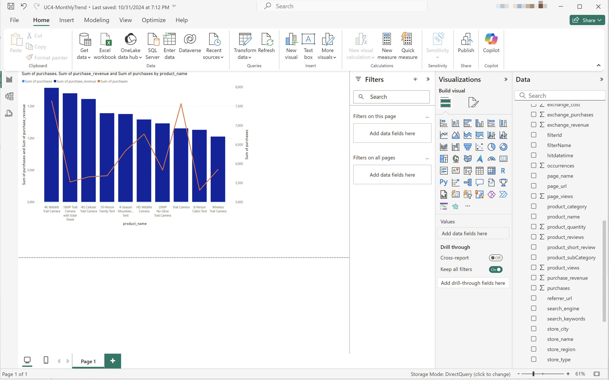
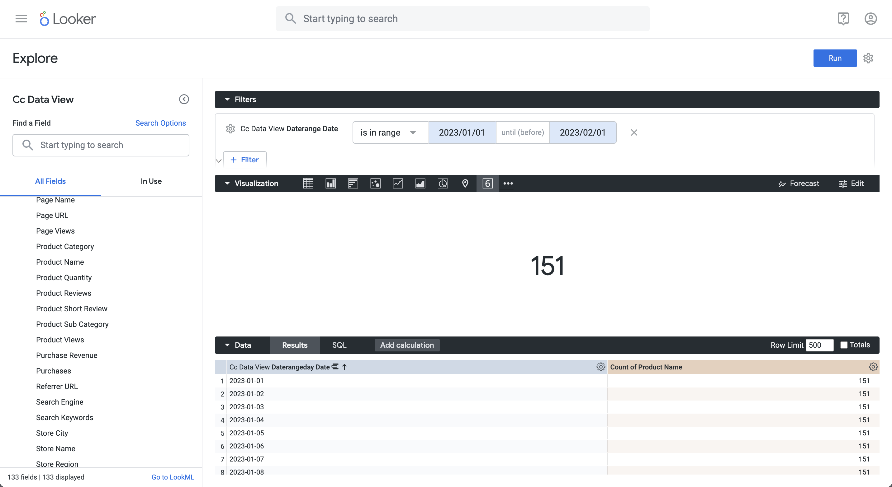
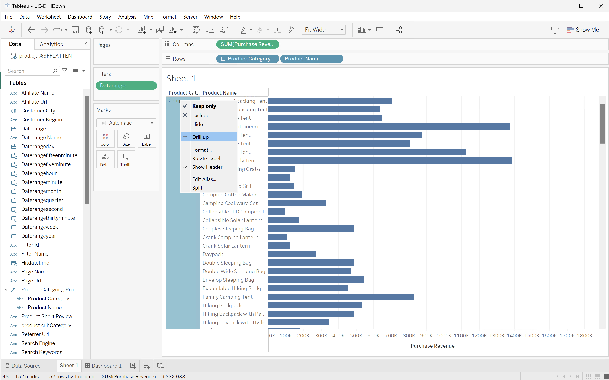

# BI 扩展用例

本文记录如何使用Customer Journey Analytics BI扩展完成多个用例。 每个用例都说明了Customer Journey Analytics功能，以及支持的每个BI工具的详细信息：

* **Power BI桌面**。 使用的版本为2.137.1102.0 64位（2024年10月）。
* **Tableau桌面**。 使用的版本为2024.1.5 (20241.24.0705.0334) 64位。
* **Looker**。 联机版本25.0.23，可通过[looker.com](https://looker.com){target="_blank"}使用

已记录以下用例：

* **连接**
   * [连接并列出数据视图](#connect-and-validate)

* **报告和分析**
   * [每日趋势](#daily-trend)
   * [每小时趋势](#hourly-trend)
   * [每月趋势](#monthly-trend)
   * [单个维度排名](#single-dimension-ranked)
   * [多个维度排名](#multiple-dimension-ranked)
   * [对非重复维度值计数](#count-distinct-dimension-values)
   * [使用日期范围名称进行筛选](#use-date-range-names-to-filter)
   * [使用筛选器名称进行筛选](#use-filter-names-to-filter)
   * [使用维度值进行筛选](#use-dimension-values-to-filter)
   * [排序](#sort)
   * [限制](#limits)

* **了解**

   * [Transformations（转换）](#transformations)
   * [可视化内容](#visualizations)
   * [注意事项](#caveats)

**connect**&#x200B;用例侧重于如何使用Customer Journey Analytics BI扩展连接BI工具。

**报告和分析**&#x200B;用例指导如何在当前支持的BI工具中实现类似的Customer Journey Analytics可视化图表。

**了解**&#x200B;用例提供了有关以下内容的更多详细信息：

* 使用BI工具报告和分析时发生的转换。
* Customer Journey Analytics和BI工具之间的可视化图表异同。
* 您应了解的每个BI工具的注意事项。


## 连接并验证

此用例设置从BI工具到Customer Journey Analytics的连接，列出可用的数据视图，并选择要使用的数据视图。

+++ Customer Journey Analytics

这些说明引用了具有以下对象的示例环境：

* 数据视图： **[!UICONTROL C&amp;C — 数据视图]**??。
* 维度：**[!UICONTROL 产品名称]**??和&#x200B;**[!UICONTROL 产品类别]**??。
* 量度：**[!UICONTROL 购买收入]**??和&#x200B;**[!UICONTROL 购买]**??。
* 筛选器： **[!UICONTROL 个钓鱼产品]**??。

{zoomable="yes"}

当您完成使用案例时，请将这些示例对象替换为适合您特定环境的对象。

+++

+++ BI 工具

>[!BEGINTABS]

>[!TAB Power BI桌面]

1. 从Experience Platform查询服务UI访问所需的凭据和参数。

   1. 导航到您的Experience Platform沙盒。
   1. 从左边栏中选择 **[!UICONTROL 查询]**。
   1. 在&#x200B;**[!UICONTROL 查询]**&#x200B;界面中选择&#x200B;**[!UICONTROL 凭据]**&#x200B;选项卡。
   1. 从&#x200B;**[!UICONTROL 数据库]**&#x200B;下拉菜单中选择`prod:cja`。

      {zoomable="yes"}

1. 启动Power BI Desktop。
   1. 从主界面中选择&#x200B;**[!UICONTROL 从其他源获取数据]**。
   1. 在&#x200B;**[!UICONTROL 获取数据]**对话框中：
      {zoomable="yes"}
      1. 搜索并选择&#x200B;**[!UICONTROL PostgreSQL数据库]**。
      1. 选择&#x200B;**[!UICONTROL 连接]**。
   1. 在&#x200B;**[!UICONTROL PostgreSQL数据库]**对话框中：
      {zoomable="yes"}
      1. 使用从Experience Platform **[!UICONTROL 查询]** **[!UICONTROL 过期凭据]**&#x200B;面板中复制并粘贴&#x200B;**[!UICONTROL 主机]**&#x200B;和&#x200B;**[!UICONTROL 端口]**&#x200B;值，以`:`分隔，作为&#x200B;**[!UICONTROL 服务器]**&#x200B;的值。 例如：`examplecompany.platform-query.adobe.io:80`。
      1. 使用从Experience Platform **[!UICONTROL 查询]** **[!UICONTROL 过期凭据]**&#x200B;面板复制并粘贴&#x200B;**[!UICONTROL 数据库]**&#x200B;值。 将`?FLATTEN`添加到您粘贴的值。 例如，`prod:cja?FLATTEN`。
      1. 选择&#x200B;**[!UICONTROL DirectQuery]**&#x200B;作为&#x200B;**[!UICONTROL 数据连接模式]**。
      1. 选择&#x200B;**[!UICONTROL 确定]**。
   1. 在&#x200B;**[!UICONTROL PostgreSQL数据库]** - **[!UICONTROL 数据库]**对话框中：
      {zoomable="yes"}
      1. 使用从&#x200B;**[!UICONTROL 用户名]**&#x200B;和&#x200B;**[!UICONTROL 密码]**&#x200B;字段中的Experience Platform **[!UICONTROL 查询]** **[!UICONTROL 过期凭据]**&#x200B;面板中复制&#x200B;**[!UICONTROL 用户名]**&#x200B;和&#x200B;**[!UICONTROL 密码]**&#x200B;值。 如果您使用的是[不会过期的凭据](https://experienceleague.adobe.com/en/docs/experience-platform/query/ui/credentials?lang=en#use-credential-to-connect)，请使用不会过期的凭据的密码。
      1. 确保&#x200B;**[!UICONTROL 选择要将这些设置应用到]**&#x200B;的级别的下拉菜单设置为您之前定义的&#x200B;**[!UICONTROL 服务器]**。
      1. 选择&#x200B;**[!UICONTROL 连接]**。
   1. 在&#x200B;**[!UICONTROL 导航器]**对话框中，将检索数据视图。 此检索可能需要一些时间。 检索后，您将在Power BI Desktop中看到以下内容。
      {zoomable="yes"}
      1. 从左侧面板的列表中选择&#x200B;**[!UICONTROL public.cc_data_view]**。
      1. 您有两个选项：
         1. 选择&#x200B;**[!UICONTROL 加载]**&#x200B;以继续并完成安装。
         1. 选择&#x200B;**[!UICONTROL 转换数据]**。 您会看到一个对话框，可以在其中选择将转换作为配置的一部分应用。
            {zoomable="yes"}
            * 选择&#x200B;**[!UICONTROL 关闭并应用]**。
   1. 一段时间后，**[!UICONTROL public.cc_data_view]**&#x200B;显示在&#x200B;**[!UICONTROL 数据]**&#x200B;窗格中。 选择以显示维度和量度。
      {zoomable="yes"}


### 是否扁平化

Power BI Desktop支持`FLATTEN`参数的以下方案。 有关详细信息，请参阅[拼合嵌套数据](https://experienceleague.adobe.com/en/docs/experience-platform/query/key-concepts/flatten-nested-data)。

| FLATTEN参数 | 示例 | 受支持 | 备注 |
|---|---|:---:|---|
| 无 | `prod:cja` |  | |
| `?FLATTEN` | `prod:cja?FLATTEN` |  | **推荐使用的选项！** |
| `%3FFLATTEN` | `prod:cja%3FFLATTEN` |  | Power BI桌面显示错误： **[!UICONTROL 无法使用提供的凭据进行身份验证。 请重试。]** |

### 更多信息

* [先决条件](/help/data-views/bi-extension.md#prerequisites)
* [凭据指南](https://experienceleague.adobe.com/en/docs/experience-platform/query/ui/credentials)
* [将Power BI连接到查询服务](https://experienceleague.adobe.com/en/docs/experience-platform/query/clients/power-bi)。


>[!TAB Tableau桌面]

1. 从Experience Platform查询服务UI访问所需的凭据和参数。

   1. 导航到您的Experience Platform沙盒。
   1. 从左边栏中选择 **[!UICONTROL 查询]**。
   1. 在&#x200B;**[!UICONTROL 查询]**&#x200B;界面中选择&#x200B;**[!UICONTROL 凭据]**&#x200B;选项卡。
   1. 从&#x200B;**[!UICONTROL 数据库]**&#x200B;下拉菜单中选择`prod:cja`。

      {zoomable="yes"}

1. 启动“表格”。
   1. 从&#x200B;**[!UICONTROL To a Server]**&#x200B;下的左边栏中选择&#x200B;**[!UICONTROL PostgreSQL]**。 如果不可用，请选择&#x200B;**[!UICONTROL 更多……]**，然后从&#x200B;**[!UICONTROL 安装的连接器]**&#x200B;中选择&#x200B;**[!UICONTROL PostgreSQL]**。
      {zoomable="yes"}
   1. 在&#x200B;**[!UICONTROL PostgreSQL]**&#x200B;对话框的&#x200B;**[!UICONTROL 常规]**选项卡中：
      {zoomable="yes"}
      1. 使用将&#x200B;**[!UICONTROL 主机]**&#x200B;从Experience Platform **[!UICONTROL 查询]** **[!UICONTROL 过期凭据]**&#x200B;面板复制并粘贴到&#x200B;**[!UICONTROL 服务器]**。
      1. 使用将&#x200B;**[!UICONTROL 端口]**&#x200B;从Experience Platform **[!UICONTROL 查询]** **[!UICONTROL 过期凭据]**&#x200B;面板复制并粘贴到&#x200B;**[!UICONTROL 端口]**。
      1. 使用将&#x200B;**[!UICONTROL 数据库]**&#x200B;从Experience Platform **[!UICONTROL 查询]** **[!UICONTROL 过期凭据]**&#x200B;面板复制并粘贴到&#x200B;**[!UICONTROL 数据库]**。 将`%3FFLATTEN`添加到您粘贴的值。 例如：`prod:cja%3FFLATTEN`。
      1. 从&#x200B;**[!UICONTROL 身份验证]**&#x200B;下拉菜单中选择&#x200B;**[!UICONTROL 用户名和密码]**。
      1. 使用将&#x200B;**[!UICONTROL 用户名]**&#x200B;从Experience Platform **[!UICONTROL 查询]** **[!UICONTROL 过期凭据]**&#x200B;面板复制并粘贴到&#x200B;**[!UICONTROL 用户名]**。
      1. 使用将&#x200B;**[!UICONTROL 密码]**&#x200B;从Experience Platform **[!UICONTROL 查询]** **[!UICONTROL 过期凭据]**&#x200B;面板复制并粘贴到&#x200B;**[!UICONTROL 密码]**。 如果您使用的是[不会过期的凭据](https://experienceleague.adobe.com/en/docs/experience-platform/query/ui/credentials?lang=en#use-credential-to-connect)，请使用不会过期的凭据的密码。
      1. 确保已选中&#x200B;**[!UICONTROL Require SSL]**。
      1. 选择&#x200B;**[!UICONTROL 登录]**。

      在Tableau Desktop验证连接时，您会看到&#x200B;**[!UICONTROL 处理请求]**&#x200B;对话框。
   1. 在主窗口中，您会在左窗格的&#x200B;**[!UICONTROL Data Source]**&#x200B;页面中看到：
      * **[!UICONTROL 连接]**&#x200B;下的连接名称。
      * **[!UICONTROL 数据库]**&#x200B;下的数据库名称。
      * **[!UICONTROL 表]**下的表列表。
        {zoomable="yes"}
      1. 将&#x200B;**[!UICONTROL cc_data_view]**&#x200B;条目拖放到显示&#x200B;**[!UICONTROL 将表]**&#x200B;拖放到此处的主视图中。
   1. 主窗口显示&#x200B;**[!UICONTROL cc_data_view]**数据视图的详细信息。
      {zoomable="yes"}

### 是否扁平化

Tableau Desktop支持`FLATTEN`参数的以下方案。 有关详细信息，请参阅[拼合嵌套数据](https://experienceleague.adobe.com/en/docs/experience-platform/query/key-concepts/flatten-nested-data)。

| FLATTEN参数 | 示例 | 受支持 | 备注 |
|---|---|:---:|---|
| 无 | `prod:cja` |  | |
| `?FLATTEN` | `prod:cja?FLATTEN` |  | |
| `%3FFLATTEN` | `prod:cja%3FFLATTEN` |  | **推荐使用的选项**。 请注意，`%3FFLATTEN`是`?FLATTEN`的URL编码版本。 |

### 更多信息

* [先决条件](/help/data-views/bi-extension.md#prerequisites)
* [凭据指南](https://experienceleague.adobe.com/en/docs/experience-platform/query/ui/credentials)
* [将Tableau桌面连接到查询服务](https://experienceleague.adobe.com/en/docs/experience-platform/query/clients/tableau)。


>[!TAB Looker]

1. 从Experience Platform查询服务UI访问所需的凭据和参数。

   1. 导航到您的Experience Platform沙盒。
   1. 从左边栏中选择 **[!UICONTROL 查询]**。
   1. 在&#x200B;**[!UICONTROL 查询]**&#x200B;界面中选择&#x200B;**[!UICONTROL 凭据]**&#x200B;选项卡。
   1. 从&#x200B;**[!UICONTROL 数据库]**&#x200B;下拉菜单中选择`prod:cja`。

      {zoomable="yes"}

1. 登录到Looker

   1. 从左边栏中选择&#x200B;**[!UICONTROL 管理员]**。
   1. 选择&#x200B;**[!UICONTROL 连接]**。
   1. 选择&#x200B;**[!UICONTROL 添加连接]**。
   1. 在&#x200B;**[!UICONTROL 将数据库连接到Looker屏幕]**&#x200B;中。

      {zoomable="yes"}

      1. 为您的连接输入&#x200B;**[!UICONTROL Name]**，例如`Example Looker Connection`。
      1. 确保选择&#x200B;**[!UICONTROL 所有项目]**&#x200B;作为&#x200B;**[!UICONTROL 连接作用域]**。
      1. 选择&#x200B;**[!UICONTROL PostgreSQL 9.5+]**&#x200B;作为方言。
      1. 使用从Experience Platform **[!UICONTROL 查询]** **[!UICONTROL 过期凭据]**&#x200B;面板复制并粘贴&#x200B;**[!UICONTROL 主机]**&#x200B;值作为&#x200B;**[!UICONTROL 主机]**&#x200B;的值。 例如：`examplecompany.platform-query.adobe.io`。
      1. 使用从Experience Platform **[!UICONTROL 查询]** **[!UICONTROL 过期凭据]**&#x200B;面板中复制并粘贴&#x200B;**[!UICONTROL 端口]**&#x200B;值作为&#x200B;**[!UICONTROL 端口]**&#x200B;的值。 例如：`80`。
      1. 使用从Experience Platform **[!UICONTROL 查询]** **[!UICONTROL 过期凭据]**&#x200B;面板中复制并粘贴&#x200B;**[!UICONTROL 数据库]**&#x200B;值作为&#x200B;**[!UICONTROL 数据库]**&#x200B;的值。 将`?FLATTEN`添加到您粘贴的值。 例如，`prod:cja?FLATTEN`。
      1. 使用从Experience Platform **[!UICONTROL 查询]** **[!UICONTROL 过期凭据]**&#x200B;面板中复制并粘贴&#x200B;**[!UICONTROL 用户名]**&#x200B;值作为&#x200B;**[!UICONTROL 用户名]**&#x200B;的值。
      1. 使用从Experience Platform **[!UICONTROL 查询]** **[!UICONTROL 过期凭据]**&#x200B;面板中复制并粘贴&#x200B;**[!UICONTROL 密码]**&#x200B;值作为&#x200B;**[!UICONTROL 密码]**&#x200B;的值。
      1. 选择&#x200B;**[!UICONTROL 在**[!UICONTROL &#x200B;可选设置&#x200B;]**处展开全部]**。
      1. 将每个节点的最大连接数&#x200B;**[!UICONTROL 设置为`5`。]**
      1. 确保启用&#x200B;**[!UICONTROL SSL]**。
      1. 选择&#x200B;**[!UICONTROL 测试]**&#x200B;以测试连接。 您应该会看到屏幕顶部出现一个横幅，其中显示一条消息，如&#x200B;**[!UICONTROL Success， can connect JDBC string： jdbc:postgresql://examplecompany.platform-query-stage.adobe.io:80/prod:cja?FLATTEN?tcpKeepAlive=true&amp;ssl=true&amp;sslfactory=org.postgresql.ssl.NonValidatingFactory&amp;sslmode=prefer]**。
      1. 选择&#x200B;**[!UICONTROL 连接]**&#x200B;以建立和保存连接。
   1. 您可以在&#x200B;**[!UICONTROL 连接]**&#x200B;界面中看到新连接。
   1. 从&#x200B;**[!UICONTROL 管理员]**&#x200B;中选择&#x200B;**←**&#x200B;以转到左边栏中的主导航。
   1. 选择&#x200B;**[!UICONTROL 开发]**。
   1. 选择&#x200B;**[!UICONTROL 项目]**。
   1. 在LookML项目中选择&#x200B;**[!UICONTROL 新建模型]**。
   1. 以确保不会影响其他用户。 出现提示时，选择Enter Development Mode。
   1. 在&#x200B;**[!UICONTROL 创建模型]**&#x200B;体验中：
      1. 在&#x200B;**[!UICONTROL ➊中，选择数据库连接]**：
         1. 在&#x200B;**[!UICONTROL 选择数据库连接]**&#x200B;中选择数据库连接。 例如：**[!UICONTROL example_looker_connection]**。
         1. 在&#x200B;**[!UICONTROL 中命名您的项目创建此模型的新LookML项目]**。 针对`example: example_looker_project`。
         1. 选择&#x200B;**[!UICONTROL 下一步]**。
      1. 在&#x200B;**[!UICONTROL ➋中，选择表]**：
         1. 选择&#x200B;**[!UICONTROL public]**，然后确保已选择您的Customer Journey Analytics数据视图。 例如：  **[!UICONTROL cc_data_view]**。
         1. 选择&#x200B;**[!UICONTROL 下一步]**。
      1. 在&#x200B;**[!UICONTROL ➌中，选择主键]**：
         1. 选择&#x200B;**[!UICONTROL 下一步]**。
      1. 在&#x200B;**[!UICONTROL ➍中，选择要创建的探索]**：
         1. 确保选择您的视图。 例如：**[!UICONTROL cc_data_view.view]**。
         1. 选择&#x200B;**[!UICONTROL 下一步]**。
      1. 在&#x200B;**[!UICONTROL 中➎输入模型名称]**：
         1. 命名您的模型。 例如：`example_looker_model`。
      1. 选择&#x200B;**[!UICONTROL 完成并浏览数据]**。

   您将被重定向到Looker的&#x200B;**[!UICONTROL 浏览]**&#x200B;界面，准备浏览数据。


### 是否扁平化

Looker支持`FLATTEN`参数的以下方案。 有关详细信息，请参阅[拼合嵌套数据](https://experienceleague.adobe.com/en/docs/experience-platform/query/key-concepts/flatten-nested-data)。

| FLATTEN参数 | 示例 | 受支持 | 备注 |
|---|---|:---:|---|
| 无 | `prod:cja` |  | |
| `?FLATTEN` | `prod:cja?FLATTEN` |  | |
| `%3FFLATTEN` | `prod:cja%3FFLATTEN` |  | **推荐使用的选项**。 请注意，`%3FFLATTEN`是`?FLATTEN`的URL编码版本。 |

### 更多信息

* [先决条件](/help/data-views/bi-extension.md#prerequisites)
* [凭据指南](https://experienceleague.adobe.com/en/docs/experience-platform/query/ui/credentials)

>[!ENDTABS]

+++


## 每日趋势

在此使用案例中，您要显示一个表格和简单的折线图可视化图表，其中显示2023年1月1日至2023年1月31日期间的每日发生次数（事件）趋势。

+++ Customer Journey Analytics

用例的&#x200B;**[!UICONTROL 每日趋势]**&#x200B;面板示例：

{zoomable="yes"}

+++

+++ BI 工具

>[!PREREQUISITES]
>
>请确保已验证[连接是否成功，并且可以为要试用此用例的BI工具列出和使用数据视图](#connect-and-validate)。
>

>[!BEGINTABS]

>[!TAB Power BI桌面]

1. 在&#x200B;**[!UICONTROL 数据]**&#x200B;窗格中：
   1. 选择&#x200B;**[!UICONTROL daterangeday]**。
   1. 选择&#x200B;**[!UICONTROL ∑发生次数]**。

   您会看到一个显示当月发生次数的表。 为了获得更好的可见性，请放大可视化图表。

1. 在&#x200B;**[!UICONTROL 筛选器]**&#x200B;窗格中：

   1. 从此视觉对象上的&#x200B;**[!UICONTROL 筛选器中选择**[!UICONTROL  daterangeday is (All)]**]**。
   1. 选择&#x200B;**[!UICONTROL 高级筛选]**&#x200B;作为&#x200B;**[!UICONTROL 筛选器类型]**。
   1. 将筛选器定义为&#x200B;**[!UICONTROL 当值]** **[!UICONTROL 位于或晚于]** `1/1/2023` **[!UICONTROL 且]** **[!UICONTROL 位于]** `2/1/2023.`时显示项您可以使用日历图标挑选日期。
   1. 选择&#x200B;**[!UICONTROL 应用筛选器]**。

   您会看到使用应用的&#x200B;**[!UICONTROL daterangeday]**&#x200B;过滤器更新的表。

1. 在&#x200B;**[!UICONTROL 可视化图表]**&#x200B;窗格中，选择&#x200B;**[!UICONTROL 折线图]**&#x200B;可视化图表。

   使用与表相同的数据时，折线图可视化图表会替换表。 您的Power BI桌面应该如下所示。

   {zoomable="yes"}

1. 在折线图可视化图表上：

   1. 选择。
   1. 从上下文菜单中，选择&#x200B;**[!UICONTROL 显示为表]**。

   主视图已更新以显示折线图可视化图表和表格。 您的Power BI桌面应该如下所示。

   {zoomable="yes"}

>[!TAB Tableau桌面]

1. 选择底部的&#x200B;**[!UICONTROL 表1]**&#x200B;选项卡以从&#x200B;**[!UICONTROL 数据源]**&#x200B;视图切换。 在&#x200B;**[!UICONTROL 表1]**&#x200B;视图中：
   1. 从&#x200B;**[!UICONTROL 数据]**&#x200B;窗格的&#x200B;**[!UICONTROL 表]**&#x200B;列表中拖动&#x200B;**[!UICONTROL 日期范围]**&#x200B;条目，并将该条目放到&#x200B;**[!UICONTROL 筛选器]**&#x200B;托架上。
   1. 在&#x200B;**[!UICONTROL 筛选器字段\[日期范围\]]**&#x200B;对话框中，选择&#x200B;**[!UICONTROL 日期范围]**&#x200B;并选择&#x200B;**[!UICONTROL 下一步>]**。
   1. 在&#x200B;**[!UICONTROL 筛选器\[日期范围]]**&#x200B;对话框中，选择&#x200B;**[!UICONTROL 日期范围]**&#x200B;并指定句点`01/01/2023` - `01/02/2023`。

      {zoomable="yes"}

   1. 从&#x200B;**[!UICONTROL 数据]**&#x200B;窗格的&#x200B;**[!UICONTROL 表]**&#x200B;列表中拖放&#x200B;**[!UICONTROL Daterangeday]**，并将条目拖放到&#x200B;**[!UICONTROL 列]**&#x200B;旁边的字段中。
      * 从&#x200B;**[!UICONTROL Daterangeday]**&#x200B;下拉菜单中选择&#x200B;**[!UICONTROL Day]**，以便将该值更新为&#x200B;**[!UICONTROL DAY(Daterangeday)]**。
   1. 从&#x200B;**[!UICONTROL 数据]**&#x200B;窗格中的&#x200B;**[!UICONTROL 表（*度量值名称*）]**&#x200B;列表中拖放&#x200B;**[!UICONTROL 发生次数]**，并将条目拖放到&#x200B;**[!UICONTROL 行]**&#x200B;旁边的字段中。 该值会自动转换为&#x200B;**[!UICONTROL SUM（发生次数）]**。
   1. 从工具栏中的&#x200B;**[!UICONTROL 适应]**&#x200B;下拉菜单将&#x200B;**[!UICONTROL 标准]**&#x200B;修改为&#x200B;**[!UICONTROL 整个视图]**。

      您的Tableau桌面应该如下所示。

      {zoomable="yes"}

1. 从&#x200B;**[!UICONTROL 工作表1]**&#x200B;选项卡上下文菜单中选择&#x200B;**[!UICONTROL 复制]**&#x200B;以创建第二个工作表。
1. 从&#x200B;**[!UICONTROL 工作表1]**&#x200B;选项卡上下文菜单中选择&#x200B;**[!UICONTROL 重命名]**&#x200B;以将工作表重命名为`Graph`。
1. 从&#x200B;**[!UICONTROL 工作表1 (2)]**&#x200B;选项卡上下文菜单中选择&#x200B;**[!UICONTROL 重命名]**&#x200B;以将工作表重命名为`Data`。
1. 确保已选择&#x200B;**[!UICONTROL 数据]**&#x200B;工作表。 在&#x200B;**[!UICONTROL 数据]**&#x200B;视图中：
   1. 选择右上角的&#x200B;**[!UICONTROL 向我显示]**&#x200B;并选择&#x200B;**[!UICONTROL 文本表]**（左上角可视化图表）以将数据视图的内容修改为表。
   1. 从工具栏中选择&#x200B;**[!UICONTROL 交换行和列]**。
   1. 从工具栏中的&#x200B;**[!UICONTROL 适应]**&#x200B;下拉菜单将&#x200B;**[!UICONTROL 标准]**&#x200B;修改为&#x200B;**[!UICONTROL 整个视图]**。

      您的Tableau桌面应该如下所示。

      {zoomable="yes"}

1. 选择&#x200B;**[!UICONTROL 新建仪表板]**&#x200B;选项卡按钮（位于底部）以创建新的&#x200B;**[!UICONTROL 仪表板1]**&#x200B;视图。 在&#x200B;**[!UICONTROL 功能板1]**&#x200B;视图中：
   1. 将&#x200B;**[!UICONTROL Graph]**&#x200B;工作表从&#x200B;**[!UICONTROL 工作表]**&#x200B;托架拖放到&#x200B;**[!UICONTROL 仪表板1]**&#x200B;视图中，该视图显示&#x200B;*在此处放置工作表*。
   1. 将&#x200B;**[!UICONTROL 数据]**&#x200B;工作表从&#x200B;**[!UICONTROL 图形]**&#x200B;工作表下的&#x200B;**[!UICONTROL 工作表]**&#x200B;托架拖放到&#x200B;**[!UICONTROL 仪表板1]**&#x200B;视图中。
   1. 选择视图中的&#x200B;**[!UICONTROL 数据]**&#x200B;工作表，并将&#x200B;**[!UICONTROL 整个视图]**&#x200B;修改为&#x200B;**[!UICONTROL 固定宽度]**。

      您的Tableau桌面应该如下所示。

      {zoomable="yes"}


>[!TAB Looker]

1. 在Looker的&#x200B;**[!UICONTROL 浏览]**&#x200B;界面中，确保您拥有干净的设置。 如果不是，请选择 **[!UICONTROL 删除字段和筛选器]**。
1. 选择&#x200B;**[!UICONTROL 筛选器]**&#x200B;下的&#x200B;**[!UICONTROL +筛选器]**。
1. 在&#x200B;**[!UICONTROL 添加筛选器]**&#x200B;对话框中：
   1. 选择&#x200B;**[!UICONTROL ‣抄送数据视图]**
   1. 从字段列表中，选择&#x200B;**[!UICONTROL 日‣间范围日期]**，然后选择&#x200B;**[!UICONTROL 日期范围日期]**。
      {zoomable="yes"}
1. 指定&#x200B;**[!UICONTROL Cc数据视图日期范围日期]**&#x200B;筛选器，因为&#x200B;**[!UICONTROL 在]** **[!UICONTROL 2023/01/01]** **[!UICONTROL 之前]** **[!UICONTROL 2023/02/01]**&#x200B;的范围内。
1. 从左边栏中的&#x200B;**[!UICONTROL 抄送数据视图]**&#x200B;部分，
   1. 从&#x200B;**[!UICONTROL DIMENSIONS‣]**&#x200B;的列表中选择&#x200B;**[!UICONTROL 日期范围日期]**，然后选择&#x200B;**[!UICONTROL 日期]**。
   1. 在左边栏（底部）中选择&#x200B;**[!UICONTROL MEASURES]**&#x200B;下的&#x200B;**[!UICONTROL 计数]**。
1. 选择&#x200B;**[!UICONTROL 运行]**。
1. 选择‣**[!UICONTROL 可视化图表]**&#x200B;以显示折线图可视化图表。

您应该会看到如下所示的可视化图表和表格。

{zoomable="yes"}

>[!ENDTABS]

+++


## 每小时趋势

在此使用案例中，您要显示一个表格和简单的折线图可视化图表，其中显示2023年1月1日发生次数（事件）的每小时趋势。

+++ Customer Journey Analytics

用例的&#x200B;**[!UICONTROL 每小时趋势]**&#x200B;面板示例：

{zoomable="yes"}

+++

+++ BI 工具

>[!PREREQUISITES]
>
>请确保已验证[连接是否成功，可以列出数据视图，并为要为其尝试此用例的BI工具使用数据视图](#connect-and-validate)。
>

>[!BEGINTABS]

>[!TAB Power BI桌面]

 Power BI **不**&#x200B;了解如何处理日期时间字段，因此不支持&#x200B;**[!UICONTROL daterangehour]**&#x200B;和&#x200B;**[!UICONTROL daterangeminute]**&#x200B;等维度。

>[!TAB Tableau桌面]

1. 选择底部的&#x200B;**[!UICONTROL 表1]**&#x200B;选项卡以从&#x200B;**[!UICONTROL 数据源]**&#x200B;切换。 在&#x200B;**[!UICONTROL 表1]**&#x200B;视图中：
   1. 从&#x200B;**[!UICONTROL 数据]**&#x200B;窗格的&#x200B;**[!UICONTROL 表]**&#x200B;列表中拖动&#x200B;**[!UICONTROL 日期范围]**&#x200B;条目，并将该条目放到&#x200B;**[!UICONTROL 筛选器]**&#x200B;托架上。
   1. 在&#x200B;**[!UICONTROL 筛选器字段\[日期范围\]]**&#x200B;对话框中，选择&#x200B;**[!UICONTROL 日期范围]**&#x200B;并选择&#x200B;**[!UICONTROL 下一步>]**。
   1. 在&#x200B;**[!UICONTROL 筛选器\[日期范围]]**&#x200B;对话框中，选择&#x200B;**[!UICONTROL 日期范围]**&#x200B;并指定句点`01/01/2023` - `02/01/2023`。

      {zoomable="yes"}

   1. 从&#x200B;**[!UICONTROL 数据]**&#x200B;窗格的&#x200B;**[!UICONTROL 表]**&#x200B;列表中拖放&#x200B;**[!UICONTROL Daterangehour]**，并将条目拖放到&#x200B;**[!UICONTROL 列]**&#x200B;旁边的字段中。
      * 从&#x200B;**[!UICONTROL Daterangeday]**&#x200B;下拉菜单中选择&#x200B;**[!UICONTROL More]** > **[!UICONTROL Hours]**，以便将该值更新为&#x200B;**[!UICONTROL HOUR(Daterangeday)]**。
   1. 从&#x200B;**[!UICONTROL 数据]**&#x200B;窗格中的&#x200B;**[!UICONTROL 表（*度量值名称*）]**&#x200B;列表中拖放&#x200B;**[!UICONTROL 发生次数]**，并将条目拖放到&#x200B;**[!UICONTROL 行]**&#x200B;旁边的字段中。 该值会自动转换为&#x200B;**[!UICONTROL SUM（发生次数）]**。
   1. 从工具栏中的&#x200B;**[!UICONTROL 适应]**&#x200B;下拉菜单将&#x200B;**[!UICONTROL 标准]**&#x200B;修改为&#x200B;**[!UICONTROL 整个视图]**。

      您的Tableau桌面应该如下所示。

      {zoomable="yes"}

1. 从&#x200B;**[!UICONTROL 工作表1]**&#x200B;选项卡上下文菜单中选择&#x200B;**[!UICONTROL 复制]**&#x200B;以创建第二个工作表。
1. 从&#x200B;**[!UICONTROL 工作表1]**&#x200B;选项卡上下文菜单中选择&#x200B;**[!UICONTROL 重命名]**&#x200B;以将工作表重命名为`Graph`。
1. 从&#x200B;**[!UICONTROL 工作表1 (2)]**&#x200B;选项卡上下文菜单中选择&#x200B;**[!UICONTROL 重命名]**&#x200B;以将工作表重命名为`Data`。
1. 确保已选择&#x200B;**[!UICONTROL 数据]**&#x200B;工作表。 在&#x200B;**[!UICONTROL 数据]**&#x200B;视图中：
   1. 选择右上角的&#x200B;**[!UICONTROL 向我显示]**&#x200B;并选择&#x200B;**[!UICONTROL 文本表]**（左上角可视化图表）以将数据视图的内容修改为表。
   1. 将&#x200B;**[!UICONTROL HOUR(Daterangeday)]**&#x200B;从&#x200B;**[!UICONTROL 列]**&#x200B;拖到&#x200B;**[!UICONTROL 行]**。
   1. 从工具栏中的&#x200B;**[!UICONTROL 适应]**&#x200B;下拉菜单将&#x200B;**[!UICONTROL 标准]**&#x200B;修改为&#x200B;**[!UICONTROL 整个视图]**。

      您的Tableau桌面应该如下所示。

      {zoomable="yes"}

1. 选择&#x200B;**[!UICONTROL 新建仪表板]**&#x200B;选项卡按钮（位于底部）以创建新的&#x200B;**[!UICONTROL 仪表板1]**&#x200B;视图。 在&#x200B;**[!UICONTROL 功能板1]**&#x200B;视图中：
   1. 将&#x200B;**[!UICONTROL Graph]**&#x200B;工作表从&#x200B;**[!UICONTROL 工作表]**&#x200B;托架拖放到&#x200B;**[!UICONTROL 仪表板1]**&#x200B;视图中，该视图显示&#x200B;*在此处放置工作表*。
   1. 将&#x200B;**[!UICONTROL 数据]**&#x200B;工作表从&#x200B;**[!UICONTROL 图形]**&#x200B;工作表下的&#x200B;**[!UICONTROL 工作表]**&#x200B;托架拖放到&#x200B;**[!UICONTROL 仪表板1]**&#x200B;视图中。
   1. 选择视图中的&#x200B;**[!UICONTROL 数据]**&#x200B;工作表，并将&#x200B;**[!UICONTROL 整个视图]**&#x200B;修改为&#x200B;**[!UICONTROL 固定宽度]**。

      您的&#x200B;**[!UICONTROL 仪表板1]**&#x200B;视图应如下所示。

      {zoomable="yes"}


>[!TAB Looker]


1. 在Looker的&#x200B;**[!UICONTROL 浏览]**&#x200B;界面中，确保您拥有干净的设置。 如果不是，请选择 **[!UICONTROL 删除字段和筛选器]**。
1. 选择&#x200B;**[!UICONTROL 筛选器]**&#x200B;下的&#x200B;**[!UICONTROL +筛选器]**。
1. 在&#x200B;**[!UICONTROL 添加筛选器]**&#x200B;对话框中：
   1. 选择&#x200B;**[!UICONTROL ‣抄送数据视图]**
   1. 从字段列表中，选择&#x200B;**[!UICONTROL 日‣间范围日期]**，然后选择&#x200B;**[!UICONTROL 日期范围日期]**。
      {zoomable="yes"}
1. 指定&#x200B;**[!UICONTROL Cc数据视图日期范围日期]**&#x200B;筛选器，因为&#x200B;**[!UICONTROL 在]** **[!UICONTROL 2023/01/01]** **[!UICONTROL 之前]** **[!UICONTROL 2023/01/02]**&#x200B;的范围内。
1. 从左边栏中的&#x200B;**[!UICONTROL 抄送数据视图]**&#x200B;部分，
   1. 从‣**[!UICONTROL DIMENSIONS]**&#x200B;的列表中选择&#x200B;**[!UICONTROL Daterangehour Date]**，然后选择&#x200B;**[!UICONTROL Time]**。
   1. 在左边栏（底部）中选择&#x200B;**[!UICONTROL MEASURES]**&#x200B;下的&#x200B;**[!UICONTROL 计数]**。
1. 选择&#x200B;**[!UICONTROL 运行]**。
1. 选择‣**[!UICONTROL 可视化图表]**&#x200B;以显示折线图可视化图表。

您应该会看到如下所示的可视化图表和表格。

{zoomable="yes"}

>[!ENDTABS]

+++


## 每月趋势

在此使用案例中，您要显示一个表格和简单的折线图可视化图表，其中显示2023年发生次数（事件）的每月趋势。

+++ Customer Journey Analytics

使用案例的&#x200B;**[!UICONTROL 每月趋势]**&#x200B;面板示例：

{zoomable="yes"}

+++

+++ BI 工具

>[!PREREQUISITES]
>
>请确保已验证[连接是否成功，可以列出数据视图，并为要为其尝试此用例的BI工具使用数据视图](#connect-and-validate)。
>

>[!BEGINTABS]

>[!TAB Power BI桌面]

1. 在&#x200B;**[!UICONTROL 数据]**&#x200B;窗格中：
   1. 选择&#x200B;**[!UICONTROL daterangemonth]**。
   1. 选择&#x200B;**[!UICONTROL ∑发生次数]**。

   您会看到一个显示当月发生次数的表。 为了获得更好的可见性，请放大可视化图表。

1. 在&#x200B;**[!UICONTROL 筛选器]**&#x200B;窗格中：

   1. 从此视觉对象上的&#x200B;**[!UICONTROL 筛选器中选择**[!UICONTROL  daterangemonth is (All)]**。]**
   1. 选择&#x200B;**[!UICONTROL 高级筛选]**&#x200B;作为&#x200B;**[!UICONTROL 筛选器类型]**。
   1. 将筛选器定义为&#x200B;**[!UICONTROL 当值]** **[!UICONTROL 位于或晚于]** `1/1/2023` **[!UICONTROL 且]** **[!UICONTROL 位于]** `1/1/2024.`时显示项您可以使用日历图标挑选日期。
   1. 选择&#x200B;**[!UICONTROL 应用筛选器]**。

   您会看到使用应用的&#x200B;**[!UICONTROL daterangemonth]**&#x200B;过滤器更新的表。

1. 在&#x200B;**[!UICONTROL 可视化图表]**&#x200B;窗格中：

   1. 选择&#x200B;**[!UICONTROL 折线图]**&#x200B;可视化图表。

   使用与表相同的数据时，折线图可视化图表会替换表。 您的Power BI桌面应该如下所示。

   {zoomable="yes"}

1. 在折线图可视化图表上：

   1. 选择。
   1. 从上下文菜单中，选择&#x200B;**[!UICONTROL 显示为表]**。

   主视图已更新以显示折线图可视化图表和表格。 您的Power BI桌面应该如下所示。

   {zoomable="yes"}

>[!TAB Tableau桌面]

1. 选择底部的&#x200B;**[!UICONTROL 表1]**&#x200B;选项卡以从&#x200B;**[!UICONTROL 数据源]**&#x200B;切换。 在&#x200B;**[!UICONTROL 表1]**&#x200B;视图中：
   1. 从&#x200B;**[!UICONTROL 数据]**&#x200B;窗格的&#x200B;**[!UICONTROL 表]**&#x200B;列表中拖动&#x200B;**[!UICONTROL 日期范围]**&#x200B;条目，并将该条目放到&#x200B;**[!UICONTROL 筛选器]**&#x200B;托架上。
   1. 在&#x200B;**[!UICONTROL 筛选器字段\[日期范围\]]**&#x200B;对话框中，选择&#x200B;**[!UICONTROL 日期范围]**&#x200B;并选择&#x200B;**[!UICONTROL 下一步>]**。
   1. 在&#x200B;**[!UICONTROL 筛选器\[日期范围]]**&#x200B;对话框中，选择&#x200B;**[!UICONTROL 日期范围]**&#x200B;并指定句点`01/01/2023` - `01/01/2024`。

      {zoomable="yes"}

   1. 从&#x200B;**[!UICONTROL 数据]**&#x200B;窗格的&#x200B;**[!UICONTROL 表]**&#x200B;列表中拖放&#x200B;**[!UICONTROL Daterangeday]**，并将条目拖放到&#x200B;**[!UICONTROL 列]**&#x200B;旁边的字段中。
      * 从&#x200B;**[!UICONTROL Daterangeday]**&#x200B;下拉菜单中选择&#x200B;**[!UICONTROL MONTH]**，以便将该值更新为&#x200B;**[!UICONTROL MONTH(Daterangeday)]**。
   1. 从&#x200B;**[!UICONTROL 数据]**&#x200B;窗格中的&#x200B;**[!UICONTROL 表（*度量值名称*）]**&#x200B;列表中拖放&#x200B;**[!UICONTROL 发生次数]**，并将条目拖放到&#x200B;**[!UICONTROL 行]**&#x200B;旁边的字段中。 该值会自动转换为&#x200B;**[!UICONTROL SUM（发生次数）]**。
   1. 从工具栏中的&#x200B;**[!UICONTROL 适应]**&#x200B;下拉菜单将&#x200B;**[!UICONTROL 标准]**&#x200B;修改为&#x200B;**[!UICONTROL 整个视图]**。

      您的Tableau桌面应该如下所示。

      {zoomable="yes"}

1. 从&#x200B;**[!UICONTROL 工作表1]**&#x200B;选项卡上下文菜单中选择&#x200B;**[!UICONTROL 复制]**&#x200B;以创建第二个工作表。
1. 从&#x200B;**[!UICONTROL 工作表1]**&#x200B;选项卡上下文菜单中选择&#x200B;**[!UICONTROL 重命名]**&#x200B;以将工作表重命名为`Graph`。
1. 从&#x200B;**[!UICONTROL 工作表1 (2)]**&#x200B;选项卡上下文菜单中选择&#x200B;**[!UICONTROL 重命名]**&#x200B;以将工作表重命名为`Data`。
1. 确保已选择&#x200B;**[!UICONTROL 数据]**&#x200B;工作表。 在“数据”视图中：
   1. 选择右上角的&#x200B;**[!UICONTROL 向我显示]**&#x200B;并选择&#x200B;**[!UICONTROL 文本表]**（左上角可视化图表）以将数据视图的内容修改为表。
   1. 将&#x200B;**[!UICONTROL MONTH(Daterangeday)]**&#x200B;从&#x200B;**[!UICONTROL 列]**&#x200B;拖到&#x200B;**[!UICONTROL 行]**。
   1. 从工具栏中的&#x200B;**[!UICONTROL 适应]**&#x200B;下拉菜单将&#x200B;**[!UICONTROL 标准]**&#x200B;修改为&#x200B;**[!UICONTROL 整个视图]**。

      您的Tableau桌面应该如下所示。

      {zoomable="yes"}

1. 选择&#x200B;**[!UICONTROL 新建仪表板]**&#x200B;选项卡按钮（位于底部）以创建新的&#x200B;**[!UICONTROL 仪表板1]**&#x200B;视图。 在&#x200B;**[!UICONTROL 功能板1]**&#x200B;视图中：
   1. 将&#x200B;**[!UICONTROL Graph]**&#x200B;工作表从&#x200B;**[!UICONTROL 工作表]**&#x200B;托架拖放到&#x200B;**[!UICONTROL 仪表板1]**&#x200B;视图中，该视图显示&#x200B;*在此处放置工作表*。
   1. 将&#x200B;**[!UICONTROL 数据]**&#x200B;工作表从&#x200B;**[!UICONTROL 图形]**&#x200B;工作表下的&#x200B;**[!UICONTROL 工作表]**&#x200B;托架拖放到&#x200B;**[!UICONTROL 仪表板1]**&#x200B;视图中。
   1. 选择视图中的&#x200B;**[!UICONTROL 数据]**&#x200B;工作表，并将&#x200B;**[!UICONTROL 整个视图]**&#x200B;修改为&#x200B;**[!UICONTROL 固定宽度]**。

      您的Tableau桌面应该如下所示。

      {zoomable="yes"}


>[!TAB Looker]

1. 在Looker的&#x200B;**[!UICONTROL 浏览]**&#x200B;界面中，确保您拥有干净的设置。 如果不是，请选择 **[!UICONTROL 删除字段和筛选器]**。
1. 选择&#x200B;**[!UICONTROL 筛选器]**&#x200B;下的&#x200B;**[!UICONTROL +筛选器]**。
1. 在&#x200B;**[!UICONTROL 添加筛选器]**&#x200B;对话框中：
   1. 选择&#x200B;**[!UICONTROL ‣抄送数据视图]**
   1. 从字段列表中，选择&#x200B;**[!UICONTROL 日‣间范围日期]**，然后选择&#x200B;**[!UICONTROL 日期范围日期]**。
      {zoomable="yes"}
1. 指定&#x200B;**[!UICONTROL Cc数据视图日期范围日期]**&#x200B;筛选器，因为&#x200B;**[!UICONTROL 在]** **[!UICONTROL 2023/01/01]** **[!UICONTROL 之前]** **[!UICONTROL 2024/01/01]**&#x200B;的范围内。
1. 从左侧&#x200B;**[!UICONTROL 抄送数据视图]**&#x200B;边栏，
   1. 从‣**[!UICONTROL DIMENSIONS]**&#x200B;的列表中选择&#x200B;**[!UICONTROL Daterangemonth Date]**，然后选择&#x200B;**[!UICONTROL Month]**。
   1. 在左边栏（底部）中选择&#x200B;**[!UICONTROL MEASURES]**&#x200B;下的&#x200B;**[!UICONTROL 计数]**。
1. 选择&#x200B;**[!UICONTROL 运行]**。
1. 选择‣**[!UICONTROL 可视化图表]**&#x200B;以显示折线图可视化图表。

您应该会看到如下所示的可视化图表和表格。

{zoomable="yes"}

>[!ENDTABS]

+++


## 单个维度排名

在此使用案例中，您希望显示一个表格和简单的条形图可视化图表，其中显示产品名称在2023年的购买和购买收入。

+++ Customer Journey Analytics

用例的&#x200B;**[!UICONTROL 单个Dimension排名]**&#x200B;面板示例：

{zoomable="yes"}
+++

+++ BI 工具

>[!PREREQUISITES]
>
>请确保已验证[连接是否成功，可以列出数据视图，并为要为其尝试此用例的BI工具使用数据视图](#connect-and-validate)。
>

>[!BEGINTABS]

>[!TAB Power BI桌面]

1. 在&#x200B;**[!UICONTROL 数据]**&#x200B;窗格中：
   1. 选择&#x200B;**[!UICONTROL 日期范围]**。
   1. 选择&#x200B;**[!UICONTROL 产品名称]**。
   1. 选择&#x200B;**[!UICONTROL ∑ purchase_revenue]**。
   1. 选择&#x200B;**[!UICONTROL ∑购买]**。

   您会看到一个空表，其中仅显示选定元素的列标题。 为了获得更好的可见性，请放大可视化图表。

1. 在&#x200B;**[!UICONTROL 筛选器]**&#x200B;窗格中：

   1. 从该视觉对象上的&#x200B;**[!UICONTROL 筛选器中选择**[!UICONTROL &#x200B;日期范围是（全部）]**]**。
   1. 选择&#x200B;**[!UICONTROL 相对日期]**&#x200B;作为&#x200B;**[!UICONTROL 筛选器类型]**。
   1. 将筛选器定义为&#x200B;**[!UICONTROL 当值]** **[!UICONTROL 在最后]** `1` **[!UICONTROL 日历年]**&#x200B;内时显示项。
   1. 选择&#x200B;**[!UICONTROL 应用筛选器]**。

   您会看到使用应用的&#x200B;**[!UICONTROL 日期范围]**&#x200B;筛选器更新的表。

1. 在&#x200B;**[!UICONTROL 可视化图表]**&#x200B;窗格中：

   1. 使用从&#x200B;**[!UICONTROL 列]**&#x200B;中删除&#x200B;**[!UICONTROL 日期范围]**。
   1. 将&#x200B;**[!UICONTROL Sum of purchases_revenue]**&#x200B;拖放到&#x200B;**[!UICONTROL 列]**&#x200B;中的&#x200B;**[!UICONTROL Sum of purchases]**&#x200B;下。

1. 在“表”可视化图表上：

   1. 选择&#x200B;**[!UICONTROL Sum of purchase_revenue]**&#x200B;以按降序采购收入顺序对产品名称排序。 您的Power BI桌面应该如下所示。

   {zoomable="yes"}

1. 在&#x200B;**[!UICONTROL 筛选器]**&#x200B;窗格中：

   1. 选择&#x200B;**[!UICONTROL product_name is (All)]**。
   1. 将&#x200B;**[!UICONTROL 筛选器类型]**&#x200B;设置为&#x200B;**[!UICONTROL 前N]**。
   1. 将筛选器定义为&#x200B;**[!UICONTROL 按值]**&#x200B;显示项目&#x200B;]****[!UICONTROL &#x200B;前&#x200B;]**`10`**[!UICONTROL 。
   1. 将&#x200B;**[!UICONTROL purchase_revenue]**&#x200B;拖放到&#x200B;**[!UICONTROL By值]**&#x200B;中&#x200B;**[!UICONTROL 在此处添加数据字段]**。
   1. 选择&#x200B;**[!UICONTROL 应用筛选器]**。

   您会看到该表与Analysis Workspace中的自由格式表可视化图表同步更新了购买收入值。

1. 在&#x200B;**[!UICONTROL 可视化图表]**&#x200B;窗格中：

   1. 选择&#x200B;**[!UICONTROL 折线图和栈叠柱状图]**&#x200B;可视化图表。

   使用与表相同的数据时，折线图和栈叠式柱状图可视化会替换表。

1. 将&#x200B;**[!UICONTROL 购买]**&#x200B;拖放到&#x200B;**[!UICONTROL 可视化图表]**&#x200B;窗格中的&#x200B;**[!UICONTROL 行Y轴]**&#x200B;上。

   更新了折线图和栈叠式柱状图。 您的Power BI桌面应该如下所示。

   {zoomable="yes"}

1. 在折线图和栈叠式柱状图可视化图表上：

   1. 选择。
   1. 从上下文菜单中，选择&#x200B;**[!UICONTROL 显示为表]**。

   主视图已更新以显示折线图可视化图表和表格。

   {zoomable="yes"}

>[!TAB Tableau桌面]

1. 选择底部的&#x200B;**[!UICONTROL 表1]**&#x200B;选项卡以从&#x200B;**[!UICONTROL 数据源]**&#x200B;切换。 在&#x200B;**[!UICONTROL 表1]**&#x200B;视图中：
   1. 从&#x200B;**[!UICONTROL 数据]**&#x200B;窗格的&#x200B;**[!UICONTROL 表]**&#x200B;列表中拖动&#x200B;**[!UICONTROL 日期范围]**&#x200B;条目，并将该条目放到&#x200B;**[!UICONTROL 筛选器]**&#x200B;托架上。
   1. 在&#x200B;**[!UICONTROL 筛选器字段\[日期范围\]]**&#x200B;对话框中，选择&#x200B;**[!UICONTROL 日期范围]**&#x200B;并选择&#x200B;**[!UICONTROL 下一步>]**。
   1. 在&#x200B;**[!UICONTROL 筛选器\[日期范围]]**&#x200B;对话框中，选择&#x200B;**[!UICONTROL 日期范围]**&#x200B;并指定句点`01/01/2023` - `31/12/2023`。 选择&#x200B;**[!UICONTROL 应用]**&#x200B;和&#x200B;**[!UICONTROL 确定]**。

      {zoomable="yes"}

   1. 从&#x200B;**[!UICONTROL 数据]**&#x200B;窗格的&#x200B;**[!UICONTROL 表]**&#x200B;列表中拖放&#x200B;**[!UICONTROL 产品名称]**，并将该条目拖放到&#x200B;**[!UICONTROL 行]**&#x200B;旁边的字段中。
   1. 从&#x200B;**[!UICONTROL 数据]**&#x200B;窗格中的&#x200B;**[!UICONTROL 表（*度量值名称*）]**&#x200B;列表中拖放&#x200B;**[!UICONTROL 购买]**，并将条目拖放到&#x200B;**[!UICONTROL 行]**&#x200B;旁边的字段中。 该值会自动转换为&#x200B;**[!UICONTROL SUM（购买）]**。
   1. 从&#x200B;**[!UICONTROL 数据]**&#x200B;窗格中的&#x200B;**[!UICONTROL 表（*度量值名称*）]**&#x200B;列表中拖放&#x200B;**[!UICONTROL 购买收入]**，并将条目拖放到&#x200B;**[!UICONTROL 列]**&#x200B;旁的字段中，该字段来自&#x200B;**[!UICONTROL SUM（购买）]**。 该值会自动转换为&#x200B;**[!UICONTROL SUM（采购收入）]**。
   1. 要按降序排列两个图表，请将鼠标悬停在&#x200B;**[!UICONTROL 采购收入]**&#x200B;标题上并选择排序图标。
   1. 要限制图表中的条目数，请在&#x200B;**[!UICONTROL 行]**&#x200B;中选择&#x200B;**[!UICONTROL SUM(Purchase Revenue)]**，然后从下拉菜单中选择&#x200B;**[!UICONTROL 筛选器]**。
   1. 在&#x200B;**[!UICONTROL 筛选器\[Purchase Revenue\]]**&#x200B;对话框中，选择&#x200B;**[!UICONTROL 值范围]**&#x200B;并输入相应的值。 例如： `1,000,000` - `2,000,000`。 选择&#x200B;**[!UICONTROL 应用]**&#x200B;和&#x200B;**[!UICONTROL 确定]**。
   1. 若要将两个条形图转换为双组合图，请在&#x200B;**[!UICONTROL 行]**&#x200B;中选择&#x200B;**[!UICONTROL SUM（购买）]**，然后从下拉菜单中选择&#x200B;**[!UICONTROL 双轴]**。 条形图转换为散点图。
   1. 要将散点图修改为条形图，请执行以下操作：
      1. 在&#x200B;**[!UICONTROL 标记]**&#x200B;区域中选择&#x200B;**[!UICONTROL SUM（购买）]**，然后从下拉菜单中选择&#x200B;**[!UICONTROL 行]**。
      1. 在&#x200B;**[!UICONTROL 标记]**&#x200B;区域中选择&#x200B;**[!UICONTROL SUM(Purchase Revenue)]**，然后从下拉菜单中选择&#x200B;**[!UICONTROL 栏]**。

   您的Tableau桌面应该如下所示。

   {zoomable="yes"}

1. 从&#x200B;**[!UICONTROL 工作表1]**&#x200B;选项卡上下文菜单中选择&#x200B;**[!UICONTROL 复制]**&#x200B;以创建第二个工作表。
1. 从&#x200B;**[!UICONTROL 工作表1]**&#x200B;选项卡上下文菜单中选择&#x200B;**[!UICONTROL 重命名]**&#x200B;以将工作表重命名为`Data`。
1. 从&#x200B;**[!UICONTROL 工作表1 (2)]**&#x200B;选项卡上下文菜单中选择&#x200B;**[!UICONTROL 重命名]**&#x200B;以将工作表重命名为`Graph`。
1. 确保已选择&#x200B;**[!UICONTROL 数据]**&#x200B;工作表。
   1. 选择右上角的&#x200B;**[!UICONTROL 向我显示]**&#x200B;并选择&#x200B;**[!UICONTROL 文本表]**（左上角可视化）以将两个图表的内容修改为表格。
   1. 若要按降序对采购收入排序，请将指针悬停在表中的&#x200B;**[!UICONTROL Purchase Revenue]**&#x200B;上，然后选择。
   1. 从&#x200B;**[!UICONTROL 适合]**&#x200B;下拉菜单中选择&#x200B;**[!UICONTROL 整个视图]**。

   您的Tableau桌面应该如下所示。

   {zoomable="yes"}

1. 选择&#x200B;**[!UICONTROL 新建仪表板]**&#x200B;选项卡按钮（位于底部）以创建新的&#x200B;**[!UICONTROL 仪表板1]**&#x200B;视图。 在&#x200B;**[!UICONTROL 功能板1]**&#x200B;视图中：
   1. 将&#x200B;**[!UICONTROL Graph]**&#x200B;工作表从&#x200B;**[!UICONTROL 工作表]**&#x200B;托架拖放到&#x200B;**[!UICONTROL 仪表板1]**&#x200B;视图中，该视图显示&#x200B;*在此处放置工作表*。
   1. 将&#x200B;**[!UICONTROL 数据]**&#x200B;工作表从&#x200B;**[!UICONTROL 图形]**&#x200B;工作表下的&#x200B;**[!UICONTROL 工作表]**&#x200B;托架拖放到&#x200B;**[!UICONTROL 仪表板1]**&#x200B;视图中。
   1. 选择视图中的&#x200B;**[!UICONTROL 数据]**&#x200B;工作表，并将&#x200B;**[!UICONTROL 整个视图]**&#x200B;修改为&#x200B;**[!UICONTROL 固定宽度]**。

   您的&#x200B;**[!UICONTROL 仪表板1]**&#x200B;视图应如下所示。

   {zoomable="yes"}


>[!TAB Looker]

1. 在Looker的&#x200B;**[!UICONTROL 浏览]**&#x200B;界面中，确保您拥有干净的设置。 如果不是，请选择 **[!UICONTROL 删除字段和筛选器]**。
1. 选择&#x200B;**[!UICONTROL 筛选器]**&#x200B;下的&#x200B;**[!UICONTROL +筛选器]**。
1. 在&#x200B;**[!UICONTROL 添加筛选器]**&#x200B;对话框中：
   1. 选择&#x200B;**[!UICONTROL ‣抄送数据视图]**
   1. 从字段列表中，选择&#x200B;**[!UICONTROL 日‣间范围日期]**，然后选择&#x200B;**[!UICONTROL 日期范围日期]**。
      {zoomable="yes"}
1. 指定&#x200B;**[!UICONTROL Cc数据视图日期范围日期]**&#x200B;筛选器，因为&#x200B;**[!UICONTROL 在]** **[!UICONTROL 2023/01/01]** **[!UICONTROL 之前]** **[!UICONTROL 2024/01/01]**&#x200B;的范围内。
1. 从左边栏中的&#x200B;**[!UICONTROL ‣ Cc数据视图]**&#x200B;部分，选择&#x200B;**[!UICONTROL 产品名称]**。
1. 在左边栏的&#x200B;**[!UICONTROL ‣自定义字段]**&#x200B;部分中：
   1. 从&#x200B;**[!UICONTROL +添加]**&#x200B;下拉菜单中选择&#x200B;**[!UICONTROL 自定义度量值]**。
   1. 在&#x200B;**[!UICONTROL 创建自定义度量值]**&#x200B;对话框中：
      1. 从&#x200B;**[!UICONTROL 要度量]**&#x200B;的字段下拉菜单中选择&#x200B;**[!UICONTROL 购买收入]**。
      1. 从&#x200B;**[!UICONTROL 度量值类型]**&#x200B;下拉菜单中选择&#x200B;**[!UICONTROL Sum]**。
      1. 输入&#x200B;**[!UICONTROL 名称]**&#x200B;的自定义字段名称。 例如：`Purchase Revenue`。
      1. 选择&#x200B;**[!UICONTROL 字段详细信息]**&#x200B;选项卡。
      1. 从&#x200B;**[!UICONTROL 格式]**&#x200B;下拉菜单中选择&#x200B;**[!UICONTROL 小数]**&#x200B;并确保以&#x200B;**[!UICONTROL 小数]**&#x200B;输入`0`。
         {zoomable="yes"}
      1. 选择&#x200B;**[!UICONTROL 保存]**。
   1. 从&#x200B;**[!UICONTROL +添加]**&#x200B;下拉菜单中再次选择&#x200B;**[!UICONTROL 自定义度量值]**。 在&#x200B;**[!UICONTROL 创建自定义]**&#x200B;度量值对话框中：
      1. 从&#x200B;**[!UICONTROL 要度量]**&#x200B;的字段下拉菜单中选择&#x200B;**[!UICONTROL 购买]**。
      1. 从&#x200B;**[!UICONTROL 度量值类型]**&#x200B;下拉菜单中选择&#x200B;**[!UICONTROL Sum]**。
      1. 输入&#x200B;**[!UICONTROL 名称]**&#x200B;的自定义字段名称。 例如：`Sum of Purchases`。
      1. 选择&#x200B;**[!UICONTROL 字段详细信息]**&#x200B;选项卡。
      1. 从&#x200B;**[!UICONTROL 格式]**&#x200B;下拉菜单中选择&#x200B;**[!UICONTROL 小数]**&#x200B;并确保以&#x200B;**[!UICONTROL 小数]**&#x200B;输入`0`。
      1. 选择&#x200B;**[!UICONTROL 保存]**。
   1. 这两个字段都会自动添加到数据视图。
1. 选择&#x200B;**[!UICONTROL +筛选器]**&#x200B;以添加其他&#x200B;**[!UICONTROL 筛选器]**&#x200B;并限制数据。
1. 在&#x200B;**[!UICONTROL 添加筛选器]**&#x200B;对话框中，选择&#x200B;**[!UICONTROL ‣自定义字段]**，然后选择&#x200B;**[!UICONTROL 购买收入]**。
1. 进行适当的选择并输入建议值，以使筛选器显示为&#x200B;**[!UICONTROL 介于]** `1000000` **[!UICONTROL 和]** `2000000`之间。
1. 选择&#x200B;**[!UICONTROL 运行]**。
1. 选择‣**[!UICONTROL 可视化图表]**&#x200B;以显示折线图可视化图表。
1. 选择&#x200B;**[!UICONTROL 可视化图表]**&#x200B;中的&#x200B;**[!UICONTROL 编辑]**&#x200B;以更新可视化图表。 在弹出对话框中：
   1. 选择&#x200B;**[!UICONTROL 系列]**&#x200B;选项卡。
   1. 向下滚动以查看&#x200B;**[!UICONTROL 购买]**&#x200B;并将&#x200B;**[!UICONTROL 类型]**&#x200B;更改为&#x200B;**[!UICONTROL 行]**。
   1. 选择&#x200B;**[!UICONTROL Y]**&#x200B;选项卡。
   1. 将&#x200B;**[!UICONTROL 购买]**&#x200B;从&#x200B;**[!UICONTROL 左1]**&#x200B;容器拖动到显示&#x200B;**[!UICONTROL *将系列拖动到此处以创建新的左轴&#x200B;*]**。 此操作创建**[!UICONTROL  Left 2 ]**容器。
      {zoomable="yes"}
   1. 选择&#x200B;**[!UICONTROL 编辑]**&#x200B;旁边的以隐藏弹出对话框

您应该会看到如下所示的可视化图表和表格。

{zoomable="yes"}

>[!ENDTABS]

+++


## 多个维度排名

在此使用案例中，您希望显示一个表，其中划分2023年产品类别中产品名称的购买收入和购买。 此外，您还希望使用一些可视化图表来说明每个产品类别中的产品类别分布和产品名称贡献。

+++ Customer Journey Analytics

用例的&#x200B;**[!UICONTROL 多个Dimension排名]**&#x200B;面板示例：

{zoomable="yes"}

+++

+++ BI 工具

>[!PREREQUISITES]
>
>请确保已验证[连接是否成功，可以列出数据视图，并为要为其尝试此用例的BI工具使用数据视图](#connect-and-validate)。
>

>[!BEGINTABS]

>[!TAB Power BI桌面]

1. 若要确保日期范围适用于所有可视化图表，请将&#x200B;**[!UICONTROL daterangeday]**&#x200B;从&#x200B;**[!UICONTROL 数据]**&#x200B;窗格拖放到此页上的&#x200B;**[!UICONTROL 筛选器]**。
   1. 从该页面上的&#x200B;**[!UICONTROL 筛选器中选择**[!UICONTROL  daterangeday is (All)]**]**。
   1. 选择&#x200B;**[!UICONTROL 相对日期]**&#x200B;作为&#x200B;**[!UICONTROL 筛选器类型]**。
   1. 将筛选器定义为&#x200B;**[!UICONTROL 当值]** **[!UICONTROL 在最后]** `1` **[!UICONTROL 日历年]**&#x200B;内时显示项。
   1. 选择&#x200B;**[!UICONTROL 应用筛选器]**。

1. 在&#x200B;**[!UICONTROL 数据]**&#x200B;窗格中：
   1. 选择&#x200B;**[!UICONTROL datarangeday]**。
   1. 选择&#x200B;**[!UICONTROL 产品类别]**。
   1. 选择&#x200B;**[!UICONTROL 产品名称]**。
   1. 选择&#x200B;**[!UICONTROL ∑ purchase_revenue]**
   1. 选择&#x200B;**[!UICONTROL ∑购买]**

1. 若要将垂直条形图修改为表，请确保已选择表，并从&#x200B;**[!UICONTROL 可视化]**&#x200B;窗格中选择&#x200B;**[!UICONTROL 矩阵]**。
   * 从&#x200B;**[!UICONTROL 列]**&#x200B;中拖动&#x200B;**[!UICONTROL product_name]**，并将字段拖放到&#x200B;**[!UICONTROL 可视化]**&#x200B;窗格中的&#x200B;**[!UICONTROL 行]**&#x200B;中的**[!UICONTROL product_categor]**y下。

1. 要限制表中显示的产品数，请在&#x200B;**[!UICONTROL 筛选器]**&#x200B;窗格中选择&#x200B;**[!UICONTROL product_name is (All)]**。

   1. 选择&#x200B;**[!UICONTROL 高级筛选]**。
   1. 选择&#x200B;**[!UICONTROL 筛选器类型]** **[!UICONTROL 前N]** **[!UICONTROL 按值]**&#x200B;显示项&#x200B;]****[!UICONTROL &#x200B;前&#x200B;]**`15`**[!UICONTROL 。
   1. 从&#x200B;**[!UICONTROL 数据]**&#x200B;窗格将&#x200B;**[!UICONTROL 购买]**&#x200B;拖到&#x200B;**[!UICONTROL 在此添加数据字段]**&#x200B;上。
   1. 选择&#x200B;**[!UICONTROL 应用筛选器]**。

1. 为了提高可读性，请从顶部菜单中选择&#x200B;**[!UICONTROL 视图]**，然后选择&#x200B;**[!UICONTROL 页面视图]** > **[!UICONTROL 实际大小]**&#x200B;并调整表可视化图表的大小。

1. 要划分表中的每个类别，请在产品类别级别选择&#x200B;**[!UICONTROL +]**。 您的Power BI桌面应该如下所示。

   {zoomable="yes"}

1. 从顶部菜单中选择&#x200B;**[!UICONTROL 主页]**，然后选择&#x200B;**[!UICONTROL 新建视觉对象]**。 新视觉对象会添加到报表中。

1. 在&#x200B;**[!UICONTROL 数据]**&#x200B;窗格中：
   1. 选择&#x200B;**[!UICONTROL 产品类别]**。
   1. 选择&#x200B;**[!UICONTROL 产品名称]**。
   1. 选择&#x200B;**[!UICONTROL purchase_revenue]**。

1. 要修改可视化，请选择条形图，然后从&#x200B;**[!UICONTROL 可视化]**&#x200B;窗格中选择&#x200B;**[!UICONTROL 树状图]**。
1. 确保&#x200B;**[!UICONTROL product_category]**&#x200B;列在&#x200B;**[!UICONTROL Category]**&#x200B;下，并且&#x200B;**[!UICONTROL product_name]**&#x200B;列在&#x200B;**[!UICONTROL 可视化图表]**&#x200B;窗格的&#x200B;**[!UICONTROL 详细信息]**&#x200B;下。

   您的Power BI桌面应该如下所示。

   {zoomable="yes"}

1. 从顶部菜单中选择&#x200B;**[!UICONTROL 主页]**，然后选择&#x200B;**[!UICONTROL 新建视觉对象]**。 新视觉对象会添加到报表中。

1. 在&#x200B;**[!UICONTROL 数据]**&#x200B;窗格中：
   1. 选择&#x200B;**[!UICONTROL 产品类别]**。
   1. 选择&#x200B;**[!UICONTROL purchase_revenue]**。
   1. 选择&#x200B;**[!UICONTROL 购买]**。

1. 在&#x200B;**[!UICONTROL 可视化图表]**&#x200B;窗格中：
   1. 要修改可视化图表，请选择&#x200B;**[!UICONTROL 折线图和栈叠式柱状图]**。
   1. 将&#x200B;**[!UICONTROL sum_of_purchases]**&#x200B;从&#x200B;**[!UICONTROL 列Y轴]**&#x200B;拖动到&#x200B;**[!UICONTROL 行Y轴]**。

1. 在报表中，对各个可视化图表进行重新洗牌。

   您的Power BI桌面应该如下所示。

   {zoomable="yes"}


>[!TAB Tableau桌面]

1. 选择底部的&#x200B;**[!UICONTROL 表1]**&#x200B;选项卡以从&#x200B;**[!UICONTROL 数据源]**&#x200B;切换。 在&#x200B;**[!UICONTROL 表1]**&#x200B;视图中：
   1. 从&#x200B;**[!UICONTROL 数据]**&#x200B;窗格的&#x200B;**[!UICONTROL 表]**&#x200B;列表中拖动&#x200B;**[!UICONTROL 日期范围]**&#x200B;条目，并将该条目放到&#x200B;**[!UICONTROL 筛选器]**&#x200B;托架上。
   1. 在&#x200B;**[!UICONTROL 筛选器字段\[日期范围\]]**&#x200B;对话框中，选择&#x200B;**[!UICONTROL 日期范围]**&#x200B;并选择&#x200B;**[!UICONTROL 下一步>]**。
   1. 在&#x200B;**[!UICONTROL 筛选器\[日期范围]]**&#x200B;对话框中，选择&#x200B;**[!UICONTROL 相对日期]**，选择&#x200B;**[!UICONTROL 年]**，并指定&#x200B;**[!UICONTROL 上一年]**。 选择&#x200B;**[!UICONTROL 应用]**&#x200B;和&#x200B;**[!UICONTROL 确定]**。

      您的Tableau桌面应该如下所示。

      {zoomable="yes"}

   1. 将&#x200B;**[!UICONTROL 产品类别]**&#x200B;拖放到&#x200B;**[!UICONTROL 列]**&#x200B;旁边。
   1. 将&#x200B;**[!UICONTROL 购买收入]**&#x200B;拖放到&#x200B;**[!UICONTROL 行]**&#x200B;旁边。 值更改为&#x200B;**[!UICONTROL SUM（采购收入）]**。
   1. 将购买拖放到&#x200B;**[!UICONTROL 行]**&#x200B;旁边。 值更改为&#x200B;**[!UICONTROL SUM（购买）]**。
   1. 选择&#x200B;**[!UICONTROL SUM（购买）]**，然后从下拉菜单中选择&#x200B;**[!UICONTROL 双轴]**。
   1. 在&#x200B;**[!UICONTROL 标记]**&#x200B;中选择&#x200B;**[!UICONTROL SUM（购买）]**&#x200B;并从下拉菜单中选择&#x200B;**[!UICONTROL 行]**。
   1. 在&#x200B;**[!UICONTROL 标记]**&#x200B;中选择&#x200B;**[!UICONTROL SUM(Purchase Revenue)]**，然后从下拉菜单中选择&#x200B;**[!UICONTROL 栏]**。
   1. 从&#x200B;**[!UICONTROL 适合]**&#x200B;菜单中选择&#x200B;**[!UICONTROL 整个视图]**。
   1. 选择图表中的&#x200B;**[!UICONTROL 采购收入]**&#x200B;标题，并确保采购收入按升序排列。

      您的Tableau桌面应该如下所示。

      {zoomable="yes"}

1. 将当前&#x200B;**[!UICONTROL 工作表1]**&#x200B;重命名为`Category`。
1. 选择&#x200B;**[!UICONTROL 新建工作表]**&#x200B;以创建新工作表，并将其重命名为`Data`。

   1. 从&#x200B;**[!UICONTROL 数据]**&#x200B;窗格的&#x200B;**[!UICONTROL 表]**&#x200B;列表中拖动&#x200B;**[!UICONTROL 日期范围]**&#x200B;条目，并将该条目放到&#x200B;**[!UICONTROL 筛选器]**&#x200B;托架上。
   1. 在&#x200B;**[!UICONTROL 筛选器字段\[日期范围\]]**&#x200B;对话框中，选择&#x200B;**[!UICONTROL 日期范围]**&#x200B;并选择&#x200B;**[!UICONTROL 下一步>]**。
   1. 在&#x200B;**[!UICONTROL 筛选器\[日期范围]]**&#x200B;对话框中，选择&#x200B;**[!UICONTROL 相对日期]**，选择&#x200B;**[!UICONTROL 年]**，并指定&#x200B;**[!UICONTROL 上一年]**。 选择&#x200B;**[!UICONTROL 应用]**&#x200B;和&#x200B;**[!UICONTROL 确定]**。
   1. 将&#x200B;**[!UICONTROL Purchase Revenue]**&#x200B;从&#x200B;**[!UICONTROL 数据]**&#x200B;窗格拖至&#x200B;**[!UICONTROL 列]**。 值更改为&#x200B;**[!UICONTROL SUM（采购收入）]**。
   1. 将&#x200B;**[!UICONTROL Purchase]**&#x200B;从&#x200B;**[!UICONTROL 数据]**&#x200B;窗格拖动到&#x200B;**[!UICONTROL Purchase Revenue]**&#x200B;旁边的&#x200B;**[!UICONTROL 列]**。 值更改为&#x200B;**[!UICONTROL SUM（购买）]**。
   1. 将&#x200B;**[!UICONTROL 产品类别]**&#x200B;从&#x200B;**[!UICONTROL 数据]**&#x200B;窗格拖动到&#x200B;**[!UICONTROL 行]**。
   1. 将&#x200B;**[!UICONTROL 产品名称]**&#x200B;从&#x200B;**[!UICONTROL 数据]**&#x200B;窗格拖动到&#x200B;**[!UICONTROL 产品类别]**&#x200B;旁边的&#x200B;**[!UICONTROL 行]**。
   1. 若要将两个水平条更改为表，请从&#x200B;**[!UICONTROL 显示我]**&#x200B;中选择&#x200B;**[!UICONTROL 文本表]**。
   1. 要限制产品数，请在&#x200B;**[!UICONTROL 度量值]**&#x200B;中选择&#x200B;**[!UICONTROL 购买]**。 从下拉菜单中选择&#x200B;**[!UICONTROL 筛选器]**。
   1. 在&#x200B;**[!UICONTROL 筛选器\[购买\]]**&#x200B;对话框中，选择&#x200B;**[!UICONTROL 至少]**&#x200B;并输入`7000`。 选择&#x200B;**[!UICONTROL 应用]**&#x200B;和&#x200B;**[!UICONTROL 确定]**。
   1. 从&#x200B;****&#x200B;适应下拉菜单中选择&#x200B;**[!UICONTROL 适应宽度]**。

      您的Tableau桌面应该如下所示。

      {zoomable="yes"}

1. 选择&#x200B;**[!UICONTROL 新建工作表]**&#x200B;以创建新工作表并将其重命名为&#x200B;**[!UICONTROL 树状图]**。
   1. 从&#x200B;**[!UICONTROL 数据]**&#x200B;窗格的&#x200B;**[!UICONTROL 表]**&#x200B;列表中拖动&#x200B;**[!UICONTROL 日期范围]**&#x200B;条目，并将该条目放到&#x200B;**[!UICONTROL 筛选器]**&#x200B;托架上。
   1. 在&#x200B;**[!UICONTROL 筛选器字段\[日期范围\]]**&#x200B;对话框中，选择&#x200B;**[!UICONTROL 日期范围]**&#x200B;并选择&#x200B;**[!UICONTROL 下一步>]**。
   1. 在&#x200B;**[!UICONTROL 筛选器\[日期范围]]**&#x200B;对话框中，选择&#x200B;**[!UICONTROL 相对日期]**，选择&#x200B;**[!UICONTROL 年]**，并指定&#x200B;**[!UICONTROL 上一年]**。 选择&#x200B;**[!UICONTROL 应用]**&#x200B;和&#x200B;**[!UICONTROL 确定]**。
   1. 将&#x200B;**[!UICONTROL Purchase Revenue]**&#x200B;从&#x200B;**[!UICONTROL 数据]**&#x200B;窗格拖至&#x200B;**[!UICONTROL 行]**。 值更改为&#x200B;**[!UICONTROL SUM（采购收入）]**。
   1. 将&#x200B;**[!UICONTROL Purchase]**&#x200B;从&#x200B;**[!UICONTROL 数据]**&#x200B;窗格拖动到&#x200B;**[!UICONTROL Purchase Revenue]**&#x200B;旁边的&#x200B;**[!UICONTROL 行]**。 值更改为&#x200B;**[!UICONTROL SUM（购买）]**。
   1. 将&#x200B;**[!UICONTROL 产品类别]**&#x200B;从&#x200B;**[!UICONTROL 数据]**&#x200B;窗格拖动到&#x200B;**[!UICONTROL 列]**。
   1. 将&#x200B;**[!UICONTROL 产品名称]**&#x200B;从&#x200B;**[!UICONTROL 数据]**&#x200B;窗格拖动到&#x200B;**[!UICONTROL 列]**。
   1. 若要将两个垂直条形图更改为树状图，请从&#x200B;**[!UICONTROL 显示我]**&#x200B;中选择&#x200B;**[!UICONTROL 树状图]**。
   1. 要限制产品数，请在&#x200B;**[!UICONTROL 度量值]**&#x200B;中选择&#x200B;**[!UICONTROL 购买]**。 从下拉菜单中选择&#x200B;**[!UICONTROL 筛选器]**。
   1. 在&#x200B;**[!UICONTROL 筛选器\[购买\]]**&#x200B;对话框中，选择&#x200B;**[!UICONTROL 至少]**&#x200B;并输入`7000`。 选择&#x200B;**[!UICONTROL 应用]**&#x200B;和&#x200B;**[!UICONTROL 确定]**。
   1. 从&#x200B;**[!UICONTROL 适合]**&#x200B;下拉菜单中选择&#x200B;**[!UICONTROL 适合宽度]**。

      您的Tableau桌面应该如下所示。

      {zoomable="yes"}

1. 选择&#x200B;**[!UICONTROL 新建仪表板]**&#x200B;选项卡按钮（位于底部）以创建新的&#x200B;**[!UICONTROL 仪表板1]**&#x200B;视图。 在&#x200B;**[!UICONTROL 功能板1]**&#x200B;视图中：
   1. 将&#x200B;**[!UICONTROL 类别]**&#x200B;工作表从&#x200B;**[!UICONTROL 工作表]**&#x200B;托架拖放到&#x200B;**[!UICONTROL 仪表板1]**&#x200B;视图中，该视图显示&#x200B;*在此放置工作表*。
   1. 将&#x200B;**[!UICONTROL 树状图]**&#x200B;工作表从&#x200B;**[!UICONTROL 工作表]**&#x200B;托架拖放到&#x200B;**[!UICONTROL 仪表板1]**&#x200B;视图的&#x200B;**[!UICONTROL 类别]**&#x200B;工作表下。
   1. 将&#x200B;**[!UICONTROL 数据]**&#x200B;工作表从&#x200B;**[!UICONTROL 工作表]**&#x200B;托架拖放到&#x200B;**[!UICONTROL 仪表板1]**&#x200B;视图的&#x200B;**[!UICONTROL 树状图]**&#x200B;工作表下。
   1. 调整视图中每个页面的大小。

   您的&#x200B;**[!UICONTROL 仪表板1]**&#x200B;视图应如下所示。

   {zoomable="yes"}


>[!TAB Looker]

1. 在Looker的&#x200B;**[!UICONTROL 浏览]**&#x200B;界面中，确保您拥有干净的设置。 如果不是，请选择 **[!UICONTROL 删除字段和筛选器]**。
1. 选择&#x200B;**[!UICONTROL 筛选器]**&#x200B;下的&#x200B;**[!UICONTROL +筛选器]**。
1. 在&#x200B;**[!UICONTROL 添加筛选器]**&#x200B;对话框中：
   1. 选择&#x200B;**[!UICONTROL ‣抄送数据视图]**
   1. 从字段列表中，选择&#x200B;**[!UICONTROL 日‣间范围日期]**，然后选择&#x200B;**[!UICONTROL 日期范围日期]**。
      {zoomable="yes"}
1. 指定&#x200B;**[!UICONTROL Cc数据视图日期范围日期]**&#x200B;筛选器，因为&#x200B;**[!UICONTROL 在]** **[!UICONTROL 2023/01/01]** **[!UICONTROL 之前]** **[!UICONTROL 2024/01/01]**&#x200B;的范围内。
1. 从左边栏中的&#x200B;**[!UICONTROL ‣ Cc数据视图]**&#x200B;部分：
   1. 选择&#x200B;**[!UICONTROL 产品类别]**。
   1. 选择&#x200B;**[!UICONTROL 产品名称]**。
1. 在左边栏的&#x200B;**[!UICONTROL ‣自定义字段]**&#x200B;部分中：
   1. 从&#x200B;**[!UICONTROL +添加]**&#x200B;下拉菜单中选择&#x200B;**[!UICONTROL 自定义度量值]**。
   1. 在&#x200B;**[!UICONTROL 创建自定义度量值]**&#x200B;对话框中：
      1. 从&#x200B;**[!UICONTROL 要度量]**&#x200B;的字段下拉菜单中选择&#x200B;**[!UICONTROL 购买收入]**。
      1. 从&#x200B;**[!UICONTROL 度量值类型]**&#x200B;下拉菜单中选择&#x200B;**[!UICONTROL Sum]**。
      1. 输入&#x200B;**[!UICONTROL 名称]**&#x200B;的自定义字段名称。 例如：`Sum of Purchase Revenue`。
      1. 选择&#x200B;**[!UICONTROL 字段详细信息]**&#x200B;选项卡。
      1. 从&#x200B;**[!UICONTROL 格式]**&#x200B;下拉菜单中选择&#x200B;**[!UICONTROL 小数]**&#x200B;并确保以&#x200B;**[!UICONTROL 小数]**&#x200B;输入`0`。
         {zoomable="yes"}
      1. 选择&#x200B;**[!UICONTROL 保存]**。
   1. 从&#x200B;**[!UICONTROL +添加]**&#x200B;下拉菜单中再次选择&#x200B;**[!UICONTROL 自定义度量值]**。 在&#x200B;**[!UICONTROL 创建自定义]**&#x200B;度量值对话框中：
      1. 从&#x200B;**[!UICONTROL 要度量]**&#x200B;的字段下拉菜单中选择&#x200B;**[!UICONTROL 购买]**。
      1. 从&#x200B;**[!UICONTROL 度量值类型]**&#x200B;下拉菜单中选择&#x200B;**[!UICONTROL Sum]**。
      1. 输入&#x200B;**[!UICONTROL 名称]**&#x200B;的自定义字段名称。 例如：`Sum of Purchases`。
      1. 选择&#x200B;**[!UICONTROL 字段详细信息]**&#x200B;选项卡。
      1. 从&#x200B;**[!UICONTROL 格式]**&#x200B;下拉菜单中选择&#x200B;**[!UICONTROL 小数]**&#x200B;并确保以&#x200B;**[!UICONTROL 小数]**&#x200B;输入`0`。
      1. 选择&#x200B;**[!UICONTROL 保存]**。
   1. 这两个字段都会自动添加到数据视图。
1. 在&#x200B;**[!UICONTROL 筛选器]**&#x200B;部分中，选择&#x200B;**[!UICONTROL +筛选器]**。 在&#x200B;**[!UICONTROL 添加筛选器]**&#x200B;对话框中。 选择&#x200B;**[!UICONTROL ‣自定义字段]**，然后选择&#x200B;**[!UICONTROL 购买收入]**。
1. 选择&#x200B;**[!UICONTROL is >]**&#x200B;并输入`800000`以限制结果。
1. 选择&#x200B;**[!UICONTROL 运行]**。
1. 选择‣**[!UICONTROL 可视化图表]**&#x200B;以显示折线图可视化图表。
1. 选择&#x200B;**[!UICONTROL 可视化图表]**&#x200B;中的&#x200B;**[!UICONTROL 编辑]**&#x200B;以更新可视化图表。 在弹出对话框中：
   1. 选择&#x200B;**[!UICONTROL 绘图]**&#x200B;选项卡。
   1. 向下滚动并选择&#x200B;**[!UICONTROL 编辑图表配置]**。
   1. 在&#x200B;**[!UICONTROL 图表配置（覆盖）]**&#x200B;中修改JSON，如下面的屏幕快照所示，然后选择&#x200B;**[!UICONTROL 预览]**。

      {zoomable="yes"}

   1. 选择&#x200B;**[!UICONTROL 应用]**。
   1. 选择&#x200B;**[!UICONTROL 编辑]**&#x200B;旁边的以隐藏弹出对话框

您应该会看到如下所示的可视化图表和表格。

{zoomable="yes"}

>[!ENDTABS]

+++


## 对非重复维度值计数

在此使用案例中，您希望获取2023年1月期间报告的不同数量的产品名称。

+++ Customer Journey Analytics

要报告产品名称的非重复计数，请在Customer Journey Analytics中设置一个计算量度，**[!UICONTROL 标题]** `Product Name (Count Distinct)`和&#x200B;**[!UICONTROL 外部ID]** `product_name_count_distinct`。

{zoomable="yes"}

然后，您可以在用例的示例&#x200B;**[!UICONTROL 计算不同Dimension值]**&#x200B;面板中使用该量度：

{zoomable="yes"}

+++

+++ BI 工具

>[!PREREQUISITES]
>
>请确保已验证[连接是否成功，可以列出数据视图，并为要为其尝试此用例的BI工具使用数据视图](#connect-and-validate)。
>

>[!BEGINTABS]

>[!TAB Power BI桌面]

1. 为确保日期范围适用于所有可视化图表，请将&#x200B;**[!UICONTROL daterangeday]**&#x200B;从&#x200B;**[!UICONTROL 数据]**&#x200B;窗格拖放到此页上的&#x200B;**[!UICONTROL 筛选器]**&#x200B;上。
   1. 从该页面上的&#x200B;**[!UICONTROL 筛选器中选择**[!UICONTROL  daterangeday is (All)]**]**。
   1. 选择&#x200B;**[!UICONTROL 高级筛选]**&#x200B;作为&#x200B;**[!UICONTROL 筛选器类型]**。
   1. 将筛选器定义为&#x200B;**[!UICONTROL 当值]** **[!UICONTROL 在]** `1/1/2023` **[!UICONTROL 和]** **[!UICONTROL 在]** `2/1/2023`之前或之后时显示项。
   1. 选择&#x200B;**[!UICONTROL 应用筛选器]**。

1. 在&#x200B;**[!UICONTROL 数据]**&#x200B;窗格中：
   1. 选择&#x200B;**[!UICONTROL datarangeday]**。
   1. 选择&#x200B;**[!UICONTROL ∑ cm_product_name_count_distinct]**，它是Customer Journey Analytics中定义的计算指标。

1. 若要将垂直条形图修改为表，请确保已选定该图表，并从&#x200B;**[!UICONTROL 可视化]**&#x200B;窗格中选择&#x200B;**[!UICONTROL 表]**。

   您的Power BI桌面应该如下所示。

   {zoomable="yes"}

1. 选择表可视化图表。 从上下文菜单中，选择&#x200B;**[!UICONTROL 复制]** > **[!UICONTROL 复制视觉对象]**。
1. 使用&#x200B;**[!UICONTROL ctrl-v]**&#x200B;粘贴可视化图表。 可视化图表的精确副本与原始副本重叠。 将其移动到报表区域的右侧。
1. 若要将复制的可视化图表从表修改为卡片，请从&#x200B;**[!UICONTROL 可视化图表]**&#x200B;中选择&#x200B;**[!UICONTROL 卡片]**。

   您的Power BI桌面应该如下所示。

   {zoomable="yes"}

或者，您可以使用Power BI中的不同计数功能。

1. 选择&#x200B;**[!UICONTROL product_name]**&#x200B;维度。
1. 对&#x200B;**[!UICONTROL 列]**&#x200B;中的&#x200B;**[!UICONTROL product_name]**&#x200B;维度应用&#x200B;**[!UICONTROL Count (Distinct)]**&#x200B;函数。

   {zoomable="yes"}


>[!TAB Tableau桌面]

1. 选择底部的&#x200B;**[!UICONTROL 表1]**&#x200B;选项卡以从&#x200B;**[!UICONTROL 数据源]**&#x200B;切换。 在&#x200B;**[!UICONTROL 表1]**&#x200B;视图中：
   1. 从&#x200B;**[!UICONTROL 数据]**&#x200B;窗格的&#x200B;**[!UICONTROL 表]**&#x200B;列表中拖动&#x200B;**[!UICONTROL 日期范围]**&#x200B;条目，并将该条目放到&#x200B;**[!UICONTROL 筛选器]**&#x200B;托架上。
   1. 在&#x200B;**[!UICONTROL 筛选器字段\[日期范围\]]**&#x200B;对话框中，选择&#x200B;**[!UICONTROL 日期范围]**，然后选择&#x200B;**[!UICONTROL 下一步>]**。
   1. 在&#x200B;**[!UICONTROL 筛选器\[日期范围]]**&#x200B;对话框中，选择&#x200B;**[!UICONTROL 日期范围]**，然后选择`01/01/2023` - `31/1/2023`。 选择&#x200B;**[!UICONTROL 应用]**&#x200B;和&#x200B;**[!UICONTROL 确定]**。
   1. 将&#x200B;**[!UICONTROL Cm Product Name Count Distinct]**&#x200B;拖至&#x200B;**[!UICONTROL 行]**。 该值更改为&#x200B;**[!UICONTROL SUM(Cm Product Name Count Distinct)]**。 此字段是您在Customer Journey Analytics中定义的计算指标。
   1. 将&#x200B;**[!UICONTROL Daterangeday]**&#x200B;拖放到&#x200B;**[!UICONTROL 列]**&#x200B;旁边。 选择&#x200B;**[!UICONTROL Daterangeday]**，然后从下拉菜单中选择&#x200B;**[!UICONTROL Day]**。
   1. 若要将折线图可视化图表修改为表格，请从&#x200B;**[!UICONTROL 显示我]**&#x200B;中选择&#x200B;**[!UICONTROL 文本表格]**。
   1. 从工具栏中选择&#x200B;**[!UICONTROL 交换行和列]**。
   1. 从&#x200B;**[!UICONTROL 适合]**&#x200B;下拉菜单中选择&#x200B;**[!UICONTROL 适合宽度]**。

      您的Tableau桌面应该如下所示。

      {zoomable="yes"}

1. 从&#x200B;**[!UICONTROL 工作表1]**&#x200B;选项卡上下文菜单中选择&#x200B;**[!UICONTROL 复制]**&#x200B;以创建第二个工作表。
1. 从&#x200B;**[!UICONTROL 工作表1]**&#x200B;选项卡上下文菜单中选择&#x200B;**[!UICONTROL 重命名]**&#x200B;以将工作表重命名为`Data`。
1. 从&#x200B;**[!UICONTROL 工作表1 (2)]**&#x200B;选项卡上下文菜单中选择&#x200B;**[!UICONTROL 重命名]**&#x200B;以将工作表重命名为`Card`。

1. 确保您已选择&#x200B;**[!UICONTROL 卡片]**&#x200B;视图。
1. 选择&#x200B;**[!UICONTROL DAY(Daterangeday)]**，然后从下拉菜单中选择&#x200B;**[!UICONTROL 月]**。 值更改为&#x200B;**[!UICONTROL MONTH(Daterangeday)]**。
1. 在&#x200B;**[!UICONTROL 标记]**&#x200B;中选择&#x200B;**[!UICONTROL SUM(Cm Product Name Count Distinct)]**，然后从下拉菜单中选择&#x200B;**[!UICONTROL 格式]**。
1. 若要更改字体大小，请在&#x200B;**[!UICONTROL Format SUM(CM Product Name Count Distinct)]**&#x200B;窗格中，选择&#x200B;**[!UICONTROL 默认值]**&#x200B;内的&#x200B;**[!UICONTROL 字体]**，然后选择字体大小为&#x200B;**[!UICONTROL 72]**。
1. 若要对齐数字，请选择&#x200B;**[!UICONTROL 对齐]**&#x200B;旁边的&#x200B;**[!UICONTROL 自动]**，并将&#x200B;**[!UICONTROL 水平]**&#x200B;设置为居中。
1. 若要使用整数，请选择&#x200B;**[!UICONTROL 数字]**&#x200B;旁边的&#x200B;**[!UICONTROL 123.456]**，然后选择&#x200B;**[!UICONTROL 数字（自定义）]**。 将&#x200B;**[!UICONTROL 小数位]**&#x200B;设置为`0`。

   您的Tableau桌面应该如下所示。

   {zoomable="yes"}

1. 选择&#x200B;**[!UICONTROL 新建仪表板]**&#x200B;选项卡按钮（位于底部）以创建新的&#x200B;**[!UICONTROL 仪表板1]**&#x200B;视图。 在&#x200B;**[!UICONTROL 功能板1]**&#x200B;视图中：
   1. 将&#x200B;**[!UICONTROL 卡片]**&#x200B;工作表从&#x200B;**[!UICONTROL 工作表]**&#x200B;托架拖放到&#x200B;**[!UICONTROL 仪表板1]**&#x200B;视图中，该视图显示&#x200B;*在此处放置工作表*。
   1. 将&#x200B;**[!UICONTROL 数据]**&#x200B;工作表从&#x200B;**[!UICONTROL 工作表]**&#x200B;托架拖放到&#x200B;**[!UICONTROL 仪表板1]**&#x200B;视图的&#x200B;**[!UICONTROL 卡片]**&#x200B;工作表下。

   您的&#x200B;**[!UICONTROL 仪表板1]**&#x200B;视图应如下所示。

   {zoomable="yes"}


或者，您可以使用Tableau Desktop中的非重复计数功能。

1. 使用&#x200B;**[!UICONTROL 产品名称]**，而不是&#x200B;**[!UICONTROL Cm产品名称计数Distinct]**。
1. 在&#x200B;**[!UICONTROL 标记]**&#x200B;中的&#x200B;**[!UICONTROL 产品名称]**&#x200B;上应用&#x200B;**[!UICONTROL 度量]** > **[!UICONTROL 计数（非重复）]**。

   {zoomable="yes"}


>[!TAB Looker]

1. 在Looker的&#x200B;**[!UICONTROL 浏览]**&#x200B;界面中，确保您拥有干净的设置。 如果不是，请选择 **[!UICONTROL 删除字段和筛选器]**。
1. 选择&#x200B;**[!UICONTROL 筛选器]**&#x200B;下的&#x200B;**[!UICONTROL +筛选器]**。
1. 在&#x200B;**[!UICONTROL 添加筛选器]**&#x200B;对话框中：
   1. 选择&#x200B;**[!UICONTROL ‣抄送数据视图]**
   1. 从字段列表中，选择&#x200B;**[!UICONTROL 日‣间范围日期]**，然后选择&#x200B;**[!UICONTROL 日期范围日期]**。
      {zoomable="yes"}
1. 指定&#x200B;**[!UICONTROL Cc数据视图日期范围日期]**&#x200B;筛选器，因为&#x200B;**[!UICONTROL 在]** **[!UICONTROL 2023/01/01]** **[!UICONTROL 之前]** **[!UICONTROL 2023/02/01]**&#x200B;的范围内。
1. 从左边栏中的&#x200B;**[!UICONTROL ‣ Cc数据视图]**&#x200B;部分：
   1. 选择&#x200B;**[!UICONTROL 日期范围日期]**，然后选择&#x200B;**[!UICONTROL 日期]**。
   1. 从&#x200B;**[!UICONTROL 产品名称]**&#x200B;上的&#x200B;**⋮更多**&#x200B;上下文菜单中选择&#x200B;**[!UICONTROL 聚合非重复计数]**‣。
      {zoomable="yes"}
1. 选择&#x200B;**[!UICONTROL 运行]**。
1. 选择‣**[!UICONTROL 可视化图表]**&#x200B;并从工具栏中选择6︎⃣以显示单值可视化图表。

您应该会看到如下所示的可视化图表和表格。

{zoomable="yes"}

>[!ENDTABS]

+++


## 使用日期范围名称进行筛选

在此使用案例中，您希望使用在Customer Journey Analytics中定义的日期范围来过滤和报告去年的发生次数（事件）。

+++ Customer Journey Analytics

若要使用日期范围报告，请在Customer Journey Analytics中设置一个日期范围，并设置&#x200B;**[!UICONTROL 标题]** `Last Year 2023`。

{zoomable="yes"}

然后，您可以在用例的示例&#x200B;**[!UICONTROL 使用日期范围名称进行筛选]**&#x200B;面板中使用该日期范围：

{zoomable="yes"}

请注意，在自由格式表可视化图表中定义的日期范围如何覆盖应用于面板的日期范围。

+++

+++ BI 工具

>[!PREREQUISITES]
>
>请确保已验证[连接是否成功，可以列出数据视图，并为要为其尝试此用例的BI工具使用数据视图](#connect-and-validate)。
>

>[!BEGINTABS]

>[!TAB Power BI桌面]

1. 在&#x200B;**[!UICONTROL 数据]**&#x200B;窗格中：
   1. 选择&#x200B;**[!UICONTROL daterangemonth]**。
   1. 选择&#x200B;**[!UICONTROL 日期范围名称]**。
   1. 选择&#x200B;**[!UICONTROL ∑发生次数]**。

   您看到一个可视化图表，其中显示&#x200B;**[!UICONTROL 获取此可视化图表的数据时出错]**。

1. 在&#x200B;**[!UICONTROL 筛选器]**&#x200B;窗格中：

   1. 从该视觉对象上的&#x200B;**[!UICONTROL 筛选器中选择**[!UICONTROL  daterangeName is (All)]**。]**
   1. 选择&#x200B;**[!UICONTROL 基本筛选]**&#x200B;作为&#x200B;**[!UICONTROL 筛选器类型]**。
   1. 在&#x200B;**[!UICONTROL Search]**&#x200B;字段下，选择&#x200B;**[!UICONTROL Last Year 2023]**，它是您在Customer Journey Analytics中定义的日期范围的名称。
   1. 选择以从&#x200B;**[!UICONTROL 列]**&#x200B;中删除&#x200B;**[!UICONTROL daterangeName]**。

   您会看到使用应用的&#x200B;**[!UICONTROL 日期范围名称]**&#x200B;过滤器更新的表。 您的Power BI桌面应该如下所示。

   {zoomable="yes"}

>[!TAB Tableau桌面]

1. 选择底部的&#x200B;**[!UICONTROL 表1]**&#x200B;选项卡以从&#x200B;**[!UICONTROL 数据源]**&#x200B;切换。 在&#x200B;**[!UICONTROL 表1]**&#x200B;视图中：
   1. 从&#x200B;**[!UICONTROL 筛选器]**&#x200B;托架中的&#x200B;**[!UICONTROL 表]**&#x200B;列表中拖动&#x200B;**[!UICONTROL 日期范围名称]**&#x200B;条目。
   1. 在&#x200B;**[!UICONTROL 筛选器\[日期范围名称\]]**&#x200B;对话框中，确保选中&#x200B;**[!UICONTROL 从列表中选择]**，然后从列表中选择&#x200B;**[!UICONTROL 去年度2023]**。 选择&#x200B;**[!UICONTROL 应用]**&#x200B;和&#x200B;**[!UICONTROL 确定]**。
   1. 从&#x200B;**[!UICONTROL 表]**&#x200B;列表中拖动&#x200B;**[!UICONTROL Daterangemonth]**&#x200B;条目，并将该条目放入&#x200B;**[!UICONTROL 行]**&#x200B;旁边的字段中。 选择&#x200B;**[!UICONTROL Daterangemonth]**&#x200B;并选择&#x200B;**[!UICONTROL 月]**。 值更改为&#x200B;**[!UICONTROL MONTH(Daterangemonth)]**。
   1. 从&#x200B;**[!UICONTROL 表]**&#x200B;列表中拖动&#x200B;**[!UICONTROL 发生次数]**&#x200B;条目，并将该条目放入&#x200B;**[!UICONTROL 列]**&#x200B;旁边的字段中。 值更改为&#x200B;**[!UICONTROL SUM（发生次数）]**。
   1. 从&#x200B;**[!UICONTROL 显示我]**&#x200B;中选择&#x200B;**[!UICONTROL 文本表]**。
   1. 从工具栏中选择&#x200B;**[!UICONTROL 交换行和列]**。
   1. 从&#x200B;**[!UICONTROL 适合]**&#x200B;下拉菜单中选择&#x200B;**[!UICONTROL 适合宽度]**。

      您的Tableau桌面应该如下所示。

      {zoomable="yes"}

>[!TAB Looker]

1. 在Looker的&#x200B;**[!UICONTROL 浏览]**&#x200B;界面中，确保您拥有干净的设置。 如果不是，请选择 **[!UICONTROL 删除字段和筛选器]**。
1. 选择&#x200B;**[!UICONTROL 筛选器]**&#x200B;下的&#x200B;**[!UICONTROL +筛选器]**。
1. 在&#x200B;**[!UICONTROL 添加筛选器]**&#x200B;对话框中：
   1. 选择&#x200B;**[!UICONTROL ‣抄送数据视图]**
   1. 从字段列表中选择&#x200B;**[!UICONTROL ‣日期范围名称]**。
1. 将&#x200B;**[!UICONTROL Cc数据视图日期范围名称]**&#x200B;筛选器指定为&#x200B;**[!UICONTROL is]**，并从值列表中选择&#x200B;**[!UICONTROL Last Year 2023]**。
1. 从左边栏中的&#x200B;**[!UICONTROL ‣ Cc数据视图]**&#x200B;部分：
   1. 选择&#x200B;**[!UICONTROL 日期范围月]**，然后选择&#x200B;**[!UICONTROL 月]**。
   1. 在左边栏（底部）中选择&#x200B;**[!UICONTROL MEASURES]**&#x200B;下的&#x200B;**[!UICONTROL 计数]**。
1. 选择&#x200B;**[!UICONTROL 运行]**。
1. 选择&#x200B;**[!UICONTROL ‣可视化图表]**。

您应该会看到如下所示的可视化图表和表格。

{zoomable="yes"}

>[!ENDTABS]

+++


## 使用筛选器名称进行筛选

在此使用案例中，您希望对已在Customer Journey Analytics中定义的渔产品类别使用现有过滤器。 筛选并报告2023年1月期间的产品名称和发生次数（事件）。

+++ Customer Journey Analytics

检查要在Customer Journey Analytics中使用的过滤器。

{zoomable="yes"}

然后，您可以在用例的示例&#x200B;**[!UICONTROL 使用日期范围名称进行筛选]**&#x200B;面板中使用该筛选器：

{zoomable="yes"}

+++

+++ BI 工具

>[!PREREQUISITES]
>
>请确保已验证[连接是否成功，可以列出数据视图，并为要为其尝试此用例的BI工具使用数据视图](#connect-and-validate)。
>

>[!BEGINTABS]

>[!TAB Power BI桌面]

1. 在&#x200B;**[!UICONTROL 数据]**&#x200B;窗格中：
   1. 选择&#x200B;**[!UICONTROL 日期范围]**。
   1. 选择&#x200B;**[!UICONTROL 筛选器名称]**。
   1. 选择&#x200B;**[!UICONTROL 产品名称]**。
   1. 选择&#x200B;**[!UICONTROL ∑发生次数]**。

您看到一个可视化图表，其中显示&#x200B;**[!UICONTROL 获取此可视化图表的数据时出错]**。

1. 在&#x200B;**[!UICONTROL 筛选器]**&#x200B;窗格中：

   1. 从该视觉对象上的&#x200B;**[!UICONTROL 筛选器中选择**[!UICONTROL &#x200B;筛选器名称为（全部）]**。]**
   1. 选择&#x200B;**[!UICONTROL 基本筛选]**&#x200B;作为&#x200B;**[!UICONTROL 筛选器类型]**。
   1. 在&#x200B;**[!UICONTROL Search]**&#x200B;字段下，选择&#x200B;**[!UICONTROL Fishing Products]**，它是Customer Journey Analytics中定义的现有过滤器的名称。
   1. 从该视觉对象上的&#x200B;**[!UICONTROL 筛选器中选择**[!UICONTROL &#x200B;日期范围是（全部）]**]**。
   1. 选择&#x200B;**[!UICONTROL 高级筛选]**&#x200B;作为&#x200B;**[!UICONTROL 筛选器类型]**。
   1. 将筛选器定义为&#x200B;**[!UICONTROL 当值]** **[!UICONTROL 在]** `1/1/2023` **[!UICONTROL 和]** **[!UICONTROL 在]** `2/1/2023`之前或之后时显示项。
   1. 选择以从&#x200B;**[!UICONTROL 列]**&#x200B;中删除&#x200B;**[!UICONTROL filterName]**。
   1. 选择以从&#x200B;**[!UICONTROL 列]**&#x200B;中删除&#x200B;**[!UICONTROL 日期范围]**。

   您会看到使用应用的&#x200B;**[!UICONTROL filterName]**&#x200B;筛选器更新的表。 您的Power BI桌面应该如下所示。

   {zoomable="yes"}


>[!TAB Tableau桌面]

1. 选择底部的&#x200B;**[!UICONTROL 表1]**&#x200B;选项卡以从&#x200B;**[!UICONTROL 数据源]**&#x200B;切换。 在&#x200B;**[!UICONTROL 表1]**&#x200B;视图中：
   1. 从&#x200B;**[!UICONTROL 筛选器]**&#x200B;托架中的&#x200B;**[!UICONTROL 表]**&#x200B;列表中拖动&#x200B;**[!UICONTROL 筛选器名称]**&#x200B;条目。
   1. 在&#x200B;**[!UICONTROL 筛选器\[筛选器名称\]]**&#x200B;对话框中，确保已选中&#x200B;**[!UICONTROL 从列表中选择]**，并从列表中选择&#x200B;**[!UICONTROL 钓鱼产品]**。 选择&#x200B;**[!UICONTROL 应用]**&#x200B;和&#x200B;**[!UICONTROL 确定]**。
   1. 从&#x200B;**[!UICONTROL 筛选器]**&#x200B;托架中的&#x200B;**[!UICONTROL 表]**&#x200B;列表中拖动&#x200B;**[!UICONTROL 日期范围]**&#x200B;条目。
   1. 在&#x200B;**[!UICONTROL 筛选器字段\[日期范围\]]**&#x200B;对话框中，选择&#x200B;**[!UICONTROL 日期范围]**，然后选择&#x200B;**[!UICONTROL 下一步>]**。
   1. 在&#x200B;**[!UICONTROL 筛选器\[日期范围]]**&#x200B;对话框中，选择&#x200B;**[!UICONTROL 日期范围]**，然后选择`01/01/2023` - `01/02/2023`。 选择&#x200B;**[!UICONTROL 应用]**&#x200B;和&#x200B;**[!UICONTROL 确定]**。
   1. 将&#x200B;**[!UICONTROL 产品名称]**&#x200B;从&#x200B;**[!UICONTROL 表]**&#x200B;列表拖至&#x200B;**[!UICONTROL 行]**。
   1. 从&#x200B;**[!UICONTROL 表]**&#x200B;列表中拖动&#x200B;**[!UICONTROL 发生次数]**&#x200B;条目，并将该条目放入&#x200B;**[!UICONTROL 列]**&#x200B;旁边的字段中。 值更改为&#x200B;**[!UICONTROL SUM（发生次数）]**。
   1. 从&#x200B;**[!UICONTROL 显示我]**&#x200B;中选择&#x200B;**[!UICONTROL 文本表]**。
   1. 从&#x200B;**[!UICONTROL 适合]**&#x200B;下拉菜单中选择&#x200B;**[!UICONTROL 适合宽度]**。

      您的Tableau桌面应该如下所示。

      {zoomable="yes"}

>[!TAB Looker]

1. 在Looker的&#x200B;**[!UICONTROL 浏览]**&#x200B;界面中，确保您拥有干净的设置。 如果不是，请选择 **[!UICONTROL 删除字段和筛选器]**。
1. 选择&#x200B;**[!UICONTROL 筛选器]**&#x200B;下的&#x200B;**[!UICONTROL +筛选器]**。
1. 在&#x200B;**[!UICONTROL 添加筛选器]**&#x200B;对话框中：
   1. 选择&#x200B;**[!UICONTROL ‣抄送数据视图]**
   1. 从字段列表中，选择&#x200B;**[!UICONTROL 日‣间范围日期]**，然后选择&#x200B;**[!UICONTROL 日期范围日期]**。
      {zoomable="yes"}
1. 指定&#x200B;**[!UICONTROL Cc数据视图日期范围日期]**&#x200B;筛选器，因为&#x200B;**[!UICONTROL 在]** **[!UICONTROL 2023/01/01]** **[!UICONTROL 之前]** **[!UICONTROL 2023/02/01]**&#x200B;的范围内。
1. 选择&#x200B;**[!UICONTROL 筛选器]**&#x200B;下的&#x200B;**[!UICONTROL +筛选器]**&#x200B;以添加其他筛选器。
1. 在&#x200B;**[!UICONTROL 添加筛选器]**&#x200B;对话框中：
   1. 选择&#x200B;**[!UICONTROL ‣抄送数据视图]**
   1. 从字段列表中，选择&#x200B;**[!UICONTROL ‣筛选器名称]**。
1. 确保&#x200B;**[!UICONTROL 是]**&#x200B;筛选器的选定内容。
1. 从可能值列表中选择&#x200B;**[!UICONTROL 钓鱼产品]**。
1. 从左边栏中的&#x200B;**[!UICONTROL ‣ Cc数据视图]**&#x200B;部分：
   1. 选择&#x200B;**[!UICONTROL 产品名称]**。
   1. 在左边栏（底部）中选择&#x200B;**[!UICONTROL MEASURES]**&#x200B;下的&#x200B;**[!UICONTROL 计数]**。
1. 选择&#x200B;**[!UICONTROL 运行]**。
1. 选择&#x200B;**[!UICONTROL ‣可视化图表]**。

您应该会看到如下所示的可视化图表和表格。

{zoomable="yes"}

>[!ENDTABS]

+++


## 使用维度值进行筛选

您可以在Customer Journey Analytics中创建一个新的筛选器，用于筛选狩猎产品类别中的产品。 然后，您要使用新过滤器报告2023年1月狩猎类别中产品的产品名称和发生次数（事件）。

+++ Customer Journey Analytics

在Customer Journey Analytics中使用&#x200B;**[!UICONTROL 标题]** `Hunting Products`创建新筛选器。

{zoomable="yes"}

然后，您可以在用例的示例&#x200B;**[!UICONTROL 使用Dimension值来筛选]**&#x200B;面板中使用该筛选器：

{zoomable="yes"}

+++

+++ BI 工具

>[!PREREQUISITES]
>
>请确保已验证[连接是否成功，可以列出数据视图，并为要为其尝试此用例的BI工具使用数据视图](#connect-and-validate)。
>

>[!BEGINTABS]

>[!TAB Power BI桌面]

1. 从菜单中选择&#x200B;**[!UICONTROL 主页]**，然后从工具栏中选择&#x200B;**[!UICONTROL 刷新]**。 您需要刷新连接以选取您刚才在Customer Journey Analytics中定义的新筛选器。

1. 在&#x200B;**[!UICONTROL 数据]**&#x200B;窗格中：
   1. 选择&#x200B;**[!UICONTROL 日期范围]**。
   1. 选择&#x200B;**[!UICONTROL 筛选器名称]**。
   1. 选择&#x200B;**[!UICONTROL 产品名称]**。
   1. 选择&#x200B;**[!UICONTROL ∑发生次数]**。

您看到一个可视化图表，其中显示&#x200B;**[!UICONTROL 获取此可视化图表的数据时出错]**。

1. 在&#x200B;**[!UICONTROL 筛选器]**&#x200B;窗格中：
   1. 从该视觉对象上的&#x200B;**[!UICONTROL 筛选器中选择**[!UICONTROL &#x200B;筛选器名称为（全部）]**。]**
   1. 选择&#x200B;**[!UICONTROL 基本筛选]**&#x200B;作为&#x200B;**[!UICONTROL 筛选器类型]**。
   1. 在&#x200B;**[!UICONTROL 搜索]**&#x200B;字段下，选择&#x200B;**[!UICONTROL 打猎产品]**，它是Customer Journey Analytics中定义的现有筛选器的名称。
   1. 从该视觉对象上的&#x200B;**[!UICONTROL 筛选器中选择**[!UICONTROL &#x200B;日期范围是（全部）]**]**。
   1. 选择&#x200B;**[!UICONTROL 高级筛选]**&#x200B;作为&#x200B;**[!UICONTROL 筛选器类型]**。
   1. 将筛选器定义为&#x200B;**[!UICONTROL 当值]** **[!UICONTROL 在]** `1/1/2023` **[!UICONTROL 和]** **[!UICONTROL 在]** `2/1/2023`之前或之后时显示项。
   1. 选择以从&#x200B;**[!UICONTROL 列]**&#x200B;中删除&#x200B;**[!UICONTROL filterName]**。
   1. 选择以从&#x200B;**[!UICONTROL 列]**&#x200B;中删除&#x200B;**[!UICONTROL 日期范围]**。

   您会看到使用应用的&#x200B;**[!UICONTROL filterName]**&#x200B;筛选器更新的表。 您的Power BI桌面应该如下所示。

   {zoomable="yes"}


>[!TAB Tableau桌面]

1. 在&#x200B;**[!UICONTROL Data Source]**&#x200B;视图中，在&#x200B;**[!UICONTROL Data]**&#x200B;下，从&#x200B;**[!UICONTROL cc_data_view(prod：cja%3FFLATTEN)]**&#x200B;上的上下文菜单中，选择&#x200B;**[!UICONTROL 刷新]**。 您需要刷新连接以选取您刚才在Customer Journey Analytics中定义的新筛选器。
1. 选择底部的&#x200B;**[!UICONTROL 表1]**&#x200B;选项卡以从&#x200B;**[!UICONTROL 数据源]**&#x200B;切换。 在&#x200B;**[!UICONTROL 表1]**&#x200B;视图中：
   1. 从&#x200B;**[!UICONTROL 筛选器]**&#x200B;托架中的&#x200B;**[!UICONTROL 表]**&#x200B;列表中拖动&#x200B;**[!UICONTROL 筛选器名称]**&#x200B;条目。
   1. 在&#x200B;**[!UICONTROL 筛选器\[筛选器名称\]]**&#x200B;对话框中，确保已选中&#x200B;**[!UICONTROL 从列表中选择]**，并从列表中选择&#x200B;**[!UICONTROL 正在搜寻产品]**。 选择&#x200B;**[!UICONTROL 应用]**&#x200B;和&#x200B;**[!UICONTROL 确定]**。
   1. 从&#x200B;**[!UICONTROL 筛选器]**&#x200B;托架中的&#x200B;**[!UICONTROL 表]**&#x200B;列表中拖动&#x200B;**[!UICONTROL 日期范围]**&#x200B;条目。
   1. 在&#x200B;**[!UICONTROL 筛选器字段\[日期范围\]]**&#x200B;对话框中，选择&#x200B;**[!UICONTROL 日期范围]**，然后选择&#x200B;**[!UICONTROL 下一步>]**。
   1. 在&#x200B;**[!UICONTROL 筛选器\[日期范围]]**&#x200B;对话框中，选择&#x200B;**[!UICONTROL 日期范围]**，然后选择`01/01/2023` - `1/2/2023`。 选择&#x200B;**[!UICONTROL 应用]**&#x200B;和&#x200B;**[!UICONTROL 确定]**。
   1. 将&#x200B;**[!UICONTROL 产品名称]**&#x200B;从&#x200B;**[!UICONTROL 表]**&#x200B;列表拖至&#x200B;**[!UICONTROL 行]**。
   1. 从&#x200B;**[!UICONTROL 表]**&#x200B;列表中拖动&#x200B;**[!UICONTROL 发生次数]**&#x200B;条目，并将该条目放入&#x200B;**[!UICONTROL 列]**&#x200B;旁边的字段中。 值更改为&#x200B;**[!UICONTROL SUM（发生次数）]**。
   1. 从&#x200B;**[!UICONTROL 显示我]**&#x200B;中选择&#x200B;**[!UICONTROL 文本表]**。
   1. 从&#x200B;**[!UICONTROL 适合]**&#x200B;下拉菜单中选择&#x200B;**[!UICONTROL 适合宽度]**。

      您的Tableau桌面应该如下所示。

      {zoomable="yes"}

>[!TAB Looker]

1. 在1. 在Looker的&#x200B;**[!UICONTROL 浏览]**&#x200B;界面中，刷新您的连接。 选择 **[!UICONTROL 清除缓存并刷新]**。
1. 在Looker的&#x200B;**[!UICONTROL 浏览]**&#x200B;界面中，确保您拥有干净的设置。 如果不是，请选择 **[!UICONTROL 删除字段和筛选器]**。
1. 选择&#x200B;**[!UICONTROL 筛选器]**&#x200B;下的&#x200B;**[!UICONTROL +筛选器]**。
1. 在&#x200B;**[!UICONTROL 添加筛选器]**&#x200B;对话框中：
   1. 选择&#x200B;**[!UICONTROL ‣抄送数据视图]**
   1. 从字段列表中，选择&#x200B;**[!UICONTROL 日‣间范围日期]**，然后选择&#x200B;**[!UICONTROL 日期范围日期]**。
      {zoomable="yes"}
1. 指定&#x200B;**[!UICONTROL Cc数据视图日期范围日期]**&#x200B;筛选器，因为&#x200B;**[!UICONTROL 在]** **[!UICONTROL 2023/01/01]** **[!UICONTROL 之前]** **[!UICONTROL 2023/02/01]**&#x200B;的范围内。
1. 选择&#x200B;**[!UICONTROL 筛选器]**&#x200B;下的&#x200B;**[!UICONTROL +筛选器]**&#x200B;以添加其他筛选器。
1. 在&#x200B;**[!UICONTROL 添加筛选器]**&#x200B;对话框中：
   1. 选择&#x200B;**[!UICONTROL ‣抄送数据视图]**
   1. 从字段列表中，选择&#x200B;**[!UICONTROL ‣产品类别]**。
1. 确保&#x200B;**[!UICONTROL 是]**&#x200B;作为筛选器的选择。
1. 从可能值列表中选择&#x200B;**[!UICONTROL 打猎产品]**。
1. 从左边栏中的&#x200B;**[!UICONTROL ‣ Cc数据视图]**&#x200B;部分：
   1. 选择&#x200B;**[!UICONTROL 产品名称]**。
   1. 在左边栏（底部）中选择&#x200B;**[!UICONTROL MEASURES]**&#x200B;下的&#x200B;**[!UICONTROL 计数]**。
1. 选择&#x200B;**[!UICONTROL 运行]**。

您应该会看到如下所示的类似表格。

{zoomable="yes"}

>[!ENDTABS]

+++


## 排序

在此使用案例中，您要报告2023年1月期间产品名称的购买收入和购买（按降序购买收入排序）。

+++ Customer Journey Analytics

用例的示例&#x200B;**[!UICONTROL 排序]**&#x200B;面板：

{zoomable="yes"}

+++

+++ BI 工具

>[!PREREQUISITES]
>
>请确保已验证[连接是否成功，可以列出数据视图，并为要为其尝试此用例的BI工具使用数据视图](#connect-and-validate)。
>

>[!BEGINTABS]

>[!TAB Power BI桌面]

1. 在&#x200B;**[!UICONTROL 数据]**&#x200B;窗格中：
   1. 选择&#x200B;**[!UICONTROL 日期范围]**。
   1. 选择&#x200B;**[!UICONTROL product_namr]**。
   1. 选择&#x200B;**[!UICONTROL ∑ purchase_revenue]**。
   1. 选择&#x200B;**[!UICONTROL ∑购买]**。

1. 在&#x200B;**[!UICONTROL 筛选器]**&#x200B;窗格中：
   1. 从该视觉对象上的&#x200B;**[!UICONTROL 筛选器中选择**[!UICONTROL &#x200B;日期范围是（全部）]**]**。
   1. 选择&#x200B;**[!UICONTROL 高级筛选]**&#x200B;作为&#x200B;**[!UICONTROL 筛选器类型]**。
   1. 将筛选器定义为&#x200B;**[!UICONTROL 当值]** **[!UICONTROL 在]** `1/1/2023` **[!UICONTROL 和]** **[!UICONTROL 在]** `2/1/2023`之前或之后时显示项。

1. 在“可视化”窗格中：
   1. 选择以从列中删除日期范围。
   1. 将&#x200B;**[!UICONTROL Sum of purchase_revenue]**&#x200B;拖到&#x200B;**[!UICONTROL 列]**&#x200B;项的底部。

1. 在报表中，选择&#x200B;**[!UICONTROL Sum of purchase_revenue]**&#x200B;以按采购收入的降序对表进行排序。

   您的Power BI桌面应该如下所示。

   {zoomable="yes"}

Power BI Desktop使用BI扩展执行的查询不包含`sort`语句。 缺少`sort`语句意味着排序在客户端执行。

```sql
select "_"."product_name",
    "_"."a0",
    "_"."a1"
from 
(
    select "rows"."product_name" as "product_name",
        sum("rows"."purchases") as "a0",
        sum("rows"."purchase_revenue") as "a1"
    from 
    (
        select "_"."daterangeName",
            "_"."daterange",
            "_"."filterId",
            "_"."filterName",
            "_"."timestamp",
            "_"."affiliate_name",
            "_"."affiliate_url",
            "_"."commerce.order.priceTotal",
            "_"."customer_city",
            "_"."customer_region",
            "_"."daterangeday",
            "_"."daterangefifteenminute",
            "_"."daterangefiveminute",
            "_"."daterangehour",
            "_"."daterangeminute",
            "_"."daterangemonth",
            "_"."daterangequarter",
            "_"."daterangesecond",
            "_"."daterangethirtyminute",
            "_"."daterangeweek",
            "_"."daterangeyear",
            "_"."hitdatetime",
            "_"."page_name",
            "_"."page_url",
            "_"."product_category",
            "_"."product_name",
            "_"."product_short_review",
            "_"."product_subCategory",
            "_"."referrer_url",
            "_"."search_engine",
            "_"."search_keywords",
            "_"."store_city",
            "_"."store_name",
            "_"."store_region",
            "_"."store_type",
            "_"."timepartdayofmonth",
            "_"."timepartdayofweek",
            "_"."timepartdayofyear",
            "_"."timeparthourofday",
            "_"."timepartminuteofhour",
            "_"."timepartmonthofyear",
            "_"."timepartquarterofyear",
            "_"."timepartweekofyear",
            "_"."cm_session_end_rate_defaultmetric",
            "_"."cm_session_person_defaultmetric",
            "_"."cm_session_start_rate_defaultmetric",
            "_"."cm_timespent_person_defaultmetric",
            "_"."cm_timespent_session_defaultmetric",
            "_"."cm_product_name_count_distinct",
            "_"."ad_views",
            "_"."adobe_sessionends",
            "_"."adobe_sessionstarts",
            "_"."adobe_timespent",
            "_"."exchange_buybacks",
            "_"."exchange_cost",
            "_"."exchange_purchases",
            "_"."exchange_revenue",
            "_"."occurrences",
            "_"."page_views",
            "_"."product_quantity",
            "_"."product_reviews",
            "_"."product_views",
            "_"."purchase_revenue",
            "_"."purchases",
            "_"."visitors",
            "_"."visits"
        from "public"."cc_data_view" "_"
        where "_"."daterange" < date '2023-02-01' and "_"."daterange" >= date '2023-01-01'
    ) "rows"
    group by "product_name"
) "_"
where not "_"."a0" is null or not "_"."a1" is null
limit 1000001
```


>[!TAB Tableau桌面]

1. 选择底部的&#x200B;**[!UICONTROL 表1]**&#x200B;选项卡以从&#x200B;**[!UICONTROL 数据源]**&#x200B;切换。 在&#x200B;**[!UICONTROL 表1]**&#x200B;视图中：
   1. 从&#x200B;**[!UICONTROL 筛选器]**&#x200B;托架中的&#x200B;**[!UICONTROL 表]**&#x200B;列表中拖动&#x200B;**[!UICONTROL 日期范围]**&#x200B;条目。
   1. 在&#x200B;**[!UICONTROL 筛选器字段\[日期范围\]]**&#x200B;对话框中，选择&#x200B;**[!UICONTROL 日期范围]**，然后选择&#x200B;**[!UICONTROL 下一步>]**。
   1. 在&#x200B;**[!UICONTROL 筛选器\[日期范围]]**&#x200B;对话框中，选择&#x200B;**[!UICONTROL 日期范围]**，然后选择`01/01/2023` - `1/2/2023`。 选择&#x200B;**[!UICONTROL 应用]**&#x200B;和&#x200B;**[!UICONTROL 确定]**。
   1. 从&#x200B;**[!UICONTROL 表]**&#x200B;列表中拖动&#x200B;**[!UICONTROL 产品名称]**，并将该条目放入&#x200B;**[!UICONTROL 行]**&#x200B;旁边的字段中。
   1. 从&#x200B;**[!UICONTROL Tables]**&#x200B;列表中拖动&#x200B;**[!UICONTROL Purchases]**&#x200B;条目，并将该条目放入&#x200B;**[!UICONTROL 列]**&#x200B;旁边的字段中。 值更改为&#x200B;**[!UICONTROL SUM（购买）]**。
   1. 将&#x200B;**[!UICONTROL Purchase Revenue]**&#x200B;条目从&#x200B;**[!UICONTROL 表]**&#x200B;列表中拖放到&#x200B;**[!UICONTROL 列]**&#x200B;旁的字段中，**[!UICONTROL SUM（购买）]**&#x200B;旁边。 值更改为&#x200B;**[!UICONTROL SUM（采购收入）]**。
   1. 从&#x200B;**[!UICONTROL 显示我]**&#x200B;中选择&#x200B;**[!UICONTROL 文本表]**。
   1. 从&#x200B;**[!UICONTROL 适合]**&#x200B;下拉菜单中选择&#x200B;**[!UICONTROL 适合宽度]**。
   1. 选择&#x200B;**[!UICONTROL Purchase Revenue]**&#x200B;列标题并对此列上的表按降序排序。

      您的Tableau桌面应该如下所示。

      {zoomable="yes"}

Tableau Desktop使用BI扩展执行的查询不包含`sort`语句。 缺少此`sort`语句意味着排序在客户端执行。

```sql
SELECT CAST("cc_data_view"."product_name" AS TEXT) AS "product_name",
  SUM("cc_data_view"."occurrences") AS "sum:occurrences:ok",
  SUM("cc_data_view"."purchase_revenue") AS "sum:purchase_revenue:ok",
  SUM("cc_data_view"."purchases") AS "sum:purchases:ok"
FROM "public"."cc_data_view" "cc_data_view"
WHERE (("cc_data_view"."daterange" >= (DATE '2023-01-01')) AND ("cc_data_view"."daterange" <= (DATE '2023-02-01')))
GROUP BY 1
```

>[!TAB Looker]

1. 在Looker的&#x200B;**[!UICONTROL 浏览]**&#x200B;界面中，刷新您的连接。 选择 **[!UICONTROL 清除缓存并刷新]**。
1. 在Looker的&#x200B;**[!UICONTROL 浏览]**&#x200B;界面中，确保您拥有干净的设置。 如果不是，请选择 **[!UICONTROL 删除字段和筛选器]**。
1. 选择&#x200B;**[!UICONTROL 筛选器]**&#x200B;下的&#x200B;**[!UICONTROL +筛选器]**。
1. 在&#x200B;**[!UICONTROL 添加筛选器]**&#x200B;对话框中：
   1. 选择&#x200B;**[!UICONTROL ‣抄送数据视图]**
   1. 从字段列表中，选择&#x200B;**[!UICONTROL 日‣间范围日期]**，然后选择&#x200B;**[!UICONTROL 日期范围日期]**。
      {zoomable="yes"}
1. 指定&#x200B;**[!UICONTROL Cc数据视图日期范围日期]**&#x200B;筛选器，因为&#x200B;**[!UICONTROL 在]** **[!UICONTROL 2023/01/01]** **[!UICONTROL 之前]** **[!UICONTROL 2023/02/01]**&#x200B;的范围内。
1. 从左边栏中的&#x200B;**[!UICONTROL ‣ Cc数据视图]**&#x200B;部分，选择&#x200B;**[!UICONTROL 产品名称]**。
1. 在左边栏的&#x200B;**[!UICONTROL ‣自定义字段]**&#x200B;部分中：
   1. 从&#x200B;**[!UICONTROL +添加]**&#x200B;下拉菜单中选择&#x200B;**[!UICONTROL 自定义度量值]**。
   1. 在&#x200B;**[!UICONTROL 创建自定义度量值]**&#x200B;对话框中：
      1. 从&#x200B;**[!UICONTROL 要度量]**&#x200B;的字段下拉菜单中选择&#x200B;**[!UICONTROL 购买收入]**。
      1. 从&#x200B;**[!UICONTROL 度量值类型]**&#x200B;下拉菜单中选择&#x200B;**[!UICONTROL Sum]**。
      1. 输入&#x200B;**[!UICONTROL 名称]**&#x200B;的自定义字段名称。 例如：`Sum of Purchase Revenue`。
      1. 选择&#x200B;**[!UICONTROL 字段详细信息]**&#x200B;选项卡。
      1. 从&#x200B;**[!UICONTROL 格式]**&#x200B;下拉菜单中选择&#x200B;**[!UICONTROL 小数]**&#x200B;并确保以&#x200B;**[!UICONTROL 小数]**&#x200B;输入`0`。
         {zoomable="yes"}
      1. 选择&#x200B;**[!UICONTROL 保存]**。
1. 请确保在&#x200B;**[!UICONTROL Purchase Revenue]**&#x200B;列上选择&#x200B;**[!UICONTROL ↓]** （**[!UICONTROL 降序，排序顺序： 1]**）。
1. 选择&#x200B;**[!UICONTROL 运行]**。
1. 选择&#x200B;**[!UICONTROL ‣可视化图表]**。

您应该会看到如下所示的可视化图表和表格。

{zoomable="yes"}


Looker使用BI扩展生成的查询包括`ORDER BY`，这意味着排序通过Looker和BI扩展执行。

```sql
-- Looker Query Context '{"user_id":6,"history_slug":"fc83573987b999306eaf6e1a3f2cde70","instance_slug":"71d4667f0b76c0011463658f45c3f7a3"}' 
SELECT
    cc_data_view."product_name"  AS "cc_data_view.product_name",
    COALESCE(SUM(CAST(( cc_data_view."purchase_revenue"  ) AS DOUBLE PRECISION)), 0) AS "purchase_revenue"
FROM
    "public"."cc_data_view" AS "cc_data_view"
WHERE ((( cc_data_view."daterange"  ) >= (DATE_TRUNC('day', DATE '2023-01-31')) AND ( cc_data_view."daterange"  ) < (DATE_TRUNC('day', DATE '2023-02-01'))))
GROUP BY
    1
ORDER BY
    2 DESC
FETCH NEXT 500 ROWS ONLY
```

>[!ENDTABS]

+++

## 限制

在此使用案例中，您要报告2023年期间产品名称的前5次发生次数。

+++ Customer Journey Analytics

用例的&#x200B;**[!UICONTROL Limit]**&#x200B;面板示例：

{zoomable="yes"}

+++

+++ BI 工具

>[!PREREQUISITES]
>
>请确保已验证[连接是否成功，可以列出数据视图，并为要为其尝试此用例的BI工具使用数据视图](#connect-and-validate)。
>

>[!BEGINTABS]

>[!TAB Power BI桌面]

1. 在&#x200B;**[!UICONTROL 数据]**&#x200B;窗格中：
   1. 选择&#x200B;**[!UICONTROL 日期范围]**。
   1. 选择&#x200B;**[!UICONTROL 产品名称]**。
   1. 选择&#x200B;**[!UICONTROL ∑发生次数]**。

1. 在&#x200B;**[!UICONTROL 筛选器]**&#x200B;窗格中：
   1. 从该视觉对象上的&#x200B;**[!UICONTROL 筛选器中选择**[!UICONTROL &#x200B;日期范围是（全部）]**]**。
   1. 选择&#x200B;**[!UICONTROL 相对日期]**&#x200B;作为&#x200B;**[!UICONTROL 筛选器类型]**。
   1. 将筛选器定义为&#x200B;**[!UICONTROL 当值]** **[!UICONTROL 在最后]** `1` **[!UICONTROL 日历年]**&#x200B;内时显示项。
   1. 选择&#x200B;**[!UICONTROL 应用筛选器]**。
   1. 从该视觉对象上的&#x200B;**[!UICONTROL 筛选器中选择**[!UICONTROL  product_name is (All)]**。]**
   1. 选择&#x200B;**[!UICONTROL 前N]**&#x200B;项作为&#x200B;**[!UICONTROL 筛选器类型]**。
   1. 选择&#x200B;**[!UICONTROL 显示项]** **[!UICONTROL 前]** `5` **[!UICONTROL 按值]**。
   1. 从&#x200B;**[!UICONTROL 数据]**&#x200B;窗格中拖放∑0}个匹配项&#x200B;]**并将其放到**[!UICONTROL &#x200B;在此处添加数据字段&#x200B;]**上。**[!UICONTROL 
   1. 选择&#x200B;**[!UICONTROL 应用筛选器]**。

1. 在“可视化”窗格中：
   * 选择以从列中删除日期范围。

   您的Power BI桌面应该如下所示。

   {zoomable="yes"}

Power BI Desktop使用BI扩展执行的查询包含`limit`语句，但不包含预期的语句。 Power BI Desktop会使用明确的产品名称结果来强制实施对前5次发生次数的限制。

```sql
select "_"."product_name",
    "_"."a0"
from 
(
    select "rows"."product_name" as "product_name",
        sum("rows"."occurrences") as "a0"
    from 
    (
        select "_"."daterangeName",
            "_"."daterange",
            "_"."filterId",
            "_"."filterName",
            "_"."timestamp",
            "_"."affiliate_name",
            "_"."affiliate_url",
            "_"."commerce.order.priceTotal",
            "_"."customer_city",
            "_"."customer_region",
            "_"."daterangeday",
            "_"."daterangefifteenminute",
            "_"."daterangefiveminute",
            "_"."daterangehour",
            "_"."daterangeminute",
            "_"."daterangemonth",
            "_"."daterangequarter",
            "_"."daterangesecond",
            "_"."daterangethirtyminute",
            "_"."daterangeweek",
            "_"."daterangeyear",
            "_"."hitdatetime",
            "_"."page_name",
            "_"."page_url",
            "_"."product_category",
            "_"."product_name",
            "_"."product_short_review",
            "_"."product_subCategory",
            "_"."referrer_url",
            "_"."search_engine",
            "_"."search_keywords",
            "_"."store_city",
            "_"."store_name",
            "_"."store_region",
            "_"."store_type",
            "_"."timepartdayofmonth",
            "_"."timepartdayofweek",
            "_"."timepartdayofyear",
            "_"."timeparthourofday",
            "_"."timepartminuteofhour",
            "_"."timepartmonthofyear",
            "_"."timepartquarterofyear",
            "_"."timepartweekofyear",
            "_"."cm_session_end_rate_defaultmetric",
            "_"."cm_session_person_defaultmetric",
            "_"."cm_session_start_rate_defaultmetric",
            "_"."cm_timespent_person_defaultmetric",
            "_"."cm_timespent_session_defaultmetric",
            "_"."cm_product_name_count_distinct",
            "_"."ad_views",
            "_"."adobe_sessionends",
            "_"."adobe_sessionstarts",
            "_"."adobe_timespent",
            "_"."exchange_buybacks",
            "_"."exchange_cost",
            "_"."exchange_purchases",
            "_"."exchange_revenue",
            "_"."occurrences",
            "_"."page_views",
            "_"."product_quantity",
            "_"."product_reviews",
            "_"."product_views",
            "_"."purchase_revenue",
            "_"."purchases",
            "_"."visitors",
            "_"."visits"
        from "public"."cc_data_view" "_"
        where (("_"."product_name" in ('Saltwater Monofilament Line', 'Pop-Up Beach Tent', 'Instant Pop-Up Tent', 'Envelop Sleeping Bag', 'Waterproof Tackle Bag')) and "_"."daterange" < date '2024-01-01') and "_"."daterange" >= date '2023-01-01'
    ) "rows"
    group by "product_name"
) "_"
where not "_"."a0" is null
limit 1000001
```

>[!TAB Tableau桌面]

1. 选择底部的&#x200B;**[!UICONTROL 表1]**&#x200B;选项卡以从&#x200B;**[!UICONTROL 数据源]**&#x200B;切换。 在&#x200B;**[!UICONTROL 表1]**&#x200B;视图中：
   1. 从&#x200B;**[!UICONTROL 筛选器]**&#x200B;托架中的&#x200B;**[!UICONTROL 表]**&#x200B;列表中拖动&#x200B;**[!UICONTROL 日期范围]**&#x200B;条目。
   1. 在&#x200B;**[!UICONTROL 筛选器字段\[日期范围\]]**&#x200B;对话框中，选择&#x200B;**[!UICONTROL 日期范围]**，然后选择&#x200B;**[!UICONTROL 下一步>]**。
   1. 在&#x200B;**[!UICONTROL 筛选器\[日期范围]]**&#x200B;对话框中，选择&#x200B;**[!UICONTROL 相对日期]**，选择&#x200B;**[!UICONTROL 年]**，然后选择&#x200B;**[!UICONTROL 以前年份]**。 选择&#x200B;**[!UICONTROL 应用]**&#x200B;和&#x200B;**[!UICONTROL 确定]**。
   1. 将&#x200B;**[!UICONTROL 产品名称]**&#x200B;从&#x200B;**[!UICONTROL 表]**&#x200B;列表拖至&#x200B;**[!UICONTROL 行]**。
   1. 从&#x200B;**[!UICONTROL 表]**&#x200B;列表中拖动&#x200B;**[!UICONTROL 发生次数]**&#x200B;条目，并将该条目放入&#x200B;**[!UICONTROL 列]**&#x200B;旁边的字段中。 值更改为&#x200B;**[!UICONTROL SUM（发生次数）]**。
   1. 从&#x200B;**[!UICONTROL 显示我]**&#x200B;中选择&#x200B;**[!UICONTROL 文本表]**。
   1. 从&#x200B;**[!UICONTROL 适合]**&#x200B;下拉菜单中选择&#x200B;**[!UICONTROL 适合宽度]**。
   1. 在&#x200B;**[!UICONTROL 行]**&#x200B;中选择&#x200B;**[!UICONTROL 产品名称]**。 从下拉菜单中选择&#x200B;**[!UICONTROL 筛选器]**。
      1. 在&#x200B;**[!UICONTROL 筛选器\[产品名称\]]**&#x200B;对话框中，选择&#x200B;**[!UICONTROL 顶部]**&#x200B;选项卡。
      1. 选择&#x200B;**[!UICONTROL By字段：]** **[!UICONTROL Top]** `5` **[!UICONTROL By发生次数]** **[!UICONTROL 总和]**。
      1. 选择&#x200B;**[!UICONTROL 应用]**&#x200B;和&#x200B;**[!UICONTROL 确定]**。

         您注意到该表消失。 使用此过滤器时，按发生次数选择前5个产品名称&#x200B;**无法**&#x200B;正常工作。
      1. 选择&#x200B;**[!UICONTROL 筛选器]**&#x200B;托架中的&#x200B;**[!UICONTROL 产品名称]**，然后从下拉菜单中选择&#x200B;**[!UICONTROL 删除]**。 此时将重新显示该表。
   1. 在&#x200B;**[!UICONTROL 标记]**&#x200B;托架中选择&#x200B;**[!UICONTROL SUM（发生次数）]**。 从下拉菜单中选择&#x200B;**[!UICONTROL 筛选器]**。
      1. 在&#x200B;**[!UICONTROL 筛选器\[发生次数\]]**&#x200B;对话框中，选择&#x200B;**[!UICONTROL 至少]**。
      1. 输入`47.799`作为值。 此值可确保表中只显示排名前5的项目。 选择&#x200B;**[!UICONTROL 应用]**&#x200B;和&#x200B;**[!UICONTROL 确定]**。

         您的Tableau桌面应该如下所示。

         {zoomable="yes"}

如上所示，在定义针对产品名称的“前5次发生次数”过滤器时，由Tableau Desktop执行的此查询会失败。

```sql
SELECT CAST("cc_data_view"."product_name" AS TEXT) AS "product_name",
  SUM("cc_data_view"."occurrences") AS "sum:occurrences:ok"
FROM "public"."cc_data_view" "cc_data_view"
  INNER JOIN (
  SELECT CAST("cc_data_view"."product_name" AS TEXT) AS "product_name",
    SUM("cc_data_view"."occurrences") AS "$__alias__0"
  FROM "public"."cc_data_view" "cc_data_view"
  GROUP BY 1
  ORDER BY 2 DESC,
    1 ASC
  LIMIT 5
) "t0" ON (CAST("cc_data_view"."product_name" AS TEXT) = "t0"."product_name")
WHERE (("cc_data_view"."daterange" >= (TIMESTAMP '2023-01-01 00:00:00.000')) AND ("cc_data_view"."daterange" < (TIMESTAMP '2024-01-01 00:00:00.000')))
GROUP BY 1
```

定义发生次数排名前5的过滤器时，Tableau Desktop执行的查询如下所示。 该限制在查询和应用的客户端中不可见。

```sql
SELECT CAST("cc_data_view"."product_name" AS TEXT) AS "product_name",
  SUM("cc_data_view"."occurrences") AS "sum:occurrences:ok"
FROM "public"."cc_data_view" "cc_data_view"
WHERE (("cc_data_view"."daterange" >= (TIMESTAMP '2023-01-01 00:00:00.000')) AND ("cc_data_view"."daterange" < (TIMESTAMP '2024-01-01 00:00:00.000')))
GROUP BY 1
```

>[!TAB Looker]

1. 在Looker的&#x200B;**[!UICONTROL 浏览]**&#x200B;界面中，刷新您的连接。 选择 **[!UICONTROL 清除缓存并刷新]**。
1. 在Looker的&#x200B;**[!UICONTROL 浏览]**&#x200B;界面中，确保您拥有干净的设置。 如果不是，请选择 **[!UICONTROL 删除字段和筛选器]**。
1. 选择&#x200B;**[!UICONTROL 筛选器]**&#x200B;下的&#x200B;**[!UICONTROL +筛选器]**。
1. 在&#x200B;**[!UICONTROL 添加筛选器]**&#x200B;对话框中：
   1. 选择&#x200B;**[!UICONTROL ‣抄送数据视图]**
   1. 从字段列表中，选择&#x200B;**[!UICONTROL 日‣间范围日期]**，然后选择&#x200B;**[!UICONTROL 日期范围日期]**。
      {zoomable="yes"}
1. 指定&#x200B;**[!UICONTROL Cc数据视图日期范围日期]**&#x200B;筛选器，因为&#x200B;**[!UICONTROL 在]** **[!UICONTROL 2023/01/01]** **[!UICONTROL 之前]** **[!UICONTROL 2024/01/01]**&#x200B;的范围内。
1. 从左边栏中的&#x200B;**[!UICONTROL ‣ Cc数据视图]**&#x200B;部分：
   1. 选择&#x200B;**[!UICONTROL 产品名称]**。
   1. 在左边栏（底部）中选择&#x200B;**[!UICONTROL MEASURES]**&#x200B;下的&#x200B;**[!UICONTROL 计数]**。
1. 请确保在&#x200B;**[!UICONTROL Purchase Revenue]**&#x200B;列上选择&#x200B;**[!UICONTROL ↓]** （**[!UICONTROL 降序，排序顺序： 1]**）。
1. 请确保在&#x200B;**[!UICONTROL Purchase Revenue]**&#x200B;列上选择&#x200B;**[!UICONTROL ↓]** （**[!UICONTROL 降序，排序顺序： 1]**）。
1. 选择&#x200B;**[!UICONTROL 运行]**。
1. 选择&#x200B;**[!UICONTROL ‣可视化图表]**。

您应该会看到如下所示的可视化图表和表格。

{zoomable="yes"}

Looker使用BI扩展生成的查询包括`FETCH NEXT 5 ROWS ONLY`，这意味着限制通过Looker和BI扩展执行。

```sql
-- Looker Query Context '{"user_id":6,"history_slug":"a8f3b1ebd5712413ca1ae695090f70db","instance_slug":"71d4667f0b76c0011463658f45c3f7a3"}' 
SELECT
    cc_data_view."product_name"  AS "cc_data_view.product_name",
    COUNT(*) AS "cc_data_view.count"
FROM
    "public"."cc_data_view" AS "cc_data_view"
WHERE ((( cc_data_view."daterange"  ) >= (DATE_TRUNC('day', DATE '2023-01-31')) AND ( cc_data_view."daterange"  ) < (DATE_TRUNC('day', DATE '2024-01-01'))))
GROUP BY
    1
ORDER BY
    2 DESC
FETCH NEXT 5 ROWS ONLY
```

>[!ENDTABS]

+++

## Transformations（转换）

您希望了解各种BI工具对Customer Journey Analytics对象（如维度、量度、过滤器、计算量度和日期范围）的转换。

+++ Customer Journey Analytics

在Customer Journey Analytics中，您在[数据视图](/help/data-views/data-views.md)中定义数据集的哪些组件以及如何作为[维度](/help/components/dimensions/overview.md)和[量度](/help/components/apply-create-metrics.md)显示。 维度和量度的定义可通过BI扩展向BI工具公开。
您将[筛选器](/help/components/filters/filters-overview.md)、[计算量度](/help/components/calc-metrics/calc-metr-overview.md)和[日期范围](/help/components/date-ranges/overview.md)等组件用作Workspace项目的一部分。 这些组件还将通过BI扩展向BI工具公开。

+++

+++ BI 工具

>[!PREREQUISITES]
>
>请确保已验证[连接是否成功，可以列出数据视图，并为要为其尝试此用例的BI工具使用数据视图](#connect-and-validate)。
>

>[!BEGINTABS]

>[!TAB Power BI桌面]

Customer Journey Analytics对象在&#x200B;**[!UICONTROL 数据]**&#x200B;窗格中可用，并可从Power BI Desktop中选择的表检索。 例如，**[!UICONTROL public.cc_data_view]**。 表的名称与在Customer Journey Analytics中为数据视图定义的外部ID相同。 例如，具有&#x200B;**[!UICONTROL 标题]** `C&C - Data View`和&#x200B;**[!UICONTROL 外部ID]** `cc_data_view`的数据视图。

**维度**
Customer Journey Analytics中的维度由[!UICONTROL 组件ID]标识。 已在Customer Journey Analytics数据视图中定义[!UICONTROL 组件ID]。 例如，Customer Journey Analytics中的维度&#x200B;**[!UICONTROL 产品名称]**&#x200B;具有[!UICONTROL 组件ID] **[!UICONTROL product_name]**，它是Power BI Desktop中的维度的名称。
Customer Journey Analytics中的日期范围维度，如**[!UICONTROL Day]**、**[!UICONTROL Week]**、**[!UICONTROL Month]**&#x200B;等，可用作&#x200B;**[!UICONTROL daterangeday]**、**[!UICONTROL daterangeweek]**、**[!UICONTROL daterangemonth]**&#x200B;等。

**个量度**
Customer Journey Analytics中的指标由[!UICONTROL 组件ID]标识。 已在Customer Journey Analytics数据视图中定义[!UICONTROL 组件ID]。 例如，Customer Journey Analytics中的量度&#x200B;**[!UICONTROL Purchase Revenue]**&#x200B;具有[!UICONTROL 组件ID] **[!UICONTROL purchase_revenue]**，它是Power BI Desktop中该量度的名称。 **[!UICONTROL ∑]**&#x200B;表示指标。 当您在任何可视化中使用量度时，该量度将重命名为&#x200B;**[!UICONTROL 1}量度的总和&#x200B;*]**。*

**筛选器**
您在Customer Journey Analytics中定义的筛选器可作为**[!UICONTROL filterName]**&#x200B;字段的一部分提供。 当您在Power BI Desktop中使用&#x200B;**[!UICONTROL filterName]**&#x200B;字段时，可以指定要使用的筛选器。

**计算量度**
您在Customer Journey Analytics中定义的计算指标由您为计算指标定义的[!UICONTROL 外部ID]标识。 例如，计算量度&#x200B;**[!UICONTROL 产品名称（非重复计数）]**&#x200B;具有[!UICONTROL 外部ID] **[!UICONTROL product_name_count_distinct]**，并在Power BI Desktop中显示为**[!UICONTROL cm_product_name_count_distinc]**t。

**日期范围**
您在Customer Journey Analytics中定义的日期范围可作为**[!UICONTROL daterangeName]**&#x200B;字段的一部分使用。 当您使用&#x200B;**[!UICONTROL daterangeName]**&#x200B;字段时，您可以指定要使用的日期范围。

**自定义转换**
Power BI Desktop提供了使用[Data Analysis表达式(DAX)](https://learn.microsoft.com/en-us/dax/dax-overview)的自定义转换功能。 例如，您要执行产品名称为小写的[单维度排名](#single-dimension-ranked)用例。

1. 在报表视图中，选择条形图可视化图表。
1. 在数据窗格中选择&#x200B;**[!UICONTROL product_name]**。
1. 在工具栏中选择&#x200B;**[!UICONTROL 新建列]**。
1. 在公式编辑器中，定义名为`product_name_lower`的新列，如`product_name_lower = LOWER('public.cc_data_view[product_name])`。
   {zoomable="yes"}
1. 请确保在&#x200B;**[!UICONTROL 数据]**&#x200B;窗格中选择新的&#x200B;**[!UICONTROL product_name_lower]**&#x200B;列，而不是&#x200B;**[!UICONTROL product_name]**&#x200B;列。
1. 在表可视化图表中，从中选择&#x200B;**[!UICONTROL 报告为表]**。

   您的Power BI桌面应该如下所示。
   {zoomable="yes"}

自定义转换导致SQL查询更新。 请参阅以下SQL示例中的`lower`函数的使用：

```sql
select "_"."product_name_lower",
    "_"."a0",
    "_"."a1"
from 
(
    select "rows"."product_name_lower" as "product_name_lower",
        sum("rows"."purchases") as "a0",
        sum("rows"."purchase_revenue") as "a1"
    from 
    (
        select "_"."daterange" as "daterange",
            "_"."product_name" as "product_name",
            "_"."purchase_revenue" as "purchase_revenue",
            "_"."purchases" as "purchases",
            lower("_"."product_name") as "product_name_lower"
        from 
        (
            select "_"."daterange",
                "_"."product_name",
                "_"."purchase_revenue",
                "_"."purchases"
            from 
            (
                select "daterange",
                    "product_name",
                    "purchase_revenue",
                    "purchases"
                from "public"."cc_data_view" "$Table"
            ) "_"
            where ("_"."daterange" < date '2024-01-01' and "_"."daterange" >= date '2023-01-01') and ("_"."product_name" in ('4G Cellular Trail Camera', '4K Wildlife Trail Camera', 'Wireless Trail Camera', '8-Person Cabin Tent', '20MP No-Glow Trail Camera', 'HD Wildlife Camera', '4-Season Mountaineering Tent', 'Trail Camera', '16MP Trail Camera with Solar Panel', '10-Person Family Tent'))
        ) "_"
    ) "rows"
    group by "product_name_lower"
) "_"
where not "_"."a0" is null or not "_"."a1" is null
limit 1000001
```

>[!TAB Tableau桌面]

每当您在工作表中工作时，**[!UICONTROL Data]**&#x200B;侧栏中都有Customer Journey Analytics对象。 并从您选择作为Tableau中&#x200B;**[!UICONTROL 数据源]**&#x200B;页面一部分的表中检索和。 例如，**[!UICONTROL cc_data_view]**。 表的名称与在Customer Journey Analytics中为数据视图定义的外部ID相同。 例如，具有&#x200B;**[!UICONTROL 标题]** `C&C - Data View`和&#x200B;**[!UICONTROL 外部ID]** `cc_data_view`的数据视图。

**维度**
Customer Journey Analytics中的维度由[!UICONTROL 组件名称]标识。 已在Customer Journey Analytics数据视图中定义[!UICONTROL 组件名称]。 例如，Customer Journey Analytics中的维度&#x200B;**[!UICONTROL 产品名称]**&#x200B;具有[!UICONTROL 组件名称] **[!UICONTROL 产品名称]**，它是Tableau中的维度的名称。 所有维度均由&#x200B;**[!UICONTROL Abc]**标识。
来自Customer Journey Analytics的日期范围维度，如**[!UICONTROL Day]**、**[!UICONTROL Week]**、**[!UICONTROL Month]**&#x200B;等，可用作&#x200B;**[!UICONTROL Daterangeday]**、**[!UICONTROL Daterangeweek]**、**[!UICONTROL Daterangemonth]**&#x200B;等。 使用日期范围维度时，必须从下拉菜单中选择适当的日期或时间定义以应用于该日期范围维度。 例如，**[!UICONTROL 年]**，**[!UICONTROL 季度]**，**[!UICONTROL 月]**，**[!UICONTROL 天]**。

**个量度**
Customer Journey Analytics中的量度由[!UICONTROL 组件名称]标识。 已在Customer Journey Analytics数据视图中定义[!UICONTROL 组件名称]。 例如，Customer Journey Analytics中的量度&#x200B;**[!UICONTROL Purchase Revenue]**&#x200B;具有[!UICONTROL 组件名称] **[!UICONTROL Purchase Revenue]**，它是Tableau中的量度的名称。 所有量度都由&#x200B;**[!UICONTROL #]**&#x200B;标识。 在任何可视化中使用量度时，该量度将重命名为&#x200B;**[!UICONTROL Sum（*量度*）]**。

**筛选器**
您在Customer Journey Analytics中定义的筛选器可作为**[!UICONTROL 筛选器名称]**&#x200B;字段的一部分使用。 当您在Tableau中使用&#x200B;**[!UICONTROL 筛选器名称]**&#x200B;字段时，可以指定要使用的筛选器。

**计算量度**
您在Customer Journey Analytics中定义的计算指标由您为计算指标定义的[!UICONTROL 标题]标识。 例如，计算量度&#x200B;**[!UICONTROL 产品名称（非重复计数）]**&#x200B;具有[!UICONTROL 标题] **[!UICONTROL 产品名称（非重复计数）]**，在Tableau中显示为&#x200B;**[!UICONTROL Cm产品名称非重复计数]**。

**日期范围**
您在Customer Journey Analytics中定义的日期范围可作为**[!UICONTROL 日期范围名称]**&#x200B;字段的一部分使用。 当您使用&#x200B;**[!UICONTROL 日期范围名称]**&#x200B;字段时，您可以指定要使用的日期范围。

**自定义转换**
Tableau Desktop提供了使用[计算字段](https://help.tableau.com/current/pro/desktop/en-us/calculations_calculatedfields_create.htm)的自定义转换功能。 例如，您要执行产品名称为小写的[单维度排名](#single-dimension-ranked)用例。

1. 从主菜单中选择&#x200B;**[!UICONTROL 分析]** > **[!UICONTROL 创建计算字段]**。
   1. 使用函数`LOWER([Product Name])`定义&#x200B;**[!UICONTROL 小写的产品名称]**。
      {zoomable="yes"}
   1. 选择&#x200B;**[!UICONTROL 确定]**。
1. 选择&#x200B;**[!UICONTROL 数据]**&#x200B;表。
   1. 从&#x200B;**[!UICONTROL 表]**&#x200B;中拖动&#x200B;**[!UICONTROL 小写的产品名称]**，并将条目放入&#x200B;**[!UICONTROL 行]**&#x200B;旁边的字段中。
   1. 从&#x200B;**[!UICONTROL 行]**&#x200B;中删除&#x200B;**[!UICONTROL 产品名称]**。
1. 选择&#x200B;**[!UICONTROL 仪表板1]**&#x200B;视图。

您的Tableau桌面应该如下所示。

转换后的{zoomable="yes"}

自定义转换会导致SQL查询更新。 请参阅以下SQL示例中的`LOWER`函数的使用：

```sql
SELECT LOWER(CAST(CAST("cc_data_view"."product_name" AS TEXT) AS TEXT)) AS "Calculation_1562467608097775616",
  SUM("cc_data_view"."purchase_revenue") AS "sum:purchase_revenue:ok",
  SUM("cc_data_view"."purchases") AS "sum:purchases:ok"
FROM "public"."cc_data_view" "cc_data_view"
WHERE (("cc_data_view"."daterange" >= (DATE '2023-01-01')) AND ("cc_data_view"."daterange" <= (DATE '2023-12-31')))
GROUP BY 1
HAVING ((SUM("cc_data_view"."purchase_revenue") >= 999999.99999998999) AND (SUM("cc_data_view"."purchase_revenue") <= 2000000.00000002))
```

>[!TAB Looker]

Customer Journey Analytics对象在&#x200B;**[!UICONTROL 浏览]**&#x200B;界面中可用。 和将作为在Looker中设置连接、项目和模型的一部分进行检索。 例如，**[!UICONTROL cc_data_view]**。 视图的名称与您在Customer Journey Analytics中为数据视图定义的外部ID相同。 例如，具有&#x200B;**[!UICONTROL 标题]** `C&C - Data View`和&#x200B;**[!UICONTROL 外部ID]** `cc_data_view`的数据视图。

**维度**
Customer Journey Analytics中的维度在**[!UICONTROL 抄送数据视图]**&#x200B;左边栏中列为&#x200B;**[!UICONTROL DIMENSION]**。 维度是在Customer Journey Analytics数据视图中定义的。 例如，Customer Journey Analytics中的维度&#x200B;**[!UICONTROL 产品名称]**&#x200B;具有&#x200B;**[!UICONTROL DIMENSION]** **[!UICONTROL 产品名称]**，它是查找器中维度的名称。
来自Customer Journey Analytics的日期范围维度，如**[!UICONTROL Day]**、**[!UICONTROL Week]**、**[!UICONTROL Month]**&#x200B;等，可用作&#x200B;**[!UICONTROL Daterangeday Date]**、**[!UICONTROL Daterangeweek Date]**、**[!UICONTROL Daterangemonth Date]**&#x200B;等。  使用日期范围维度时，必须选择适当的日期或时间定义。 例如，**[!UICONTROL 年]**，**[!UICONTROL 季度]**，**[!UICONTROL 月]**，**[!UICONTROL 日期]**。

**个量度**
Customer Journey Analytics中的量度在**[!UICONTROL 抄送数据视图]**&#x200B;左边栏中列为&#x200B;**[!UICONTROL DIMENSION]**。 例如，Customer Journey Analytics中的量度&#x200B;**[!UICONTROL Purchase Revenue]**&#x200B;具有&#x200B;**[!UICONTROL DIMENSION]** **[!UICONTROL Purchase Revenue]**。 要实际用作量度，请创建一个自定义量度字段（如上面的示例所示），或使用维度的快捷键。 例如，**[!UICONTROL ⋮]**，选择&#x200B;**[!UICONTROL 聚合]**，然后选择&#x200B;**[!UICONTROL 总和]**。

**筛选器**
您在Customer Journey Analytics中定义的筛选器可作为**[!UICONTROL 筛选器名称]**&#x200B;字段的一部分使用。 当您在Looker中使用&#x200B;**[!UICONTROL 筛选器名称]**&#x200B;字段时，可以指定要使用的筛选器。

**计算量度**
您在Customer Journey Analytics中定义的计算指标由您为计算指标定义的[!UICONTROL 标题]标识。 例如，计算量度&#x200B;**[!UICONTROL 产品名称（非重复计数）]**&#x200B;具有[!UICONTROL 标题] **[!UICONTROL 产品名称（非重复计数）]**，并且在查找器中显示为&#x200B;**[!UICONTROL Cm产品名称非重复计数]**。

**日期范围**
您在Customer Journey Analytics中定义的日期范围可作为**[!UICONTROL 日期范围名称]**&#x200B;字段的一部分使用。 当您使用&#x200B;**[!UICONTROL 日期范围名称]**&#x200B;字段时，您可以指定要使用的日期范围。

**自定义转换**
Looker使用自定义字段生成器提供自定义转换功能，如上所示。 例如，您要执行产品名称为小写的[单维度排名](#single-dimension-ranked)用例。

1. 在左边栏的&#x200B;**[!UICONTROL ‣自定义字段]**&#x200B;部分中：
   1. 从&#x200B;**[!UICONTROL +添加]**&#x200B;下拉菜单中选择&#x200B;**[!UICONTROL 自定义Dimension]**。
   1. 在&#x200B;**[!UICONTROL 表达式]**&#x200B;文本区域中输入`lower(${cc_data_view.product_name})`。 当您开始键入`Product Name`时，会使用正确的语法来帮助您。
      {zoomable="yes"}
   1. 输入`product name`作为&#x200B;**[!UICONTROL Name]**。
   1. 选择&#x200B;**[!UICONTROL 保存]**。

您应该会看到如下所示的类似表格。

{zoomable="yes"}


自定义转换会导致SQL查询更新。 请参阅以下SQL示例中的`LOWER`函数的使用：

```sql
SELECT
    LOWER((cc_data_view."product_name")) AS "product_name",
    COALESCE(SUM(CAST(( cc_data_view."purchase_revenue"  ) AS DOUBLE PRECISION)), 0) AS "sum_of_purchase_revenue",
    COALESCE(SUM(CAST(( cc_data_view."purchases"  ) AS DOUBLE PRECISION)), 0) AS "sum_of_purchases"
FROM public.cc_data_view  AS cc_data_view
WHERE ((( cc_data_view."daterange"  ) >= (DATE_TRUNC('day', DATE '2023-01-01')) AND ( cc_data_view."daterange"  ) < (DATE_TRUNC('day', DATE '2024-01-01'))))
GROUP BY
    1
ORDER BY
    2 DESC
FETCH NEXT 500 ROWS ONLY
```

>[!ENDTABS]

+++


## 可视化内容

您希望了解如何通过BI工具中的可用可视化图表，以类似方式创建Customer Journey Analytics中的可视化图表。

+++ Customer Journey Analytics

Customer Journey Analytics具有许多可视化图表。 请参阅[可视化图表](/help/analysis-workspace/visualizations/freeform-analysis-visualizations.md)，了解各种可视化图表的简介和概述。

+++

+++ BI 工具

>[!BEGINTABS]

>[!TAB Power BI桌面]

### 比较

对于大多数Customer Journey Analytics可视化图表，Power BI Desktop提供了等效的体验。 请参阅下表。

| 图标 | Customer Journey Analytics可视化图表 | Power BI桌面可视化图表 |
| :---: | --- | ---| 
|  | [面积图](/help/analysis-workspace/visualizations/area.md) | [面积图、栈叠面积图和100%面积图](https://learn.microsoft.com/en-us/power-bi/visuals/power-bi-visualization-types-for-reports-and-q-and-a#area-charts-basic-layered-and-stacked) |
|  | [条形图](/help/analysis-workspace/visualizations/bar.md) | [簇状柱状图](https://learn.microsoft.com/en-us/power-bi/visuals/power-bi-visualization-types-for-reports-and-q-and-a#bar-and-column-charts) |
|  | [栈叠的条形图](/help/analysis-workspace/visualizations/bar.md) | [栈叠式柱状图和100%栈叠式柱状图](https://learn.microsoft.com/en-us/power-bi/visuals/power-bi-visualization-types-for-reports-and-q-and-a#bar-and-column-charts) |
| </p> | [项目符号](/help/analysis-workspace/visualizations/bullet-graph.md) |  |
|  | [同类群组表](/help/analysis-workspace/visualizations/cohort-table/cohort-analysis.md) |  |
|  | [组合](/help/analysis-workspace/visualizations/combo-charts.md) | [折线图和栈叠式柱状图以及折线图和簇状柱状图](https://learn.microsoft.com/en-us/power-bi/visuals/power-bi-visualization-types-for-reports-and-q-and-a#combo-charts) |
|  | [圆环图](/help/analysis-workspace/visualizations/donut.md) | [圆环图](https://learn.microsoft.com/en-us/power-bi/visuals/power-bi-visualization-types-for-reports-and-q-and-a#doughnut-charts) |
|  | [流失](/help/analysis-workspace/visualizations/fallout/fallout-flow.md) | [漏斗](https://learn.microsoft.com/en-us/power-bi/visuals/power-bi-visualization-types-for-reports-and-q-and-a#funnel-charts)。 |
|  | [流](/help/analysis-workspace/visualizations/c-flow/flow.md) | 分解树？ |
| </p> | [自由格式表](/help/analysis-workspace/visualizations/freeform-table/freeform-table.md) | [表](https://learn.microsoft.com/en-us/power-bi/visuals/power-bi-visualization-types-for-reports-and-q-and-a#tables)和[矩阵](https://learn.microsoft.com/en-us/power-bi/visuals/power-bi-visualization-types-for-reports-and-q-and-a#matrix) |
|  | [直方图](/help/analysis-workspace/visualizations/histogram.md) |  |
|  | [水平条](/help/analysis-workspace/visualizations/horizontal-bar.md) | [簇状条形图](https://learn.microsoft.com/en-us/power-bi/visuals/power-bi-visualization-types-for-reports-and-q-and-a#bar-and-column-charts) |
|  | [栈叠的水平条形图](/help/analysis-workspace/visualizations/horizontal-bar.md) | [栈叠条形图和100%栈叠条形图](https://learn.microsoft.com/en-us/power-bi/visuals/power-bi-visualization-types-for-reports-and-q-and-a#bar-and-column-charts) |
|  | [历程画布](/help/analysis-workspace/visualizations/journey-canvas/journey-canvas.md) | [分解树](https://learn.microsoft.com/en-us/power-bi/visuals/power-bi-visualization-types-for-reports-and-q-and-a#decomposition-tree) |
|  | [关键量度摘要](/help/analysis-workspace/visualizations/key-metric.md) |  |
|  | [Line](/help/analysis-workspace/visualizations/line.md) | [折线图](https://learn.microsoft.com/en-us/power-bi/visuals/power-bi-visualization-types-for-reports-and-q-and-a#line-charts) |
|  | [散点图](/help/analysis-workspace/visualizations/scatterplot.md) | [散点图](https://learn.microsoft.com/en-us/power-bi/visuals/power-bi-visualization-types-for-reports-and-q-and-a#scatter) |
|  | [节标题](/help/analysis-workspace/visualizations/section-header.md) | [文本框](https://learn.microsoft.com/en-us/power-bi/paginated-reports/report-design/textbox/add-move-or-delete-a-text-box-report-builder-and-service) |
|  | [概要变化](/help/analysis-workspace/visualizations/summary-number-change.md) | [卡](https://learn.microsoft.com/en-us/power-bi/visuals/power-bi-visualization-types-for-reports-and-q-and-a#cards) |
| </p> | [摘要数字](/help/analysis-workspace/visualizations/summary-number-change.md) | [卡](https://learn.microsoft.com/en-us/power-bi/visuals/power-bi-visualization-types-for-reports-and-q-and-a#cards) |
|  | [文本](/help/analysis-workspace/visualizations/text.md) | [文本框](https://learn.microsoft.com/en-us/power-bi/paginated-reports/report-design/textbox/add-move-or-delete-a-text-box-report-builder-and-service) |
|  | [树形图](/help/analysis-workspace/visualizations/treemap.md)<p> | [树形图](https://learn.microsoft.com/en-us/power-bi/visuals/power-bi-visualization-types-for-reports-and-q-and-a#treemaps) |
|  | [维恩图](/help/analysis-workspace/visualizations/venn.md) | |


### 深入分析

Power BI支持[钻取模式](https://learn.microsoft.com/en-us/power-bi/consumer/end-user-drill)，以深入了解某些可视化图表的详细信息。 在以下示例中，您分析了产品类别的购买收入。 从表示产品类别的栏的上下文菜单中，可以选择&#x200B;**[!UICONTROL 向下展开]**。

{zoomable="yes"}

深入查看会更新所选产品类别中产品的购买收入可视化。

{zoomable="yes"}

向下钻取导致以下使用`WHERE`子句的SQL查询：

```sql
select "_"."product_category" as "c25",
    "_"."product_name" as "c26",
    "_"."a0" as "a0"
from 
(
    select "_"."product_category",
        "_"."product_name",
        "_"."a0"
    from 
    (
        select "_"."product_category",
            "_"."product_name",
            "_"."a0"
        from 
        (
            select "rows"."product_category" as "product_category",
                "rows"."product_name" as "product_name",
                sum("rows"."purchase_revenue") as "a0"
            from 
            (
                select "_"."product_category",
                    "_"."product_name",
                    "_"."purchase_revenue"
                from "public"."cc_data_view" "_"
                where ("_"."daterange" >= date '2023-01-01' and "_"."product_category" = 'Fishing') and "_"."daterange" < date '2024-01-01'
            ) "rows"
            group by "product_category",
                "product_name"
        ) "_"
        where not "_"."a0" is null
    ) "_"
) "_"
order by "_"."product_category",
        "_"."product_name"
limit 1001
```

>[!TAB Tableau桌面]

### 比较

对于大多数Customer Journey Analytics可视化图表，Tableau桌面版提供了等效的体验。 请参阅下表。

| 图标 | Customer Journey Analytics可视化图表 | Power BI桌面可视化图表 |
| :---: | --- | ---| 
|  | [面积图](/help/analysis-workspace/visualizations/area.md) | [面积图](https://help.tableau.com/current/pro/desktop/en-us/qs_area_charts.htm) |
|  | [条形图](/help/analysis-workspace/visualizations/bar.md) | [条形图](https://help.tableau.com/current/pro/desktop/en-us/buildexamples_bar.htm) |
|  | [栈叠的条形图](/help/analysis-workspace/visualizations/bar.md) |  |
| </p> | [项目符号](/help/analysis-workspace/visualizations/bullet-graph.md) | [项目符号图表](https://help.tableau.com/current/pro/desktop/en-us/qs_bullet_graphs.htm) |
|  | [同类群组表](/help/analysis-workspace/visualizations/cohort-table/cohort-analysis.md) |  |
|  | [组合](/help/analysis-workspace/visualizations/combo-charts.md) | [组合图表](https://help.tableau.com/current/pro/desktop/en-us/qs_combo_charts.htm) |
|  | [圆环图](/help/analysis-workspace/visualizations/donut.md) | |
|  | [流失](/help/analysis-workspace/visualizations/fallout/fallout-flow.md) | |
|  | [流](/help/analysis-workspace/visualizations/c-flow/flow.md) |  |
| </p> | [自由格式表](/help/analysis-workspace/visualizations/freeform-table/freeform-table.md) | [文本表](https://help.tableau.com/current/pro/desktop/en-us/buildexamples_text.htm) |
|  | [直方图](/help/analysis-workspace/visualizations/histogram.md) | [直方图](https://help.tableau.com/current/pro/desktop/en-us/buildexamples_histogram.htm) |
|  | [水平条](/help/analysis-workspace/visualizations/horizontal-bar.md) | [条形图](https://help.tableau.com/current/pro/desktop/en-us/buildexamples_bar.htm) |
|  | [栈叠的水平条形图](/help/analysis-workspace/visualizations/horizontal-bar.md) | [条形图](https://help.tableau.com/current/pro/desktop/en-us/buildexamples_bar.htm) |
|  | [历程画布](/help/analysis-workspace/visualizations/journey-canvas/journey-canvas.md) | |
|  | [关键量度摘要](/help/analysis-workspace/visualizations/key-metric.md) |  |
|  | [Line](/help/analysis-workspace/visualizations/line.md) | [折线图](https://help.tableau.com/current/pro/desktop/en-us/buildexamples_line.htm) |
|  | [散点图](/help/analysis-workspace/visualizations/scatterplot.md) | [散点图](https://help.tableau.com/current/pro/desktop/en-us/buildexamples_scatter.htm) |
|  | [节标题](/help/analysis-workspace/visualizations/section-header.md) |  |
|  | [概要变化](/help/analysis-workspace/visualizations/summary-number-change.md) | |
| </p> | [摘要数字](/help/analysis-workspace/visualizations/summary-number-change.md) | |
|  | [文本](/help/analysis-workspace/visualizations/text.md) | |
|  | [树形图](/help/analysis-workspace/visualizations/treemap.md)<p> | [树形图](https://help.tableau.com/current/pro/desktop/en-us/buildexamples_treemap.htm) |
|  | [维恩图](/help/analysis-workspace/visualizations/venn.md) | |


### 深入分析

Tableau支持[钻取模式](https://learn.microsoft.com/en-us/power-bi/consumer/end-user-drill)到[层次结构](https://help.tableau.com/current/pro/desktop/en-us/qs_hierarchies.htm)。 在以下示例中，当您选择&#x200B;**[!UICONTROL 表]**&#x200B;中的&#x200B;**[!UICONTROL 产品名称]**&#x200B;字段并将其拖动到&#x200B;**[!UICONTROL 产品类别]**&#x200B;上时，您便创建了层次结构。 然后，从表示产品类别的栏的上下文菜单中，可以选择&#x200B;**[!UICONTROL +向下展开]**。

{zoomable="yes"}

深入查看会更新所选产品类别中产品的购买收入可视化。

{zoomable="yes"}

向下钻取会导致以下使用GROUP BY子句的SQL查询：

```sql
SELECT CAST("cc_data_view"."product_category" AS TEXT) AS "product_category",
  CAST("cc_data_view"."product_name" AS TEXT) AS "product_name",
  SUM("cc_data_view"."purchase_revenue") AS "sum:purchase_revenue:ok"
FROM "public"."cc_data_view" "cc_data_view"
WHERE (("cc_data_view"."daterange" >= (TIMESTAMP '2023-01-01 00:00:00.000')) AND ("cc_data_view"."daterange" < (TIMESTAMP '2024-01-01 00:00:00.000')))
GROUP BY 1,
  2
```

查询&#x200B;**不**&#x200B;将结果限制为选定的产品类别；只有可视化图表显示选定的产品类别。

{zoomable="yes"}

或者，您可以创建一个向下钻取仪表板，其中一个可视化图表是另一个可视化图表中所选内容的结果。 在下面的示例中，**[!UICONTROL 产品类别]**&#x200B;可视化用作过滤器来更新&#x200B;**[!UICONTROL 产品名称]**&#x200B;表。 此可视化筛选器是仅用于客户端的，不会产生额外的SQL查询。

{zoomable="yes"}


>[!TAB Looker]

### 比较

对于大多数Customer Journey Analytics可视化图表，Looker提供了等效的体验。 请参阅下表。

| 图标 | Customer Journey Analytics可视化图表 | Power BI桌面可视化图表 |
| :---: | --- | ---| 
|  | [面积图](/help/analysis-workspace/visualizations/area.md) | [面积图](https://cloud.google.com/looker/docs/area-options) |
|  | [条形图](/help/analysis-workspace/visualizations/bar.md) | [条形图](https://cloud.google.com/looker/docs/bar-options) |
|  | [栈叠的条形图](/help/analysis-workspace/visualizations/bar.md) | [条形图](https://cloud.google.com/looker/docs/bar-options) |
| </p> | [项目符号](/help/analysis-workspace/visualizations/bullet-graph.md) | [项目符号图表](https://cloud.google.com/looker/docs/bullet-chart) |
|  | [同类群组表](/help/analysis-workspace/visualizations/cohort-table/cohort-analysis.md) |  |
|  | [组合](/help/analysis-workspace/visualizations/combo-charts.md) | [自定义可视化图表](https://cloud.google.com/looker/docs/creating-visualizations#customizing_visualizations_with_chart_settings) |
|  | [圆环图](/help/analysis-workspace/visualizations/donut.md) | [圆环图](https://cloud.google.com/looker/docs/donut-multiples-options) |
|  | [流失](/help/analysis-workspace/visualizations/fallout/fallout-flow.md) | [漏斗](https://cloud.google.com/looker/docs/funnel-options) |
|  | [流](/help/analysis-workspace/visualizations/c-flow/flow.md) | [Sankey](https://cloud.google.com/looker/docs/sankey) |
| </p> | [自由格式表](/help/analysis-workspace/visualizations/freeform-table/freeform-table.md) | [表](https://cloud.google.com/looker/docs/table-options) |
|  | [直方图](/help/analysis-workspace/visualizations/histogram.md) | |
|  | [水平条](/help/analysis-workspace/visualizations/horizontal-bar.md) | [条形图](https://cloud.google.com/looker/docs/bar-options) |
|  | [栈叠的水平条形图](/help/analysis-workspace/visualizations/horizontal-bar.md) | [条形图](https://cloud.google.com/looker/docs/bar-options) |
|  | [历程画布](/help/analysis-workspace/visualizations/journey-canvas/journey-canvas.md) |  |
|  | [关键量度摘要](/help/analysis-workspace/visualizations/key-metric.md) |  |
|  | [Line](/help/analysis-workspace/visualizations/line.md) | [折线图](https://cloud.google.com/looker/docs/line-options) |
|  | [散点图](/help/analysis-workspace/visualizations/scatterplot.md) | [散点图](https://cloud.google.com/looker/docs/scatter-options) |
|  | [节标题](/help/analysis-workspace/visualizations/section-header.md) |  |
|  | [概要变化](/help/analysis-workspace/visualizations/summary-number-change.md) | [单值](https://cloud.google.com/looker/docs/single-value-options) |
| </p> | [摘要数字](/help/analysis-workspace/visualizations/summary-number-change.md) | [单值](https://cloud.google.com/looker/docs/single-value-options) |
|  | [文本](/help/analysis-workspace/visualizations/text.md) | [单值](https://cloud.google.com/looker/docs/single-value-options) |
|  | [树形图](/help/analysis-workspace/visualizations/treemap.md) | [树形图](https://cloud.google.com/looker/docs/treemap) |
|  | [维恩图](/help/analysis-workspace/visualizations/venn.md) | [维恩图](https://cloud.google.com/looker/docs/venn) |

>[!ENDTABS]

+++


## 注意事项

在使用Customer Journey Analytics BI扩展时，每个受支持的BI工具都存在一些注意事项。

+++ BI 工具

>[!BEGINTABS]

>[!TAB Power BI桌面]

* Power BI Desktop Advanced日期范围筛选是排他性的。  对于结束日期，您需要选择要在其中报告的一天之后的日期。 例如，**[!UICONTROL 位于]** `1/1/2023` **[!UICONTROL 或之后，且位于]** `1/2/2023`之前。
* 创建连接时，Power BI桌面默认为&#x200B;**[!UICONTROL 导入]**。 请确保使用&#x200B;**[!UICONTROL 直接查询]**。
* Power BI Desktop通过Power Query公开数据转换。  Power Query主要与Import类型连接配合使用，因此许多您应用日期或字符串函数之类的转换都会引发错误，指出您需要切换到Import类型连接。  如果您需要在查询时转换数据，则应该使用派生维度和量度，这样Power BI就不需要自己进行转换。
* Power BI Desktop不了解如何处理日期时间类型列，因此不支持&#x200B;**[!UICONTROL daterange *X *]**维度，如**[!UICONTROL daterangehour ]**和**[!UICONTROL daterangeminute ]**。
* 默认情况下，Power BI Desktop会尝试使用更多查询服务会话建立多个连接。  转到项目的Power BI设置并禁用并行查询。
* Power BI Desktop执行所有排序和限制客户端操作。 Power BI Desktop对于前&#x200B;*X*&#x200B;个包含绑定值的过滤也具有不同的语义。 因此，您不能像在Analysis Workspace中一样创建相同的排序和限制。
* 早期版本的Power BI Desktop 2024年10月发行版中断了PostgreSQL数据源。 确保使用本文中提到的版本。

>[!TAB Tableau桌面]

* Tableau桌面日期范围过滤是独占的。 对于结束日期，您需要选择要在其中报告的一天之后的日期。
* 默认情况下，当您向工作表的行添加日期或日期时间维度（如&#x200B;**[!UICONTROL Daterangemonth]**）时，Tableau Desktop会将该字段包装在&#x200B;**[!UICONTROL YEAR()]**&#x200B;函数中。  要获得所需的内容，您需要选择该维度，然后从下拉菜单中选择要使用的日期函数。  例如，当您尝试使用&#x200B;**[!UICONTROL Daterangemonth]**&#x200B;时，将&#x200B;**[!UICONTROL Year]**&#x200B;更改为&#x200B;**[!UICONTROL Month]**。
* 在Tableau Desktop中，将结果限制为前&#x200B;*X*&#x200B;并不明显。 您可以显式限制结果，也可以使用计算字段和&#x200B;**[!UICONTROL INDEX()]**&#x200B;函数限制结果。  将Top *X*&#x200B;筛选器添加到维度时，会使用不受支持的内部连接生成复杂的SQL。

>[!TAB Looker]

* Looker具有每个节点的最大连接数设置，该设置要求介于5-100之间。  不能将此值设置为1。  此设置意味着Looker连接始终使用至少5个可用的查询服务会话。
* 通过Looker，可使用基于Customer Journey Analytics数据视图的视图创建项目。 然后，Looker使用LookerML基于维度和量度创建模型，这些维度和量度在数据视图中可用。  此项目视图不会自动更新以匹配源。  如果您对CJA数据视图维度、量度、计算量度或过滤器进行了更改或添加了内容，则这些更改不会自动显示在Looker中。  您必须手动更新项目视图或创建新项目。
* 查找器在日期或日期时间字段上的用户体验（如&#x200B;**[!UICONTROL 日期范围日期]**&#x200B;或&#x200B;**[!UICONTROL 日期范围日期]**）令人困惑。
* 查阅者的日期范围为独占而非包含。  **[!UICONTROL until （之前）]**&#x200B;为灰色，因此您可能缺少该方面。  对于您的结束日期，您需要选择要在其中报告的前一天。
* Looker不会自动将您的量度视为量度。  当您选择某个量度时，默认情况下，查找器会尝试将该量度视为查询中的维度。  要将量度视为量度，您需要创建如上所述的自定义字段。 作为快捷方式，您可以选择&#x200B;**[!UICONTROL ⋮]**，选择&#x200B;**[!UICONTROL 聚合]**，然后选择&#x200B;**[!UICONTROL 总和]**。

>[!ENDTABS]

+++
