# 连接并验证


此用例设置从BI工具到Customer Journey Analytics的连接，列出可用的数据视图，并选择要使用的数据视图。

+++ Customer Journey Analytics

这些说明引用了具有以下对象的示例环境：

* 数据视图： **[!UICONTROL C&amp;C — 数据视图]** 🅐。
* 维度：**[!UICONTROL 产品名称]** 🅑和&#x200B;**[!UICONTROL 产品类别]** 🅒。
* 量度：**[!UICONTROL 购买收入]** 🅓和&#x200B;**[!UICONTROL 购买]** 🅔。
* 筛选器： **[!UICONTROL 钓鱼产品]** 🅕。

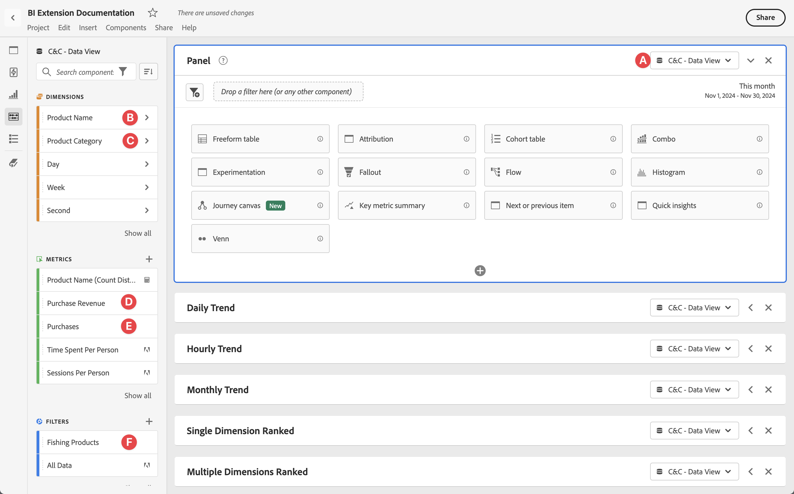

当您完成使用案例时，请将这些示例对象替换为适合您特定环境的对象。

+++

+++ BI 工具

>[!BEGINTABS]

>[!TAB Power BI桌面]

1. 从Experience Platform查询服务UI访问所需的凭据和参数。

   1. 导航到您的Experience Platform沙盒。
   1. 从左边栏中选择 **[!UICONTROL 查询]**。
   1. 在&#x200B;**[!UICONTROL 查询]**&#x200B;界面中选择&#x200B;**[!UICONTROL 凭据]**&#x200B;选项卡。
   1. 从&#x200B;**[!UICONTROL 数据库]**&#x200B;下拉菜单中选择`prod:cja`。

      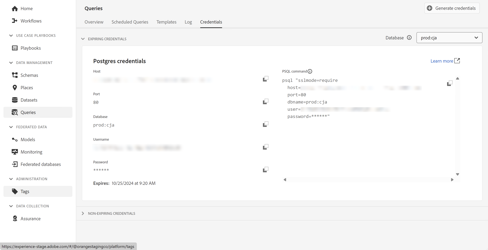

1. 启动Power BI Desktop。
   1. 从主界面中选择&#x200B;**[!UICONTROL 从其他源获取数据]**。
   1. 在&#x200B;**[!UICONTROL 获取数据]**&#x200B;对话框中：
      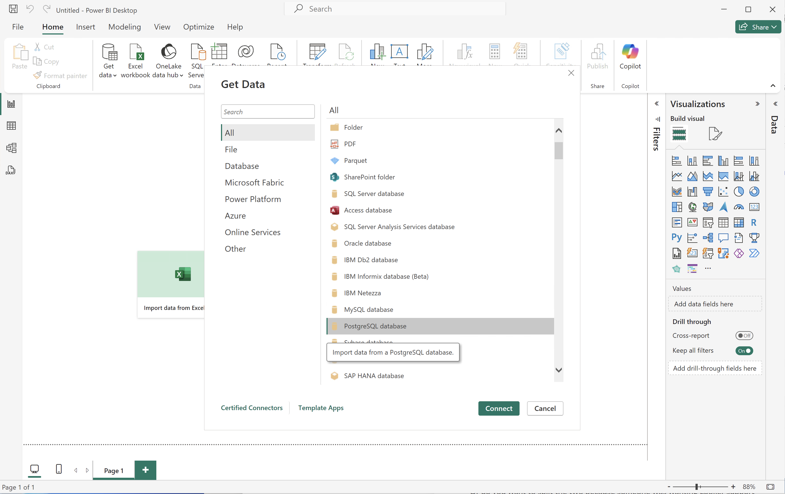
      1. 搜索并选择&#x200B;**[!UICONTROL PostgreSQL数据库]**。
      1. 选择&#x200B;**[!UICONTROL 连接]**。
   1. 在&#x200B;**[!UICONTROL PostgreSQL数据库]**&#x200B;对话框中：
      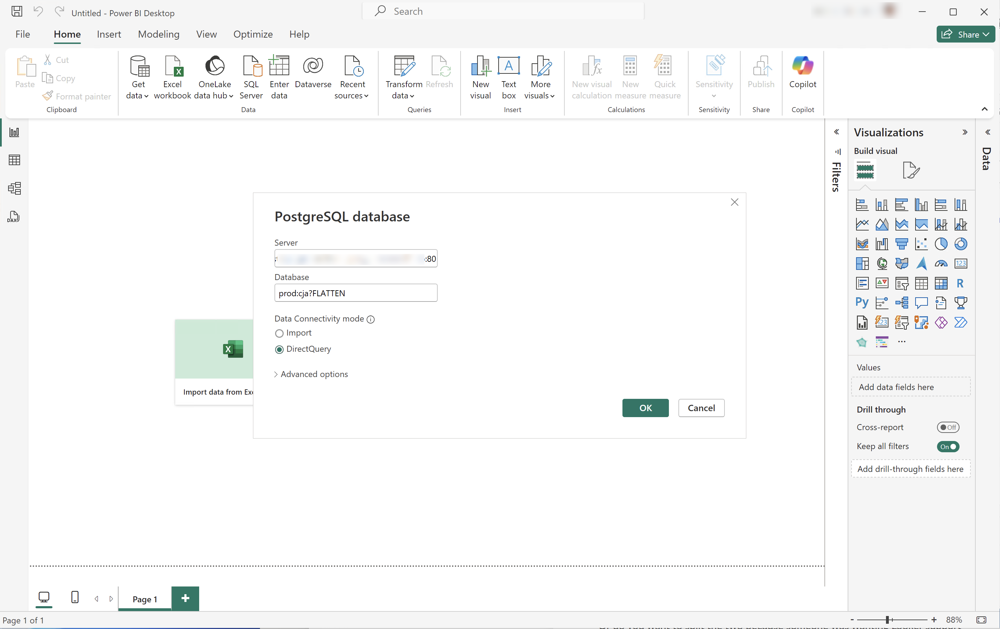
      1. 使用从Experience Platform **[!UICONTROL 查询]** **[!UICONTROL 过期凭据]**&#x200B;面板中复制并粘贴&#x200B;**[!UICONTROL 主机]**&#x200B;和&#x200B;**[!UICONTROL 端口]**&#x200B;值，以`:`分隔，作为&#x200B;**[!UICONTROL 服务器]**&#x200B;的值。 例如：`examplecompany.platform-query.adobe.io:80`。
      1. 使用从Experience Platform **[!UICONTROL 查询]** **[!UICONTROL 过期凭据]**&#x200B;面板复制并粘贴&#x200B;**[!UICONTROL 数据库]**&#x200B;值。 将`?FLATTEN`添加到您粘贴的值。 例如，`prod:cja?FLATTEN`。
      1. 选择&#x200B;**[!UICONTROL DirectQuery]**&#x200B;作为&#x200B;**[!UICONTROL 数据连接模式]**。
      1. 选择&#x200B;**[!UICONTROL 确定]**。
   1. 在&#x200B;**[!UICONTROL PostgreSQL数据库]** - **[!UICONTROL 数据库]**&#x200B;对话框中：
      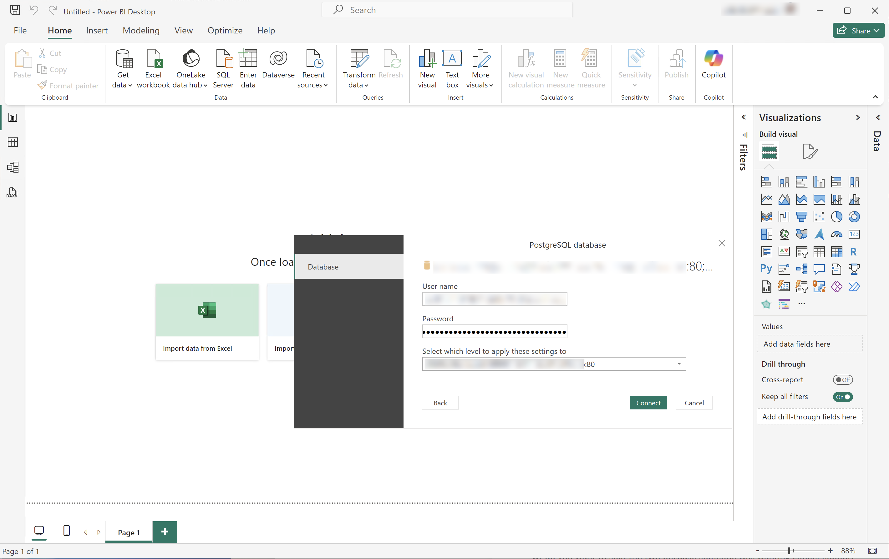
      1. 使用从&#x200B;**[!UICONTROL 用户名]**&#x200B;和&#x200B;**[!UICONTROL 密码]**&#x200B;字段中的Experience Platform **[!UICONTROL 查询]** **[!UICONTROL 过期凭据]**&#x200B;面板中复制&#x200B;**[!UICONTROL 用户名]**&#x200B;和&#x200B;**[!UICONTROL 密码]**&#x200B;值。 如果您使用的是[不会过期的凭据](https://experienceleague.adobe.com/zh-hans/docs/experience-platform/query/ui/credentials?lang=en#use-credential-to-connect)，请使用不会过期的凭据的密码。
      1. 确保&#x200B;**[!UICONTROL 选择要将这些设置应用到]**&#x200B;的级别的下拉菜单设置为您之前定义的&#x200B;**[!UICONTROL 服务器]**。
      1. 选择&#x200B;**[!UICONTROL 连接]**。
   1. 在&#x200B;**[!UICONTROL 导航器]**&#x200B;对话框中，将检索数据视图。 此检索可能需要一些时间。 检索后，您将在Power BI Desktop中看到以下内容。
      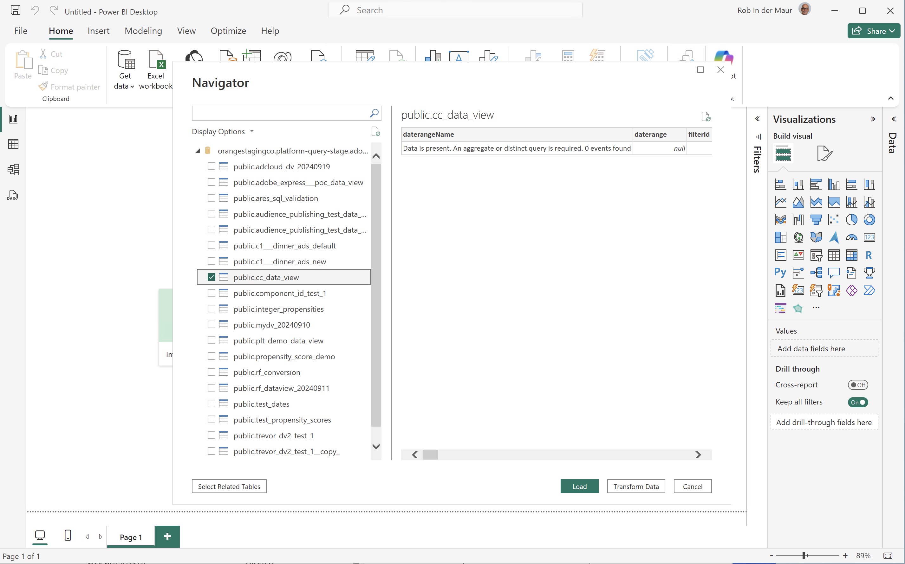
      1. 从左侧面板的列表中选择&#x200B;**[!UICONTROL public.cc_data_view]**。
      1. 您有两个选项：
         1. 选择&#x200B;**[!UICONTROL 加载]**&#x200B;以继续并完成安装。
         1. 选择&#x200B;**[!UICONTROL 转换数据]**。 您会看到一个对话框，可以在其中选择将转换作为配置的一部分应用。
            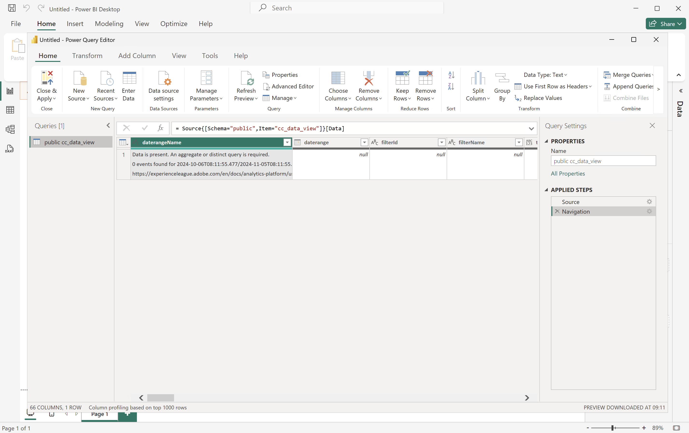
            * 选择&#x200B;**[!UICONTROL 关闭并应用]**。
   1. 一段时间后，**[!UICONTROL public.cc_data_view]**&#x200B;显示在&#x200B;**[!UICONTROL 数据]**&#x200B;窗格中。 选择以显示维度和量度。
      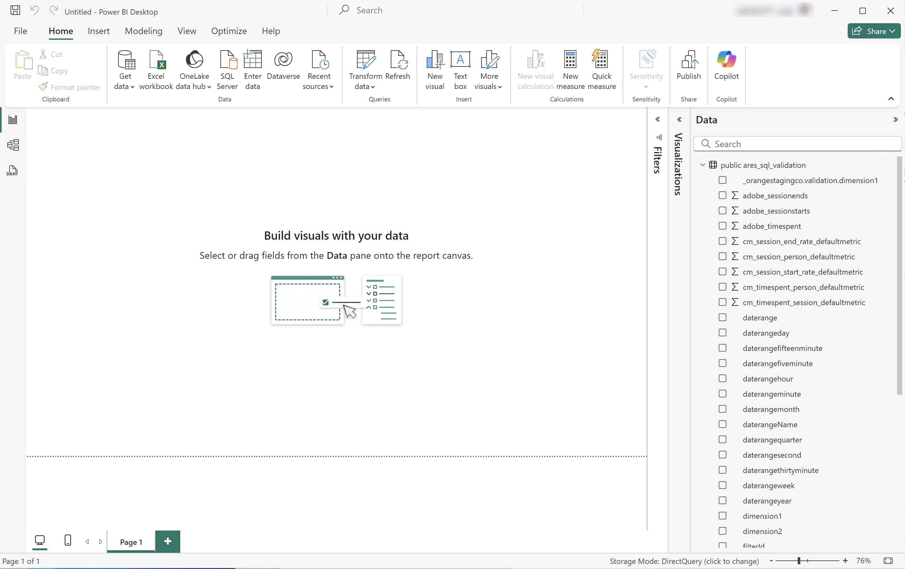


## 是否扁平化

Power BI Desktop支持`FLATTEN`参数的以下方案。 有关详细信息，请参阅[拼合嵌套数据](https://experienceleague.adobe.com/zh-hans/docs/experience-platform/query/key-concepts/flatten-nested-data)。

| FLATTEN参数 | 示例 | 受支持 | 备注 |
|---|---|:---:|---|
| 无 | `prod:cja` |  | |
| `?FLATTEN` | `prod:cja?FLATTEN` |  | **推荐使用的选项！** |
| `%3FFLATTEN` | `prod:cja%3FFLATTEN` |  | Power BI桌面显示错误： **[!UICONTROL 无法使用提供的凭据进行身份验证。 请重试。]** |

### 更多信息

* [先决条件](/help/data-views/bi-extension.md#prerequisites)
* [凭据指南](https://experienceleague.adobe.com/zh-hans/docs/experience-platform/query/ui/credentials)
* [将Power BI连接到查询服务](https://experienceleague.adobe.com/zh-hans/docs/experience-platform/query/clients/power-bi)。


>[!TAB Tableau桌面]

1. 从Experience Platform查询服务UI访问所需的凭据和参数。

   1. 导航到您的Experience Platform沙盒。
   1. 从左边栏中选择 **[!UICONTROL 查询]**。
   1. 在&#x200B;**[!UICONTROL 查询]**&#x200B;界面中选择&#x200B;**[!UICONTROL 凭据]**&#x200B;选项卡。
   1. 从&#x200B;**[!UICONTROL 数据库]**&#x200B;下拉菜单中选择`prod:cja`。

      

1. 启动“表格”。
   1. 从&#x200B;**[!UICONTROL To a Server]**&#x200B;下的左边栏中选择&#x200B;**[!UICONTROL PostgreSQL]**。 如果不可用，请选择&#x200B;**[!UICONTROL 更多……]**，然后从&#x200B;**[!UICONTROL 安装的连接器]**&#x200B;中选择&#x200B;**[!UICONTROL PostgreSQL]**。
      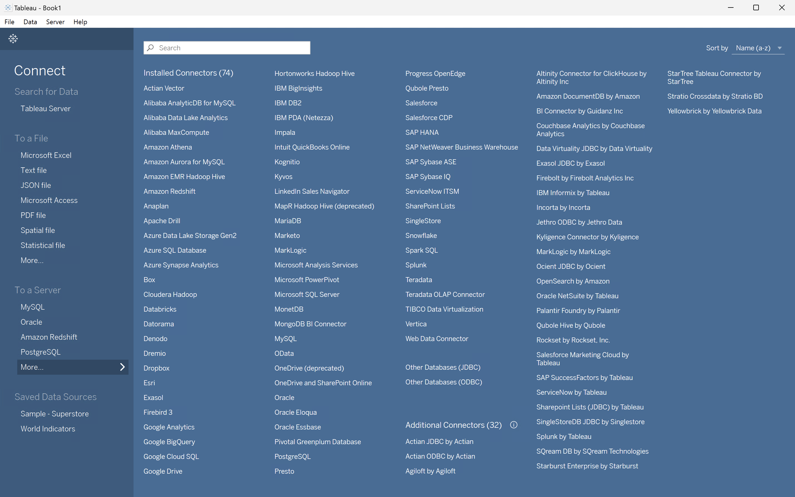
   1. 在&#x200B;**[!UICONTROL PostgreSQL]**&#x200B;对话框的&#x200B;**[!UICONTROL 常规]**&#x200B;选项卡中：
      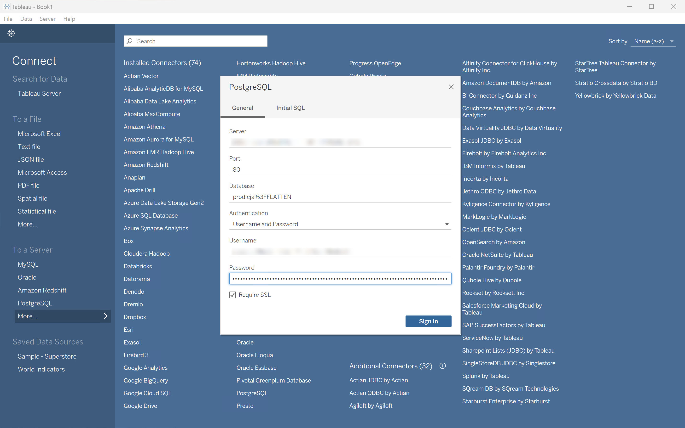
      1. 使用将&#x200B;**[!UICONTROL 主机]**&#x200B;从Experience Platform **[!UICONTROL 查询]** **[!UICONTROL 过期凭据]**&#x200B;面板复制并粘贴到&#x200B;**[!UICONTROL 服务器]**。
      1. 使用将&#x200B;**[!UICONTROL 端口]**&#x200B;从Experience Platform **[!UICONTROL 查询]** **[!UICONTROL 过期凭据]**&#x200B;面板复制并粘贴到&#x200B;**[!UICONTROL 端口]**。
      1. 使用将&#x200B;**[!UICONTROL 数据库]**&#x200B;从Experience Platform **[!UICONTROL 查询]** **[!UICONTROL 过期凭据]**&#x200B;面板复制并粘贴到&#x200B;**[!UICONTROL 数据库]**。 将`%3FFLATTEN`添加到您粘贴的值。 例如：`prod:cja%3FFLATTEN`。
      1. 从&#x200B;**[!UICONTROL 身份验证]**&#x200B;下拉菜单中选择&#x200B;**[!UICONTROL 用户名和密码]**。
      1. 使用将&#x200B;**[!UICONTROL 用户名]**&#x200B;从Experience Platform **[!UICONTROL 查询]** **[!UICONTROL 过期凭据]**&#x200B;面板复制并粘贴到&#x200B;**[!UICONTROL 用户名]**。
      1. 使用将&#x200B;**[!UICONTROL 密码]**&#x200B;从Experience Platform **[!UICONTROL 查询]** **[!UICONTROL 过期凭据]**&#x200B;面板复制并粘贴到&#x200B;**[!UICONTROL 密码]**。 如果您使用的是[不会过期的凭据](https://experienceleague.adobe.com/zh-hans/docs/experience-platform/query/ui/credentials?lang=en#use-credential-to-connect)，请使用不会过期的凭据的密码。
      1. 确保已选中&#x200B;**[!UICONTROL Require SSL]**。
      1. 选择&#x200B;**[!UICONTROL 登录]**。

      在Tableau Desktop验证连接时，您会看到&#x200B;**[!UICONTROL 处理请求]**&#x200B;对话框。
   1. 在主窗口中，您会在左窗格的&#x200B;**[!UICONTROL Data Source]**&#x200B;页面中看到：
      * **[!UICONTROL 连接]**&#x200B;下的连接名称。
      * **[!UICONTROL 数据库]**&#x200B;下的数据库名称。
      * **[!UICONTROL 表]**&#x200B;下的表列表。
        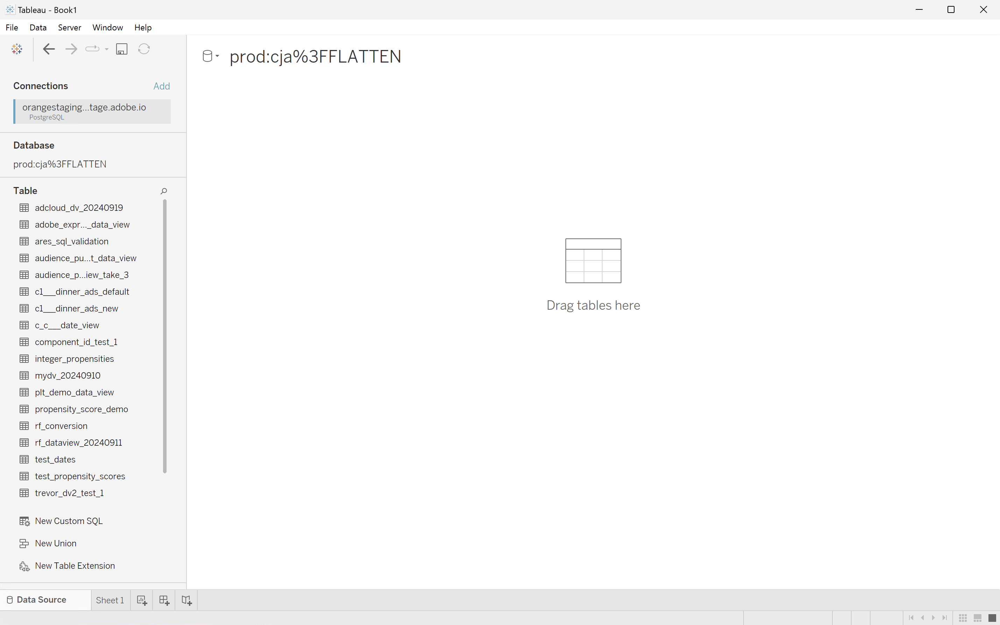
      1. 将&#x200B;**[!UICONTROL cc_data_view]**&#x200B;条目拖放到显示&#x200B;**[!UICONTROL 将表]**&#x200B;拖放到此处的主视图中。
   1. 主窗口显示&#x200B;**[!UICONTROL cc_data_view]**&#x200B;数据视图的详细信息。
      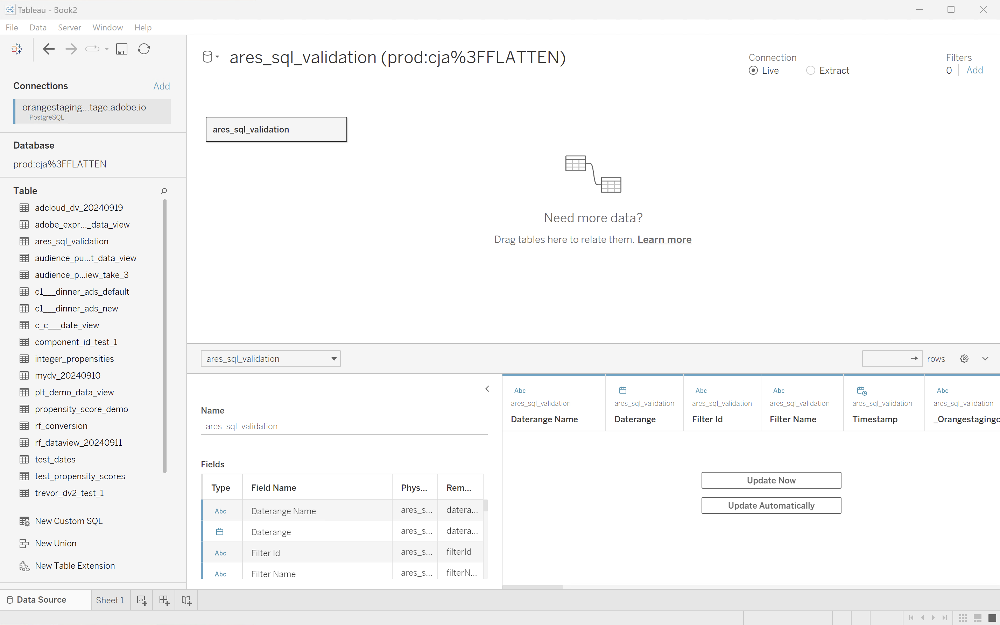

## 是否扁平化

Tableau Desktop支持`FLATTEN`参数的以下方案。 有关详细信息，请参阅[拼合嵌套数据](https://experienceleague.adobe.com/zh-hans/docs/experience-platform/query/key-concepts/flatten-nested-data)。

| FLATTEN参数 | 示例 | 受支持 | 备注 |
|---|---|:---:|---|
| 无 | `prod:cja` |  | |
| `?FLATTEN` | `prod:cja?FLATTEN` |  | |
| `%3FFLATTEN` | `prod:cja%3FFLATTEN` |  | **推荐使用的选项**。 请注意，`%3FFLATTEN`是`?FLATTEN`的URL编码版本。 |

## 更多信息

* [先决条件](/help/data-views/bi-extension.md#prerequisites)
* [凭据指南](https://experienceleague.adobe.com/zh-hans/docs/experience-platform/query/ui/credentials)
* [将Tableau桌面连接到查询服务](https://experienceleague.adobe.com/zh-hans/docs/experience-platform/query/clients/tableau)。


>[!TAB Looker]

1. 从Experience Platform查询服务UI访问所需的凭据和参数。

   1. 导航到您的Experience Platform沙盒。
   1. 从左边栏中选择 **[!UICONTROL 查询]**。
   1. 在&#x200B;**[!UICONTROL 查询]**&#x200B;界面中选择&#x200B;**[!UICONTROL 凭据]**&#x200B;选项卡。
   1. 从&#x200B;**[!UICONTROL 数据库]**&#x200B;下拉菜单中选择`prod:cja`。

      

1. 登录到Looker

   1. 从左侧边栏中选择&#x200B;**[!UICONTROL 管理员]**。
   1. 选择&#x200B;**[!UICONTROL 连接]**。
   1. 选择&#x200B;**[!UICONTROL 添加连接]**。
   1. 在&#x200B;**[!UICONTROL 将数据库连接到Looker屏幕]**&#x200B;中。

      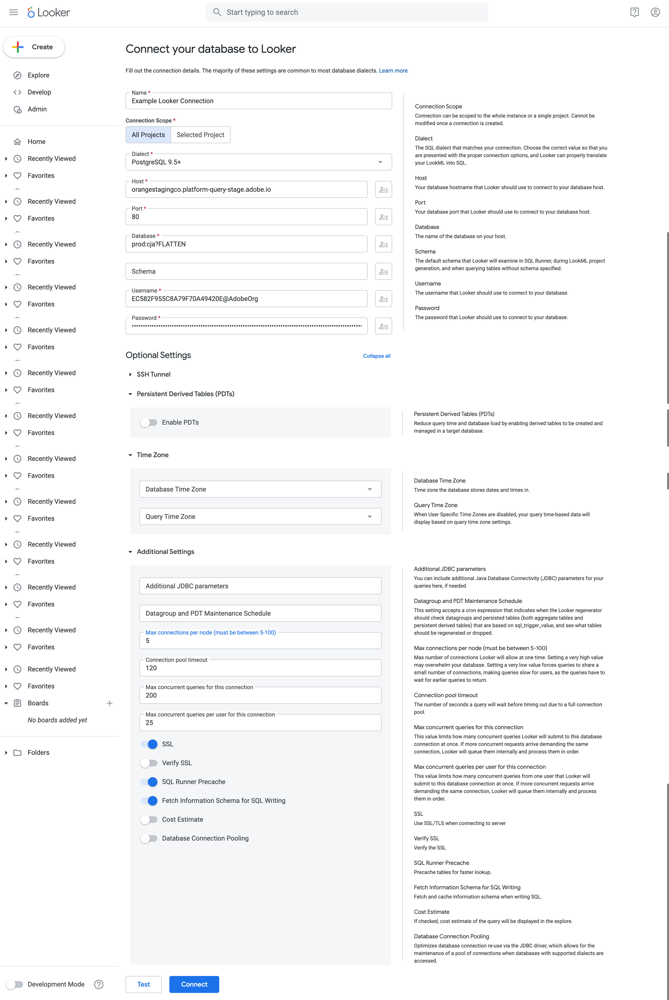

      1. 为您的连接输入&#x200B;**[!UICONTROL Name]**，例如`Example Looker Connection`。
      1. 确保选择&#x200B;**[!UICONTROL 所有项目]**&#x200B;作为&#x200B;**[!UICONTROL 连接作用域]**。
      1. 选择&#x200B;**[!UICONTROL PostgreSQL 9.5+]**&#x200B;作为方言。
      1. 使用从Experience Platform **[!UICONTROL 查询]** **[!UICONTROL 过期凭据]**&#x200B;面板复制并粘贴&#x200B;**[!UICONTROL 主机]**&#x200B;值作为&#x200B;**[!UICONTROL 主机]**&#x200B;的值。 例如：`examplecompany.platform-query.adobe.io`。
      1. 使用从Experience Platform **[!UICONTROL 查询]** **[!UICONTROL 过期凭据]**&#x200B;面板中复制并粘贴&#x200B;**[!UICONTROL 端口]**&#x200B;值作为&#x200B;**[!UICONTROL 端口]**&#x200B;的值。 例如：`80`。
      1. 使用从Experience Platform **[!UICONTROL 查询]** **[!UICONTROL 过期凭据]**&#x200B;面板中复制并粘贴&#x200B;**[!UICONTROL 数据库]**&#x200B;值作为&#x200B;**[!UICONTROL 数据库]**&#x200B;的值。 将`%3FFLATTEN`添加到您粘贴的值。 例如，`prod:cja%3FFLATTEN`。
      1. 使用从Experience Platform **[!UICONTROL 查询]** **[!UICONTROL 过期凭据]**&#x200B;面板中复制并粘贴&#x200B;**[!UICONTROL 用户名]**&#x200B;值作为&#x200B;**[!UICONTROL 用户名]**&#x200B;的值。
      1. 使用从Experience Platform **[!UICONTROL 查询]** **[!UICONTROL 过期凭据]**&#x200B;面板中复制并粘贴&#x200B;**[!UICONTROL 密码]**&#x200B;值作为&#x200B;**[!UICONTROL 密码]**&#x200B;的值。
      1. 选择&#x200B;**[!UICONTROL 在**&#x200B;[!UICONTROL &#x200B;可选设置&#x200B;]&#x200B;**处展开全部]**。
      1. 将每个节点的最大连接数&#x200B;**[!UICONTROL 设置为`5`。]**
      1. 确保启用&#x200B;**[!UICONTROL SSL]**。
      1. 选择&#x200B;**[!UICONTROL 测试]**&#x200B;以测试连接。 您应该会看到屏幕顶部出现一个横幅，其中显示一条消息，如&#x200B;**[!UICONTROL Success， can connect JDBC ....]**。
      1. 选择&#x200B;**[!UICONTROL 连接]**&#x200B;以建立和保存连接。
   1. 您可以在&#x200B;**[!UICONTROL 连接]**&#x200B;界面中看到新连接。
   1. 从&#x200B;**[!UICONTROL 管理员]**&#x200B;中选择&#x200B;**←**&#x200B;以转到左边栏中的主导航。
   1. 选择&#x200B;**[!UICONTROL 开发]**。
   1. 选择&#x200B;**[!UICONTROL 项目]**。
   1. 在LookML项目中选择&#x200B;**[!UICONTROL 新建模型]**。
   1. 以确保不会影响其他用户。 出现提示时，选择Enter Development Mode。
   1. 在&#x200B;**[!UICONTROL 创建模型]**&#x200B;体验中：
      1. 在&#x200B;**[!UICONTROL ➊中，选择数据库连接]**：
         1. 在&#x200B;**[!UICONTROL 选择数据库连接]**&#x200B;中选择数据库连接。 例如：**[!UICONTROL example_looker_connection]**。
         1. 在&#x200B;**[!UICONTROL 中命名您的项目创建此模型的新LookML项目]**。 针对`example: example_looker_project`。
         1. 选择&#x200B;**[!UICONTROL 下一步]**。
      1. 在&#x200B;**[!UICONTROL ➋中，选择表]**：
         1. 选择&#x200B;**[!UICONTROL public]**，然后确保已选择您的Customer Journey Analytics数据视图。 例如：  **[!UICONTROL cc_data_view]**。
         1. 选择&#x200B;**[!UICONTROL 下一步]**。
      1. 在&#x200B;**[!UICONTROL ➌中，选择主键]**：
         1. 选择&#x200B;**[!UICONTROL 下一步]**。
      1. 在&#x200B;**[!UICONTROL ➍中，选择要创建的探索]**：
         1. 确保选择您的视图。 例如：**[!UICONTROL cc_data_view.view]**。
         1. 选择&#x200B;**[!UICONTROL 下一步]**。
      1. 在&#x200B;**[!UICONTROL ➎中，输入模型名称]**：
         1. 命名您的模型。 例如：`example_looker_model`。
      1. 选择&#x200B;**[!UICONTROL 完成并浏览数据]**。

   您将被重定向到Looker的&#x200B;**[!UICONTROL 浏览]**&#x200B;界面，准备浏览数据。


## 是否扁平化

Looker支持`FLATTEN`参数的以下方案。 有关详细信息，请参阅[拼合嵌套数据](https://experienceleague.adobe.com/zh-hans/docs/experience-platform/query/key-concepts/flatten-nested-data)。

| FLATTEN参数 | 示例 | 受支持 | 备注 |
|---|---|:---:|---|
| 无 | `prod:cja` |  | |
| `?FLATTEN` | `prod:cja?FLATTEN` |  | |
| `%3FFLATTEN` | `prod:cja%3FFLATTEN` |  | **推荐使用的选项**。 请注意，`%3FFLATTEN`是`?FLATTEN`的URL编码版本。 |

## 更多信息

* [先决条件](/help/data-views/bi-extension.md#prerequisites)
* [凭据指南](https://experienceleague.adobe.com/zh-hans/docs/experience-platform/query/ui/credentials)


>[!TAB Jupyter笔记本]

1. 从Experience Platform查询服务UI访问所需的凭据和参数。

   1. 导航到您的Experience Platform沙盒。
   1. 从左边栏中选择 **[!UICONTROL 查询]**。
   1. 在&#x200B;**[!UICONTROL 查询]**&#x200B;界面中选择&#x200B;**[!UICONTROL 凭据]**&#x200B;选项卡。
   1. 从&#x200B;**[!UICONTROL 数据库]**&#x200B;下拉菜单中选择`prod:cja`。

      

1. 确保已设置专用Python虚拟环境来运行Jupyter Notebook环境。
1. 确保在虚拟环境中安装了所需的库：
   * ipython-sql： `pip install ipython-sql`。
   * psycopg2-binary： `pip install psycopg-binary`。
   * sqlalchemy： pip `install sqlalchemy`。

1. 从您的虚拟环境中启动Jupyter Notebook： `jupyter notebook`。
1. 创建新笔记本，或下载[此示例笔记本](../assets/BI-Extension.ipynb.zip)。
1. 在第一个单元格中，输入并执行：

   ```
   %config SqlMagic.style = '_DEPRECATED_DEFAULT'
   ```

1. 在新单元格中输入连接的配置参数。 使用将Experience Platform **[!UICONTROL 查询]** **[!UICONTROL 过期凭据]**&#x200B;面板中的值复制并粘贴到配置参数所需的值。 例如：

   ```
   import ipywidgets as widgets
   from IPython.display import display
   
   config_host = widgets.Text(description='Host:', value='example.platform-query-stage.adobe.io',
                           layout=widgets.Layout(width="600px"))
   display(config_host)
   config_port = widgets.IntText(description='Port:', value=80,
                              layout=widgets.Layout(width="200px"))
   display(config_port)
   config_db = widgets.Text(description='Database:', value='prod:cja',
                         layout=widgets.Layout(width="300px"))
   display(config_db)
   config_username = widgets.Text(description='Username:', value='EC582F955C8A79F70A49420E@AdobeOrg',
                               layout=widgets.Layout(width="600px"))
   display(config_username)
   config_password = widgets.Password(description='Password:', value='***',
                                   layout=widgets.Layout(width="600px"))
   display(config_password)
   ```

1. 执行单元格。
1. 使用将密码从Experience Platform **[!UICONTROL 查询]** **[!UICONTROL 过期凭据]**&#x200B;面板复制并粘贴到Jupyter Notebook中的&#x200B;**[!UICONTROL 密码]**&#x200B;字段。

   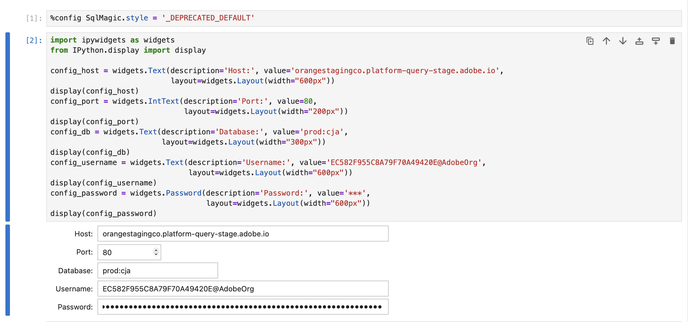

1. 在新单元格中，输入要加载SQL扩展和所需库的语句，并与Customer Journey Analytics连接。

   ```python
   %load_ext sql
   from sqlalchemy import create_engine
   %sql postgresql://{config_username.value}:{config_password.value}@{config_host.value}:{config_port.value}/{config_db.value}?sslmode=require
   ```

   执行shell。 您应该不会看到任何输出，但单元格应在没有任何警告的情况下执行。

   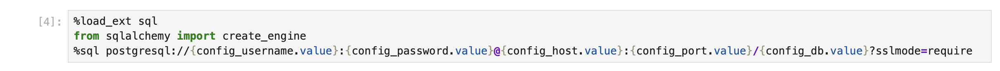

1. 在新调用中，输入语句以根据连接获取可用数据视图的列表。

   ```python
   %%sql
   SELECT n.nspname as "Schema",
      c.relname as "Name",
      CASE c.relkind WHEN 'r' THEN 'table' WHEN 'v' THEN 'view' WHEN 'm' THEN 'materialized view' WHEN 'i' THEN 'index' WHEN 'S' THEN 'sequence' WHEN 's' THEN 'special' WHEN 't' THEN 'TOAST table' WHEN 'f' THEN 'foreign table' WHEN 'p' THEN 'partitioned table' WHEN 'I' THEN 'partitioned index' END as "Type",
      pg_catalog.pg_get_userbyid(c.relowner) as "Owner"
   FROM pg_catalog.pg_class c
   LEFT JOIN pg_catalog.pg_namespace n ON n.oid = c.relnamespace
   WHERE c.relkind IN ('v','')
      AND n.nspname <> 'pg_catalog'
      AND n.nspname !~ '^pg_toast'
      AND n.nspname <> 'information_schema'
      AND pg_catalog.pg_table_is_visible(c.oid)
      AND c.relname NOT LIKE '%test%'
      AND c.relname NOT LIKE '%ajo%'
   ORDER BY 1,2;
   ```

   执行shell。 您应该会在下面的屏幕快照中看到输出模拟。

   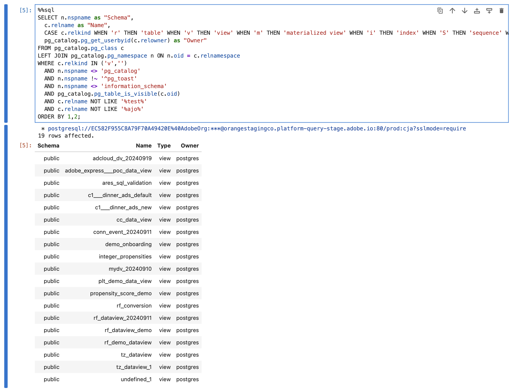

   您应该会在数据视图列表中看到&#x200B;**[!UICONTROL cc_data_view]**。

## 是否扁平化

Jupyter Notebook支持`FLATTEN`参数的以下方案。 有关详细信息，请参阅[拼合嵌套数据](https://experienceleague.adobe.com/zh-hans/docs/experience-platform/query/key-concepts/flatten-nested-data)。

| FLATTEN参数 | 示例 | 受支持 | 备注 |
|---|---|:---:|---|
| 无 | `prod:cja` |  | |
| `?FLATTEN` | `prod:cja?FLATTEN` |  | |
| `%3FFLATTEN` | `prod:cja%3FFLATTEN` |  | **推荐使用的选项**。 请注意，`%3FFLATTEN`是`?FLATTEN`的URL编码版本。 |

## 更多信息

* [先决条件](/help/data-views/bi-extension.md#prerequisites)
* [凭据指南](https://experienceleague.adobe.com/zh-hans/docs/experience-platform/query/ui/credentials)

>[!TAB RStudio]

1. 从Experience Platform查询服务UI访问所需的凭据和参数。

   1. 导航到您的Experience Platform沙盒。
   1. 从左边栏中选择 **[!UICONTROL 查询]**。
   1. 在&#x200B;**[!UICONTROL 查询]**&#x200B;界面中选择&#x200B;**[!UICONTROL 凭据]**&#x200B;选项卡。
   1. 从&#x200B;**[!UICONTROL 数据库]**&#x200B;下拉菜单中选择`prod:cja`。

      

1. 启动RStudio。
1. 创建新的R Markdown文件，或下载[此示例R Markdown文件](../assets/BI-Extension.Rmd.zip)。
1. 在第一个块中，输入以下介于` ` ``{r} `和` `` ` `之间的语句。 使用将Experience Platform **[!UICONTROL 查询]** **[!UICONTROL 过期凭据]**&#x200B;面板中的值复制并粘贴到各种参数（如`host`、`dbname`和`user`）所需的值。 例如：

   ```R
   library(rstudioapi)
   library(DBI)
   library(dplyr)
   library(tidyr)
   library(RPostgres)
   library(ggplot2)
   
   host <- rstudioapi::showPrompt(title = "Host", message = "Host", default = "orangestagingco.platform-query-stage.adobe.io")
   dbname <- rstudioapi::showPrompt(title = "Database", message = "Database", default = "prod:cja?FLATTEN")
   user <- rstudioapi::showPrompt(title = "Username", message = "Username", default = "EC582F955C8A79F70A49420E@AdobeOrg")
   password <- rstudioapi::askForPassword(prompt = "Password")
   ```

1. 运行块。 系统会提示您输入&#x200B;**[!UICONTROL 主机]**、**[!UICONTROL 数据库]**&#x200B;和&#x200B;**[!UICONTROL 用户]**。 只需接受您在上一步中提供的值即可。
1. 使用将密码从Experience Platform **[!UICONTROL 查询]** **[!UICONTROL 过期凭据]**&#x200B;面板复制并粘贴到RStudio中的&#x200B;**[!UICONTROL 密码]**&#x200B;对话框提示符。

   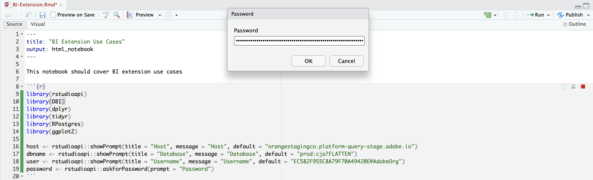

1. 创建一个新块并输入以下介于` ` `` {r} `和` `` ` `之间的语句。

   ```R
   con <- dbConnect(
      RPostgres::Postgres(),
      host = host,
      port = 80,
      dbname = dbname,
      user = user,
      password = password,
      sslmode = 'require'
   )
   ```

1. 运行块。 如果连接成功，您应该不会看到任何输出。


1. 创建一个新块并输入以下介于` ` `` {r} `和` `` ` `之间的语句。

   ```R
   views <- dbListTables(con)
   print(views)
   ```

1. 运行块。 您应该看到`character(0)`作为唯一输出。


1. 创建一个新块并输入以下介于` ` `` {r} `和` `` ` `之间的语句。

   ```R
   glimpse(dv)
   ```

1. 运行块。 您应该会在下面的屏幕快照中看到输出模拟。

   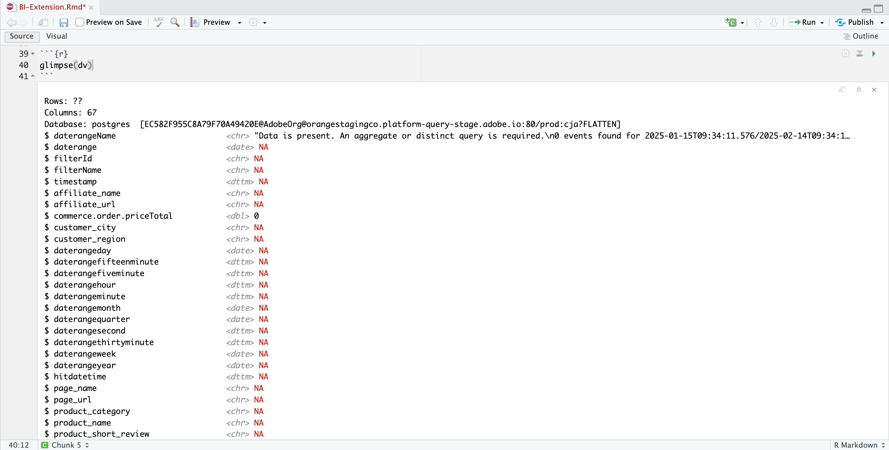

## 是否扁平化

RStudio支持`FLATTEN`参数的以下方案。 有关详细信息，请参阅[拼合嵌套数据](https://experienceleague.adobe.com/zh-hans/docs/experience-platform/query/key-concepts/flatten-nested-data)。

| FLATTEN参数 | 示例 | 受支持 | 备注 |
|---|---|:---:|---|
| 无 | `prod:cja` |  | |
| `?FLATTEN` | `prod:cja?FLATTEN` |  | **推荐使用的选项**。 |
| `%3FFLATTEN` | `prod:cja%3FFLATTEN` |  | |

## 更多信息

* [先决条件](/help/data-views/bi-extension.md#prerequisites)
* [凭据指南](https://experienceleague.adobe.com/zh-hans/docs/experience-platform/query/ui/credentials)

>[!ENDTABS]

+++
