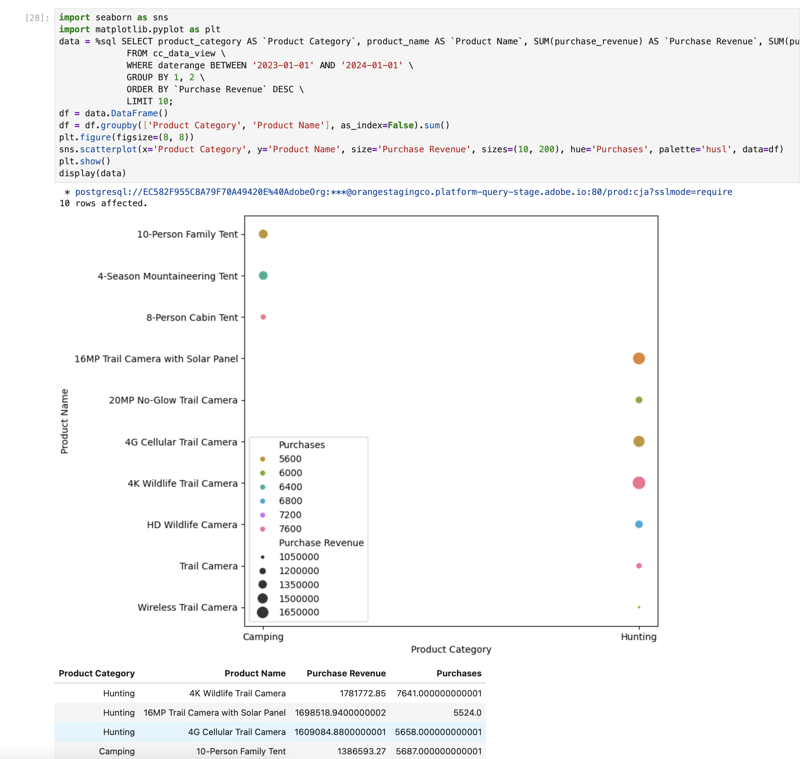

# 多个维度排名


在此使用案例中，您希望显示一个表，其中划分2023年产品类别中产品名称的购买收入和购买。 此外，您还希望使用一些可视化图表来说明每个产品类别中的产品类别分布和产品名称贡献。

+++ Customer Journey Analytics

用例的&#x200B;**[!UICONTROL 多个Dimension排名]**&#x200B;面板示例：


+++

+++ BI 工具

>[!PREREQUISITES]
>
>请确保已验证[连接是否成功，可以列出数据视图，并为要为其尝试此用例的BI工具使用数据视图](connect-and-validate.md)。
>

>[!BEGINTABS]

>[!TAB Power BI桌面]

1. 若要确保日期范围适用于所有可视化图表，请将&#x200B;**[!UICONTROL daterangeday]**&#x200B;从&#x200B;**[!UICONTROL 数据]**&#x200B;窗格拖放到此页上的&#x200B;**[!UICONTROL 筛选器]**。
   1. 从该页面上的&#x200B;**[!UICONTROL 筛选器中选择]** daterangeday is (All)**&#x200B;**。
   1. 选择&#x200B;**[!UICONTROL 相对日期]**&#x200B;作为&#x200B;**[!UICONTROL 筛选器类型]**。
   1. 将筛选器定义为&#x200B;**[!UICONTROL 当值]** **[!UICONTROL 在最后]** `1` **[!UICONTROL 日历年]**&#x200B;内时显示项。
   1. 选择&#x200B;**[!UICONTROL 应用筛选器]**。

1. 在&#x200B;**[!UICONTROL 数据]**&#x200B;窗格中：
   1. 选择&#x200B;**[!UICONTROL datarangeday]**。
   1. 选择&#x200B;**[!UICONTROL 产品类别]**。
   1. 选择&#x200B;**[!UICONTROL 产品名称]**。
   1. 选择&#x200B;**[!UICONTROL sum purchase_revenue]**
   1. 选择&#x200B;**[!UICONTROL 购买总和]**

1. 若要将垂直条形图修改为表，请确保已选择表，并从&#x200B;**[!UICONTROL 可视化]**&#x200B;窗格中选择&#x200B;**[!UICONTROL 矩阵]**。
   * 从&#x200B;**[!UICONTROL 列]**&#x200B;中拖动&#x200B;**[!UICONTROL product_name]**，并将字段拖放到[!UICONTROL 可视化]窗格中的&#x200B;**[!UICONTROL 行]**&#x200B;中的&#x200B;**&#x200B;**&#x200B;[!UICONTROL product_categor]&#x200B;**&#x200B;**&#x200B;y下。

1. 要限制表中显示的产品数，请在&#x200B;**[!UICONTROL 筛选器]**&#x200B;窗格中选择&#x200B;**[!UICONTROL product_name is (All)]**。

   1. 选择&#x200B;**[!UICONTROL 高级筛选]**。
   1. 选择&#x200B;**[!UICONTROL 筛选器类型]** **[!UICONTROL 前N]** **[!UICONTROL 按值]**&#x200B;显示项&#x200B;**&#x200B;**&#x200B;前`15` **&#x200B;**。
   1. 从&#x200B;**[!UICONTROL 数据]**&#x200B;窗格将&#x200B;**[!UICONTROL 购买]**&#x200B;拖到&#x200B;**[!UICONTROL 在此添加数据字段]**&#x200B;上。
   1. 选择&#x200B;**[!UICONTROL 应用筛选器]**。

1. 为了提高可读性，请从顶部菜单中选择&#x200B;**[!UICONTROL 视图]**，然后选择&#x200B;**[!UICONTROL 页面视图]** > **[!UICONTROL 实际大小]**&#x200B;并调整表可视化图表的大小。

1. 要划分表中的每个类别，请在产品类别级别选择&#x200B;**[!UICONTROL +]**。 您的Power BI桌面应该如下所示。

   

1. 从顶部菜单中选择&#x200B;**[!UICONTROL 主页]**，然后选择&#x200B;**[!UICONTROL 新建视觉对象]**。 新视觉对象会添加到报表中。

1. 在&#x200B;**[!UICONTROL 数据]**&#x200B;窗格中：
   1. 选择&#x200B;**[!UICONTROL 产品类别]**。
   1. 选择&#x200B;**[!UICONTROL 产品名称]**。
   1. 选择&#x200B;**[!UICONTROL purchase_revenue]**。

1. 要修改可视化，请选择条形图，然后从&#x200B;**[!UICONTROL 可视化]**&#x200B;窗格中选择&#x200B;**[!UICONTROL 树状图]**。
1. 确保&#x200B;**[!UICONTROL product_category]**&#x200B;列在&#x200B;**[!UICONTROL Category]**&#x200B;下，并且&#x200B;**[!UICONTROL product_name]**&#x200B;列在&#x200B;**[!UICONTROL 可视化图表]**&#x200B;窗格的&#x200B;**[!UICONTROL 详细信息]**&#x200B;下。

   您的Power BI桌面应该如下所示。

   

1. 从顶部菜单中选择&#x200B;**[!UICONTROL 主页]**，然后选择&#x200B;**[!UICONTROL 新建视觉对象]**。 新视觉对象会添加到报表中。

1. 在&#x200B;**[!UICONTROL 数据]**&#x200B;窗格中：
   1. 选择&#x200B;**[!UICONTROL 产品类别]**。
   1. 选择&#x200B;**[!UICONTROL purchase_revenue]**。
   1. 选择&#x200B;**[!UICONTROL 购买]**。

1. 在&#x200B;**[!UICONTROL 可视化图表]**&#x200B;窗格中：
   1. 要修改可视化图表，请选择&#x200B;**[!UICONTROL 折线图和栈叠式柱状图]**。
   1. 将&#x200B;**[!UICONTROL sum_of_purchases]**&#x200B;从&#x200B;**[!UICONTROL 列Y轴]**&#x200B;拖动到&#x200B;**[!UICONTROL 行Y轴]**。

1. 在报表中，对各个可视化图表进行重新洗牌。

   您的Power BI桌面应该如下所示。

   


>[!TAB Tableau桌面]

1. 选择底部的&#x200B;**[!UICONTROL 表1]**&#x200B;选项卡以从&#x200B;**[!UICONTROL 数据源]**&#x200B;切换。 在&#x200B;**[!UICONTROL 表1]**&#x200B;视图中：
   1. 从&#x200B;**[!UICONTROL 数据]**&#x200B;窗格的&#x200B;**[!UICONTROL 表]**&#x200B;列表中拖动&#x200B;**[!UICONTROL 日期范围]**&#x200B;条目，并将该条目放到&#x200B;**[!UICONTROL 筛选器]**&#x200B;托架上。
   1. 在&#x200B;**[!UICONTROL 筛选器字段\[日期范围\]]**&#x200B;对话框中，选择&#x200B;**[!UICONTROL 日期范围]**&#x200B;并选择&#x200B;**[!UICONTROL 下一步>]**。
   1. 在&#x200B;**[!UICONTROL 筛选器\[日期范围\]]**&#x200B;对话框中，选择&#x200B;**[!UICONTROL 相对日期]**，选择&#x200B;**[!UICONTROL 年]**，然后指定&#x200B;**[!UICONTROL 上一年]**。 选择&#x200B;**[!UICONTROL 应用]**&#x200B;和&#x200B;**[!UICONTROL 确定]**。

      您的Tableau桌面应该如下所示。

      

   1. 将&#x200B;**[!UICONTROL 产品类别]**&#x200B;拖放到&#x200B;**[!UICONTROL 列]**&#x200B;旁边。
   1. 将&#x200B;**[!UICONTROL 购买收入]**&#x200B;拖放到&#x200B;**[!UICONTROL 行]**&#x200B;旁边。 值更改为&#x200B;**[!UICONTROL SUM（采购收入）]**。
   1. 将购买拖放到&#x200B;**[!UICONTROL 行]**&#x200B;旁边。 值更改为&#x200B;**[!UICONTROL SUM（购买）]**。
   1. 选择&#x200B;**[!UICONTROL SUM（购买）]**，然后从下拉菜单中选择&#x200B;**[!UICONTROL 双轴]**。
   1. 在&#x200B;**[!UICONTROL 标记]**&#x200B;中选择&#x200B;**[!UICONTROL SUM（购买）]**&#x200B;并从下拉菜单中选择&#x200B;**[!UICONTROL 行]**。
   1. 在&#x200B;**[!UICONTROL 标记]**&#x200B;中选择&#x200B;**[!UICONTROL SUM(Purchase Revenue)]**，然后从下拉菜单中选择&#x200B;**[!UICONTROL 栏]**。
   1. 从&#x200B;**[!UICONTROL 适合]**&#x200B;菜单中选择&#x200B;**[!UICONTROL 整个视图]**。
   1. 选择图表中的&#x200B;**[!UICONTROL 采购收入]**&#x200B;标题，并确保采购收入按升序排列。

      您的Tableau桌面应该如下所示。

      

1. 将当前&#x200B;**[!UICONTROL 工作表1]**&#x200B;重命名为`Category`。
1. 选择&#x200B;**[!UICONTROL 新建工作表]**&#x200B;以创建新工作表，并将其重命名为`Data`。

   1. 从&#x200B;**[!UICONTROL 数据]**&#x200B;窗格的&#x200B;**[!UICONTROL 表]**&#x200B;列表中拖动&#x200B;**[!UICONTROL 日期范围]**&#x200B;条目，并将该条目放到&#x200B;**[!UICONTROL 筛选器]**&#x200B;托架上。
   1. 在&#x200B;**[!UICONTROL 筛选器字段\[日期范围\]]**&#x200B;对话框中，选择&#x200B;**[!UICONTROL 日期范围]**&#x200B;并选择&#x200B;**[!UICONTROL 下一步>]**。
   1. 在&#x200B;**[!UICONTROL 筛选器\[日期范围\]]**&#x200B;对话框中，选择&#x200B;**[!UICONTROL 相对日期]**，选择&#x200B;**[!UICONTROL 年]**，然后指定&#x200B;**[!UICONTROL 上一年]**。 选择&#x200B;**[!UICONTROL 应用]**&#x200B;和&#x200B;**[!UICONTROL 确定]**。
   1. 将&#x200B;**[!UICONTROL Purchase Revenue]**&#x200B;从&#x200B;**[!UICONTROL 数据]**&#x200B;窗格拖至&#x200B;**[!UICONTROL 列]**。 值更改为&#x200B;**[!UICONTROL SUM（采购收入）]**。
   1. 将&#x200B;**[!UICONTROL Purchase]**&#x200B;从&#x200B;**[!UICONTROL 数据]**&#x200B;窗格拖动到&#x200B;**[!UICONTROL Purchase Revenue]**&#x200B;旁边的&#x200B;**[!UICONTROL 列]**。 值更改为&#x200B;**[!UICONTROL SUM（购买）]**。
   1. 将&#x200B;**[!UICONTROL 产品类别]**&#x200B;从&#x200B;**[!UICONTROL 数据]**&#x200B;窗格拖动到&#x200B;**[!UICONTROL 行]**。
   1. 将&#x200B;**[!UICONTROL 产品名称]**&#x200B;从&#x200B;**[!UICONTROL 数据]**&#x200B;窗格拖动到&#x200B;**[!UICONTROL 产品类别]**&#x200B;旁边的&#x200B;**[!UICONTROL 行]**。
   1. 若要将两个水平条更改为表，请从&#x200B;**[!UICONTROL 显示我]**&#x200B;中选择&#x200B;**[!UICONTROL 文本表]**。
   1. 要限制产品数，请在&#x200B;**[!UICONTROL 度量值]**&#x200B;中选择&#x200B;**[!UICONTROL 购买]**。 从下拉菜单中选择&#x200B;**[!UICONTROL 筛选器]**。
   1. 在&#x200B;**[!UICONTROL 筛选器\[购买\]]**&#x200B;对话框中，选择&#x200B;**[!UICONTROL 至少]**&#x200B;并输入`7000`。 选择&#x200B;**[!UICONTROL 应用]**&#x200B;和&#x200B;**[!UICONTROL 确定]**。
   1. 从&#x200B;**&#x200B;**&#x200B;适应下拉菜单中选择&#x200B;**[!UICONTROL 适应宽度]**。

      您的Tableau桌面应该如下所示。

      

1. 选择&#x200B;**[!UICONTROL 新建工作表]**&#x200B;以创建新工作表并将其重命名为&#x200B;**[!UICONTROL 树状图]**。
   1. 从&#x200B;**[!UICONTROL 数据]**&#x200B;窗格的&#x200B;**[!UICONTROL 表]**&#x200B;列表中拖动&#x200B;**[!UICONTROL 日期范围]**&#x200B;条目，并将该条目放到&#x200B;**[!UICONTROL 筛选器]**&#x200B;托架上。
   1. 在&#x200B;**[!UICONTROL 筛选器字段\[日期范围\]]**&#x200B;对话框中，选择&#x200B;**[!UICONTROL 日期范围]**&#x200B;并选择&#x200B;**[!UICONTROL 下一步>]**。
   1. 在&#x200B;**[!UICONTROL 筛选器\[日期范围\]]**&#x200B;对话框中，选择&#x200B;**[!UICONTROL 相对日期]**，选择&#x200B;**[!UICONTROL 年]**，然后指定&#x200B;**[!UICONTROL 上一年]**。 选择&#x200B;**[!UICONTROL 应用]**&#x200B;和&#x200B;**[!UICONTROL 确定]**。
   1. 将&#x200B;**[!UICONTROL Purchase Revenue]**&#x200B;从&#x200B;**[!UICONTROL 数据]**&#x200B;窗格拖至&#x200B;**[!UICONTROL 行]**。 值更改为&#x200B;**[!UICONTROL SUM（采购收入）]**。
   1. 将&#x200B;**[!UICONTROL Purchase]**&#x200B;从&#x200B;**[!UICONTROL 数据]**&#x200B;窗格拖动到&#x200B;**[!UICONTROL Purchase Revenue]**&#x200B;旁边的&#x200B;**[!UICONTROL 行]**。 值更改为&#x200B;**[!UICONTROL SUM（购买）]**。
   1. 将&#x200B;**[!UICONTROL 产品类别]**&#x200B;从&#x200B;**[!UICONTROL 数据]**&#x200B;窗格拖动到&#x200B;**[!UICONTROL 列]**。
   1. 将&#x200B;**[!UICONTROL 产品名称]**&#x200B;从&#x200B;**[!UICONTROL 数据]**&#x200B;窗格拖动到&#x200B;**[!UICONTROL 列]**。
   1. 若要将两个垂直条形图更改为树状图，请从&#x200B;**[!UICONTROL 显示我]**&#x200B;中选择&#x200B;**[!UICONTROL 树状图]**。
   1. 要限制产品数，请在&#x200B;**[!UICONTROL 度量值]**&#x200B;中选择&#x200B;**[!UICONTROL 购买]**。 从下拉菜单中选择&#x200B;**[!UICONTROL 筛选器]**。
   1. 在&#x200B;**[!UICONTROL 筛选器\[购买\]]**&#x200B;对话框中，选择&#x200B;**[!UICONTROL 至少]**&#x200B;并输入`7000`。 选择&#x200B;**[!UICONTROL 应用]**&#x200B;和&#x200B;**[!UICONTROL 确定]**。
   1. 从&#x200B;**[!UICONTROL 适合]**&#x200B;下拉菜单中选择&#x200B;**[!UICONTROL 适合宽度]**。

      您的Tableau桌面应该如下所示。

      

1. 选择&#x200B;**[!UICONTROL 新建仪表板]**&#x200B;选项卡按钮（位于底部）以创建新的&#x200B;**[!UICONTROL 仪表板1]**&#x200B;视图。 在&#x200B;**[!UICONTROL 功能板1]**&#x200B;视图中：
   1. 将&#x200B;**[!UICONTROL 类别]**&#x200B;工作表从&#x200B;**[!UICONTROL 工作表]**&#x200B;托架拖放到&#x200B;**[!UICONTROL 仪表板1]**&#x200B;视图中，该视图显示&#x200B;*在此放置工作表*。
   1. 将&#x200B;**[!UICONTROL 树状图]**&#x200B;工作表从&#x200B;**[!UICONTROL 工作表]**&#x200B;托架拖放到&#x200B;**[!UICONTROL 仪表板1]**&#x200B;视图的&#x200B;**[!UICONTROL 类别]**&#x200B;工作表下。
   1. 将&#x200B;**[!UICONTROL 数据]**&#x200B;工作表从&#x200B;**[!UICONTROL 工作表]**&#x200B;托架拖放到&#x200B;**[!UICONTROL 仪表板1]**&#x200B;视图的&#x200B;**[!UICONTROL 树状图]**&#x200B;工作表下。
   1. 调整视图中每个页面的大小。

   您的&#x200B;**[!UICONTROL 仪表板1]**&#x200B;视图应如下所示。

   


>[!TAB Looker]

1. 在Looker的&#x200B;**[!UICONTROL 浏览]**&#x200B;界面中，确保您拥有干净的设置。 如果不是，请选择 **[!UICONTROL 删除字段和筛选器]**。
1. 选择&#x200B;**[!UICONTROL 筛选器]**&#x200B;下的&#x200B;**[!UICONTROL +筛选器]**。
1. 在&#x200B;**[!UICONTROL 添加筛选器]**&#x200B;对话框中：
   1. 选择&#x200B;**[!UICONTROL ‣抄送数据视图]**
   1. 从字段列表中，选择&#x200B;**[!UICONTROL 日‣间范围日期]**，然后选择&#x200B;**[!UICONTROL 日期范围日期]**。
      
1. 指定&#x200B;**[!UICONTROL Cc数据视图日期范围日期]**&#x200B;筛选器，因为&#x200B;**[!UICONTROL 在]** **[!UICONTROL 2023/01/01]** **[!UICONTROL 之前]** **[!UICONTROL 2024/01/01]**&#x200B;的范围内。
1. 从左边栏中的&#x200B;**[!UICONTROL ‣ Cc数据视图]**&#x200B;部分：
   1. 选择&#x200B;**[!UICONTROL 产品类别]**。
   1. 选择&#x200B;**[!UICONTROL 产品名称]**。
1. 在左边栏的&#x200B;**[!UICONTROL ‣自定义字段]**&#x200B;部分中：
   1. 从&#x200B;**[!UICONTROL +添加]**&#x200B;下拉菜单中选择&#x200B;**[!UICONTROL 自定义度量值]**。
   1. 在&#x200B;**[!UICONTROL 创建自定义度量值]**&#x200B;对话框中：
      1. 从&#x200B;**[!UICONTROL 要度量]**&#x200B;的字段下拉菜单中选择&#x200B;**[!UICONTROL 购买收入]**。
      1. 从&#x200B;**[!UICONTROL 度量值类型]**&#x200B;下拉菜单中选择&#x200B;**[!UICONTROL Sum]**。
      1. 输入&#x200B;**[!UICONTROL 名称]**&#x200B;的自定义字段名称。 例如：`Sum of Purchase Revenue`。
      1. 选择&#x200B;**[!UICONTROL 字段详细信息]**&#x200B;选项卡。
      1. 从&#x200B;**[!UICONTROL 格式]**&#x200B;下拉菜单中选择&#x200B;**[!UICONTROL 小数]**，并确保以`0`小数&#x200B;**[!UICONTROL 输入]**。
         
      1. 选择&#x200B;**[!UICONTROL 保存]**。
   1. 从&#x200B;**[!UICONTROL +添加]**&#x200B;下拉菜单中选择&#x200B;**[!UICONTROL 自定义度量值]**。 在&#x200B;**[!UICONTROL 创建自定义]**&#x200B;度量值对话框中：
      1. 从&#x200B;**[!UICONTROL 要度量]**&#x200B;的字段下拉菜单中选择&#x200B;**[!UICONTROL 购买]**。
      1. 从&#x200B;**[!UICONTROL 度量值类型]**&#x200B;下拉菜单中选择&#x200B;**[!UICONTROL Sum]**。
      1. 输入&#x200B;**[!UICONTROL 名称]**&#x200B;的自定义字段名称。 例如：`Sum of Purchases`。
      1. 选择&#x200B;**[!UICONTROL 字段详细信息]**&#x200B;选项卡。
      1. 从&#x200B;**[!UICONTROL 格式]**&#x200B;下拉菜单中选择&#x200B;**[!UICONTROL 小数]**，并确保以`0`小数&#x200B;**[!UICONTROL 输入]**。
      1. 选择&#x200B;**[!UICONTROL 保存]**。
   1. 这两个字段都会自动添加到数据视图。
1. 在&#x200B;**[!UICONTROL 筛选器]**&#x200B;部分中，选择&#x200B;**[!UICONTROL +筛选器]**。 在&#x200B;**[!UICONTROL 添加筛选器]**&#x200B;对话框中。 选择&#x200B;**[!UICONTROL ‣自定义字段]**，然后选择&#x200B;**[!UICONTROL 购买收入]**。
1. 选择&#x200B;**[!UICONTROL is >]**&#x200B;并输入`800000`以限制结果。
1. 选择&#x200B;**[!UICONTROL 运行]**。
1. 选择‣**[!UICONTROL 可视化图表]**&#x200B;以显示折线图可视化图表。
1. 选择&#x200B;**[!UICONTROL 可视化图表]**&#x200B;中的&#x200B;**[!UICONTROL 编辑]**&#x200B;以更新可视化图表。 在弹出的对话框中：
   1. 选择&#x200B;**[!UICONTROL 绘图]**&#x200B;选项卡。
   1. 向下滚动并选择&#x200B;**[!UICONTROL 编辑图表配置]**。
   1. 在&#x200B;**[!UICONTROL 图表配置（覆盖）]**&#x200B;中修改JSON，如下面的屏幕快照所示，然后选择&#x200B;**[!UICONTROL 预览]**。

      

   1. 选择&#x200B;**[!UICONTROL 应用]**。
   1. 选择旁边的&#x200B;**[!UICONTROL CrossSize75]**&#x200B;以隐藏弹出对话框

您应该会看到如下所示的可视化图表和表格。


>[!TAB Jupyter笔记本]

1. 在新单元格中输入以下语句。

   ```
   import seaborn as sns
   import matplotlib.pyplot as plt
   data = %sql SELECT product_category AS `Product Category`, product_name AS `Product Name`, SUM(purchase_revenue) AS `Purchase Revenue`, SUM(purchases) AS `Purchases` \
               FROM cc_data_view \
               WHERE daterange BETWEEN '2023-01-01' AND '2024-01-01' \
               GROUP BY 1, 2 \
               ORDER BY `Purchase Revenue` DESC \
               LIMIT 10;
   df = data.DataFrame()
   df = df.groupby(['Product Category', 'Product Name'], as_index=False).sum()
   plt.figure(figsize=(8, 8))
   sns.scatterplot(x='Product Category', y='Product Name', size='Purchase Revenue', sizes=(10, 200), hue='Purchases', palette='husl', data=df)
   plt.show()
   display(data)
   ```

1. 执行单元格。 您应该会看到类似于以下屏幕快照的输出。

   


>[!TAB RStudio]

1. 在新块中输入以下介于` ` ``{r} `和` `` ` `之间的语句。

   ```R
   ## Multiple dimensions ranked
   df <- dv %>%
      filter(daterange >= "2023-01-01" & daterange < "2024-01-01") %>%
      group_by(product_category, product_name) %>%
      summarise(purchase_revenue = sum(purchase_revenue), purchases = sum(purchases), .groups = "keep") %>%
      arrange(desc(purchase_revenue), .by_group = FALSE)
   print(df)
   ```

1. 运行块。 您应该会看到类似于以下屏幕快照的输出。

   


>[!ENDTABS]

+++
