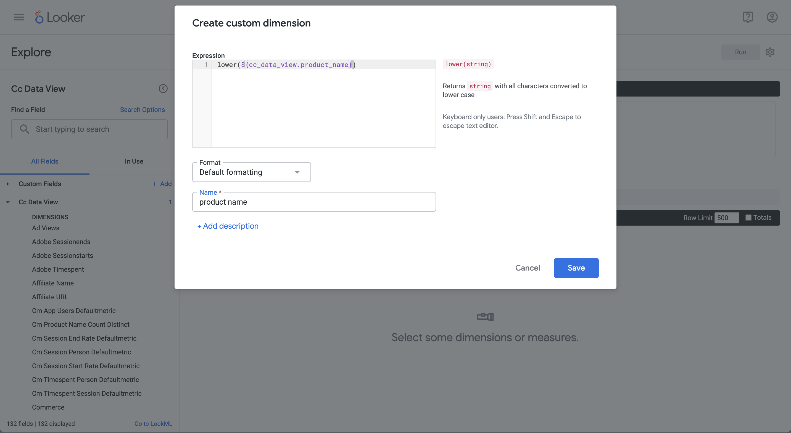

# 转换


您希望了解各种BI工具对Customer Journey Analytics对象（如维度、量度、过滤器、计算量度和日期范围）的转换。

+++ Customer Journey Analytics

在Customer Journey Analytics中，您在[数据视图](/help/data-views/data-views.md)中定义数据集的哪些组件以及如何作为[维度](/help/components/dimensions/overview.md)和[量度](/help/components/apply-create-metrics.md)显示。 维度和量度的定义可通过BI扩展向BI工具公开。
您将[筛选器](/help/components/segments/seg-overview.md)、[计算量度](/help/components/calc-metrics/calc-metr-overview.md)和[日期范围](/help/components/date-ranges/overview.md)等组件用作Workspace项目的一部分。 这些组件还将通过BI扩展向BI工具公开。

+++

+++ BI 工具

>[!PREREQUISITES]
>
>请确保已验证[连接是否成功，可以列出数据视图，并为要为其尝试此用例的BI工具使用数据视图](connect-and-validate.md)。
>

>[!BEGINTABS]

>[!TAB Power BI桌面]

Customer Journey Analytics对象在&#x200B;**[!UICONTROL 数据]**&#x200B;窗格中可用，并可从Power BI Desktop中选择的表检索。 例如，**[!UICONTROL public.cc_data_view]**。 表的名称与在Customer Journey Analytics中为数据视图定义的外部ID相同。 例如，具有&#x200B;**[!UICONTROL 标题]** `C&C - Data View`和&#x200B;**[!UICONTROL 外部ID]** `cc_data_view`的数据视图。

**维度**
Customer Journey Analytics中的维度由[!UICONTROL 组件ID]标识。 已在Customer Journey Analytics数据视图中定义[!UICONTROL 组件ID]。 例如，Customer Journey Analytics中的维度&#x200B;**[!UICONTROL 产品名称]**&#x200B;具有[!UICONTROL 组件ID] **[!UICONTROL product_name]**，它是Power BI Desktop中的维度的名称。
Customer Journey Analytics中的日期范围维度，如**[!UICONTROL Day]**、**[!UICONTROL Week]**、**[!UICONTROL Month]**&#x200B;等，可用作&#x200B;**[!UICONTROL daterangeday]**、**[!UICONTROL daterangeweek]**、**[!UICONTROL daterangemonth]**&#x200B;等。

**个量度**
Customer Journey Analytics中的指标由[!UICONTROL 组件ID]标识。 已在Customer Journey Analytics数据视图中定义[!UICONTROL 组件ID]。 例如，Customer Journey Analytics中的量度&#x200B;**[!UICONTROL Purchase Revenue]**&#x200B;具有[!UICONTROL 组件ID] **[!UICONTROL purchase_revenue]**，它是Power BI Desktop中该量度的名称。 **[!UICONTROL ∑]**&#x200B;表示指标。 当您在任何可视化中使用量度时，该量度将重命名为&#x200B;**[!UICONTROL 1}量度的总和&#x200B;*。*]**

**筛选器**
您在Customer Journey Analytics中定义的筛选器可作为**[!UICONTROL filterName]**&#x200B;字段的一部分提供。 当您在Power BI Desktop中使用&#x200B;**[!UICONTROL filterName]**&#x200B;字段时，可以指定要使用的筛选器。

**计算量度**
您在Customer Journey Analytics中定义的计算指标由您为计算指标定义的[!UICONTROL 外部ID]标识。 例如，计算量度&#x200B;**[!UICONTROL 产品名称（非重复计数）]**&#x200B;具有[!UICONTROL 外部ID] **[!UICONTROL product_name_count_distinct]**，并在Power BI Desktop中显示为**[!UICONTROL cm_product_name_count_distinc]**t。

**日期范围**
您在Customer Journey Analytics中定义的日期范围可作为**[!UICONTROL daterangeName]**&#x200B;字段的一部分使用。 当您使用&#x200B;**[!UICONTROL daterangeName]**&#x200B;字段时，您可以指定要使用的日期范围。

**自定义转换**
Power BI Desktop提供了使用[Data Analysis表达式(DAX)](https://learn.microsoft.com/en-us/dax/dax-overview)的自定义转换功能。 例如，您要执行产品名称为小写的[单维度排名](#single-dimension-ranked)用例。

1. 在报表视图中，选择条形图可视化图表。
1. 在数据窗格中选择&#x200B;**[!UICONTROL product_name]**。
1. 在工具栏中选择&#x200B;**[!UICONTROL 新建列]**。
1. 在公式编辑器中，定义名为`product_name_lower`的新列，如`product_name_lower = LOWER('public.cc_data_view[product_name])`。
   
1. 请确保在&#x200B;**[!UICONTROL 数据]**&#x200B;窗格中选择新的&#x200B;**[!UICONTROL product_name_lower]**&#x200B;列，而不是&#x200B;**[!UICONTROL product_name]**&#x200B;列。
1. 在表可视化图表中，从&#x200B;**[!UICONTROL 更多]**&#x200B;中选择。

   您的Power BI桌面应该如下所示。
   

自定义转换导致SQL查询更新。 请参阅以下SQL示例中的`lower`函数的使用：

```sql
select "_"."product_name_lower",
    "_"."a0",
    "_"."a1"
from 
(
    select "rows"."product_name_lower" as "product_name_lower",
        sum("rows"."purchases") as "a0",
        sum("rows"."purchase_revenue") as "a1"
    from 
    (
        select "_"."daterange" as "daterange",
            "_"."product_name" as "product_name",
            "_"."purchase_revenue" as "purchase_revenue",
            "_"."purchases" as "purchases",
            lower("_"."product_name") as "product_name_lower"
        from 
        (
            select "_"."daterange",
                "_"."product_name",
                "_"."purchase_revenue",
                "_"."purchases"
            from 
            (
                select "daterange",
                    "product_name",
                    "purchase_revenue",
                    "purchases"
                from "public"."cc_data_view" "$Table"
            ) "_"
            where ("_"."daterange" < date '2024-01-01' and "_"."daterange" >= date '2023-01-01') and ("_"."product_name" in ('4G Cellular Trail Camera', '4K Wildlife Trail Camera', 'Wireless Trail Camera', '8-Person Cabin Tent', '20MP No-Glow Trail Camera', 'HD Wildlife Camera', '4-Season Mountaineering Tent', 'Trail Camera', '16MP Trail Camera with Solar Panel', '10-Person Family Tent'))
        ) "_"
    ) "rows"
    group by "product_name_lower"
) "_"
where not "_"."a0" is null or not "_"."a1" is null
limit 1000001
```

>[!TAB Tableau桌面]

每当您在工作表中工作时，**[!UICONTROL Data]**&#x200B;侧栏中都有Customer Journey Analytics对象。 并从您选择作为Tableau中&#x200B;**[!UICONTROL 数据源]**&#x200B;页面一部分的表中检索和。 例如，**[!UICONTROL cc_data_view]**。 表的名称与在Customer Journey Analytics中为数据视图定义的外部ID相同。 例如，具有&#x200B;**[!UICONTROL 标题]** `C&C - Data View`和&#x200B;**[!UICONTROL 外部ID]** `cc_data_view`的数据视图。

**维度**
Customer Journey Analytics中的维度由[!UICONTROL 组件名称]标识。 已在Customer Journey Analytics数据视图中定义[!UICONTROL 组件名称]。 例如，Customer Journey Analytics中的维度&#x200B;**[!UICONTROL 产品名称]**&#x200B;具有[!UICONTROL 组件名称] **[!UICONTROL 产品名称]**，它是Tableau中的维度的名称。 所有维度均由&#x200B;**[!UICONTROL Abc]**标识。
来自Customer Journey Analytics的日期范围维度，如**[!UICONTROL Day]**、**[!UICONTROL Week]**、**[!UICONTROL Month]**&#x200B;等，可用作&#x200B;**[!UICONTROL Daterangeday]**、**[!UICONTROL Daterangeweek]**、**[!UICONTROL Daterangemonth]**&#x200B;等。 使用日期范围维度时，必须从下拉菜单中选择适当的日期或时间定义以应用于该日期范围维度。 例如，**[!UICONTROL 年]**，**[!UICONTROL 季度]**，**[!UICONTROL 月]**，**[!UICONTROL 天]**。

**个量度**
Customer Journey Analytics中的量度由[!UICONTROL 组件名称]标识。 已在Customer Journey Analytics数据视图中定义[!UICONTROL 组件名称]。 例如，Customer Journey Analytics中的量度&#x200B;**[!UICONTROL Purchase Revenue]**&#x200B;具有[!UICONTROL 组件名称] **[!UICONTROL Purchase Revenue]**，它是Tableau中的量度的名称。 所有量度都由&#x200B;**[!UICONTROL #]**&#x200B;标识。 在任何可视化中使用量度时，该量度将重命名为&#x200B;**[!UICONTROL Sum（*量度*）]**。

**筛选器**
您在Customer Journey Analytics中定义的筛选器可作为**[!UICONTROL 筛选器名称]**&#x200B;字段的一部分使用。 当您在Tableau中使用&#x200B;**[!UICONTROL 筛选器名称]**&#x200B;字段时，可以指定要使用的筛选器。

**计算量度**
您在Customer Journey Analytics中定义的计算指标由您为计算指标定义的[!UICONTROL 标题]标识。 例如，计算量度&#x200B;**[!UICONTROL 产品名称（非重复计数）]**&#x200B;具有[!UICONTROL 标题] **[!UICONTROL 产品名称（非重复计数）]**，在Tableau中显示为&#x200B;**[!UICONTROL Cm产品名称非重复计数]**。

**日期范围**
您在Customer Journey Analytics中定义的日期范围可作为**[!UICONTROL 日期范围名称]**&#x200B;字段的一部分使用。 当您使用&#x200B;**[!UICONTROL 日期范围名称]**&#x200B;字段时，您可以指定要使用的日期范围。

**自定义转换**
Tableau Desktop提供了使用[计算字段](https://help.tableau.com/current/pro/desktop/en-us/calculations_calculatedfields_create.htm)的自定义转换功能。 例如，您要执行产品名称为小写的[单维度排名](#single-dimension-ranked)用例。

1. 从主菜单中选择&#x200B;**[!UICONTROL 分析]** > **[!UICONTROL 创建计算字段]**。
   1. 使用函数&#x200B;**[!UICONTROL 定义]**&#x200B;小写的产品名称`LOWER([Product Name])`。
      
   1. 选择&#x200B;**[!UICONTROL 确定]**。
1. 选择&#x200B;**[!UICONTROL 数据]**&#x200B;表。
   1. 从&#x200B;**[!UICONTROL 表]**&#x200B;中拖动&#x200B;**[!UICONTROL 小写的产品名称]**，并将条目放入&#x200B;**[!UICONTROL 行]**&#x200B;旁边的字段中。
   1. 从&#x200B;**[!UICONTROL 行]**&#x200B;中删除&#x200B;**[!UICONTROL 产品名称]**。
1. 选择&#x200B;**[!UICONTROL 仪表板1]**&#x200B;视图。

您的Tableau桌面应该如下所示。

转换后的

自定义转换会导致SQL查询更新。 请参阅以下SQL示例中的`LOWER`函数的使用：

```sql
SELECT LOWER(CAST(CAST("cc_data_view"."product_name" AS TEXT) AS TEXT)) AS "Calculation_1562467608097775616",
  SUM("cc_data_view"."purchase_revenue") AS "sum:purchase_revenue:ok",
  SUM("cc_data_view"."purchases") AS "sum:purchases:ok"
FROM "public"."cc_data_view" "cc_data_view"
WHERE (("cc_data_view"."daterange" >= (DATE '2023-01-01')) AND ("cc_data_view"."daterange" <= (DATE '2023-12-31')))
GROUP BY 1
HAVING ((SUM("cc_data_view"."purchase_revenue") >= 999999.99999998999) AND (SUM("cc_data_view"."purchase_revenue") <= 2000000.00000002))
```

>[!TAB Looker]

Customer Journey Analytics对象在&#x200B;**[!UICONTROL 浏览]**&#x200B;界面中可用。 和将作为在Looker中设置连接、项目和模型的一部分进行检索。 例如，**[!UICONTROL cc_data_view]**。 视图的名称与您在Customer Journey Analytics中为数据视图定义的外部ID相同。 例如，具有&#x200B;**[!UICONTROL 标题]** `C&C - Data View`和&#x200B;**[!UICONTROL 外部ID]** `cc_data_view`的数据视图。

**维度**
Customer Journey Analytics中的维度在**[!UICONTROL 抄送数据视图]**&#x200B;左边栏中列为&#x200B;**[!UICONTROL DIMENSION]**。 维度是在Customer Journey Analytics数据视图中定义的。 例如，Customer Journey Analytics中的维度&#x200B;**[!UICONTROL 产品名称]**&#x200B;具有&#x200B;**[!UICONTROL DIMENSION]** **[!UICONTROL 产品名称]**，它是查找器中维度的名称。
来自Customer Journey Analytics的日期范围维度，如**[!UICONTROL Day]**、**[!UICONTROL Week]**、**[!UICONTROL Month]**&#x200B;等，可用作&#x200B;**[!UICONTROL Daterangeday Date]**、**[!UICONTROL Daterangeweek Date]**、**[!UICONTROL Daterangemonth Date]**&#x200B;等。  使用日期范围维度时，必须选择适当的日期或时间定义。 例如，**[!UICONTROL 年]**，**[!UICONTROL 季度]**，**[!UICONTROL 月]**，**[!UICONTROL 日期]**。

**个量度**
Customer Journey Analytics中的量度在**[!UICONTROL 抄送数据视图]**&#x200B;左边栏中列为&#x200B;**[!UICONTROL DIMENSION]**。 例如，Customer Journey Analytics中的量度&#x200B;**[!UICONTROL Purchase Revenue]**&#x200B;具有&#x200B;**[!UICONTROL DIMENSION]** **[!UICONTROL Purchase Revenue]**。 要实际用作量度，请创建一个自定义量度字段（如上面的示例所示），或使用维度的快捷键。 例如，**[!UICONTROL ⋮]**，选择&#x200B;**[!UICONTROL 聚合]**，然后选择&#x200B;**[!UICONTROL 总和]**。

**筛选器**
您在Customer Journey Analytics中定义的筛选器可作为**[!UICONTROL 筛选器名称]**&#x200B;字段的一部分使用。 当您在Looker中使用&#x200B;**[!UICONTROL 筛选器名称]**&#x200B;字段时，可以指定要使用的筛选器。

**计算量度**
您在Customer Journey Analytics中定义的计算指标由您为计算指标定义的[!UICONTROL 标题]标识。 例如，计算量度&#x200B;**[!UICONTROL 产品名称（非重复计数）]**&#x200B;具有[!UICONTROL 标题] **[!UICONTROL 产品名称（非重复计数）]**，并且在查找器中显示为&#x200B;**[!UICONTROL Cm产品名称非重复计数]**。

**日期范围**
您在Customer Journey Analytics中定义的日期范围可作为**[!UICONTROL 日期范围名称]**&#x200B;字段的一部分使用。 当您使用&#x200B;**[!UICONTROL 日期范围名称]**&#x200B;字段时，您可以指定要使用的日期范围。

**自定义转换**
Looker使用自定义字段生成器提供自定义转换功能，如上所示。 例如，您要执行产品名称为小写的[单维度排名](#single-dimension-ranked)用例。

1. 在左边栏的&#x200B;**[!UICONTROL ‣自定义字段]**&#x200B;部分中：
   1. 从&#x200B;**[!UICONTROL +添加]**&#x200B;下拉菜单中选择&#x200B;**[!UICONTROL 自定义Dimension]**。
   1. 在`lower(${cc_data_view.product_name})`表达式&#x200B;**[!UICONTROL 文本区域中输入]**。 当您开始键入`Product Name`时，会使用正确的语法来帮助您。
      
   1. 输入`product name`作为&#x200B;**[!UICONTROL Name]**。
   1. 选择&#x200B;**[!UICONTROL 保存]**。

您应该会看到如下所示的类似表格。


自定义转换会导致SQL查询更新。 请参阅以下SQL示例中的`LOWER`函数的使用：

```sql
SELECT
    LOWER((cc_data_view."product_name")) AS "product_name",
    COALESCE(SUM(CAST(( cc_data_view."purchase_revenue"  ) AS DOUBLE PRECISION)), 0) AS "sum_of_purchase_revenue",
    COALESCE(SUM(CAST(( cc_data_view."purchases"  ) AS DOUBLE PRECISION)), 0) AS "sum_of_purchases"
FROM public.cc_data_view  AS cc_data_view
WHERE ((( cc_data_view."daterange"  ) >= (DATE_TRUNC('day', DATE '2023-01-01')) AND ( cc_data_view."daterange"  ) < (DATE_TRUNC('day', DATE '2024-01-01'))))
GROUP BY
    1
ORDER BY
    2 DESC
FETCH NEXT 500 ROWS ONLY
```

>[!TAB Jupyter笔记本]

Customer Journey Analytics对象（维度、量度、过滤器、计算量度和日期范围）作为您构建的嵌入式SQL查询的一部分提供。 请参阅前面的示例。

**自定义转换**

1. 在新单元格中输入以下语句。

   ```python
   data = %sql SELECT LOWER(product_category) AS `Product Category`, COUNT(*) AS EVENTS \
               FROM cc_data_view \
               WHERE daterange BETWEEN '2023-01-01' AND '2024-01-01' \
               GROUP BY 1 \
               ORDER BY `Events` DESC \
               LIMIT 5;
   display(data)
   ```

1. 执行单元格。 您应该会看到类似于以下屏幕快照的输出。

   

查询由Jupyter Notebook中定义的BI扩展执行。

>[!TAB RStudio]

Customer Journey Analytics组件（维度、量度、过滤器、计算量度和日期范围）在R语言中作为类似的命名对象提供。 请参阅使用组件的组件，请参阅之前的示例。

**自定义转换**

1. 在新块中输入以下介于` ```{r} `和` ``` `之间的语句。

   ```R
   df <- dv %>%
      filter(daterange >= "2023-01-01" & daterange <= "2024-01-01") %>%
      mutate(d2=lower(product_category)) %>%
      group_by(d2) %>%
      count() %>%
      arrange(d2, .by_group = FALSE)
   print(df)
   ```

1. 运行块。 您应该会看到类似于以下屏幕快照的输出。

   

RStudio使用BI扩展生成的查询包括`lower`，这意味着自定义转换由RStudio和BI扩展执行。

```sql
SELECT "d2", COUNT(*) AS "n"
FROM (
  SELECT "cc_data_view".*, lower("product_category") AS "d2"
  FROM "cc_data_view"
  WHERE ("daterange" >= '2023-01-01' AND "daterange" <= '2024-01-01')
) AS "q01"
GROUP BY "d2"
ORDER BY "d2"
LIMIT 1000
```

>[!ENDTABS]

+++

