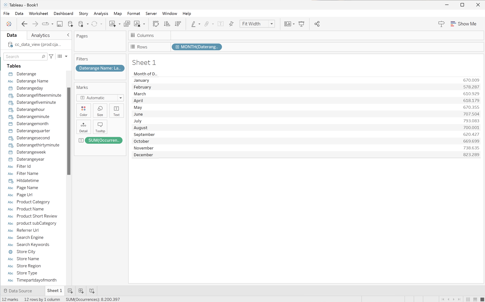

# 使用日期范围名称进行筛选

在此使用案例中，您希望使用在Customer Journey Analytics中定义的日期范围来过滤和报告去年的发生次数（事件）。

+++ Customer Journey Analytics

若要使用日期范围报告，请在Customer Journey Analytics中设置一个日期范围，并设置&#x200B;**[!UICONTROL 标题]** `Last Year 2023`。


然后，您可以在用例的示例&#x200B;**[!UICONTROL 使用日期范围名称进行筛选]**&#x200B;面板中使用该日期范围：


请注意，在自由格式表可视化图表中定义的日期范围如何覆盖应用于面板的日期范围。

+++

+++ BI 工具

>[!PREREQUISITES]
>
>请确保已验证[连接是否成功，可以列出数据视图，并为要为其尝试此用例的BI工具使用数据视图](connect-and-validate.md)。
>

>[!BEGINTABS]

>[!TAB Power BI桌面]

1. 在&#x200B;**[!UICONTROL 数据]**&#x200B;窗格中：
   1. 选择&#x200B;**[!UICONTROL daterangemonth]**。
   1. 选择&#x200B;**[!UICONTROL 日期范围名称]**。
   1. 选择&#x200B;**[!UICONTROL 发生次数总和]**。

   您看到一个可视化图表，其中显示&#x200B;**[!UICONTROL 获取此可视化图表的数据时出错]**。

1. 在&#x200B;**[!UICONTROL 筛选器]**&#x200B;窗格中：

   1. 从该视觉对象上的&#x200B;**[!UICONTROL 筛选器中选择]** daterangeName is (All)**[!UICONTROL 。]**
   1. 选择&#x200B;**[!UICONTROL 基本筛选]**&#x200B;作为&#x200B;**[!UICONTROL 筛选器类型]**。
   1. 在&#x200B;**[!UICONTROL Search]**&#x200B;字段下，选择&#x200B;**[!UICONTROL Last Year 2023]**，它是您在Customer Journey Analytics中定义的日期范围的名称。
   1. 选择以从&#x200B;**[!UICONTROL 列]**&#x200B;中删除&#x200B;**[!UICONTROL daterangeName]**。

   您会看到使用应用的&#x200B;**[!UICONTROL 日期范围名称]**&#x200B;过滤器更新的表。 您的Power BI桌面应该如下所示。

   

>[!TAB Tableau桌面]

1. 选择底部的&#x200B;**[!UICONTROL 表1]**&#x200B;选项卡以从&#x200B;**[!UICONTROL 数据源]**&#x200B;切换。 在&#x200B;**[!UICONTROL 表1]**&#x200B;视图中：
   1. 从&#x200B;**[!UICONTROL 筛选器]**&#x200B;托架中的&#x200B;**[!UICONTROL 表]**&#x200B;列表中拖动&#x200B;**[!UICONTROL 日期范围名称]**&#x200B;条目。
   1. 在&#x200B;**[!UICONTROL 筛选器\[日期范围名称\]]**&#x200B;对话框中，确保选中&#x200B;**[!UICONTROL 从列表中选择]**，然后从列表中选择&#x200B;**[!UICONTROL 去年度2023]**。 选择&#x200B;**[!UICONTROL 应用]**&#x200B;和&#x200B;**[!UICONTROL 确定]**。
   1. 从&#x200B;**[!UICONTROL 表]**&#x200B;列表中拖动&#x200B;**[!UICONTROL Daterangemonth]**&#x200B;条目，并将该条目放入&#x200B;**[!UICONTROL 行]**&#x200B;旁边的字段中。 选择&#x200B;**[!UICONTROL Daterangemonth]**&#x200B;并选择&#x200B;**[!UICONTROL 月]**。 值更改为&#x200B;**[!UICONTROL MONTH(Daterangemonth)]**。
   1. 从&#x200B;**[!UICONTROL 表]**&#x200B;列表中拖动&#x200B;**[!UICONTROL 发生次数]**&#x200B;条目，并将该条目放入&#x200B;**[!UICONTROL 列]**&#x200B;旁边的字段中。 值更改为&#x200B;**[!UICONTROL SUM（发生次数）]**。
   1. 从&#x200B;**[!UICONTROL 显示我]**&#x200B;中选择&#x200B;**[!UICONTROL 文本表]**。
   1. 从工具栏中选择&#x200B;**[!UICONTROL 交换行和列]**。
   1. 从&#x200B;**[!UICONTROL 适合]**&#x200B;下拉菜单中选择&#x200B;**[!UICONTROL 适合宽度]**。

      您的Tableau桌面应该如下所示。

      

>[!TAB Looker]

1. 在Looker的&#x200B;**[!UICONTROL 浏览]**&#x200B;界面中，确保您拥有干净的设置。 如果不是，请选择 **[!UICONTROL 删除字段和筛选器]**。
1. 选择&#x200B;**[!UICONTROL 筛选器]**&#x200B;下的&#x200B;**[!UICONTROL +筛选器]**。
1. 在&#x200B;**[!UICONTROL 添加筛选器]**&#x200B;对话框中：
   1. 选择&#x200B;**[!UICONTROL ‣抄送数据视图]**
   1. 从字段列表中选择&#x200B;**[!UICONTROL ‣日期范围名称]**。
1. 将&#x200B;**[!UICONTROL Cc数据视图日期范围名称]**&#x200B;筛选器指定为&#x200B;**[!UICONTROL is]**，并从值列表中选择&#x200B;**[!UICONTROL Last Year 2023]**。
1. 从左边栏中的&#x200B;**[!UICONTROL ‣ Cc数据视图]**&#x200B;部分：
   1. 选择&#x200B;**[!UICONTROL 日期范围月]**，然后选择&#x200B;**[!UICONTROL 月]**。
   1. 在左边栏（底部）中选择&#x200B;**[!UICONTROL MEASURES]**&#x200B;下的&#x200B;**[!UICONTROL 计数]**。
1. 选择&#x200B;**[!UICONTROL 运行]**。
1. 选择&#x200B;**[!UICONTROL ‣可视化图表]**。

您应该会看到如下所示的可视化图表和表格。


>[!TAB Jupyter笔记本]

1. 在新单元格中输入以下语句。

   ```python
   data = %sql SELECT daterangeName FROM cc_data_view;
   style = {'description_width': 'initial'}
   daterange_name = widgets.Dropdown(
      options=[d for d, in data],
      description='Date Range Name:',
      style=style
   )
   display(daterange_name)
   ```

1. 执行单元格。 您应该会看到类似于以下屏幕快照的输出。

   

1. 从下拉菜单中选择&#x200B;**[!UICONTROL 钓鱼产品]**。

1. 在新单元格中输入以下语句。

   ```python
   import seaborn as sns
   import matplotlib.pyplot as plt
   data = %sql SELECT daterangemonth AS Month, COUNT(*) AS Events \
               FROM cc_data_view \
               WHERE daterangeName = '{daterange_name.value}' \
               GROUP BY 1 \
               ORDER BY Month ASC
   df = data.DataFrame()
   df = df.groupby('Month', as_index=False).sum()
   plt.figure(figsize=(15, 3))
   sns.lineplot(x='Month', y='Events', data=df)
   plt.show()
   display(data)
   ```

1. 执行单元格。 您应该会看到类似于以下屏幕快照的输出。

   


>[!TAB RStudio]

1. 在新块中输入以下介于` ` ``{r} `和` `` ` `之间的语句。 确保使用适当的日期范围名称。 例如，`Last Year 2023`。

   ```R
   ## Monthly Events for Last Year
   df <- dv %>%
      filter(daterangeName == "Last Year 2023") %>%
      group_by(daterangemonth) %>%
      count() %>%
      arrange(daterangemonth, .by_group = FALSE)
   ggplot(df, aes(x = daterangemonth, y = n)) +
      geom_line(color = "#69b3a2") +
      ylab("Events") +
      xlab("Hour")
   print(df)
   ```

1. 运行块。 您应该会看到类似于以下屏幕快照的输出。

   

>[!ENDTABS]

+++

