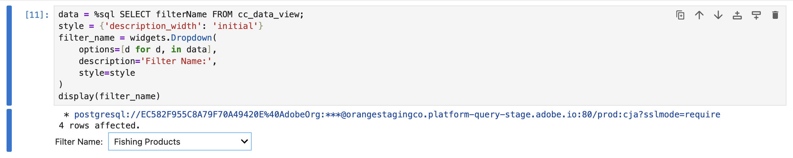

# 使用区段名称进行分段

在此使用案例中，您需要将现有区段用于Customer Journey Analytics中定义的渔业产品类别。 细分并报告2023年1月期间的产品名称和发生次数（事件）。

+++ Customer Journey Analytics

检查要在Customer Journey Analytics中使用的区段。


然后，您可以在用例的示例&#x200B;**[!UICONTROL 使用区段名称将区段分段]**&#x200B;面板中使用该区段：


+++

+++ BI 工具

>[!PREREQUISITES]
>
>请确保已验证[连接是否成功，可以列出数据视图，并为要为其尝试此用例的BI工具使用数据视图](connect-and-validate.md)。
>

>[!BEGINTABS]

>[!TAB Power BI桌面]

1. 在&#x200B;**[!UICONTROL 数据]**&#x200B;窗格中：
   1. 选择&#x200B;**[!UICONTROL 日期范围]**。
   1. 选择&#x200B;**[!UICONTROL 筛选器名称]**。
   1. 选择&#x200B;**[!UICONTROL 产品名称]**。
   1. 选择&#x200B;**[!UICONTROL 发生次数总和]**。

您看到一个可视化图表，其中显示&#x200B;**[!UICONTROL 获取此可视化图表的数据时出错]**。

1. 在&#x200B;**[!UICONTROL 筛选器]**&#x200B;窗格中：

   1. 从该视觉对象上的&#x200B;**[!UICONTROL 筛选器中选择]**&#x200B;筛选器名称为（全部）**[!UICONTROL 。]**
   1. 选择&#x200B;**[!UICONTROL 基本筛选]**&#x200B;作为&#x200B;**[!UICONTROL 筛选器类型]**。
   1. 在&#x200B;**[!UICONTROL Search]**&#x200B;字段下，选择&#x200B;**[!UICONTROL Fishing Products]**，它是Customer Journey Analytics中定义的现有过滤器的名称。
   1. 从该视觉对象上的&#x200B;**[!UICONTROL 筛选器中选择]**&#x200B;日期范围是（全部）****。
   1. 选择&#x200B;**[!UICONTROL 高级筛选]**&#x200B;作为&#x200B;**[!UICONTROL 筛选器类型]**。
   1. 将筛选器定义为&#x200B;**[!UICONTROL 当值]** **[!UICONTROL 在]** `1/1/2023` **[!UICONTROL 和]** **[!UICONTROL 在]** `2/1/2023`之前或之后时显示项。
   1. 选择以从&#x200B;**[!UICONTROL 列]**&#x200B;中删除&#x200B;**[!UICONTROL filterName]**。
   1. 选择以从&#x200B;**[!UICONTROL 列]**&#x200B;中删除&#x200B;**[!UICONTROL 日期范围]**。

   您会看到使用应用的&#x200B;**[!UICONTROL filterName]**&#x200B;筛选器更新的表。 您的Power BI桌面应该如下所示。

   


>[!TAB Tableau桌面]

1. 选择底部的&#x200B;**[!UICONTROL 表1]**&#x200B;选项卡以从&#x200B;**[!UICONTROL 数据源]**&#x200B;切换。 在&#x200B;**[!UICONTROL 表1]**&#x200B;视图中：
   1. 从&#x200B;**[!UICONTROL 筛选器]**&#x200B;托架中的&#x200B;**[!UICONTROL 表]**&#x200B;列表中拖动&#x200B;**[!UICONTROL 筛选器名称]**&#x200B;条目。
   1. 在&#x200B;**[!UICONTROL 筛选器\[筛选器名称\]]**&#x200B;对话框中，确保已选中&#x200B;**[!UICONTROL 从列表中选择]**，并从列表中选择&#x200B;**[!UICONTROL 钓鱼产品]**。 选择&#x200B;**[!UICONTROL 应用]**&#x200B;和&#x200B;**[!UICONTROL 确定]**。
   1. 从&#x200B;**[!UICONTROL 筛选器]**&#x200B;托架中的&#x200B;**[!UICONTROL 表]**&#x200B;列表中拖动&#x200B;**[!UICONTROL 日期范围]**&#x200B;条目。
   1. 在&#x200B;**[!UICONTROL 筛选器字段\[日期范围\]]**&#x200B;对话框中，选择&#x200B;**[!UICONTROL 日期范围]**，然后选择&#x200B;**[!UICONTROL 下一步>]**。
   1. 在&#x200B;**[!UICONTROL 筛选器\[Daterang\]]**&#x200B;对话框中，选择&#x200B;**[!UICONTROL 日期范围]**，然后选择`01/01/2023` - `01/02/2023`。 选择&#x200B;**[!UICONTROL 应用]**&#x200B;和&#x200B;**[!UICONTROL 确定]**。
   1. 将&#x200B;**[!UICONTROL 产品名称]**&#x200B;从&#x200B;**[!UICONTROL 表]**&#x200B;列表拖至&#x200B;**[!UICONTROL 行]**。
   1. 从&#x200B;**[!UICONTROL 表]**&#x200B;列表中拖动&#x200B;**[!UICONTROL 发生次数]**&#x200B;条目，并将该条目放入&#x200B;**[!UICONTROL 列]**&#x200B;旁边的字段中。 值更改为&#x200B;**[!UICONTROL SUM（发生次数）]**。
   1. 从&#x200B;**[!UICONTROL 显示我]**&#x200B;中选择&#x200B;**[!UICONTROL 文本表]**。
   1. 从&#x200B;**[!UICONTROL 适合]**&#x200B;下拉菜单中选择&#x200B;**[!UICONTROL 适合宽度]**。

      您的Tableau桌面应该如下所示。

      

>[!TAB Looker]

1. 在Looker的&#x200B;**[!UICONTROL 浏览]**&#x200B;界面中，确保您拥有干净的设置。 如果不是，请选择 **[!UICONTROL 删除字段和筛选器]**。
1. 选择&#x200B;**[!UICONTROL 筛选器]**&#x200B;下的&#x200B;**[!UICONTROL +筛选器]**。
1. 在&#x200B;**[!UICONTROL 添加筛选器]**&#x200B;对话框中：
   1. 选择&#x200B;**[!UICONTROL ‣抄送数据视图]**
   1. 从字段列表中，选择&#x200B;**[!UICONTROL 日‣间范围日期]**，然后选择&#x200B;**[!UICONTROL 日期范围日期]**。
      
1. 指定&#x200B;**[!UICONTROL Cc数据视图日期范围日期]**&#x200B;筛选器，因为&#x200B;**[!UICONTROL 在]** **[!UICONTROL 2023/01/01]** **[!UICONTROL 之前]** **[!UICONTROL 2023/02/01]**&#x200B;的范围内。
1. 选择&#x200B;**[!UICONTROL 筛选器]**&#x200B;下的&#x200B;**[!UICONTROL +筛选器]**&#x200B;以添加其他筛选器。
1. 在&#x200B;**[!UICONTROL 添加筛选器]**&#x200B;对话框中：
   1. 选择&#x200B;**[!UICONTROL ‣抄送数据视图]**
   1. 从字段列表中，选择&#x200B;**[!UICONTROL ‣筛选器名称]**。
1. 确保&#x200B;**[!UICONTROL 是]**&#x200B;筛选器的选定内容。
1. 从可能值列表中选择&#x200B;**[!UICONTROL 钓鱼产品]**。
1. 从左边栏中的&#x200B;**[!UICONTROL ‣ Cc数据视图]**&#x200B;部分：
   1. 选择&#x200B;**[!UICONTROL 产品名称]**。
   1. 在左边栏（底部）中选择&#x200B;**[!UICONTROL MEASURES]**&#x200B;下的&#x200B;**[!UICONTROL 计数]**。
1. 选择&#x200B;**[!UICONTROL 运行]**。
1. 选择&#x200B;**[!UICONTROL ‣可视化图表]**。

您应该会看到如下所示的可视化图表和表格。


>[!TAB Jupyter笔记本]

1. 在新单元格中输入以下语句。

   ```python
   data = %sql SELECT filterName FROM cc_data_view;
   style = {'description_width': 'initial'}
   filter_name = widgets.Dropdown(
      options=[d for d, in data],
      description='Filter Name:',
      style=style
   )
   display(filter_name)
   ```

1. 执行单元格。 您应该会看到类似于以下屏幕快照的输出。

   

1. 从下拉菜单中选择&#x200B;**[!UICONTROL 钓鱼产品]**。

1. 在新单元格中输入以下语句。

   ```python
   import seaborn as sns
   import matplotlib.pyplot as plt
   data = %sql SELECT product_name AS `Product Name`, COUNT(*) AS Events \
               FROM cc_data_view \
               WHERE daterange BETWEEN '2023-01-01' AND '2023-02-01' \
                  AND filterName = '{filter_name.value}' \
               GROUP BY 1 \
               LIMIT 10;
   df = data.DataFrame()
   df = df.groupby('Product Name', as_index=False).sum()
   plt.figure(figsize=(15, 3))
   sns.barplot(x='Events', y='Product Name', data=df)
   plt.show()
   display(data)
   ```

1. 执行单元格。 您应该会看到类似于以下屏幕快照的输出。

   


>[!TAB RStudio]

1. 在新块中输入以下介于` ```{r} `和` ``` `之间的语句。 确保使用适当的过滤器名称。 例如，`Fishing Products`。

   ```R
   ## Dimension filtered by name
   df <- dv %>%
      filter(daterange >= "2023-01-01" & daterange < "2023-02-01" & filterName == "Fishing Products") %>%
      group_by(product_name) %>%
      count() %>%
      arrange(desc(n), .by_group = FALSE)
   print(df)
   ```

1. 运行块。 您应该会看到类似于以下屏幕快照的输出。

   


>[!ENDTABS]

+++
