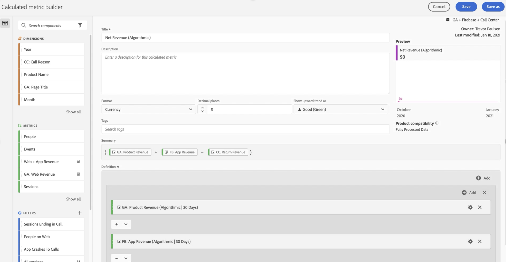

# 在 Customer Journey Analytics 中就 Google Analytics 数据给出报告

在 Customer Journey Analytics 中获得可用数据后，以下示例提供了用于报告该数据的有用方案。

## 将 Web 数据和应用程序数据可视化为组合数据集

此 Venn 图显示在您的网站（根据您的 Google Analytics 数据）、移动应用程序（根据您的 Firebase 数据）和呼叫中心中重叠的用户。您还可以看到表现最好的产品 - 不光在 Web 上，而且在移动应用程序上。您甚至可以使用计算量度从两者中获得总收入。您会注意到，当查看合并收入时，表现最好的产品表现不一。没有合并数据集，您永远想不到“Twill cap”表现如此卓著。

## 识别呼叫原因并减少呼叫量

您可以根据呼叫中心过去两个月花费的时间趋势来确定呼叫量。以下示例显示了该数据在过去两个月中的趋势。以下示例显示了一种增加趋势，这可能会影响组织成本。

使用“呼叫原因”维度可以暗示改善网络体验的方法，防止访问者首先致电。上面的示例显示，“损坏产品”每次通话的平均通话时间接近 3 分钟，为您的组织提供了一种改善客户体验和降低呼叫中心成本的精确方法。

您可以查看哪些产品引起了呼叫中心的大部分呼叫，以及有多少客户拨打了这些呼叫。气泡图显示，有 20,000 人打了电话，花费了 4 小时 30 多分钟，退回了 33 件“男士短袖 T 恤”产品。

应用“致电原因”的维度细分，该示例显示“损坏的产品”维度项目。下一步就是联系质量控制部门，了解客户为什么会收到损坏的 T 恤。

您可以查看哪些网站页面将呼叫吸引到呼叫中心。该报告可让您了解网站上体验欠佳的地方，并帮助您的产品经理解决这些挑战。以下示例使用带有参与归因模型的计算量度，将数据向下过滤到仅以呼叫中心呼叫结束的会话。

以下示例显示“购物车”和“结帐信息”页面驱动了大部分调用。

群组表允许您查看用户在访问网站后通常需要多长时间才能致电呼叫中心。以下示例表明此示例数据集的平均时间介于三到四个星期之间。

## 使用高级营销归因

CJA 允许您在跨通道数据上使用复杂的归因模型。在下面的示例中，您可以看到应用最近联系、首次联系、U 形和收入算法归因与 Google Analytics 渠道分组维度的比较。

使用计算量度，您可以将该归因应用于 Web 收入、移动应用程序收入，甚至可以删除产品退货。结果，您可以看到每个营销渠道的真实净收入。

Attribution IQ 还让您能够过滤数据。您可以看到仅针对特定用户集的归因，例如那些使用多个设备的用户。

您还可以将您的 Web 和应用程序收入归因于您的 Google 广告内容。该数据集的示例从由在线 Google Ads 驱动的移动应用获得的收入比从网络获得的收入更多。通过按 Web 和应用程序收入排序广告，您对于表现最好的 Google 广告的认识会有不同。

结合 CJA 中的数据集，您可以在此示例中看到在线广告对您在移动应用上购买的产品产生了任何影响。以下可视化显示，与单独的网络相比，来自 Google Ads 的移动应用收入多出 14000 至 15000 美元。

