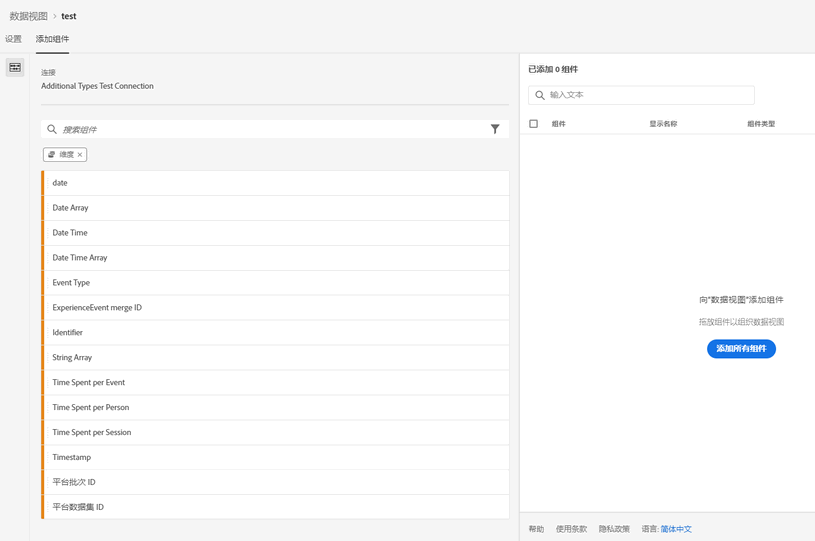
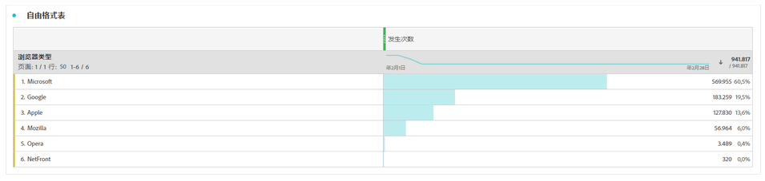

# 向数据集添加全局查找

全局查找可增强 Customer Journey Analytics 功能，使其能够报告一些本身无用但与其他数据结合后变得有用的维度/属性。示例包括移动设备的属性、操作系统属性和浏览器维度，如浏览器版本号。“全局查找”类似于查找数据集。全局查找适用于整个 Experience Cloud 组织。它们自动应用于包含某些 XDM 架构字段（有关具体字段见下文）的所有事件数据集。Adobe 分类的每个架构位置都存在一个全局查找数据集。

在传统的 Adobe Analytics 中，这些维度按自已的方式显示，但在 CJA 中，您必须在创建数据视图时主动包含这些维度。在“连接”工作流中，选择具有全局查找键标志的数据集。数据视图 UI 自动知道包括所有全局查找维度以用于报告。查找文件会在所有区域和所有帐户中自动保持为最新版本和可用。这些文件将存储在与客户关联的特定于区域的组织中。

## 将全局查找与 Adobe Data Connector 数据集结合使用

全局查找数据集会在报告时自动应用。如果您使用 Analytics Data Connector 并且引入 Adobe 将为其提供全局查找的维度，我们会自动应用此全局查找。如果事件数据集包含 XDM 字段，我们可以对其应用全局查找。

## 可用的全局查找字段

* `browser`
   * `browser`、`group_id`、`id`
* `browser_group`
   * `browser_group`、`id`
* `os`
   * `os`、`group_id`、`id`
* `os_group`
   * `os_group`、`id`
* `mobile_audio_support - multi`
* `mobile_color_depth`
* `mobile_cookie_support`
* `mobile_device_name`
* `mobile_device_number_transmit`
* `mobile_device_type`
* `mobile_drm - multi`
* `mobile_image_support - multi`
* `mobile_information_services`
* `mobile_java_vm - multi`
* `mobile_mail_decoration`
* `mobile_manufacturer`
* `mobile_max_bookmark_url_length`
* `mobile_max_browser_url_length`
* `mobile_max_mail_url_length`
* `mobile_net_protocols - multi`
* `mobile_os`
* `mobile_push_to_talk`
* `mobile_screen_height`
* `mobile_screen_size`
* `mobile_screen_width`
* `mobile_video_support - multi`

## 报告全局查找维度

要报告全局查找维度，您必须在 Customer Journey Analytics 中创建数据视图时添加这些维度：

然后，您便可以在工作区中查看查找数据：

