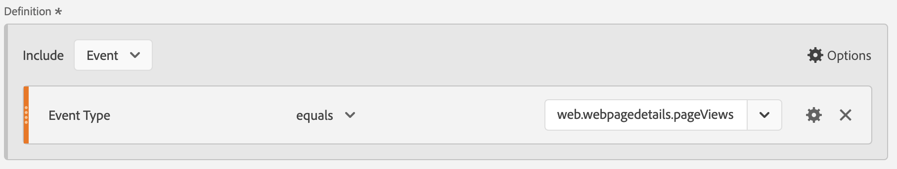

# 将Marketo B2B数据摄取到AEP并在CJA中报告

您可以利用Adobe Experience Platform(AEP)中新推出的Marketo B2B数据集，为B2B营销人员提供有价值的分析和报告解决方案。 然后在Customer Journey Analytics(CJA)中报告这些数据集。

## 步骤1:将Marketo源数据字段映射到其XDM目标

映射 [人员](https://experienceleague.adobe.com/docs/experience-platform/sources/connectors/adobe-applications/mapping/marketo.html?lang=en#persons) 和 [活动](https://experienceleague.adobe.com/docs/experience-platform/sources/connectors/adobe-applications/mapping/marketo.html?lang=en#activities) 到相应的XDM架构目标字段。

## 步骤2:将Marketo数据摄取到AEP

使用 [Marketo Engage连接器](https://experienceleague.adobe.com/docs/experience-platform/sources/connectors/adobe-applications/marketo/marketo.html?lang=en) 从Marketo将B2B数据引入Experience Platform，并使用与平台连接的应用程序保持此数据为最新。

## 步骤3:在CJA中设置与此数据集的连接

要报告Experience Platform数据集，您必须首先在Experience Platform和CJA中的数据集之间建立连接。 在 [创建连接](https://experienceleague.adobe.com/docs/analytics-platform/using/cja-connections/create-connection.html?lang=zh-Hans).

## 步骤4:创建一个或多个数据视图

A [数据视图](/help/data-views/data-views.md) 是特定于Customer Journey Analytics的容器，可让您确定如何解释连接中的数据。 它指定了Analysis Workspace中可用的所有维度和量度 — 在本例中，是特定于Marketo的量度和维度。 它还指定这些维度和量度从中获取其数据的列。 为准备 Analysis Workspace 中的报表而定义数据视图。

## 步骤5:在Analysis Workspace中报告

您可能会探索的一个用例是：2020年4月至6月，我们有多少个潜在客户访问过网页？

1. 打开 [Analytics Workspace](/help/analysis-workspace/home.md) 并创建一个新项目。

1. 创建 [过滤器](/help/components/filters/create-filters.md) 对于网页查看次数，如下所示 — 事件类型= web.webpagedetails.pageViews :

   

1. 在自由格式表中，提取您创建的过滤器 — 网页查看次数，然后提取到月日期范围。 这可让您每月按潜在客户查看网页：

   

1. 或者，提取以下维度：人员密钥或工作电子邮件地址。 这可显示每个潜在客户对网页的访问次数：

   
